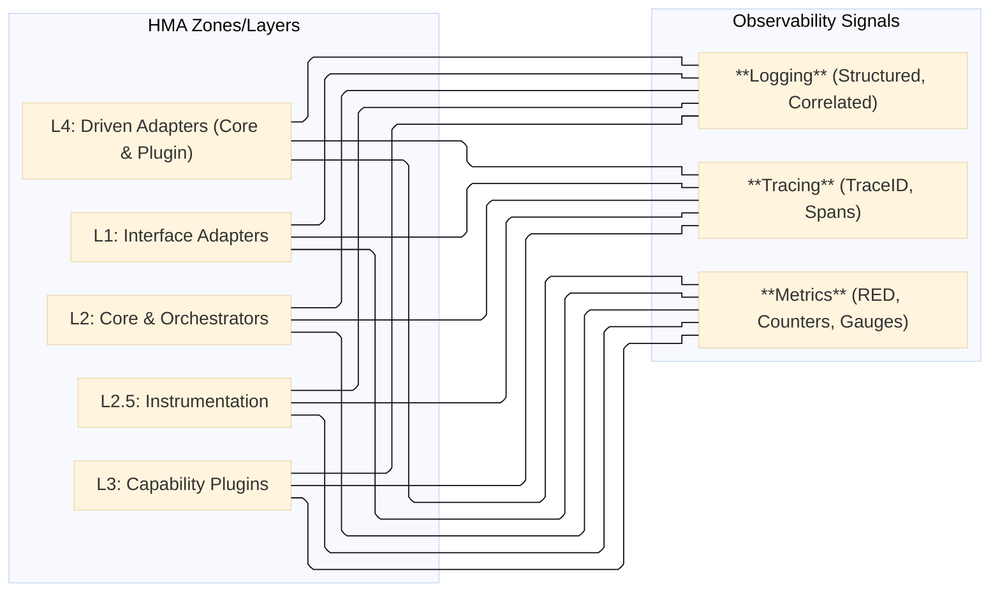
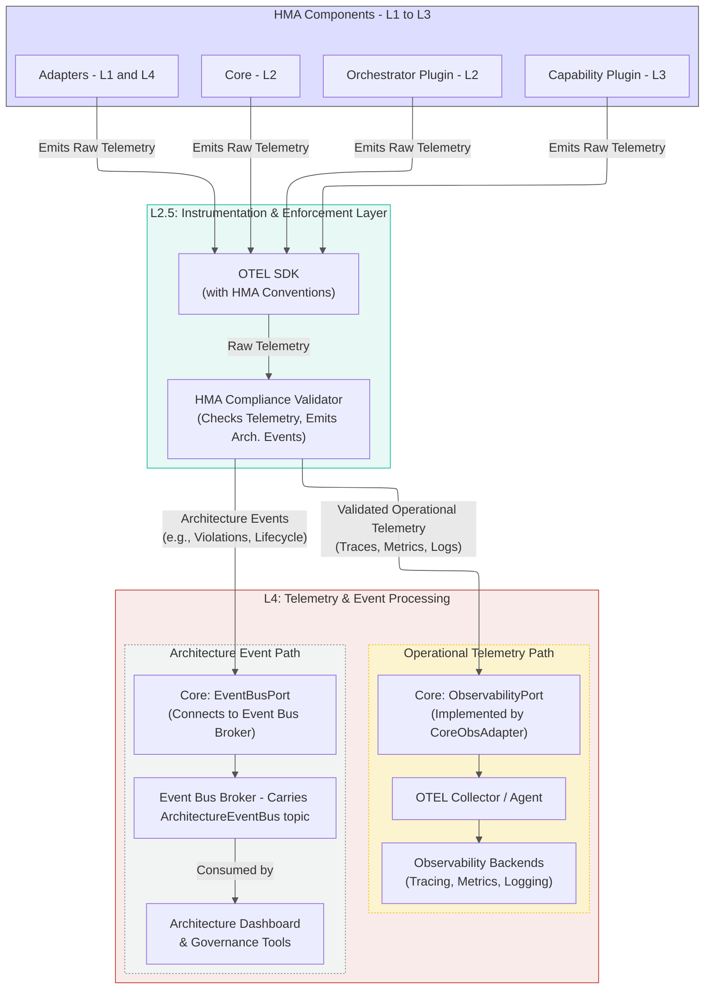
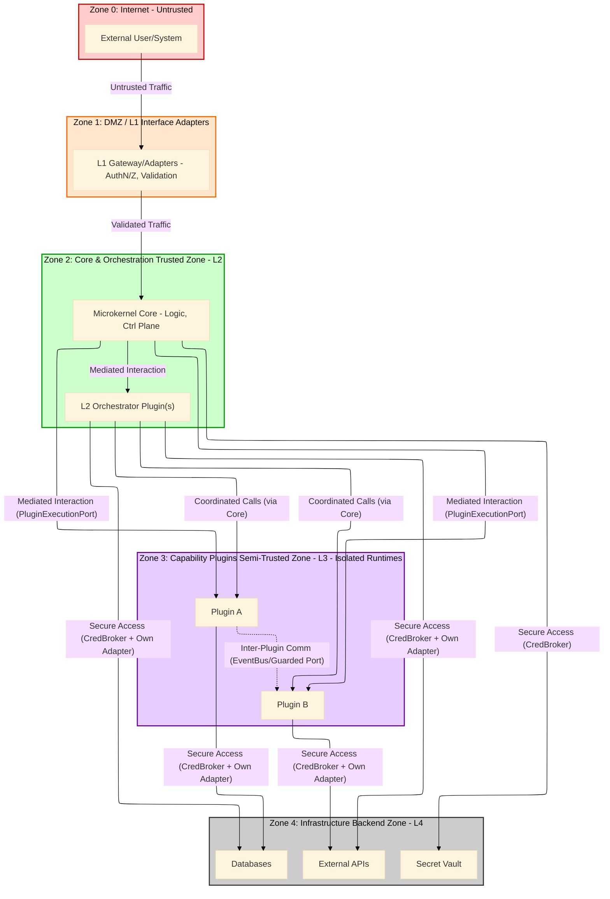

# Hexagonal Microkernel Architecture (HMA) Specification

_Version 1.3 (C4-Inspired Edition)_

**(Companion document to the AI-Powered Model-Driven Development (APMDD) Methodology v2.0)**

---

**Part 5: Applying Cross-Cutting HMA Concerns**

This part details how essential cross-cutting concerns—Observability, Security, and Enforcement—are implemented and applied across the HMA structure. These are not isolated features but are woven into the fabric of the architecture.

## 16. HMA Observability Implementation
#hma-observability #hma-layer-L2-5 #hma-event-bus #hma-event #c4-level-3
[[HMA v1.3 - Part 3 - Internal Components and Interfaces#8.3 Control Plane Service Components]]

### 16.1 Observability Principles in HMA
#hma-observability

(Content from original HMA v1.2 Sec 6.1)

*   **Observability is Not an Afterthought:** The HMA architecture itself MUST be designed to facilitate the implementation of comprehensive observability. It's a foundational requirement, not an add-on.
*   **Focus on Interactions and Boundaries:** The primary focus of HMA observability is on monitoring and understanding interactions across all defined architectural boundaries:
    *   External Actor (L0) ↔ L1 Interface Adapters
    *   L1 Interface Adapters ↔ L2 Core Inbound Ports
    *   L2 Core (Router) ↔ L2 Orchestrator Plugins (via `PluginExecutionPort`)
    *   L2 Core (Router) ↔ L3 Capability Plugins (via `PluginExecutionPort`)
    *   L2 Orchestrator Plugin ↔ L3 Capability Plugins (coordinated via Core `PluginExecutionPort` or Event Bus)
    *   Plugin ↔ Plugin (L3-L3, typically via Event Bus)
    *   Core/Plugin ↔ L2 Core Control Plane Services (e.g., `CredBrokerQueryPort`, `EventBusPort`)
    *   Core/Plugin ↔ L4 Infrastructure (via their respective Adapters)
*   **Three Pillars of Observability:** HMA observability relies on the three pillars: Tracing, Metrics, and Logging.
*   **Standardization for Correlation:** Standardized telemetry formats, metadata (especially trace IDs), and emission mechanisms are crucial for correlating data across distributed HMA components.

### 16.2 Observability Requirements (Tracing, Metrics, Logging)
#hma-observability

(Content from original HMA v1.2 Sec 6.2, Diagram 6.2-A)

*   **Diagram 16.2-A: HMA Observability Signal Coverage:** Matrix showing that all key HMA layers/zones MUST emit Traces, Metrics, and Logs.

*   **Tracing:**
    *   **MUST:** Generate and propagate distributed trace context (e.g., W3C Trace Context: TraceID, SpanID, TraceFlags, TraceState) across all HMA Port invocations (synchronous, including `PluginExecutionPort` calls) and standard HMA Event Bus messages (asynchronous, via event metadata).
    *   **MUST:** Create spans for key boundary crossings and significant operations. This includes:
        *   L1 Adapter request handling (entry/exit).
        *   L2 Core routing/dispatching decisions.
        *   `PluginExecutionPort` invocation by the Core, distinguishing calls to L2 Orchestrator vs. L3 Capability Plugins.
        *   Execution of L2 Orchestrator Plugin logic (entry/exit, key internal steps).
        *   Execution of L3 Capability Plugin logic (entry/exit).
        *   Calls to L2 Core Control Plane Ports (e.g., `CredBrokerQueryPort`, `EventBusPort`).
        *   Critical L4 Adapter operations (both Core's and Plugin's internal Adapters calling L4 external systems).
    *   **SHOULD:** Include meaningful attributes/tags in spans (e.g., `hma.plugin.id`, `hma.plugin.type`, `hma.port.name`, `hma.operation.name`, relevant non-sensitive parameters, error status, outcome). HMA-specific attribute conventions SHOULD be defined.
*   **Metrics:**
    *   **MUST:** The L2.5 Instrumentation (OTEL SDK) and Core's `ObservabilityPort` (and its L4 Adapter) MUST provide mechanisms for Core and Plugins (L2 Orchestrator and L3 Capability) to expose/emit standardized metrics.
    *   **SHOULD:** Capture RED (Rate, Errors, Duration) metrics for:
        *   L1 Adapter request handling.
        *   L2 Core routing decisions.
        *   All `PluginExecutionPort` invocations (distinguishing target Plugin type).
        *   Key operations within L2 Orchestrator and L3 Capability Plugins.
        *   All external Port interactions (Inbound and Outbound from Core/Plugins).
    *   **SHOULD:** Capture metrics for L2 Core Control Plane service usage (e.g., `CredentialBroker` issuance rate/errors, `EventBusPort` publish/subscribe rates/errors).
    *   **SHOULD:** Capture metrics for critical L4 infrastructure interactions initiated via Adapters (e.g., database call latency/errors, external API call success/failure rates from Plugin Adapters).
    *   **MAY:** Individual Plugins MAY expose internal business-specific metrics if necessary, following standard formats (e.g., OpenMetrics) and HMA naming conventions (see Section 14).
*   **Logging:**
    *   **MUST:** All HMA components (Core, Plugins) MUST emit structured logs (e.g., JSON format).
    *   **MUST:** Include `TraceID` and `SpanID` (and potentially `hma.plugin.id`) in all log entries for correlation across components and with traces/metrics.
    *   **SHOULD:** Log key lifecycle events, request routing decisions (Core), Plugin invocation/completion (Core/Plugin - L2/L3), errors encountered, significant state changes (Core Plugin lifecycle, Plugin internal state if relevant for debugging), and important Control Plane actions.
    *   **MUST:** Avoid logging sensitive data (PII, secrets, etc.) unless properly masked, tokenized, or anonymized according to defined security policies. Adherence to data privacy regulations is paramount.

### 16.3 Conceptual Data Flow & Instrumentation
#hma-observability #hma-diagram

(Content from original HMA v1.2 Sec 6.3, Diagrams 6-A, 6-B, adapted for flow)

The HMA observability data flow relies on standardized instrumentation and a clear path for telemetry.

*   **Instrumentation (L2.5):**
    *   All HMA components (Core, L2 Orchestrator Plugins, L3 Capability Plugins, L1/L4 Adapters) MUST use a centrally provided OpenTelemetry (OTEL) SDK (or equivalent standardized library) configured with HMA-specific conventions (e.g., resource attributes, span naming, metric naming). This is the L2.5 Instrumentation sub-layer.
    *   This SDK is responsible for generating traces, metrics, and logs with appropriate context and HMA-specific metadata.
*   **Telemetry Emission & Validation:**
    *   The OTEL SDK emits raw telemetry.
    *   This telemetry then conceptually flows through the `HMA Compliance Validator` (also part of L2.5). This validator can:
        *   Check for HMA-standard metadata (e.g., required tags, trace propagation).
        *   Potentially enrich telemetry with further architectural context.
        *   Route validated operational telemetry (traces, metrics, logs) towards the Core's `ObservabilityPort`.
        *   Identify and route specific "Architecture Events" (e.g., Plugin violations detected via telemetry, invalid call paths, critical lifecycle events) to the `ArchitectureEventBus` (which uses the Core's `EventBusPort`).
*   **Telemetry Processing Path (via `ObservabilityPort`):**
    *   The Core's `ObservabilityPort` is implemented by an L4 `CoreObsAdapter`.
    *   This adapter forwards the validated operational telemetry to an OTEL Collector (or similar aggregation agent) in L4.
    *   The Collector then processes and exports the telemetry to configured L4 backends (e.g., Jaeger/Zipkin for Tracing, Prometheus/Mimir for Metrics, Elasticsearch/Loki for Logging).
*   **Architecture Event Stream (via `EventBusPort` & `ArchitectureEventBus`):**
    *   The `ArchitectureEventBus` (a logical concept using the physical HMA Event Bus infrastructure) receives architecture-specific events.
    *   These events can be consumed by an "Architecture Dashboard" or other governance tools to provide insights into HMA compliance, system health from an architectural perspective, and operational anomalies.

*   **Diagram 16.3-A: Conceptual HMA Observability Data Flow (v1.3):** This revised diagram illustrates how HMA components use the OTEL SDK. Telemetry flows through the HMA Compliance Validator, which routes operational data via the `ObservabilityPort` to backends, and architecture-specific events via the `EventBusPort` (for the `ArchitectureEventBus`) to dashboards and governance tools.

**(The sequence diagram, previously Diagram 6-B, illustrating trace propagation for a complex task, remains conceptually valid and can be found in the Appendices, Section 21.1, adapted to include the validator if necessary for detailed examples.)**

This dual-path approach ensures that detailed operational telemetry is available for debugging and performance monitoring, while high-signal architectural events can directly inform governance and automated architectural oversight.

## 17. HMA Security Implementation
#hma-security #hma-layer-L2 #hma-layer-L3 #hma-zone-core #hma-zone-plugin #c4-level-3
[[HMA v1.3 - Part 6 - Supporting Information#CredentialBroker (HMA L2 Control Plane Service)]]

Security is an integral aspect of HMA, designed in from the start rather than bolted on. HMA's structure provides natural points for enforcing security controls and defining trust boundaries.

### 17.1 Trust Boundaries in HMA
#hma-security #hma-diagram

(Content from original HMA v1.2 Sec 9.1, Diagram 9.0-A, adapted)

HMA defines several key trust boundaries that dictate the level of trust between interacting components and where security controls are most critical:

*   **Internet/External Network ↔ L1 Interface Adapters:** This is the primary ingress/egress point of the system. All traffic crossing this boundary is considered untrusted. L1 Adapters MUST perform robust authentication (AuthN), authorization (AuthZ), and input validation.
*   **L1 Interface Adapters ↔ L2 Microkernel Core:** While L1 Adapters are part of the trusted system, the data they pass to the Core still requires validation by the Core's Inbound Ports to protect the Core itself.
*   **L2 Microkernel Core ↔ L3 Capability Plugins:** The Core treats L3 Capability Plugins as distinct, potentially less trusted components, even if developed internally. Interactions MUST be strictly mediated via defined Ports (e.g., `PluginExecutionPort`) and Events. Strong runtime isolation between L3 Plugins and between L3 Plugins and the Core is REQUIRED.
*   **L2 Microkernel Core ↔ L2 Orchestrator Plugins:** L2 Orchestrator Plugins, while managed as Plugins, functionally reside within the L2 zone and often have higher trust than L3 Plugins, as they orchestrate core business workflows. However, interactions still occur via defined Ports, and they are subject to the Core's lifecycle management and security policies. They still operate in their own isolated runtime environments.
*   **L3 Capability Plugin ↔ L3 Capability Plugin:** Direct synchronous interaction is discouraged. If it occurs via the Event Bus, events are messages passed between distinct trust zones. If (exceptionally) direct Port-to-Port calls are allowed, they cross trust boundaries and require AuthN/Z suitable for internal service-to-service communication (e.g., mTLS, token-based). Direct access to another Plugin's internal state or private L4 infrastructure is STRICTLY FORBIDDEN.
*   **Core/Plugin (L2/L3) ↔ L4 Infrastructure:** All interactions with L4 infrastructure (databases, message brokers, external APIs, secret vaults) cross a trust boundary. These interactions MUST use secure communication (TLS/mTLS) and dedicated, scoped credentials obtained via the L2 Core's `CredentialBroker`.
*   **Tenant Boundaries (in Multi-Tenant Systems):** If the HMA system is multi-tenant, strict data, communication, and compute isolation MUST be architecturally enforced at all relevant interaction points (L1 Adapters, Core routing, Plugin logic, L4 data storage) to prevent cross-tenant data leakage or interference. Tenant context MUST be securely propagated and enforced.

*   **Diagram 17.1-A: HMA Trust Boundary Zones:** Visualizes the different trust zones within an HMA system, from the untrusted internet to the backend infrastructure. Interactions crossing these zone boundaries require appropriate security controls.

### 17.2 Mandatory Security Controls
#hma-security

(Content from original HMA v1.2 Sec 9.2)

To protect HMA systems, the following security controls are MANDATORY:

*   **Secure Communication:**
    *   **TLS (Transport Layer Security):** MANDATORY for all external network traffic to and from L1 Adapters.
    *   **mTLS (Mutual TLS):** RECOMMENDED for internal communication between HMA components (Core ↔ Plugins, Plugin ↔ Plugin if direct, Core/Plugin ↔ L4 services that support it) to ensure mutual authentication and encrypted transport.
*   **Centralized Credential Management (`CredentialBroker`):**
    *   The L2 Core's `CredentialBroker` (accessed via `CredBrokerQueryPort`) MUST be the sole mechanism for HMA Plugins (L2 Orchestrator and L3 Capability) to obtain short-lived, scoped credentials for accessing L4 infrastructure or other services.
    *   Static secrets (API keys, database passwords) MUST NOT be embedded in Plugin code or configuration files. They should be managed by the `CredentialBroker`'s backend (e.g., HashiCorp Vault, AWS Secrets Manager).
*   **Input Validation:**
    *   MANDATORY at all L1 Adapters for data received from external actors.
    *   MANDATORY at any HMA Port where data crosses a trust boundary (e.g., Core Inbound Ports validating data from L1, Plugins validating event payloads consumed from the Event Bus if the producer is a different trust domain).
    *   Validation should check for type, format, length, range, and presence of malicious content.
*   **Principle of Least Privilege:**
    *   HMA components (Core, Plugins) MUST operate with the minimum necessary permissions required to perform their functions.
    *   This is enforced through:
        *   Scoped credentials from the `CredentialBroker`.
        *   Architectural roles and responsibilities (Plugins only access their declared Ports).
        *   Runtime isolation mechanisms.
*   **Plugin Runtime Isolation:**
    *   Strong runtime isolation mechanisms (e.g., separate processes, containers like Docker/Kubernetes with strict resource limits and network policies, WebAssembly (WASM) sandboxes) are REQUIRED, especially for L3 Capability Plugins. This limits the blast radius if a Plugin is compromised.
    *   Network policies MUST restrict Plugins to only communicate via their defined HMA Ports or with their explicitly declared L4 dependencies.
*   **Code Signing & Verification (Recommended):**
    *   Plugin artifacts (L2 Orchestrator and L3 Capability) SHOULD be cryptographically signed by a trusted entity.
    *   The Core's `PluginLifecycleManager` SHOULD verify these signatures before loading or activating a Plugin. This helps ensure Plugin integrity and authenticity.
*   **Regular Security Audits & Penetration Testing:** The HMA system SHOULD undergo regular security audits and penetration testing to identify and remediate vulnerabilities.

### 17.3 Threat Model Considerations for HMA Structures
#hma-security

(Content from original HMA v1.2 Sec 9.3)

Architects designing and implementing HMA systems MUST consider potential threats relative to the HMA structure. A formal threat modeling exercise (e.g., STRIDE) is RECOMMENDED for each HMA system. High-level considerations include:

*   **Malicious or Compromised L3 Capability Plugin:**
    *   **Threat:** A Plugin contains malicious code or is compromised at runtime.
    *   **Mitigations:** Strong runtime isolation, least privilege (scoped credentials from `CredentialBroker`), network policies, input validation by other Plugins/Core consuming its outputs/events, code signing, runtime monitoring via observability.
*   **Compromised L2 Orchestrator Plugin:**
    *   **Threat:** An Orchestrator Plugin is compromised. Due to its role in coordinating L3 Plugins, its blast radius could be larger.
    *   **Mitigations:** Similar to L3 Plugins (isolation, least privilege, code signing, monitoring). Additionally, L3 Plugins it calls should still validate inputs received from the Orchestrator. The Core `PluginExecutionPort` acts as an intermediary.
*   **Compromised Microkernel Core:**
    *   **Threat:** The Core itself is compromised. This is the most critical threat.
    *   **Mitigations:** Keep Core logic absolutely minimal to reduce attack surface, rigorous code reviews for Core components, strong protection for Core's own operational infrastructure (e.g., Plugin registry, its own credential store access).
*   **Credential Compromise (`CredentialBroker` or Plugin Credentials):**
    *   **Threat:** Credentials issued by the Broker are stolen, or the Broker itself is compromised.
    *   **Mitigations:** `CredentialBroker` issues short-lived, narrowly scoped tokens; mTLS for internal communication; secure storage for the Broker's root secrets; strict access controls to the Broker. Plugins must protect received credentials.
*   **Data Leakage (especially in Multi-Tenant Systems):**
    *   **Threat:** Data from one tenant is exposed to another.
    *   **Mitigations:** Strict tenant ID filtering architecturally enforced in Core (Router, Control Plane) and by all Plugins handling tenant data; infrastructure-level data separation where applicable (e.g., per-tenant database schemas or instances if feasible); robust AuthZ checks at all data access points.
*   **Insecure Inter-Plugin Communication:**
    *   **Threat:** Communication channels between Plugins (e.g., Event Bus, direct calls if any) are compromised.
    *   **Mitigations:** Mandating use of HMA-defined Ports and standardized Events; TLS/mTLS for transport security on the Event Bus and any direct calls; schema validation for events; AuthN/Z for direct Port calls.
*   **Denial of Service (DoS) / Resource Exhaustion:**
    *   **Threat:** A malicious actor or a misbehaving Plugin overwhelms resources.
    *   **Mitigations:** Rate limiting at L1 Adapters; resource quotas for Plugin runtimes; circuit breakers in inter-component calls; resilient Event Bus configuration.

Addressing these threats requires a defense-in-depth approach, leveraging HMA's structural properties and implementing the mandatory security controls.

## 18. HMA Enforcement Mechanisms & Tooling
#hma-standard #hma-governance

To ensure adherence to HMA rules and standards, which is critical for APMDD governance, several enforcement mechanisms and conceptual tooling are proposed.

### 18.1 Static Analysis (hma-lint Concept)
#hma-standard

(Content from original HMA v1.2 Sec 8.1)

*   **Purpose:** To perform automated, build-time checks for HMA rule compliance. This is an integral part of APMDD's quality gates and supports early detection of architectural violations.
*   **Concept:** An `hma-lint` tool (or set of linters/static analysis rules) SHOULD be developed or configured for the primary implementation languages used in the HMA system.
*   **Key Checks:**
    *   **Import/Dependency Boundaries:**
        *   Verifying that Core modules do not import Plugin-specific code.
        *   Verifying that L3 Plugins do not directly import code from other L3 Plugins (enforcing communication via Ports/Events).
        *   Ensuring L2 Orchestrator Plugins interact with L3 Plugins only via the Core's `PluginExecutionPort` or the Event Bus.
    *   **Naming Conventions:** Enforcing HMA naming standards for Plugins, Ports, Events, etc. (see Section 14).
    *   **Port Definition & Usage:**
        *   Ensuring Ports are correctly defined (e.g., interface-only, clear contracts).
        *   Checking that Plugins consume Core Control Plane Ports correctly.
        *   Verifying that Plugin interactions with L4 infrastructure occur only via their defined Outbound Ports and Adapters.
    *   **Plugin Manifest Validation:** Checking the structure and required fields of Plugin manifest files.
    *   **Security Checks:** Basic static security analysis (e.g., detecting use of hardcoded secrets, known insecure functions).
*   **Enforcement:** `hma-lint` checks MUST be integrated into the CI/CD pipeline. Builds MUST fail if HMA violations are detected.

### 18.2 Runtime Policy Enforcement
#hma-standard

(Content from original HMA v1.2 Sec 8.2, expanded)

While static analysis catches many issues, runtime enforcement is necessary for policies that depend on dynamic context or behavior.

*   **Purpose:** To enforce HMA policies and other operational rules on live operations and interactions within the running HMA system. This can be driven by governance decisions made via the APMDD process.
*   **Mechanism:**
    *   **Policy Engines (e.g., Open Policy Agent - OPA):** RECOMMENDED. OPA can be deployed as a sidecar or integrated at key choke points to make policy decisions.
    *   **Choke Points for Enforcement:**
        *   L1 Gateway/Adapters: For AuthN/Z, rate limiting, input validation beyond basic schema.
        *   L2 Core (Router/Dispatcher): To enforce routing rules, Plugin invocation policies (e.g., which Plugins can call which).
        *   L2 Core (Control Plane Services): E.g., `CredentialBroker` can use OPA to validate credential requests against fine-grained policies.
        *   `HMA Compliance Validator` (L2.5): This component (see Section 16.3) can leverage a policy engine to evaluate observed interactions (from telemetry or architecture events) against HMA rules. For example, detecting if a Plugin attempts an unauthorized call path.
*   **Example Policies:**
    *   Validating tokens issued by the `CredentialBroker` before allowing L4 access.
    *   Enforcing rate limits per Plugin, per tenant, or per L0 Actor.
    *   Auditing or blocking specific inter-Plugin interactions based on dynamic policies.
    *   Ensuring Plugins only access resources they are authorized for, based on their identity and the requested scope.
    *   Validating that events published to the `ArchitectureEventBus` conform to expected patterns or report valid states.

### 18.3 Plugin Registry Validation
#hma-standard

(Content from original HMA v1.2 Sec 8.3, integrated with Lifecycle Manager in Sec 8.2 of this doc)

This is a specific enforcement mechanism performed by the L2 Core's `PluginLifecycleManager` component during Plugin onboarding.

*   **Purpose:** To ensure that a Plugin meets fundamental HMA compliance and safety criteria *before* it is activated and allowed to participate in the system.
*   **Checks (performed by `PluginLifecycleManager`):**
    *   **Manifest Validation:** Verifying the Plugin's manifest file for structural correctness, presence of required metadata (ID, version, HMA Port declarations), and consistency.
    *   **Signature Verification (Recommended):** If code signing is used, verifying the cryptographic signature of the Plugin package.
    *   **Basic Interface Compatibility (Conceptual):** Potentially checking if the Plugin correctly declares its implementation of the `PluginExecutionPort` or its consumption of known Core Ports.
    *   **Resource Declaration Validation:** Ensuring any declared resource needs (CPU, memory, L4 dependencies) are within acceptable policy limits.
    *   **Initial Health Check (Post-Install, Pre-Activation):** Performing a basic health check after installation but before marking the Plugin as fully `Active`.

These enforcement mechanisms, working together, provide a robust framework for maintaining HMA's architectural integrity and supporting APMDD's governance goals.

---

