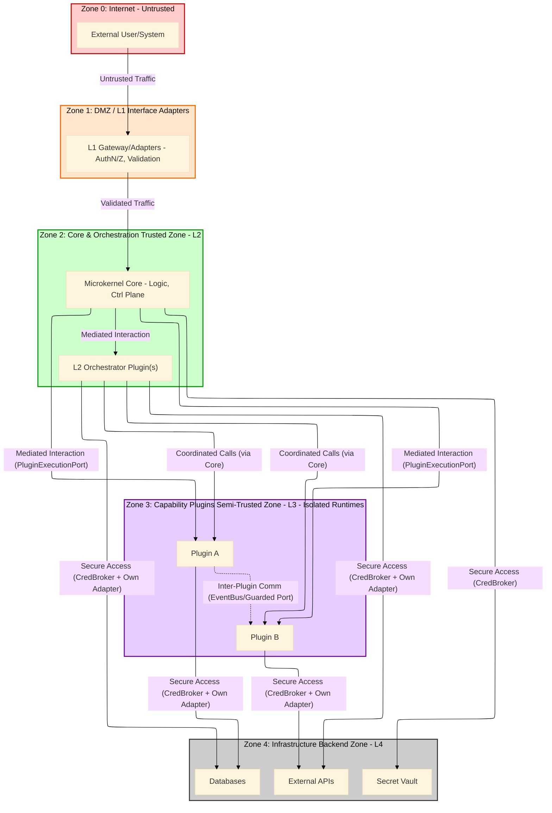
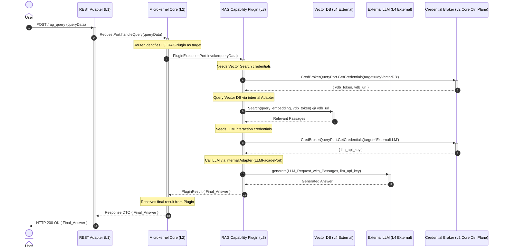
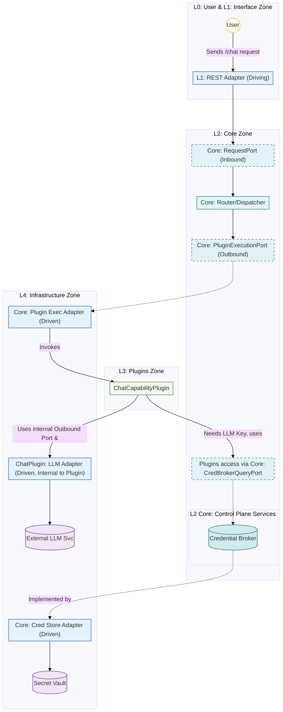
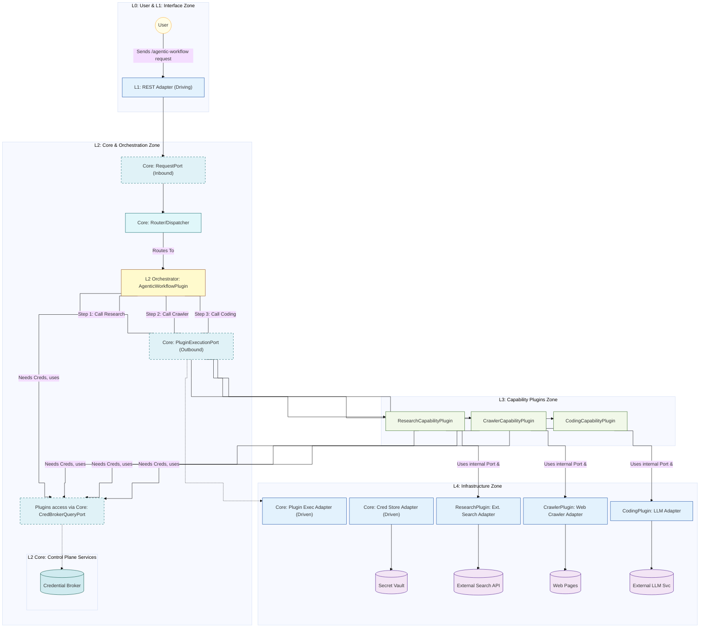

# Hexagonal Microkernel Architecture (HMA) Specification

_Version 1.3 (C4-Inspired Edition)_

**(Companion document to the AI-Powered Model-Driven Development (APMDD) Methodology v2.0)**

---

**Part 6: Supporting Information**

This part contains supplementary information essential for working with HMA, including a comprehensive glossary, a comparative analysis, and illustrative examples.

## 19. HMA Glossary

(Consolidated from original HMA v1.2 Sec 10, Diagram 10-A, and terms used throughout)

*   **Diagram 19-A: HMA Glossary Term Categories (v1.3):** Key HMA terms grouped by their conceptual category.

*   **A2A (Agent-to-Agent Protocol):** #hma-glossary-term An external standard for inter-AI agent communication. HMA Adapters (e.g., `A2ACallerPort`, `A2AListener`) MAY use A2A for interacting with *external* AI agents. (Original HMA v1.2 Sec 2.5)
*   **Adapter (HMA Context):** #hma-glossary-term A technology-specific component implementing a Port (if Driven/Outbound) or using a Port (if Driving/Inbound), bridging HMA's abstract interfaces to concrete technologies or external systems. (Original HMA v1.2 Sec 2.2)
*   **Agent (AI Developer - APMDD Context):** #hma-glossary-term An AI entity (workflow or autonomous system) responsible for development tasks within APMDD, guided by HMA specifications.
*   **APMDD (AI-Powered Model-Driven Development):** #hma-glossary-term The methodology that mandates HMA for AI-led software development.
*   **ArchitectureEventBus (Logical Concept):** #hma-glossary-term A logical event stream, utilizing the physical HMA Event Bus infrastructure, dedicated to domain-level architecture events (e.g., Plugin violations, critical lifecycle changes). (See Section 16.3)
*   **Control Plane Services (HMA L2):** #hma-glossary-term Core-provided, non-domain-specific services for governance and operational support of Plugins (e.g., `CredentialBroker`, Event Bus access, Observability access). (Original HMA v1.2 Sec 10, Sec 4.1)
*   **Core (Microkernel Core - HMA L2):** #hma-glossary-term The minimal central hub of HMA, responsible for request routing, Plugin lifecycle management, and providing access to Control Plane Services. Contains no business logic itself. (Original HMA v1.2 Sec 2.1)
*   **Core Domain Logic (HMA Context):** #hma-glossary-term In HMA v1.3, this is strictly limited to the Core's responsibilities: routing, lifecycle management, and providing Control Plane access. It does NOT include any application business logic.
*   **CredentialBroker (HMA L2 Control Plane Service):** #hma-glossary-term The HMA Control Plane Service responsible for issuing short-lived, scoped credentials to Plugins via the `CredBrokerQueryPort`. (Original HMA v1.2 Sec 10, Sec 4.1)
*   **Driving Adapter (HMA L1):** #hma-glossary-term An Adapter that handles incoming requests/events from L0 Actors and calls L2 Core Inbound Ports. (Original HMA v1.2 Sec 10, Sec 4.1)
*   **Driven Adapter (HMA L4):** #hma-glossary-term An Adapter that implements an L2 Core or L3/L2-Orchestrator Plugin Outbound Port, interacting with L4 external systems/infrastructure. (Original HMA v1.2 Sec 10, Sec 4.1)
*   **EDA (Event-Driven Architecture):** #hma-glossary-term An architectural style using asynchronous events for communication, recommended for inter-Plugin communication in HMA. (Original HMA v1.2 Sec 2.3)
*   **Event (HMA Context):** #hma-glossary-term A record of a significant state change or occurrence, published/consumed via the Event Bus, adhering to defined schemas and metadata standards. Event definitions and their visualizations are governed by the modeling strategy in `[[APMDD v2.1 - Part 4 - Modeling Types, Strategy & Notations]]`.
*   **Event Bus (HMA L4 Infrastructure, accessed via L2 Port):** #hma-glossary-term The asynchronous messaging infrastructure (e.g., message broker) used for event-based communication, accessed by Core/Plugins via `EventBusPort`. (Original HMA v1.2 Sec 2.3)
*   **Hexagonal Architecture (Ports & Adapters):** #hma-glossary-term The architectural pattern using Ports & Adapters for separation of concerns, mandated for all HMA boundaries. (Original HMA v1.2 Sec 2.2)
*   **HMA (Hexagonal Microkernel Architecture):** #hma-glossary-term This specification (Version 1.3, C4-Inspired Edition).
*   **HMA Compliance Validator (L2.5):** #hma-glossary-term A conceptual component that intercepts telemetry, checks for HMA compliance, and routes operational telemetry and architecture events accordingly. (See Section 16.3)
*   **Inbound Port (HMA Context):** #hma-glossary-term An interface defined by a component (typically L2 Core) specifying how it can be driven by external callers (typically L1 Adapters). (Original HMA v1.2 Sec 10)
*   **L0-L4 Layers:** #hma-glossary-term The logical layers defined in HMA: L0 Actor, L1 Interface, L2 Core/Orchestration, L2.5 Instrumentation, L3 Capability Plugin, L4 Infrastructure. (See Section 4.1)
*   **L2 Orchestrator Plugin (HMA L2 Zone):** #hma-glossary-term A specialized, replaceable Plugin, managed by the Core but functionally operating within the L2 (Core) zone. It is responsible for executing complex, multi-step workflows by *intelligently and adaptively coordinating* multiple L3 Capability Plugins, typically leveraging LLM-driven logic or AI agent capabilities for dynamic task distribution and workflow management. This distinguishes it from simpler, rule-based workflow engines.
*   **L3 Capability Plugin (HMA L3 Zone):** #hma-glossary-term An independently deployable HMA Plugin encapsulating specific business capabilities; autonomous and self-contained. (Original HMA v1.2 Sec 10, Sec 4.1)
*   **LLMFacadePort (HMA Outbound Port):** #hma-glossary-term An Outbound Port for Core or Plugins to call external LLM services. Adapters implementing it MAY use MCP. (Original HMA v1.2 Sec 2.4)
*   **MCP (Model Context Protocol):** #hma-glossary-term An external standard for structuring LLM context, potentially used by an `LLMAdapter` implementing `LLMFacadePort`. (Original HMA v1.2 Sec 2.4)
*   **Microkernel Pattern:** #hma-glossary-term An architectural pattern with a minimal core system providing essential functionalities, with extended features implemented as Plugins. (Original HMA v1.2 Sec 2.1)
*   **ObservabilityPort (HMA L2 Core Outbound Port):** #hma-glossary-term The Core Port used by Core/Plugins (via OTEL SDK) to emit telemetry. (See Section 10.4, 16.2)
*   **OTEL (OpenTelemetry):** #hma-glossary-term An open standard and set of tools for collecting and exporting telemetry data (traces, metrics, logs). The L2.5 HMA Instrumentation sub-layer uses an OTEL SDK.
*   **Outbound Port (HMA Context):** #hma-glossary-term An interface defined by a component (Core or Plugin) specifying its need to interact with external services or infrastructure. Implemented by Driven Adapters. (Original HMA v1.2 Sec 10)
*   **Plugin (HMA Context):** #hma-glossary-term Generic term for an independently deployable HMA module (either L3 Capability or L2 Orchestrator type) that extends Core functionality. (Original HMA v1.2 Sec 2.1)
*   **PluginExecutionPort (HMA L2 Core Outbound Port):** #hma-glossary-term The Core Port used to invoke operations on L3 Capability Plugins or L2 Orchestrator Plugins. (See Section 10.1)
*   **Port (HMA Context):** #hma-glossary-term A technology-agnostic interface (Inbound or Outbound) defining an interaction contract at a component boundary. Ports are defined as explicit interfaces within the formal architectural model. Their visual representation and specific definition tooling are governed by `[[APMDD v2.1 - Part 4 - Modeling Types, Strategy & Notations]]`.
*   **RFC 2119:** #hma-glossary-term The IETF document defining the meaning of keywords like MUST, SHOULD, MAY for requirement specifications. (See Section 15)
*   **Split-Plane Pattern (Illustrative Appendix Concept):** #hma-glossary-term A pattern mentioned in original HMA v1.2 Glossary, relevant if a Plugin accesses specialized resources like Vector Stores, potentially involving Core's Credential Broker for control plane access and Plugin-managed adapters for data plane access. (Original HMA v1.2 Sec 10, Appendix A of Appendices file)
*   **Vector Store (HMA L4 Infrastructure):** #hma-glossary-term A specialized database for vector embeddings, managed as L4 infrastructure internal to a specific L3 Plugin if needed. (Original HMA v1.2 Sec 10, Appendix A of Appendices file)
*   **Router (HMA L2 Core Component):** #hma-glossary-term The component within the HMA Microkernel Core responsible for deterministic dispatching of incoming requests or tasks. Based on request metadata and its dynamic routing configuration (updated via Plugin registration), it directs tasks to either a specific L3 Capability Plugin or an L2 Orchestrator Plugin. It does not perform intelligent workflow coordination itself but rather acts as a preliminary distribution mechanism. The router must automatically integrate new plugins into its routing table upon their successful registration by the Plugin Lifecycle Manager, without requiring manual code modifications to the router itself.

## 20. HMA Comparative Analysis & Trade-offs

### 20.1 HMA vs. Alternatives (Architectural Focus)

(Content from original HMA v1.2 Sec 11.1, table retained)

| Criterion                     | **HMA v1.3 (Mandated by APMDD v2.0)**     | Traditional Microservices             | Serverless (FaaS)              | Monolith                         |
| :---------------------------- | :---------------------------------------- | :------------------------------------ | :----------------------------- | :------------------------------- |
| **Plugin Autonomy (L3)**      | Very High (Self-contained capabilities)   | High (Service level)                  | High (Function level)          | Low                              |
| **Core Complexity**           | Very Low (Router/Lifecycle Focus)         | Variable (Can grow complex)           | Low (Platform handles)         | High (All logic tangled)         |
| **Governance Consistency**    | High (Via Core-enforced Interfaces/Rules) | Medium/Low (Drift possible)           | Low (Fragmented)               | High (Internal)                  |
| **Context Mgmt (for AI Dev)** | High (Structure limits needed context)    | Medium (Depends on service boundary)  | Medium (Function scope helps)  | Low (Whole system context)       |
| **Testability (Isolation)**   | Very High (Hexagonal Ports Everywhere)    | High (Service level)                  | High (Function level)          | Low                              |
| **Replaceability**            | Very High (Plugins L2/L3 via Ports/Events)| High (Services via APIs)              | High (Functions)               | Low                              |
| **AI Dev Team Fit (APMDD)**   | Very High (Handles context limits well)   | Medium (Context burden per service)   | Medium (Good for event tasks)  | Low (Context overload)           |

### 20.2 Key HMA v1.3 Trade-offs

(Content from original HMA v1.2 Sec 11.2, adapted for v1.3 context)

HMA v1.3, by its nature, involves certain trade-offs that architects must consider:

*   **Upfront Design Rigor vs. Rapid Prototyping Speed:** Defining clear Ports, Adapters, Event schemas, and Plugin boundaries requires more upfront architectural design effort compared to more ad-hoc or monolithic approaches. However, this rigor is essential for achieving APMDD's goals of long-term maintainability, AI team effectiveness (context reduction), and component replaceability.
*   **Minimal Core & Orchestrator Plugin Layering:** Placing complex orchestration logic in replaceable L2 Orchestrator Plugins (rather than in the Core itself) keeps the Microkernel Core truly minimal and stable. This introduces a "hop" where the Core routes to an Orchestrator, which then coordinates L3 Plugins (often back via the Core's `PluginExecutionPort`). This ensures Core simplicity and orchestrator replaceability at the cost of slight indirection for complex workflows.
*   **Operational Complexity of a Distributed System:** While HMA aims to manage internal complexity, an HMA-based system is inherently a distributed system. This requires managing the deployment, interaction, and observability of multiple components (Core, various Plugins, Event Bus, Control Plane services). Robust infrastructure and operational practices are necessary.
*   **Complexity of Asynchronous Event-Driven Interactions:** While EDA offers significant benefits in decoupling and resilience, designing, testing, and debugging complex asynchronous event flows can be challenging. It requires careful consideration of event ordering (if critical), idempotency in consumers, error handling, and eventual consistency.
*   **Learning Curve:** Understanding and correctly applying HMA principles (Hexagonal, Microkernel, specific Port patterns, Plugin lifecycle) requires a learning curve for development teams (both human and for training AI agents on these patterns). The C4-inspired structure of this specification aims to ease this.

**Conclusion (for v1.3):** HMA v1.3, with its refined documentation structure emphasizing a minimal Core, autonomous L3 Capability Plugins, replaceable L2 Orchestrator Plugins, and universal interaction via strict interfaces (Ports and Events), remains specifically tailored to enable the APMDD methodology. It directly addresses AI context limitations and supports the required incremental development and component replaceability, justifying the architectural discipline and trade-offs involved.

## 21. Appendices (Illustrative Examples)

This section provides illustrative examples of HMA in action, adapted from the `HMA Specification Appendices v1.1` document you provided. These examples are not normative parts of the HMA specification but serve to clarify how HMA patterns might be applied in concrete scenarios.

### 21.1 Appendix A: Example Interaction Flow - RAG Query (Illustrative)

*(Note: This section, adapted from `HMA Specification Appendices v1.1 - Appendix A`, provides an illustrative example of how HMA components **might** interact for Retrieval-Augmented Generation. HMA v1.3 itself does **not** mandate a Vector Store Gateway (VSG) or Vector DBs; these are Plugin-specific implementation choices. This flow demonstrates how such a pattern *could* fit within HMA if chosen.)*

#### A.1 Narrative Flow: RAG Query Handling Example

1.  **Ingress (L0→L1→L2):** User query (L0) hits an L1 `RestAdapter`, which authenticates/validates and routes the request to the L2 Core's `RequestPort`.
2.  **Core Routing (L2):** The Core's `RouterDispatcher` component identifies the request as needing the (hypothetical) `RAGCapabilityPlugin` (L3) and routes the call via the `PluginExecutionPort`.
3.  **Plugin Execution (L3):** `RAGCapabilityPlugin` receives the request.
4.  **Credential Acquisition for Vector DB (L3→L2 Control Plane):** The `RAGCapabilityPlugin` determines it needs to query its associated Vector DB. It calls the L2 Core's `CredBrokerQueryPort` to obtain credentials specifically scoped for its designated Vector DB index/resource.
    *(Note: The VSG concept from the original appendix is simplified here; direct credential brokerage for the Plugin's L4 resource is a common HMA pattern. A VSG could be an L2 Orchestrator or another L3 Plugin if complex multi-vector-store logic was needed, but for a single Plugin's DB, direct brokerage is simpler.)*
5.  **Vector DB Query (L3→L4):** The `RAGCapabilityPlugin` uses its internal `VectorStoreAdapter` (an L4 Driven Adapter within the Plugin) along with the obtained credentials to *directly* query its designated Vector DB (an L4 External System).
6.  **Retrieval & Response (L4→L3):** The Vector DB returns relevant passages to the `RAGCapabilityPlugin`'s adapter.
7.  **LLM Interaction (L3→L2 Control Plane→L4→L3):**
    a.  The `RAGCapabilityPlugin` constructs an LLM Request (potentially using MCP - Model Context Protocol).
    b.  It calls the L2 Core's `CredBrokerQueryPort` again to obtain credentials for the external LLM service.
    c.  It uses its *own* internal `LLMAdapter` (implementing its `LLMFacadePort`) to call the external LLM service (L4 External System) with the request and credentials.
    d.  The LLM service returns the generated response to the `LLMAdapter` and thus to the Plugin.
8.  **Result Aggregation (L3):** The `RAGCapabilityPlugin` combines the retrieved passages and the LLM's generated response to formulate the final answer.
9.  **Plugin Returns Result (L3→L2):** The Plugin sends the final answer back to the L2 Core via the `PluginExecutionPort` contract.
10. **Observability (Throughout):** During its execution, the `RAGCapabilityPlugin` and its internal adapters emit metrics, traces, and logs via the L2.5 OTEL SDK, which routes data via the Core's `ObservabilityPort`.
11. **Eventing (Optional L3/Core):** The `RAGCapabilityPlugin` MAY emit business events (e.g., "RAGQueryCompleted") via the Core's `EventBusPort`. The Core MAY emit generic events related to request completion or Plugin lifecycle changes.
12. **Egress (L2→L1→L0):** The L2 Core, having received the final result from the Plugin, returns the response payload to the L1 `RestAdapter`, which then sends the HTTP response back to the L0 User.

#### A.2 Diagram: RAG Query Sequence (Illustrative, Simpler Credential Flow)

*   **Diagram 21.1-A: RAG Query Sequence (Illustrative for HMA v1.3):** This sequence diagram illustrates the RAG flow. The L3 Plugin orchestrates its internal steps, uses the Core's `CredentialBroker` for obtaining credentials for both its Vector DB and the LLM, and then directly calls these L4 services using its internal adapters. The Core's role is primarily routing the initial request and receiving the final result.

*(Failure modes discussion from original Appendix A.3 remains conceptually similar and important: failures in Control Plane calls (CredBroker), Data Plane calls (VDB, LLM), or Core routing need robust handling within Plugins or Orchestrators, with comprehensive observability.)*

### 21.2 Appendix B: HMA Implementation Examples (Diagrams)

(Adapted from `HMA Specification Appendices v1.1 - Appendix B`)

These examples map hypothetical applications to the HMA v1.3 structure.

#### B.1 Simple Example: Standalone Chat Application

*   **Goal:** Provide a simple chat interface using an LLM.
*   **HMA Mapping Diagram:** (Similar to original, emphasizing HMA v1.3 concepts)

*   **Diagram 21.2-A: Simple Chat App HMA Mapping:** Illustrates a single L3 Capability Plugin for chat, using the Core's Credential Broker and its own LLM Adapter.

#### B.2 Complex Example: Agentic Code Generation Workflow

*   **Goal:** User requests code via `/agentic-workflow`, requiring a sequence like Research → Crawl → Code, orchestrated by an L2 Plugin.
*   **HMA Mapping Diagram:** (Similar to original, emphasizing HMA v1.3 concepts)

*   **Diagram 21.2-B: Agentic Code Gen HMA Mapping:** Shows an L2 Orchestrator Plugin coordinating several L3 Capability Plugins, each with their own L4 dependencies and using Core Control Plane services.

## 22. HMA Diagram Index

| Diagram ID     | Diagram Title                                         | Section Ref |
| :------------- | :---------------------------------------------------- | :---------- |
| [[HMA v1.3 - Part 1 - Overview and Context#Diagram 1.0-A|1.0-A]]          | HMA System Context Overview                           | [[HMA v1.3 - Part 1 - Overview and Context#Abstract]]      |
| [[HMA v1.3 - Part 1 - Overview and Context#Diagram Abstract-A|Abstract-A]] | HMA Concept Mash-up (Original)                        | [[HMA v1.3 - Part 1 - Overview and Context#Abstract]]    |
| [[HMA v1.3 - Part 1 - Overview and Context#Diagram 2.1-A|2.1-A]]          | HMA's Foundational Pillars                            | [[HMA v1.3 - Part 1 - Overview and Context#2.1 Synthesizing Hexagonal, Microkernel, and EDA]]         |
| [[HMA v1.3 - Part 2 - High-Level Structure#Diagram 4.2-A|4.2-A]]          | HMA Layered Reference Model & Major Zones (Illustrative View)             | [[HMA v1.3 - Part 2 - High-Level Structure#4.2 Diagram: HMA Layered Reference Model & Major Zones]]         |
| [[HMA v1.3 - Part 2 - High-Level Structure#Diagram 5.3-A|5.3-A]]          | Core Zone Context (Illustrative View)                                     | [[HMA v1.3 - Part 2 - High-Level Structure#5.3 Diagram: Core Zone Context]]         |
| [[HMA v1.3 - Part 2 - High-Level Structure#Diagram 6.4-A|6.4-A]]          | Plugin Zone Context (Illustrative View)                                   | [[HMA v1.3 - Part 2 - High-Level Structure#6.4 Diagram: Plugin Zone Context]]         |
| [[HMA v1.3 - Part 2 - High-Level Structure#Diagram 7.4-A|7.4-A]]          | Key Interaction Patterns Overview                     | [[HMA v1.3 - Part 2 - High-Level Structure#7.4 Diagram: Key Interaction Patterns Overview]]         |
| [[HMA v1.3 - Part 3 - Internal Components and Interfaces#Diagram 8.4-A|8.4-A]]          | Core Internal Components (Illustrative View)                              | [[HMA v1.3 - Part 3 - Internal Components and Interfaces#8.4 Diagram: Core Internal Components]]         |
| [[HMA v1.3 - Part 3 - Internal Components and Interfaces#Diagram 9.5-A|9.5-A]]          | Generic Plugin Internal Structure (Illustrative View)                     | [[HMA v1.3 - Part 3 - Internal Components and Interfaces#9.5 Diagram: Generic Plugin Internal Structure]]         |
| [[HMA v1.3 - Part 3 - Internal Components and Interfaces#Diagram 11.1-A|11.1-A]]         | Detailed HMA Plugin Lifecycle State Machine (Original) | [[HMA v1.3 - Part 3 - Internal Components and Interfaces#11.1 Plugin States and Transitions]]         |
| [[HMA v1.3 - Part 4 - Detailed Specifications and Standards#Diagram 14-A|14-A]]           | HMA Naming Convention Cheat Sheet (v1.3)              | [[HMA v1.3 - Part 4 - Detailed Specifications and Standards#14. HMA Naming Conventions]]         |
| [[HMA v1.3 - Part 5 - Cross-Cutting Concerns#Diagram 16.2-A|16.2-A]]         | HMA Observability Signal Coverage                     | [[HMA v1.3 - Part 5 - Cross-Cutting Concerns#16.2 Observability Requirements (Tracing, Metrics, Logging)]]         |
| [[HMA v1.3 - Part 5 - Cross-Cutting Concerns#Diagram 16.3-A|16.3-A]]         | Conceptual HMA Observability Data Flow (v1.3)         | [[HMA v1.3 - Part 5 - Cross-Cutting Concerns#16.3 Conceptual Data Flow & Instrumentation]]         |
| [[HMA v1.3 - Part 5 - Cross-Cutting Concerns#Diagram 17.1-A|17.1-A]]         | HMA Trust Boundary Zones (Illustrative View)                              | [[HMA v1.3 - Part 5 - Cross-Cutting Concerns#17.1 Trust Boundaries in HMA]]         |
| [[HMA v1.3 - Part 6 - Supporting Information#Diagram 19-A|19-A]]           | HMA Glossary Term Categories (v1.3)                   | [[HMA v1.3 - Part 6 - Supporting Information#19. HMA Glossary]]         |
| [[HMA v1.3 - Part 6 - Supporting Information#Diagram 21.1-A|21.1-A]]        | RAG Query Sequence (Illustrative for HMA v1.3)        | [[HMA v1.3 - Part 6 - Supporting Information#21.1 Appendix A: Example Interaction Flow - RAG Query (Illustrative)]]         |
| [[HMA v1.3 - Part 6 - Supporting Information#Diagram 21.2-A|21.2-A]]        | Simple Chat App HMA Mapping (Illustrative View)                           | [[HMA v1.3 - Part 6 - Supporting Information#21.2 Appendix B: HMA Implementation Examples (Diagrams)]]         |
| [[HMA v1.3 - Part 6 - Supporting Information#Diagram 21.2-B|21.2-B]]        | Agentic Code Gen HMA Mapping (Illustrative View)                          | [[HMA v1.3 - Part 6 - Supporting Information#21.2 Appendix B: HMA Implementation Examples (Diagrams)]]         |

---
**End of HMA Specification v1.3 (C4-Inspired Edition)**

---

**Recommendations Regarding New or Additional Specifications for HMA (Post-Refactoring Insights):**

Here are some areas where HMA could be further specified or where new, related specifications might be beneficial in the future (beyond v1.3):

1.  **HMA Plugin Manifest Specification (Formalize and Detail):**
    *   **Why:** While mentioned in HMA v1.3 (Sec 11.2), a dedicated, formal specification for the Plugin Manifest (e.g., its schema in JSON Schema or YAML, mandatory/optional fields) would be highly beneficial.
    *   **How:** Define fields for:
        *   `hmaVersion`: HMA spec version compatibility.
        *   `pluginId`, `pluginVersion`, `pluginName`, `description`.
        *   `implementedPorts`: List of HMA Ports the Plugin implements (e.g., specific version of `PluginExecutionPort` contract, any self-defined Inbound Ports).
        *   `consumedCorePorts`: List of Core Control Plane Ports it uses (e.g., `CredBrokerQueryPort`, `EventBusPort` with specific event types it publishes/subscribes to).
        *   `