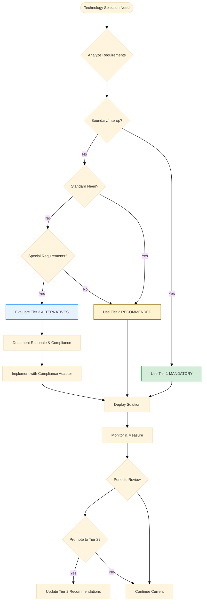

# Hexagonal Microkernel Architecture (HMA) Specification
_Version 2.2 (Guided Implementation Edition)_

**Part 1b: Technology Selection Guide (NEW in v2.2)**

This part provides comprehensive guidance for selecting technologies within the HMA ecosystem. It establishes the three-tier framework that balances proven reliability with innovation flexibility, helping teams make informed technology decisions while maintaining ecosystem compatibility.

## 1. Guided Flexibility Framework

### 1.1 Three-Tier Technology Guidance

HMA v2.2 introduces a structured approach to technology selection through three distinct tiers:

#### **Tier 1: MANDATORY (Interoperability Standards)**
- **Purpose:** Ensure ecosystem-wide compatibility and interoperability
- **Requirement Level:** MUST use - non-negotiable for HMA compliance
- **Scope:** All external boundaries and core contracts
- **Evolution:** Changes require major version increment and ecosystem coordination

#### **Tier 2: RECOMMENDED (Proven Solutions)**
- **Purpose:** Provide battle-tested, community-validated technology choices
- **Requirement Level:** SHOULD use unless justified otherwise
- **Scope:** Internal implementations, infrastructure, and operational tooling
- **Evolution:** Regular updates based on community adoption and innovation

#### **Tier 3: ALTERNATIVE (Specialized Needs)**
- **Purpose:** Enable optimization for specific domains and advanced requirements
- **Requirement Level:** MAY use with proper documentation and compliance
- **Scope:** Domain-specific optimizations and cutting-edge innovations
- **Evolution:** Successful alternatives can be promoted to Tier 2

### 1.2 Technology Selection Process



### 1.3 Decision Framework

#### 1.3.1 Technology Selection Criteria

**Primary Decision Factors:**
1. **Functional Requirements:** Does it meet the specific functional needs?
2. **Performance Requirements:** Does it satisfy performance, scalability, and latency needs?
3. **Team Expertise:** Does the team have sufficient knowledge to implement and maintain?
4. **Operational Complexity:** What is the operational overhead and maintenance burden?
5. **Community Support:** Is there active community support and ecosystem maturity?
6. **Cost Considerations:** What are the total cost of ownership implications?
7. **Compliance Requirements:** Are there regulatory or organizational compliance needs?

**Decision Matrix Template:**
```yaml
technology_evaluation:
  candidate: "Technology Name"
  tier: "2 | 3"
  
  functional_fit:
    score: 1-5
    notes: "How well does it solve the problem?"
    
  performance:
    score: 1-5
    notes: "Performance vs alternatives"
    
  team_readiness:
    score: 1-5
    notes: "Team expertise and learning curve"
    
  operational_impact:
    score: 1-5
    notes: "Deployment, monitoring, maintenance"
    
  community_ecosystem:
    score: 1-5
    notes: "Community support, documentation, ecosystem"
    
  cost_impact:
    score: 1-5
    notes: "License, infrastructure, operational costs"
    
  overall_score: 0-30
  recommendation: "adopt | trial | defer"
```

#### 1.3.2 Justification Requirements

**For Tier 3 Alternative Technologies:**

All alternative technology choices MUST include:

```yaml
alternative_technology_documentation:
  technology: "Technology name and version"
  category: "messaging | observability | security | storage | etc."
  
  rationale:
    business_need: "Specific business requirement driving the choice"
    technical_requirement: "Technical constraint or optimization need"
    alternatives_considered: ["List of Tier 2 alternatives evaluated"]
    decision_criteria: "Key factors that led to this choice"
    
  benefits:
    performance_improvement: "Quantified performance gains"
    cost_reduction: "Cost savings analysis" 
    capability_enhancement: "New capabilities enabled"
    risk_mitigation: "Risks addressed by this technology"
    
  compliance_strategy:
    boundary_compliance: "How HMA boundary compliance is maintained"
    adapter_implementation: "Description of compliance adapter"
    fallback_mechanism: "Fallback to Tier 2 technology if needed"
    
  operational_plan:
    team_training: "Team training and skill development plan"
    deployment_strategy: "Rollout and deployment approach"
    monitoring_approach: "How the technology will be monitored"
    maintenance_plan: "Ongoing maintenance and support strategy"
    
  migration_plan:
    rollback_triggers: "Conditions that would trigger rollback"
    rollback_procedure: "Steps to migrate back to Tier 2"
    data_migration: "Data migration considerations"
    timeline: "Migration timeline and milestones"
```

## 2. Recommended Technology Stack (Tier 2)

### 2.1 Message Brokers and Event Processing

#### **Primary Recommendations**

**NATS (Simple to Medium Scale Deployments)**
- **Use Case:** Development, testing, simple production deployments
- **Strengths:** Lightweight, easy to deploy, excellent performance for moderate scale
- **Community:** CNCF Graduated project with strong community support
- **Integration:** Native Kubernetes integration, excellent observability
- **Limitations:** Not optimized for massive scale or complex routing scenarios

**Apache Kafka (Enterprise Scale Deployments)**
- **Use Case:** High-throughput, mission-critical production systems
- **Strengths:** Proven at massive scale, rich ecosystem, persistent storage
- **Community:** Large, mature community with extensive tooling
- **Integration:** Enterprise-grade monitoring, management tools available
- **Limitations:** Higher operational complexity, resource requirements

**RabbitMQ (Complex Routing Requirements)**
- **Use Case:** Complex message routing, legacy integration, AMQP requirements
- **Strengths:** Sophisticated routing, protocol flexibility, management UI
- **Community:** Mature project with extensive documentation
- **Integration:** Good observability and management tooling
- **Limitations:** Can be complex to scale, memory usage patterns

#### **Selection Guidelines**
```yaml
message_broker_selection:
  development_testing:
    recommended: "NATS"
    rationale: "Lightweight, easy setup, good for prototyping"
    
  simple_production:
    recommended: "NATS"
    rationale: "< 10K messages/sec, straightforward requirements"
    
  enterprise_scale:
    recommended: "Apache Kafka"
    rationale: "> 100K messages/sec, high availability requirements"
    
  complex_routing:
    recommended: "RabbitMQ"
    rationale: "Complex routing patterns, protocol diversity"
```

### 2.2 Observability Backend Stack

#### **Metrics: Prometheus + Grafana**
- **Prometheus:** Time-series database with powerful query language (PromQL)
- **Grafana:** Visualization and alerting platform with rich ecosystem
- **Integration:** Native Kubernetes integration, extensive HMA dashboard templates
- **Strengths:** Industry standard, rich ecosystem, excellent community support
- **Alternatives:** VictoriaMetrics for scale, InfluxDB for time-series specific needs

#### **Tracing: Jaeger**
- **Purpose:** Distributed tracing for request flow analysis
- **Integration:** Native OpenTelemetry support, Kubernetes-native deployment
- **Strengths:** CNCF graduated, excellent UI, HMA trace correlation
- **Alternatives:** Zipkin for simpler deployments, cloud-native options

#### **Logging: Loki + Grafana**
- **Loki:** Log aggregation system designed like Prometheus for logs
- **Integration:** Unified Grafana interface with metrics and traces
- **Strengths:** Cost-effective, label-based indexing, Prometheus-like queries
- **Alternatives:** ELK stack for complex search, cloud-native logging services

#### **Observability Stack Configuration**
```yaml
observability_stack:
  metrics:
    storage: "Prometheus"
    visualization: "Grafana" 
    alerting: "Grafana Alerting / Prometheus Alertmanager"
    retention: "30 days local, 1 year remote storage"
    
  tracing:
    collector: "Jaeger"
    sampling: "1% production, 100% development"
    retention: "7 days"
    
  logging:
    aggregation: "Loki"
    visualization: "Grafana"
    retention: "30 days"
    
  unified_dashboard:
    platform: "Grafana"
    correlation: "Trace ID linking across metrics, traces, logs"
```

### 2.3 Security and Secrets Management

#### **HashiCorp Vault (Primary Recommendation)**
- **Use Case:** Enterprise secrets management, dynamic credentials
- **Strengths:** Mature, feature-rich, excellent audit capabilities
- **Integration:** Native Kubernetes integration, HMA CredentialBroker support
- **Community:** Large enterprise adoption, extensive documentation

#### **Alternative Secure Backends**
```yaml
secrets_management_options:
  enterprise:
    primary: "HashiCorp Vault"
    rationale: "Full-featured, audit capabilities, dynamic secrets"
    
  kubernetes_native:
    primary: "External Secrets Operator + Kubernetes Secrets"
    rationale: "Native integration, simpler operational model"
    
  cloud_native:
    aws: "AWS Secrets Manager"
    azure: "Azure Key Vault" 
    gcp: "Google Secret Manager"
    rationale: "Managed service, reduced operational overhead"
```

### 2.4 Container and Orchestration Platform

#### **Kubernetes (Production Standard)**
- **Use Case:** Production deployments, multi-environment management
- **Strengths:** Industry standard, rich ecosystem, excellent tooling
- **HMA Integration:** Native plugin lifecycle management, service discovery
- **Community:** Largest container orchestration community

#### **Development and Testing Alternatives**
```yaml
container_platforms:
  production:
    recommended: "Kubernetes"
    distribution: "Choose based on requirements (EKS, GKE, AKS, OpenShift)"
    
  development:
    recommended: "Docker Compose"
    rationale: "Simple, fast iteration, easy debugging"
    
  edge_lightweight:
    recommended: "K3s"
    rationale: "Lightweight Kubernetes for resource-constrained environments"
    
  ci_cd_testing:
    recommended: "Kind (Kubernetes in Docker)"
    rationale: "Fast, isolated testing environments"
```

### 2.5 API Management and Service Mesh

#### **API Gateway: Kong**
- **Use Case:** L1 Adapter API management, rate limiting, authentication
- **Strengths:** High performance, rich plugin ecosystem, good observability
- **HMA Integration:** Perfect fit for L1 Adapter standardization
- **Alternatives:** Traefik for cloud-native environments, Envoy for service mesh integration

#### **Service Mesh: Istio**
- **Use Case:** Advanced traffic management, security, observability
- **Strengths:** Comprehensive feature set, strong security model
- **HMA Integration:** Enhanced inter-plugin communication, automatic mTLS
- **Alternatives:** Linkerd for simplicity, Consul Connect for HashiCorp ecosystem

#### **Selection Guidelines**
```yaml
api_service_management:
  simple_api_gateway:
    recommended: "Kong"
    use_case: "Basic API management, L1 adapter standardization"
    
  cloud_native_gateway:
    recommended: "Traefik"
    use_case: "Kubernetes-native, automatic service discovery"
    
  advanced_service_mesh:
    recommended: "Istio"
    use_case: "Complex traffic management, advanced security"
    
  lightweight_service_mesh:
    recommended: "Linkerd"
    use_case: "Simpler service mesh, easier operations"
```

## 3. Alternative Technologies (Tier 3)

### 3.1 Domain-Specific Alternatives

#### **3.1.1 Semantic Systems Alternatives**
```yaml
semantic_systems:
  validation:
    standard: "JSON Schema"
    alternatives:
      - technology: "SHACL"
        use_case: "RDF graph validation, ontology constraints"
        compliance_adapter: "SHACLToJSONSchemaAdapter"
        
  query:
    standard: "REST APIs"
    alternatives:
      - technology: "SPARQL"
        use_case: "Complex semantic queries, graph traversal"
        compliance_adapter: "SPARQLToRESTAdapter"
        
  storage:
    standard: "PostgreSQL with JSON"
    alternatives:
      - technology: "RDF Triple Stores (Apache Jena, Stardog)"
        use_case: "Native RDF storage, inference capabilities"
        compliance_adapter: "RDFToJSONAPIAdapter"
```

#### **3.1.2 High-Performance Systems Alternatives**
```yaml
high_performance_systems:
  serialization:
    standard: "JSON"
    alternatives:
      - technology: "Protocol Buffers"
        use_case: "High-frequency trading, low-latency systems"
        compliance_adapter: "ProtoBufToJSONAdapter"
        
  messaging:
    standard: "NATS/Kafka"
    alternatives:
      - technology: "Redis Streams"
        use_case: "Ultra-low latency, in-memory processing"
        compliance_adapter: "RedisToEventBusAdapter"
        
  storage:
    standard: "PostgreSQL"
    alternatives:
      - technology: "In-memory databases (Redis, Hazelcast)"
        use_case: "Sub-millisecond data access"
        compliance_adapter: "InMemoryToStandardAPIAdapter"
```

#### **3.1.3 AI/ML Systems Alternatives**
```yaml
ai_ml_systems:
  validation:
    standard: "JSON Schema"
    alternatives:
      - technology: "TensorFlow Data Validation"
        use_case: "ML feature validation, data drift detection"
        compliance_adapter: "TFDVToJSONSchemaAdapter"
        
  feature_store:
    standard: "Database + REST API"
    alternatives:
      - technology: "Feast, Tecton"
        use_case: "ML feature management, online/offline serving"
        compliance_adapter: "FeatureStoreToRESTAdapter"
        
  model_registry:
    standard: "Artifact storage + metadata"
    alternatives:
      - technology: "MLflow, Kubeflow"
        use_case: "ML model lifecycle, experiment tracking"
        compliance_adapter: "MLRegistryToStandardAdapter"
```

#### **3.1.4 Financial Systems Alternatives**
```yaml
financial_systems:
  validation:
    standard: "JSON Schema"
    alternatives:
      - technology: "Financial Domain Validators (IBAN, SWIFT)"
        use_case: "Financial data validation, regulatory compliance"
        compliance_adapter: "FinancialToJSONSchemaAdapter"
        
  messaging:
    standard: "NATS/Kafka"
    alternatives:
      - technology: "Financial messaging protocols (FIX, SWIFT)"
        use_case: "Industry-standard financial messaging"
        compliance_adapter: "FinancialMsgToEventBusAdapter"
        
  storage:
    standard: "PostgreSQL"
    alternatives:
      - technology: "Financial databases (Kx, TimeStream)"
        use_case: "High-frequency data, regulatory requirements"
        compliance_adapter: "FinancialDBToStandardAPIAdapter"
```

### 3.2 Compliance Adapter Requirements

#### **3.2.1 Adapter Implementation Standards**

All Tier 3 alternative technologies MUST provide compliance adapters that:

```python
class HMAComplianceAdapter(ABC):
    """Base class for HMA compliance adapters"""
    
    @abstractmethod
    def convert_to_boundary_format(self, internal_data) -> dict:
        """Convert internal format to HMA-compliant boundary format"""
        pass
    
    @abstractmethod
    def convert_from_boundary_format(self, boundary_data: dict):
        """Convert HMA boundary format to internal format"""
        pass
    
    @abstractmethod
    def validate_boundary_compliance(self, data: dict) -> bool:
        """Validate data meets HMA boundary requirements"""
        pass
    
    @abstractmethod
    def get_fallback_implementation(self):
        """Return Tier 2 fallback implementation"""
        pass

# Example: SHACL to JSON Schema Adapter
class SHACLToJSONSchemaAdapter(HMAComplianceAdapter):
    """Adapter for SHACL validation with JSON Schema boundary compliance"""
    
    def __init__(self, shacl_shapes_graph, json_schema):
        self.shacl_engine = SHACLEngine(shacl_shapes_graph)
        self.json_schema_validator = JSONSchemaValidator(json_schema)
        self.fallback_validator = JSONSchemaValidator(json_schema)
    
    def convert_to_boundary_format(self, rdf_data) -> dict:
        """Convert RDF to JSON-LD for boundary compliance"""
        return self.rdf_to_jsonld(rdf_data)
    
    def validate_boundary_compliance(self, data: dict) -> bool:
        """Ensure data passes JSON Schema validation"""
        return self.json_schema_validator.validate(data)
    
    def validate_internal_semantics(self, rdf_data):
        """Perform enhanced SHACL validation internally"""
        return self.shacl_engine.validate(rdf_data)
    
    def get_fallback_implementation(self):
        """Fallback to pure JSON Schema validation"""
        return self.fallback_validator
```

#### **3.2.2 Adapter Testing Requirements**

```yaml
adapter_testing_requirements:
  boundary_compliance:
    - "Verify output always passes Tier 1 validation"
    - "Test conversion roundtrip accuracy"
    - "Validate error handling and fallback behavior"
    
  performance_testing:
    - "Benchmark adapter overhead vs direct implementation"
    - "Load testing under various conditions"
    - "Memory usage and resource consumption analysis"
    
  integration_testing:
    - "End-to-end testing with other HMA components"
    - "Interoperability testing with Tier 2 implementations"
    - "Failure scenario testing and recovery"
```

### 3.3 Documentation Requirements

#### **3.3.1 Technology Selection Documentation**

**Required Documentation Template:**
```markdown
# Technology Selection: [Technology Name]

## Executive Summary
- **Technology**: [Name and version]
- **Category**: [messaging/storage/validation/etc.]
- **Tier**: 3 (Alternative)
- **Recommendation**: [Adopt/Trial/Defer]

## Business Case
- **Problem Statement**: [What problem does this solve?]
- **Business Impact**: [How does this benefit the business?]
- **Success Metrics**: [How will success be measured?]

## Technical Analysis
- **Functional Requirements**: [How does it meet requirements?]
- **Performance Analysis**: [Performance comparison with Tier 2]
- **Integration Complexity**: [Integration effort and complexity]
- **Operational Impact**: [Deployment, monitoring, maintenance]

## Risk Assessment
- **Technical Risks**: [Technology-specific risks]
- **Operational Risks**: [Operational and maintenance risks]
- **Mitigation Strategies**: [How risks will be mitigated]
- **Fallback Plan**: [Migration back to Tier 2 if needed]

## Implementation Plan
- **Timeline**: [Implementation timeline and milestones]
- **Resource Requirements**: [Team, infrastructure, budget]
- **Training Plan**: [Team training and skill development]
- **Success Criteria**: [Criteria for successful implementation]

## HMA Compliance
- **Boundary Compliance**: [How HMA compliance is maintained]
- **Adapter Implementation**: [Description of compliance adapter]
- **Testing Strategy**: [How compliance will be tested]
- **Monitoring Plan**: [How compliance will be monitored]
```

## 4. Technology Evolution Framework

### 4.1 Promotion Process

#### **4.1.1 Alternative to Recommended Promotion**

Technologies can be promoted from Tier 3 (Alternative) to Tier 2 (Recommended) based on:

```yaml
promotion_criteria:
  adoption_metrics:
    - "Successful production deployments > 5 organizations"
    - "Community adoption > 1000 active users"
    - "Ecosystem maturity demonstrated"
    
  technical_maturity:
    - "Stable API with backward compatibility commitments"
    - "Comprehensive documentation and tutorials"
    - "Active maintenance and security updates"
    
  hma_ecosystem_fit:
    - "Proven compliance adapter implementations"
    - "Integration with HMA tooling and monitoring"
    - "Performance benefits demonstrated in real deployments"
    
  community_validation:
    - "Positive feedback from HMA Technology Review Board"
    - "Community testing and validation" 
    - "Success stories and case studies published"
```

#### **4.1.2 Recommended to Alternative Demotion**

Technologies may be demoted from Tier 2 to Tier 3 based on:

```yaml
demotion_triggers:
  declining_support:
    - "Reduced community activity or maintenance"
    - "Security vulnerabilities without timely fixes"
    - "Performance regression or scalability issues"
    
  ecosystem_evolution:
    - "Superior alternatives become available"
    - "Changing industry standards or best practices"
    - "Incompatibility with evolving HMA requirements"
    
  operational_complexity:
    - "Increasing operational overhead"
    - "Complex upgrade or migration paths"
    - "Poor integration with modern tooling"
```

### 4.2 Technology Review Board

#### **4.2.1 Review Board Charter**

**Purpose:** Evaluate technology recommendations and guide HMA ecosystem evolution

**Composition:**
- HMA Specification maintainers (2 members)
- Community representatives (3 members)  
- Industry practitioners (3 members)
- Technology vendors (2 members, non-voting)

**Responsibilities:**
- Quarterly review of technology recommendations
- Evaluation of promotion/demotion proposals
- Technology roadmap planning and communication
- Community feedback incorporation

#### **4.2.2 Review Process**

```yaml
technology_review_process:
  quarterly_review:
    - "Assessment of current Tier 2 recommendations"
    - "Evaluation of Tier 3 promotion candidates"
    - "Review of community feedback and metrics"
    - "Updates to technology selection guidelines"
    
  promotion_evaluation:
    - "Technical assessment of candidate technology"
    - "Community impact analysis"
    - "Migration effort estimation"
    - "Recommendation publication and feedback period"
    
  emergency_reviews:
    - "Security vulnerabilities requiring immediate action"
    - "Critical technology failures or discontinuation"
    - "Major technology releases with breaking changes"
```

#### **4.2.3 Decision Criteria and Process**

```yaml
decision_framework:
  evaluation_criteria:
    technical_merit: 25%
    community_adoption: 25%
    ecosystem_fit: 20%
    operational_impact: 15%
    strategic_alignment: 15%
    
  decision_process:
    1. "Proposal submission and initial review"
    2. "Technical evaluation and testing"
    3. "Community feedback collection (30 days)"
    4. "Board review and recommendation"
    5. "Final decision and implementation plan"
    
  appeal_process:
    - "Community can appeal decisions within 30 days"
    - "Appeal review by independent technical committee"
    - "Final decision by HMA specification maintainers"
```

---

**This technology selection guide enables teams to make informed decisions while maintaining HMA ecosystem compatibility and enabling innovation within a structured framework.**