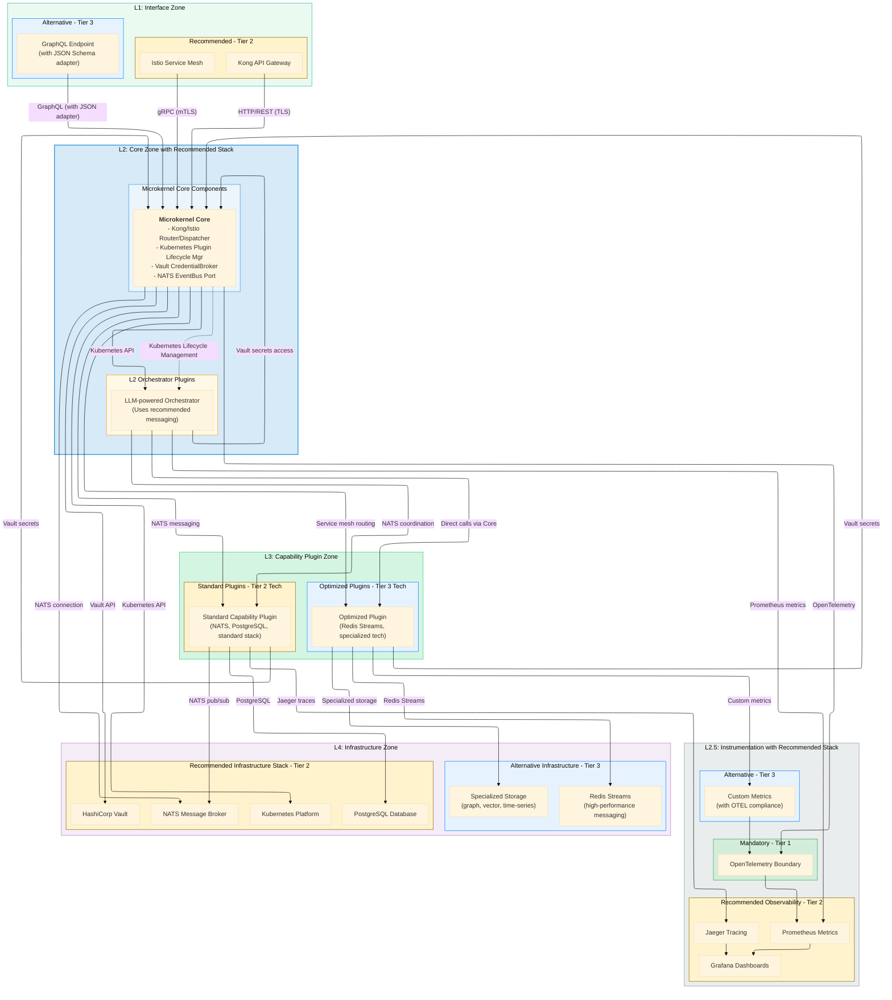
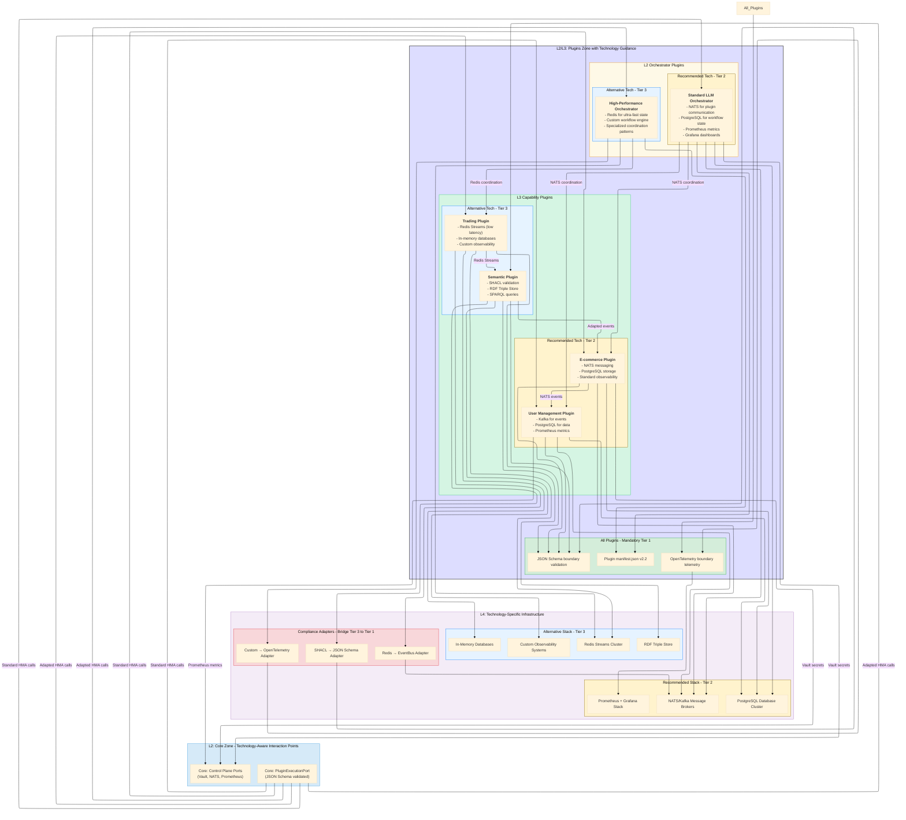

# Hexagonal Microkernel Architecture (HMA) Specification

_Version 2.2 (Guided Implementation Edition)_

**(Companion document to the AI-Powered Model-Driven Development (APMDD) Methodology v2.2)**

---

**Part 2: HMA High-Level Structure: Layers & Major Zones (Analogous to C4 Level 2 - Containers)**

This part describes the macro-architecture of HMA with the new guided flexibility framework, focusing on its layered model and the major logical "zones" or "containers" within the system. It provides a high-level structural map, showing how different parts of an HMA system are organized and how they interact using both standard patterns and recommended technologies.

## 4. HMA Macro-Architecture: The Layered Reference Model
#hma-layer-L0 #hma-layer-L1 #hma-layer-L2 #hma-layer-L2-5 #hma-layer-L3 #hma-layer-L4 #c4-level-2

HMA employs a strict layered architecture to enforce separation of concerns, enable replaceability, and manage dependencies. **ENHANCED in v2.2:** Each layer now has clear technology guidance through the three-tier framework, providing proven recommendations while enabling alternatives for specialized needs.

### 4.1 Overview of L0-L4 Layers with Technology Guidance
*(See [[HMA v2.2 - Part 6 - Supporting Information#19.2 Core HMA Terms (Enhanced for v2.2)|Glossary]] for layer definitions)*

HMA defines the following logical layers with their associated technology recommendations:

*   **L0: Actor Layer:** This layer represents all external entities that interact with the HMA system. These can be human users, other software systems, administrative tools, or even peer AI agents. Actors initiate requests or consume events from the system.

*   **L1: Interface Layer (Driving Adapters):** This is HMA's outermost boundary from an inbound perspective. It consists of **Driving Adapters** that receive requests or events from L0 Actors.
    *   **Mandatory Standards (Tier 1):** ALL adapters MUST validate incoming data against JSON Schema and document APIs using OpenAPI 3.0+
    *   **Recommended Technologies (Tier 2):** REST APIs with Kong API Gateway, gRPC with Istio service mesh, message queue listeners with NATS/Kafka
    *   **Alternative Technologies (Tier 3):** GraphQL endpoints, WebSocket connections, custom protocols with proper boundary compliance adapters

*   **L2: Microkernel Core Layer & L2.5 Instrumentation Sub-Layer:** This is the architectural heart of HMA, with clear technology guidance for operational excellence.
    *   **L2 Core Logic:** Contains the non-domain-specific components:
        *   **Request Router/Dispatcher:** Routes incoming tasks using recommended service discovery mechanisms
        *   **Plugin Lifecycle Manager:** Manages plugin states using recommended container orchestration (Kubernetes/Docker Compose)
        *   **Control Plane Services:** Provides essential services like `CredentialBroker` using recommended secrets management (HashiCorp Vault)
        *   **Core Ports:** Defined using mandatory JSON Schema validation at boundaries
    *   **L2 Pluggable Orchestrators:** LLM-powered agents or workflows for intelligent coordination
    *   **L2.5 Instrumentation & Enforcement Sub-Layer:** 
        *   **Mandatory (Tier 1):** OpenTelemetry for boundary telemetry
        *   **Recommended (Tier 2):** Prometheus metrics, Jaeger tracing, Grafana visualization
        *   **Alternative (Tier 3):** Custom observability systems with OTEL boundary compliance

*   **L3: Capability Plugin Layer:** Contains independently deployable **Capability Plugins** with guided technology choices.
    *   **Mandatory Standards:** All plugins MUST provide manifest.json files conforming to v2.2 schema
    *   **Recommended Technologies:** Use Tier 2 technologies for common needs (NATS for messaging, Kubernetes for orchestration)
    *   **Alternative Technologies:** Domain-specific optimizations (SHACL for semantic systems, Redis Streams for high-performance) with compliance adapters
    *   **Plugin Communication:** Recommended asynchronous via Event Bus using NATS/Kafka, alternative direct communication with proper service mesh integration

*   **L4: Infrastructure Layer (Driven Adapters & External Systems):** Concrete implementations with clear technology recommendations.
    *   **Recommended Infrastructure Stack:**
        *   **Message Brokers:** NATS (simple scale), Kafka (enterprise scale), RabbitMQ (complex routing)
        *   **Observability:** Prometheus + Grafana + Jaeger + Loki stack
        *   **Container Platform:** Kubernetes (production), Docker Compose (development), K3s (edge)
        *   **Secrets Management:** HashiCorp Vault, External Secrets Operator, cloud-native solutions
        *   **API Management:** Kong, Istio, Traefik based on requirements
    *   **Alternative Infrastructure:** Custom solutions with proper compliance adapters and documentation

### 4.2 Technology Selection by Layer (NEW in v2.2)

```yaml
layer_technology_guidance:
  l1_interface:
    mandatory:
      - "JSON Schema validation at all boundaries"
      - "OpenAPI 3.0+ documentation for REST APIs"
      - "TLS 1.3+ for all external communication"
    recommended:
      - "Kong API Gateway for REST APIs"
      - "Istio service mesh for gRPC"
      - "NATS/Kafka for event ingestion"
    alternatives:
      - "GraphQL with compliance adapters"
      - "WebSocket with proper boundary validation"
      - "Custom protocols with documented schemas"

  l2_core:
    mandatory:
      - "OpenTelemetry for boundary observability"
      - "mTLS for plugin-to-plugin communication"
      - "JSON Schema for all port contracts"
    recommended:
      - "Kubernetes for container orchestration"
      - "HashiCorp Vault for secrets management"
      - "Prometheus + Grafana for monitoring"
    alternatives:
      - "Docker Compose for simple deployments"
      - "Cloud-native secrets management"
      - "Custom monitoring with OTEL compliance"

  l3_plugins:
    mandatory:
      - "Plugin manifest.json v2.2 schema compliance"
      - "Boundary validation using JSON Schema"
      - "Standard HMA port implementations"
    recommended:
      - "NATS/Kafka for inter-plugin messaging"
      - "PostgreSQL for standard data storage"
      - "Standard logging frameworks"
    alternatives:
      - "Domain-specific technologies (SHACL, Protocol Buffers)"
      - "Specialized databases (graph, time-series)"
      - "High-performance messaging (Redis Streams)"

  l4_infrastructure:
    recommended:
      - "NATS (simple), Kafka (enterprise), RabbitMQ (complex routing)"
      - "Prometheus + Grafana + Jaeger + Loki observability stack"
      - "PostgreSQL for standard data storage"
      - "HashiCorp Vault for secrets management"
    alternatives:
      - "Redis for high-performance caching/messaging"
      - "Specialized databases for domain needs"
      - "Custom observability backends with OTEL compliance"
```

### 4.3 Diagram: HMA Layered Reference Model with Technology Guidance
#hma-diagram


```mermaid
%%{ init: { 'theme': 'base', "flowchart": { "defaultRenderer": "elk" } } }%%
flowchart TD
    subgraph Zone_L0_Actors [L0: Actor Zone]
        direction TB
        User((User))
        ExtSystem((External System))
        PeerAgent((Peer AI Agent))
    end

    subgraph Zone_L1_Interfaces [L1: Interface Zone - Driving Adapters]
        direction TB
        subgraph L1_Recommended [Recommended Tech - Tier 2]
            KongGateway["Kong API Gateway"]
            IstioMesh["Istio Service Mesh"]
            NATSIngress["NATS Event Ingress"]
        end
        subgraph L1_Alternative [Alternative Tech - Tier 3]
            GraphQLEndpoint["GraphQL Endpoint"]
            WebSocketAPI["WebSocket API"]
        end
        subgraph L1_Mandatory [All adapters MUST have]
            JSONValidation["JSON Schema Validation"]
            OpenAPIDoc["OpenAPI 3.0+ Documentation"]
            TLSEncryption["TLS 1.3+ Encryption"]
        end
    end

    subgraph Zone_L2_Core_Orch_Instr [L2: Core & Orchestration Zone + L2.5]
        direction TB
        subgraph L2_Core_Kernel [L2 Microkernel Core]
            RouterDispatcher["Request Router/Dispatcher"]
            PluginLifecycleMgr["Plugin Lifecycle Mgr<br/>(Kubernetes/Docker Compose)"]
            ControlPlaneSvcs["Control Plane Services<br/>(HashiCorp Vault CredBroker)"]
        end
        subgraph L2_Orchestrators_SubZone [L2 Orchestrator Plugins]
             AgenticOrchestratorPluginZ["Agentic Orchestrator Z<br/>(LLM-powered coordination)"]
        end
        subgraph L2_5_Instrumentation [L2.5 Instrumentation & Enforcement]
            OTEL_SDK["OpenTelemetry SDK<br/>(Mandatory boundary telemetry)"]
            PrometheusMetrics["Prometheus + Grafana<br/>(Recommended observability)"]
            HMA_Validator["HMA Compliance Validator"]
        end
        CoreInPorts["Core Inbound Ports<br/>(JSON Schema validated)"]
        CoreOutPorts["Core Outbound Ports<br/>(mTLS secured)"]
    end

    subgraph Zone_L3_Plugins [L3: Capability Plugin Zone]
        direction TB
        subgraph L3_Standard [Standard Plugins - Tier 2 Tech]
            CapabilityPluginA["Capability Plugin A<br/>(NATS messaging, PostgreSQL)"]
            CapabilityPluginB["Capability Plugin B<br/>(Standard tech stack)"]
        end
        subgraph L3_Optimized [Optimized Plugins - Tier 3 Tech]
            SemanticPlugin["Semantic Plugin<br/>(SHACL + compliance adapter)"]
            HighPerfPlugin["High-Performance Plugin<br/>(Redis Streams + adapter)"]
        end
        PluginManifests["All plugins: manifest.json v2.2<br/>(Mandatory compliance)"]
    end

    subgraph Zone_L4_Infrastructure [L4: Infrastructure Zone - Driven Adapters & External Systems]
        direction TB
        subgraph L4_Recommended_Stack [Recommended Infrastructure - Tier 2]
            MessageBrokers["NATS/Kafka/RabbitMQ<br/>Message Brokers"]
            ObservabilityStack["Prometheus+Grafana+Jaeger+Loki<br/>Observability Stack"]
            ContainerPlatform["Kubernetes/Docker Compose<br/>Container Platform"]
            SecretsManagement["HashiCorp Vault<br/>Secrets Management"]
        end
        subgraph L4_Alternative_Infra [Alternative Infrastructure - Tier 3]
            SpecializedDBs["Specialized Databases<br/>(Graph, Time-series, Vector)"]
            CustomObservability["Custom Observability<br/>(with OTEL compliance)"]
            HighPerfInfra["High-Performance Infrastructure<br/>(In-memory, specialized)"]
        end
    end

    %% Connections between Zones/Layers
    User --> KongGateway
    User --> WebSocketAPI
    ExtSystem --> NATSIngress
    PeerAgent --> IstioMesh

    KongGateway --> CoreInPorts
    IstioMesh --> CoreInPorts
    NATSIngress --> CoreInPorts
    GraphQLEndpoint --> CoreInPorts
    WebSocketAPI --> CoreInPorts

    CoreInPorts --> RouterDispatcher
    RouterDispatcher --> PluginLifecycleMgr
    RouterDispatcher --> ControlPlaneSvcs
    RouterDispatcher --> AgenticOrchestratorPluginZ
    RouterDispatcher --> CapabilityPluginA
    RouterDispatcher --> CapabilityPluginB
    RouterDispatcher --> SemanticPlugin
    RouterDispatcher --> HighPerfPlugin

    AgenticOrchestratorPluginZ --> CapabilityPluginA
    AgenticOrchestratorPluginZ --> CapabilityPluginB
    AgenticOrchestratorPluginZ --> ControlPlaneSvcs
    AgenticOrchestratorPluginZ --> OTEL_SDK

    CapabilityPluginA --> ControlPlaneSvcs
    CapabilityPluginB --> ControlPlaneSvcs
    SemanticPlugin --> ControlPlaneSvcs
    HighPerfPlugin --> ControlPlaneSvcs

    CapabilityPluginA --> OTEL_SDK
    CapabilityPluginB --> OTEL_SDK
    SemanticPlugin --> OTEL_SDK
    HighPerfPlugin --> OTEL_SDK

    CoreOutPorts --> MessageBrokers
    CoreOutPorts --> ObservabilityStack
    CoreOutPorts --> SecretsManagement

    OTEL_SDK --> HMA_Validator
    PrometheusMetrics --> ObservabilityStack
    HMA_Validator --> ObservabilityStack

    CapabilityPluginA --> MessageBrokers
    CapabilityPluginB --> MessageBrokers
    SemanticPlugin --> SpecializedDBs
    HighPerfPlugin --> HighPerfInfra

    %% Styling for Zones
    style Zone_L0_Actors fill:#fdebd0,stroke:#a04000,stroke-width:2px
    style Zone_L1_Interfaces fill:#eafaf1,stroke:#1abc9c,stroke-width:2px
        style L1_Recommended fill:#fff3cd,stroke:#856404,stroke-width:1px,stroke-dasharray:5 5
        style L1_Alternative fill:#e6f3ff,stroke:#007bff,stroke-width:1px,stroke-dasharray:5 5
        style L1_Mandatory fill:#d4edda,stroke:#28a745,stroke-width:1px,stroke-dasharray:5 5
    style Zone_L2_Core_Orch_Instr fill:#d6eaf8,stroke:#3498db,stroke-width:2px
        style L2_Core_Kernel fill:#ebf5fb,stroke:#3498db,stroke-width:1px,stroke-dasharray:5 5
        style L2_Orchestrators_SubZone fill:#fef9e7,stroke:#f39c12,stroke-width:1px,stroke-dasharray:5 5
        style L2_5_Instrumentation fill:#eaeded,stroke:#85929e,stroke-width:1px,stroke-dasharray:5 5
    style Zone_L3_Plugins fill:#d5f5e3,stroke:#2ecc71,stroke-width:2px
        style L3_Standard fill:#fff3cd,stroke:#856404,stroke-width:1px,stroke-dasharray:5 5
        style L3_Optimized fill:#e6f3ff,stroke:#007bff,stroke-width:1px,stroke-dasharray:5 5
    style Zone_L4_Infrastructure fill:#f4ecf7,stroke:#af7ac5,stroke-width:2px
        style L4_Recommended_Stack fill:#fff3cd,stroke:#856404,stroke-width:1px,stroke-dasharray:5 5
        style L4_Alternative_Infra fill:#e6f3ff,stroke:#007bff,stroke-width:1px,stroke-dasharray:5 5

    classDef itemNode fill:#fff,stroke:#333,stroke-width:1.5px
    class User,ExtSystem,PeerAgent,KongGateway,IstioMesh,NATSIngress,GraphQLEndpoint,WebSocketAPI,JSONValidation,OpenAPIDoc,TLSEncryption,RouterDispatcher,PluginLifecycleMgr,ControlPlaneSvcs,AgenticOrchestratorPluginZ,OTEL_SDK,PrometheusMetrics,HMA_Validator,CoreInPorts,CoreOutPorts,CapabilityPluginA,CapabilityPluginB,SemanticPlugin,HighPerfPlugin,PluginManifests,MessageBrokers,ObservabilityStack,ContainerPlatform,SecretsManagement,SpecializedDBs,CustomObservability,HighPerfInfra itemNode

```

*   **Diagram 4.3-A: HMA Layered Reference Model with Technology Guidance (v2.2):** This diagram visualizes the L0-L4 layers with explicit technology recommendations. Tier 1 (mandatory) standards ensure interoperability, Tier 2 (recommended) technologies provide proven solutions, and Tier 3 (alternative) technologies enable optimization with proper compliance.

### 4.4 Interaction Flow Between Layers with Technology Context

The interaction flow in HMA v2.2 maintains the same architectural patterns while leveraging recommended technologies for optimal implementation:

1.  **L0 Actors** initiate interactions using recommended client technologies.
2.  **L1 Interface Adapters** (preferably Kong/Istio) receive these, validate using mandatory JSON Schema, and call Inbound Ports on the **L2 Microkernel Core**.
3.  The **L2 Core** (using recommended Kubernetes orchestration) then:
    *   For simple tasks, routes the request to an appropriate **L3 Capability Plugin** via the `PluginExecutionPort`.
    *   For complex tasks, routes the request to an appropriate **L2 Orchestrator Plugin**.
4.  **L2 Orchestrator Plugins** coordinate multiple **L3 Capability Plugins** using recommended messaging (NATS/Kafka) or direct calls through the Core.
5.  **L3 Capability Plugins** execute their logic using:
    *   Recommended technologies for standard needs (PostgreSQL, standard logging)
    *   Alternative technologies for specialized needs (SHACL, Redis Streams) with compliance adapters
    *   Mandatory OpenTelemetry telemetry at boundaries
6.  **L4 Infrastructure** components implement the recommended technology stack or alternatives with proper documentation.

**Enhanced Dependency Rule (v2.2):** Higher layers should use recommended technologies unless alternatives provide documented benefits. All alternatives MUST maintain boundary compliance through appropriate adapters.

## 5. The HMA Microkernel Core Zone (L2): Role & Responsibilities
#hma-zone-core #hma-layer-L2 #c4-level-2
[[HMA v2.2 - Part 3 - Internal Components and Interfaces#8. Deeper Dive: Microkernel Core Components (L2)]]

The L2 Zone is the central nervous system of HMA, designed to be minimal yet operationally excellent through recommended technology choices.

### 5.1 Core's Minimalist Mandate with Operational Excellence
#hma-core-component
*(See [[HMA v2.2 - Part 6 - Supporting Information#19.2 Core HMA Terms (Enhanced for v2.2)|Glossary: Core]])*

The Microkernel Core maintains its minimalist mandate while leveraging recommended technologies for optimal operation:

*   **Request Routing & Dispatching:** 
    *   **Recommended Implementation:** Kong API Gateway for L1 interfaces, Istio service mesh for internal routing
    *   **Alternative Options:** Custom routing with documented performance benefits and compliance adapters

*   **Plugin Lifecycle Management:** 
    *   **Recommended Implementation:** Kubernetes for container orchestration, Docker Compose for development
    *   **Mandatory Standards:** Plugin manifest.json v2.2 schema validation
    *   **Alternative Options:** Custom orchestration platforms with HMA lifecycle compliance

*   **Control Plane Service Access:** 
    *   **Recommended Implementation:** HashiCorp Vault for secrets management, NATS for event bus
    *   **Mandatory Standards:** mTLS for secure communication, JSON Schema for data validation
    *   **Alternative Options:** Cloud-native secrets management, custom event systems with compliance adapters

### 5.2 Core's Technology Stack Recommendations (NEW in v2.2)

```yaml
core_technology_stack:
  container_orchestration:
    recommended: "Kubernetes (production), Docker Compose (development)"
    alternatives: "K3s (edge), custom orchestration platforms"
    mandatory: "Plugin lifecycle management via standard APIs"
    
  secrets_management:
    recommended: "HashiCorp Vault, External Secrets Operator"
    alternatives: "AWS Secrets Manager, Azure Key Vault, Google Secret Manager"
    mandatory: "Secure credential storage and distribution"
    
  observability:
    recommended: "Prometheus + Grafana + Jaeger + Loki stack"
    alternatives: "Custom observability with OpenTelemetry compliance"
    mandatory: "OpenTelemetry boundary telemetry"
    
  messaging:
    recommended: "NATS (simple), Kafka (enterprise), RabbitMQ (complex routing)"
    alternatives: "Redis Streams, Apache Pulsar with compliance adapters"
    mandatory: "Event schema validation at boundaries"
    
  api_management:
    recommended: "Kong (gateway), Istio (service mesh), Traefik (cloud-native)"
    alternatives: "Envoy, custom gateways with OpenAPI compliance"
    mandatory: "API documentation using OpenAPI 3.0+"
```

### 5.3 Core's Boundaries and Interactions with Technology Context

*   **Interaction with L1 (Interface Zone):**
    *   **Recommended:** Kong API Gateway for REST, Istio for gRPC, NATS for events
    *   **Mandatory:** JSON Schema validation, OpenAPI documentation, TLS encryption
    *   **Alternative:** GraphQL, WebSocket with compliance adapters

*   **Interaction with L3 (Capability Plugin Zone) & L2 Orchestrator Plugins:**
    *   **Recommended:** Kubernetes-native plugin management, NATS for messaging
    *   **Mandatory:** Plugin manifest.json v2.2 compliance, mTLS communication
    *   **Alternative:** Custom orchestration with HMA lifecycle compliance

*   **Interaction with L2.5 (Instrumentation Zone):**
    *   **Recommended:** Prometheus metrics, Jaeger tracing, Grafana dashboards
    *   **Mandatory:** OpenTelemetry boundary telemetry
    *   **Alternative:** Custom observability with OTEL compliance

*   **Interaction with L4 (Infrastructure Zone):**
    *   **Recommended:** Standard technology stack (see section 4.2)
    *   **Alternative:** Specialized infrastructure with documented rationale

### 5.4 Diagram: Core Zone Context with Technology Stack
#hma-diagram


*   **Diagram 5.4-A: Core Zone Context with Technology Stack (v2.2):** Shows the Microkernel Core leveraging recommended technologies (Tier 2) while maintaining mandatory standards (Tier 1) and supporting alternative technologies (Tier 3) with proper adapters.

## 6. HMA Plugins Zone (L3 Capability & L2 Orchestrator): Autonomy & Technology Guidance
#hma-zone-plugin #hma-layer-L3 #hma-plugin #c4-level-2
[[HMA v2.2 - Part 3 - Internal Components and Interfaces#9. Deeper Dive: Generic Plugin Components (L3 & L2 Orchestrator)]]

The Plugins Zone combines maximum autonomy with guided technology choices, enabling both proven reliability and domain-specific optimization.

### 6.1 L3 Capability Plugins: Technology-Guided Business Logic
#hma-plugin-capability
*(See [[HMA v2.2 - Part 6 - Supporting Information#19.2 Core HMA Terms (Enhanced for v2.2)|Glossary: Plugin]])*

L3 Capability Plugins maintain their autonomy while benefiting from technology guidance:

*   **Role:** Encapsulate specific business functionality using optimal technology choices
*   **Technology Selection Framework:**
    *   **Mandatory Standards:** Plugin manifest.json v2.2, JSON Schema boundary validation, OpenTelemetry telemetry
    *   **Recommended Technologies:** NATS/Kafka for messaging, PostgreSQL for data storage, standard logging frameworks
    *   **Alternative Technologies:** Domain-specific optimizations (SHACL for semantic systems, Redis for caching) with compliance adapters

*   **Enhanced Autonomy in v2.2:**
    *   **Technology Independence:** Choose optimal technologies for specific domain needs
    *   **Compliance Assurance:** Maintain ecosystem compatibility through boundary compliance
    *   **Operational Excellence:** Leverage recommended observability and deployment patterns

### 6.2 Plugin Technology Selection Examples (NEW in v2.2)

#### 6.2.1 Standard E-commerce Plugin
```yaml
e_commerce_plugin:
  technology_tier: "recommended"
  stack:
    messaging: "NATS (simple event publishing)"
    storage: "PostgreSQL (transactional data)"
    observability: "Prometheus + Grafana + Jaeger"
    deployment: "Kubernetes deployment"
  rationale: "Standard business logic, proven reliability requirements"
  compliance: "Full Tier 2 recommended stack"
```

#### 6.2.2 High-Performance Trading Plugin  
```yaml
trading_plugin:
  technology_tier: "alternative"
  stack:
    messaging: "Redis Streams (ultra-low latency)"
    storage: "In-memory databases (sub-millisecond access)"
    serialization: "Protocol Buffers (performance)"
    observability: "Custom metrics + OpenTelemetry boundaries"
  rationale: "Microsecond latency requirements, financial regulations"
  compliance: "Tier 3 alternatives with compliance adapters"
  adapters:
    - "RedisToEventBusAdapter for HMA event compatibility"
    - "ProtoBufToJSONAdapter for boundary validation"
    - "CustomMetricsToOTELAdapter for observability compliance"
```

#### 6.2.3 Semantic Knowledge Plugin
```yaml
semantic_plugin:
  technology_tier: "alternative"
  stack:
    validation: "SHACL (semantic constraints)"
    storage: "RDF Triple Store (native semantic storage)"
    query: "SPARQL (semantic queries)"
    observability: "Standard OTEL + semantic metrics"
  rationale: "Semantic reasoning requirements, ontology validation"
  compliance: "Tier 3 alternatives with semantic-to-standard adapters"
  adapters:
    - "SHACLToJSONSchemaAdapter for boundary validation"
    - "SPARQLToRESTAdapter for standard API compatibility"
    - "RDFToJSONLDAdapter for data interchange"
```

### 6.3 L2 Orchestrator Plugins: Intelligent Coordination with Recommended Technologies
#hma-plugin-orchestrator

L2 Orchestrator Plugins leverage recommended technologies for intelligent workflow coordination:

*   **Recommended Technology Stack:**
    *   **Workflow Engine:** LLM-powered agents with NATS for plugin communication
    *   **State Management:** PostgreSQL for workflow state, Redis for temporary state
    *   **Communication:** NATS for event-driven coordination, direct calls via Core for synchronous needs
    *   **Observability:** Full Prometheus + Grafana + Jaeger stack for workflow visibility

*   **Alternative Optimizations:**
    *   **High-Performance Orchestration:** Custom workflow engines with compliance adapters
    *   **Specialized Coordination:** Domain-specific orchestration patterns (financial, AI/ML pipelines)

### 6.4 Plugin Zone Technology Architecture (NEW in v2.2)

```yaml
plugin_technology_architecture:
  standard_plugins:
    description: "Plugins using Tier 2 recommended technologies"
    benefits:
      - "Proven reliability and community support"
      - "Standardized operational patterns"
      - "Rich ecosystem and tooling"
      - "Simplified team training and maintenance"
    examples:
      - "Business logic plugins (user management, product catalog)"
      - "Standard data processing plugins"
      - "Common API integration plugins"
      
  optimized_plugins:
    description: "Plugins using Tier 3 alternative technologies"
    benefits:
      - "Domain-specific performance optimization"
      - "Specialized capability enablement"
      - "Competitive advantage through innovation"
      - "Advanced feature implementation"
    requirements:
      - "Documented rationale and performance benefits"
      - "Compliance adapters for boundary compatibility"
      - "Migration plan to recommended technologies if needed"
      - "Team expertise in alternative technologies"
    examples:
      - "High-frequency trading plugins (Redis Streams)"
      - "Semantic reasoning plugins (SHACL, RDF)"
      - "AI/ML plugins (TensorFlow, specialized frameworks)"
      - "Financial compliance plugins (regulatory engines)"

  hybrid_plugins:
    description: "Plugins combining recommended and alternative technologies"
    strategy:
      - "Use recommended technologies for standard operations"
      - "Use alternative technologies for specific optimizations"
      - "Maintain clear boundaries between technology tiers"
      - "Provide fallback mechanisms to recommended technologies"
    example: "AI/ML plugin using PostgreSQL for metadata, Feast for features, TensorFlow for models"
```

### 6.5 Plugin Zone Boundaries and Technology-Aware Interactions

*   **Plugin-Core Interaction:** 
    *   **Mandatory:** Standard HMA port contracts with JSON Schema validation
    *   **Recommended:** mTLS communication, OpenTelemetry tracing
    *   **Technology-Agnostic:** Core doesn't depend on plugin's internal technology choices

*   **Plugin-Plugin Interaction:**
    *   **Recommended:** NATS/Kafka for asynchronous event-driven communication
    *   **Alternative:** Direct synchronous calls via service mesh (Istio) with proper discovery
    *   **Hybrid:** Event notifications via recommended brokers, data transfer via optimized channels

*   **Plugin-Infrastructure Interaction:**
    *   **Standard Plugins:** Use recommended infrastructure stack
    *   **Optimized Plugins:** Use alternative infrastructure with compliance adapters
    *   **Isolation:** Each plugin manages its own infrastructure dependencies

### 6.6 Diagram: Plugin Zone Technology Context
#hma-diagram


*   **Diagram 6.6-A: Plugin Zone Technology Context (v2.2):** Shows how plugins can use either recommended technologies (Tier 2) for proven reliability or alternative technologies (Tier 3) for optimization, while maintaining mandatory compliance (Tier 1) through adapters.

## 7. Guided Interaction Patterns with Technology Recommendations (ENHANCED in v2.2)
#hma-principle

HMA v2.2 provides clear technology recommendations for each interaction pattern while maintaining flexibility for specialized needs.

### 7.1 Baseline Interaction Patterns with Recommended Technologies

#### 7.1.1 Direct Synchronous Request/Response (Enhanced Technology Guidance)
*Standard HMA pattern with recommended technology stack*

**Recommended Technology Stack:**
- **L1 Interface:** Kong API Gateway or Istio service mesh
- **Communication:** HTTP/2 with TLS 1.3+, gRPC with mTLS
- **Validation:** JSON Schema at boundaries, OpenAPI 3.0+ documentation
- **Observability:** OpenTelemetry tracing, Prometheus metrics

**Pattern Flow with Technology Context:**
1. **L0 Actor** sends request via recommended client SDK
2. **Kong/Istio Adapter** validates against OpenAPI schema, logs to Prometheus
3. **L2 Core** routes via Kubernetes service discovery to target plugin
4. **Plugin** processes using recommended tech stack, emits OTEL traces
5. **Response** flows back with full observability correlation

#### 7.1.2 Asynchronous Event-Driven Communication (Technology-Guided)
*Standard HMA pattern with recommended messaging technologies*

**Recommended Technology Stack:**
- **Message Brokers:** NATS (simple), Kafka (enterprise), RabbitMQ (complex routing)
- **Event Schema:** JSON Schema validation with CloudEvents format
- **Observability:** OTEL context propagation, Jaeger tracing
- **Security:** mTLS for broker connections, event signing

**Pattern Flow with Technology Context:**
1. **Source Plugin** creates CloudEvents-formatted message
2. **NATS/Kafka Broker** receives via OTEL-instrumented connection
3. **Event Schema Validation** ensures compliance at broker level
4. **Consumer Plugins** receive with full trace context propagation
5. **Processing** occurs with correlated observability across all hops

#### 7.1.3 Orchestrated Multi-Plugin Workflows (LLM-Enhanced)
*Standard HMA pattern with AI-powered orchestration technologies*

**Recommended Technology Stack:**
- **Orchestration Engine:** LLM-powered agents with workflow state management
- **Coordination:** NATS for event-driven coordination, PostgreSQL for state
- **Decision Making:** LLM APIs with prompt engineering frameworks
- **Monitoring:** Specialized workflow observability with business metrics

### 7.2 Extended Interaction Patterns with Alternative Technologies

#### 7.2.1 High-Performance Financial Trading Pattern
```yaml
financial_trading_pattern:
  technology_tier: "alternative"
  use_case: "Microsecond latency financial trading"
  
  technologies:
    messaging: "Redis Streams (ultra-low latency)"
    serialization: "Protocol Buffers (performance)"
    storage: "In-memory databases (speed)"
    observability: "Custom metrics + OTEL boundaries"
    
  compliance_adapters:
    - "RedisToEventBusAdapter: Bridges Redis Streams to standard NATS"
    - "ProtoBufToJSONAdapter: Converts ProtoBuf to JSON at boundaries"
    - "CustomMetricsToOTELAdapter: Exports custom metrics via OpenTelemetry"
    
  performance_benefits:
    latency_improvement: "90% reduction vs standard stack"
    throughput_increase: "10x message processing rate"
    cost_efficiency: "50% infrastructure cost reduction"
    
  operational_plan:
    team_training: "Redis and ProtoBuf expertise development"
    monitoring: "Custom dashboards + standard OTEL integration"
    fallback: "Automatic degradation to NATS during Redis issues"
```

#### 7.2.2 Semantic Knowledge Graph Pattern
```yaml
semantic_knowledge_pattern:
  technology_tier: "alternative"
  use_case: "RDF-based semantic reasoning and validation"
  
  technologies:
    validation: "SHACL (semantic constraints)"
    storage: "Apache Jena, Stardog (RDF triple stores)"
    query: "SPARQL (semantic queries)"
    reasoning: "OWL inferencing engines"
    
  compliance_adapters:
    - "SHACLToJSONSchemaAdapter: Validates RDF with standard fallback"
    - "SPARQLToRESTAdapter: Exposes SPARQL via standard REST APIs"
    - "RDFToJSONLDAdapter: Converts RDF to JSON-LD for boundaries"
    
  semantic_benefits:
    reasoning_capability: "Automated inference and validation"
    data_quality: "Semantic constraint checking"
    interoperability: "Standards-based data exchange"
    
  operational_plan:
    team_training: "Semantic web technologies and SPARQL"
    integration: "Standard APIs with semantic backends"
    migration: "Gradual transition from relational to graph storage"
```

#### 7.2.3 AI/ML Pipeline Pattern
```yaml
ai_ml_pipeline_pattern:
  technology_tier: "alternative"
  use_case: "Machine learning model training and inference"
  
  technologies:
    validation: "TensorFlow Data Validation (ML-specific)"
    feature_store: "Feast, Tecton (ML feature management)"
    model_registry: "MLflow, Kubeflow (model lifecycle)"
    serving: "TensorFlow Serving, Seldon (model inference)"
    
  compliance_adapters:
    - "TFDVToJSONSchemaAdapter: ML validation with standard fallback"
    - "FeatureStoreToRESTAdapter: Feature access via standard APIs"
    - "MLModelToAPIAdapter: Model serving via standard endpoints"
    
  ml_benefits:
    data_quality: "ML-specific data validation and drift detection"
    feature_management: "Centralized feature engineering and serving"
    model_lifecycle: "Automated training, validation, and deployment"
    
  operational_plan:
    team_training: "MLOps practices and specialized tools"
    monitoring: "ML metrics + standard observability"
    governance: "Model versioning and compliance tracking"
```

### 7.3 Technology Selection Decision Framework (NEW in v2.2)

```yaml
technology_decision_framework:
  step_1_requirements_analysis:
    questions:
      - "What are the performance requirements (latency, throughput)?"
      - "What are the domain-specific needs (semantic, AI/ML, financial)?"
      - "What is the team's expertise level?"
      - "What are the operational complexity constraints?"
      
  step_2_tier_evaluation:
    tier_1_check:
      question: "Is this for boundary/interoperability requirements?"
      if_yes: "Use mandatory standards (JSON Schema, OTEL, mTLS)"
      
    tier_2_assessment:
      question: "Do recommended technologies meet requirements?"
      if_yes: "Use Tier 2 stack (NATS, Kubernetes, PostgreSQL)"
      benefits: "Proven reliability, community support, operational simplicity"
      
    tier_3_evaluation:
      question: "Do alternatives provide significant documented benefits?"
      requirements:
        - "Quantified performance improvements (>20%)"
        - "Team expertise in alternative technology"
        - "Documented compliance adapter strategy"
        - "Migration plan back to recommended technologies"
      if_yes: "Consider Tier 3 alternatives with proper documentation"
      
  step_3_compliance_planning:
    mandatory_requirements:
      - "Boundary validation using JSON Schema"
      - "Observability via OpenTelemetry at boundaries"
      - "Security via mTLS/TLS for communications"
      - "Documentation using standardized templates"
      
    adapter_implementation:
      - "Design compliance adapters for alternative technologies"
      - "Test adapter reliability and performance"
      - "Plan fallback mechanisms to recommended technologies"
      - "Document operational procedures and troubleshooting"
      
  step_4_implementation_strategy:
    pilot_approach:
      - "Start with small, non-critical component"
      - "Measure performance and operational impact"
      - "Validate compliance adapter functionality"
      - "Gather team feedback and refine approach"
      
    production_rollout:
      - "Gradual expansion based on pilot success"
      - "Full monitoring and observability implementation"
      - "Team training and documentation completion"
      - "Community contribution of successful patterns"
```

### 7.4 Diagram: Technology-Guided Interaction Patterns
#hma-diagram

```mermaid
%%{ init: { 'theme': 'base', "flowchart": { "defaultRenderer": "elk" } } }%%
graph TD
    subgraph SystemBoundary["HMA System with Technology Guidance"]
        direction TB
        
        subgraph L1_Interface_Tech [L1: Interface Technologies]
            Kong_Gateway["Kong API Gateway<br/>(Recommended - Tier 2)"]
            GraphQL_Alt["GraphQL Endpoint<br/>(Alternative - Tier 3)"]
        end
        
        subgraph L2_Core_Tech [L2: Core Technologies]
            Core_Kubernetes["Core on Kubernetes<br/>(Recommended orchestration)"]
            Core_NATS["Core with NATS<br/>(Recommended messaging)"]
            Core_Vault["Core with Vault<br/>(Recommended secrets)"]
        end
        
        subgraph L3_Plugins_Tech [L3: Plugin Technologies]
            Standard_Plugin["Standard Plugin<br/>(NATS + PostgreSQL)"]
            Trading_Plugin["Trading Plugin<br/>(Redis Streams + ProtoBuf)"]
            Semantic_Plugin["Semantic Plugin<br/>(SHACL + RDF)"]
            ML_Plugin["ML Plugin<br/>(TensorFlow + Feast)"]
        end
        
        subgraph L4_Infrastructure_Tech [L4: Infrastructure Technologies]
            Recommended_Stack["Recommended Stack<br/>(NATS, PostgreSQL, Prometheus)"]
            Alternative_Stack["Alternative Stack<br/>(Redis, RDF, Custom metrics)"]
            Compliance_Bridge["Compliance Adapters<br/>(Bridge alternatives to standards)"]
        end
    end
    
    Actor["L0 Actor<br/>(Using recommended SDKs)"]

    %% Pattern 1: Standard Direct Sync (Recommended Technologies)
    Actor -- "1. HTTPS/TLS request" --> Kong_Gateway
    Kong_Gateway -- "2. JSON Schema validated" --> Core_Kubernetes
    Core_Kubernetes -- "3. Route via service mesh" --> Standard_Plugin
    Standard_Plugin -- "4. PostgreSQL query" --> Recommended_Stack
    Standard_Plugin -- "5. OTEL traced response" --> Core_Kubernetes
    Core_Kubernetes -- "6. Response" --> Kong_Gateway
    Kong_Gateway -- "7. Response" --> Actor
    
    %% Pattern 2: Alternative GraphQL (Alternative Technology)
    Actor -- "8. GraphQL query" --> GraphQL_Alt
    GraphQL_Alt -- "9. Adapted to JSON Schema" --> Core_Kubernetes
    Core_Kubernetes -- "10. Route to semantic plugin" --> Semantic_Plugin
    Semantic_Plugin -- "11. SPARQL query" --> Alternative_Stack
    Semantic_Plugin -- "12. RDF to JSON-LD" --> Compliance_Bridge
    Compliance_Bridge -- "13. Standard compliance" --> Core_Kubernetes
    
    %% Pattern 3: High-Performance Trading (Specialized Alternative)
    Actor -- "14. High-freq trading request" --> Kong_Gateway
    Kong_Gateway -- "15. Validated request" --> Core_Kubernetes
    Core_Kubernetes -- "16. Route to trading plugin" --> Trading_Plugin
    Trading_Plugin -- "17. Redis Streams processing" --> Alternative_Stack
    Trading_Plugin -- "18. ProtoBuf to JSON" --> Compliance_Bridge
    Trading_Plugin -- "19. Sub-ms response" --> Core_Kubernetes
    
    %% Pattern 4: Event-Driven (Recommended Technologies)
    Standard_Plugin -- "20. CloudEvents to NATS" --> Core_NATS
    Core_NATS -- "21. Distribute event" --> ML_Plugin
    ML_Plugin -- "22. TensorFlow processing" --> Alternative_Stack
    ML_Plugin -- "23. Feature store access" --> Alternative_Stack
    ML_Plugin -- "24. Standard event response" --> Compliance_Bridge
    
    %% Pattern 5: Orchestrated Workflow (LLM + Recommended)
    Actor -- "25. Complex workflow request" --> Kong_Gateway
    Kong_Gateway --> Core_Kubernetes
    Core_Kubernetes -- "26. LLM orchestration" --> Core_NATS
    Core_NATS -- "27. Coordinate multiple plugins" --> Standard_Plugin
    Core_NATS --> Trading_Plugin
    Core_NATS --> Semantic_Plugin
    Core_NATS --> ML_Plugin
    
    %% Observability flows (All patterns)
    Kong_Gateway -.-> "Prometheus metrics" 
    Core_Kubernetes -.-> "Jaeger tracing"
    Standard_Plugin -.-> "Standard OTEL"
    Trading_Plugin -.-> "Custom metrics + OTEL adapter"
    Semantic_Plugin -.-> "Semantic metrics + OTEL adapter"
    ML_Plugin -.-> "ML metrics + OTEL adapter"

    %% Styling
    style Actor fill:#fdebd0,stroke:#a04000
    style L1_Interface_Tech fill:#eafaf1,stroke:#1abc9c
        style Kong_Gateway fill:#fff3cd,stroke:#856404
        style GraphQL_Alt fill:#e6f3ff,stroke:#007bff
    style L2_Core_Tech fill:#d6eaf8,stroke:#3498db
        style Core_Kubernetes fill:#fff3cd,stroke:#856404
        style Core_NATS fill:#fff3cd,stroke:#856404
        style Core_Vault fill:#fff3cd,stroke:#856404
    style L3_Plugins_Tech fill:#d5f5e3,stroke:#2ecc71
        style Standard_Plugin fill:#fff3cd,stroke:#856404
        style Trading_Plugin fill:#e6f3ff,stroke:#007bff
        style Semantic_Plugin fill:#e6f3ff,stroke:#007bff
        style ML_Plugin fill:#e6f3ff,stroke:#007bff
    style L4_Infrastructure_Tech fill:#f4ecf7,stroke:#af7ac5
        style Recommended_Stack fill:#fff3cd,stroke:#856404
        style Alternative_Stack fill:#e6f3ff,stroke:#007bff
        style Compliance_Bridge fill:#f8d7da,stroke:#dc3545
```
*   **Diagram 7.4-A: Technology-Guided Interaction Patterns (v2.2):** Shows how different interaction patterns leverage recommended technologies (Tier 2) for standard cases and alternative technologies (Tier 3) for specialized needs, with compliance adapters ensuring ecosystem compatibility.

---

**This enhanced high-level structure provides clear technology guidance while maintaining HMA's core principles of modularity, autonomy, and replaceability. The three-tier technology framework enables teams to make informed decisions between proven solutions and specialized optimizations.**