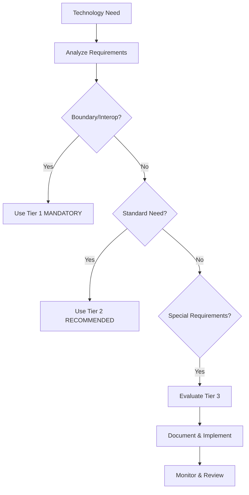

# HMA v2.2 Release Notes
**Hexagonal Microkernel Architecture (HMA) Specification v2.2 (Guided Implementation Edition)**

**Release Date**: January 25, 2025  
**Specification Version**: 2.2  
**Backward Compatibility**: Full v2.0 and v2.1 compatibility maintained  

---

## 🎯 **Major Innovation: Guided Flexibility Framework**

HMA v2.2 introduces the **"Guided Flexibility Framework"** that resolves the fundamental tension between rigidity (v2.0) and excessive flexibility (v2.1) by providing structured technology guidance while enabling informed innovation.

### 🔄 **The Perfect Balance Solution**

**v2.0 Problem**: Too rigid - forced identical technology stack everywhere  
**v2.1 Problem**: Too flexible - lacked guidance, could lead to chaos  
**v2.2 Solution**: **Opinionated defaults with informed flexibility**

- **Tier 1 (Mandatory)**: Ensures ecosystem interoperability
- **Tier 2 (Recommended)**: Provides proven, battle-tested solutions  
- **Tier 3 (Alternative)**: Enables domain-specific optimization

---

## 🌟 **What's New in v2.2**

### **1. Three-Tier Technology Framework (REVOLUTIONARY)**

**Problem Solved**: Technology decision paralysis and lack of guidance

**Solution - Structured Technology Classification:**

```yaml
technology_tiers:
  tier_1_mandatory:
    purpose: "Ecosystem interoperability"
    examples: ["JSON Schema", "OpenTelemetry", "mTLS/TLS"]
    requirement: "MUST use - non-negotiable"
    
  tier_2_recommended:
    purpose: "Proven, reliable solutions"  
    examples: ["NATS/Kafka", "Prometheus/Grafana", "Kubernetes"]
    requirement: "SHOULD use unless justified"
    
  tier_3_alternative:
    purpose: "Domain-specific optimization"
    examples: ["SHACL", "Protocol Buffers", "Redis Streams"]
    requirement: "MAY use with documentation"
```

**Benefit**: Eliminates decision paralysis while enabling optimization

### **2. Comprehensive Technology Recommendations**

**Problem Solved**: Missing guidance on excellent open-source technologies

**New Technology Recommendations:**

**Message Brokers:**
```yaml
message_brokers:
  simple_scale: "NATS (CNCF Graduated)"
  enterprise_scale: "Apache Kafka"  
  complex_routing: "RabbitMQ"
  alternatives: ["Redis Streams", "Apache Pulsar"]
```

**Observability Stack:**
```yaml
observability:
  metrics: "Prometheus + Grafana"
  tracing: "Jaeger"
  logging: "Loki + Grafana"
  alternatives: ["VictoriaMetrics", "Zipkin", "ELK Stack"]
```

**Container Orchestration:**
```yaml
containers:
  production: "Kubernetes"
  development: "Docker Compose"
  edge: "K3s"
  testing: "Kind"
```

**API Management:**
```yaml
api_management:
  gateway: "Kong"
  service_mesh: "Istio"
  lightweight: "Traefik"
  alternatives: ["Envoy", "Linkerd"]
```

### **3. Structured Technology Selection Process**

**Problem Solved**: No clear process for evaluating technology choices

**Solution - Decision Framework:**



### **4. Domain-Specific Implementation Patterns**

**Problem Solved**: One-size-fits-all approach ignoring domain requirements

**Solution - Domain-Specific Guidance:**

**Semantic Systems:**
```yaml
semantic_systems:
  boundary: "JSON Schema validation"
  internal: "SHACL for RDF validation"
  storage: "RDF Triple Stores with JSON-LD APIs"
  benefit: "Proper semantic integrity checking"
```

**High-Performance Systems:**
```yaml
high_performance:
  boundary: "JSON at external interfaces"
  internal: "Protocol Buffers for speed"
  messaging: "Redis Streams for ultra-low latency"
  benefit: "10x+ performance improvement"
```

**AI/ML Systems:**
```yaml
ai_ml_systems:
  boundary: "Standard HMA contracts"
  internal: "TensorFlow Data Validation"
  features: "Feast/Tecton feature stores"
  benefit: "ML-specific quality assurance"
```

**Financial Systems:**
```yaml
financial_systems:
  boundary: "Standard observability"
  internal: "Regulatory compliance engines"
  validation: "IBAN/SWIFT validators"
  benefit: "Automated compliance"
```

### **5. Technology Evolution Framework**

**Problem Solved**: No pathway for innovation to become standard

**Solution - Promotion Process:**

```yaml
evolution_pathway:
  tier_3_to_tier_2:
    requirements:
      - "5+ successful production deployments"
      - "1000+ active community users"
      - "Proven compliance adapter"
      - "Community validation"
      
  review_process:
    frequency: "Quarterly"
    board: "HMA Technology Review Board"
    criteria: "Technical merit, adoption, ecosystem fit"
```

### **6. Enhanced Plugin Manifest Schema**

**Problem Solved**: No visibility into technology choices and compliance

**Solution - Technology Classification in Manifests:**

```json
{
  "compliance": {
    "hma_version": "2.2",
    "technology_tier": "recommended | alternative",
    "mandatory_standards": {
      "boundary_validation": "json_schema",
      "boundary_observability": "opentelemetry",
      "boundary_security": "mtls_tls"
    }
  },
  "alternative_technologies": [
    {
      "technology": "SHACL",
      "category": "validation",
      "rationale": "Enhanced semantic validation",
      "compliance_adapter": "SHACLToJSONSchemaAdapter"
    }
  ]
}
```

---

## 📋 **Complete Feature Comparison**

| Feature Category | v2.0 (Rigid) | v2.1 (Too Flexible) | v2.2 (Guided) |
|------------------|---------------|----------------------|----------------|
| **Technology Guidance** | Mandated everywhere | No guidance | Three-tier framework |
| **Message Brokers** | Not specified | No recommendations | NATS/Kafka/RabbitMQ |
| **Observability** | OTEL mandatory | Custom allowed | Prometheus+Grafana recommended |
| **Container Platform** | Not specified | No guidance | Kubernetes recommended |
| **API Management** | Not specified | No guidance | Kong/Istio recommended |
| **Decision Process** | None | None | Structured framework |
| **Domain Patterns** | None | Basic examples | Comprehensive patterns |
| **Evolution Path** | None | Ad-hoc promotion | Formal review process |
| **Documentation** | Basic | Complex | Guided templates |

---

## 🔧 **Migration Guidance**

### **Zero-Risk Migration Path**

**From v2.0/v2.1 to v2.2:**
```yaml
migration_impact:
  breaking_changes: 0
  code_changes_required: "None for basic compliance"
  compatibility_risk: "Zero - full backward compatibility"
  adoption_timeline: "Immediate to gradual"
```

### **Migration Modes**

**1. Passive Migration (Immediate, Zero Effort)**
```yaml
passive_migration:
  effort: "Minimal"
  timeline: "1 day"
  steps:
    - "Update version references: v2.0/v2.1 → v2.2"
    - "Update plugin manifests to v2.2 schema"
  result: "Automatic v2.2 compliance, access to guidance"
```

**2. Guided Enhancement (Weeks, Low-Medium Effort)**
```yaml
guided_enhancement:
  effort: "Low-Medium"
  timeline: "2-4 weeks"
  steps:
    - "Assess current technology stack against recommendations"
    - "Adopt Tier 2 technologies where beneficial"
    - "Document any Tier 3 alternative usage"
  result: "Optimized stack with proven technologies"
```

**3. Domain Optimization (Months, Medium-High Effort)**
```yaml
domain_optimization:
  effort: "Medium-High"
  timeline: "2-3 months"
  steps:
    - "Implement domain-specific technology patterns"
    - "Deploy compliance adapters for alternatives"
    - "Comprehensive performance optimization"
  result: "Maximum optimization with ecosystem compatibility"
```

---

## 📚 **Enhanced Documentation Structure**

### **New Documents**
- **Part 1b**: "Technology Selection Guide" (completely new)
- **Migration Guide**: v2.0/v2.1 to v2.2 comprehensive guide
- **Technology Review Process**: Community governance documentation

### **Enhanced Documents**
- **Part 1**: Added Section 2.3 "HMA Guided Flexibility Principles"
- **Part 1a**: Enhanced "Mandatory Interoperability Standards"
- **Part 4**: Enhanced Sections 12-13 "Guided Validation and Event Frameworks"
- **Part 5**: Enhanced Sections 16-17 "Guided Observability and Security"
- **Part 6**: Added v2.2 terms, comparative analysis, implementation patterns

---

## 🎯 **Technology-Specific Benefits**

### **For Message Brokers**
- **Before v2.2**: No guidance, teams struggled with choice
- **After v2.2**: Clear recommendations (NATS/Kafka/RabbitMQ) with selection criteria
- **Benefit**: Faster decisions, proven solutions, community support

### **For Observability**
- **Before v2.2**: OTEL everywhere mandate, no backend guidance
- **After v2.2**: Prometheus+Grafana+Jaeger recommended stack
- **Benefit**: Unified observability, rich dashboards, proven reliability

### **For Container Orchestration**
- **Before v2.2**: No container platform guidance
- **After v2.2**: Kubernetes for production, Docker Compose for development
- **Benefit**: Industry standard adoption, rich ecosystem

### **For API Management**
- **Before v2.2**: No API gateway recommendations
- **After v2.2**: Kong for gateways, Istio for service mesh
- **Benefit**: Standardized L1 adapter management, advanced traffic control

### **For Domain-Specific Systems**
- **Before v2.2**: Generic approach for all domains
- **After v2.2**: Semantic (SHACL), AI/ML (TensorFlow), Financial (compliance engines)
- **Benefit**: Domain-appropriate optimization with ecosystem compatibility

---

## 🚦 **Adoption Recommendations**

### **Immediate Adoption (All Systems)**
```yaml
immediate_adoption:
  effort: "1-2 days"
  steps:
    - "Update documentation references to v2.2"
    - "Update plugin manifests to declare v2.2 compatibility"
    - "Review technology selection guide"
  benefit: "Future-proofing, access to guidance framework"
```

### **Selective Enhancement (Teams with Specific Needs)**
```yaml
selective_enhancement:
  message_brokers:
    condition: "Currently using custom messaging"
    recommendation: "Adopt NATS for simple, Kafka for enterprise scale"
    
  observability:
    condition: "Limited monitoring capabilities"
    recommendation: "Implement Prometheus+Grafana+Jaeger stack"
    
  container_platform:
    condition: "Manual deployment processes"
    recommendation: "Adopt Kubernetes for production workloads"
```

### **Advanced Adoption (Innovation-Focused Teams)**
```yaml
advanced_adoption:
  domain_optimization:
    semantic_systems: "Implement SHACL with JSON Schema boundaries"
    ai_ml_systems: "Add TensorFlow Data Validation with standard fallbacks"
    financial_systems: "Implement regulatory compliance engines"
    
  technology_leadership:
    - "Contribute to Tier 3 → Tier 2 promotion process"
    - "Share success stories and implementation patterns"
    - "Participate in HMA Technology Review Board"
```

---

## 🔍 **Real-World Implementation Examples**

### **Example 1: E-commerce Platform**
```yaml
e_commerce_implementation:
  message_broker: "NATS (Tier 2 - simple scale)"
  observability: "Prometheus+Grafana+Jaeger (Tier 2)"
  container_platform: "Kubernetes (Tier 2)"
  api_gateway: "Kong (Tier 2)"
  secrets: "HashiCorp Vault (Tier 2)"
  result: "Proven, reliable, well-supported stack"
```

### **Example 2: Financial Trading System**
```yaml
financial_trading_implementation:
  message_broker: "Redis Streams (Tier 3 - ultra-low latency)"
  observability: "Custom metrics + OTEL boundaries (Tier 3)"
  serialization: "Protocol Buffers + JSON boundaries (Tier 3)"
  compliance: "Regulatory engines + standard APIs (Tier 3)"
  result: "Optimized performance with ecosystem compatibility"
```

### **Example 3: Semantic Knowledge Graph**
```yaml
semantic_system_implementation:
  validation: "SHACL + JSON Schema boundaries (Tier 3)"
  storage: "RDF Triple Store + JSON-LD APIs (Tier 3)"
  query: "SPARQL + REST API adapters (Tier 3)"
  observability: "Standard OTEL + semantic metrics (Tier 3)"
  result: "Proper semantic handling with HMA compliance"
```

---

## 🛡️ **Backward Compatibility Guarantee**

### **v2.0 Implementations**
- ✅ **Automatically v2.2 compliant** with zero changes
- ✅ **Full interoperability** with v2.2 enhanced systems
- ✅ **Benefit from technology guidance** when ready to upgrade
- ✅ **No performance or operational impact**

### **v2.1 Implementations**
- ✅ **Perfect compatibility** with v2.2 systems
- ✅ **Structured guidance** for existing flexible implementations
- ✅ **Technology classification** for current choices
- ✅ **Promotion pathway** for proven innovations

### **v2.2 Enhanced Implementations**
- ✅ **Full backward compatibility** with v2.0 and v2.1
- ✅ **Graceful degradation** when interacting with older versions
- ✅ **Technology migration paths** for continuous improvement
- ✅ **Community contributions** to ecosystem evolution

---

## 🎉 **Impact Summary**

### **For Development Teams**
- **Clear Technology Guidance**: No more analysis paralysis
- **Proven Solutions**: Battle-tested technology recommendations
- **Innovation Freedom**: Structured path for adopting cutting-edge technologies
- **Risk Reduction**: Fallback mechanisms and migration paths
- **Productivity Increase**: Leverage community knowledge and patterns

### **For Organizations**
- **Strategic Technology Alignment**: Consistent technology choices across teams
- **Investment Protection**: All previous HMA investments preserved
- **Competitive Advantage**: Enable domain-specific optimization
- **Risk Mitigation**: Proven technologies with community support
- **Cost Optimization**: Leverage open-source ecosystem effectively

### **For the HMA Ecosystem**
- **Innovation Catalyst**: Framework for technology evolution
- **Community Growth**: Attracts teams needing proven solutions
- **Standard Evolution**: Clear pathway for promoting innovations
- **Ecosystem Health**: Balance between standardization and innovation
- **Industry Leadership**: Set example for technology guidance frameworks

---

## 🚀 **Looking Forward**

HMA v2.2 establishes the **Technology Guidance Framework** that enables:

### **Immediate Benefits**
- Clear technology recommendations eliminate decision paralysis
- Proven solutions reduce implementation risk and time
- Community knowledge sharing accelerates development
- Structured documentation improves maintainability

### **Long-term Evolution**
- Technology promotion process enables ecosystem evolution
- Community-driven improvements based on real-world success
- Domain-specific optimization patterns become standard practice
- Innovation-to-standard pipeline ensures continuous improvement

### **Technology Roadmap**
Technologies being evaluated for future promotion:
- **WebAssembly**: For plugin portability and security
- **Dapr**: For cloud-native application runtime
- **OpenFeature**: For feature flag standardization
- **Falco**: For runtime security monitoring
- **Cert-Manager**: For automated certificate management

---

## 📞 **Getting Started**

### **Quick Start Checklist**
1. ✅ **Read the Technology Selection Guide**: `HMA v2.2 - Part 1b`
2. ✅ **Update plugin manifests**: Declare v2.2 compatibility
3. ✅ **Assess current technology stack**: Compare against recommendations
4. ✅ **Plan technology adoption**: Start with Tier 2 recommendations
5. ✅ **Document alternative choices**: Use provided templates
6. ✅ **Join the community**: Participate in technology evolution

### **Community Resources**
- **Complete Specification**: All HMA v2.2 specification documents
- **Implementation Examples**: Domain-specific patterns and examples
- **Technology Templates**: Decision frameworks and documentation templates
- **Community Forum**: Share experiences and get guidance
- **Technology Registry**: Catalog of compliance adapters and success stories

---

**HMA v2.2: Bridging the Gap Between Proven Practices and Innovation**

*The future of architecture is guided, domain-appropriate, and community-driven.*