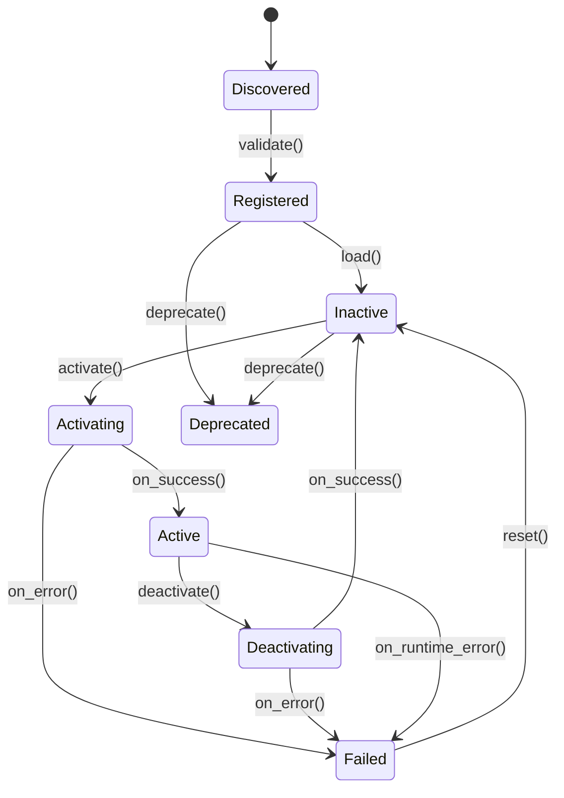

# HMA Plugin Lifecycle Concept for AOS

**Version:** 1.0
**Applies to:** AOS v5.0

---

## 1. Context

The Hexagonal Microkernel Architecture (HMA) relies on a minimal Core that manages the lifecycle of external plugins. While the HMA specification outlines this responsibility, this document details the conceptual states and transitions for plugins specifically within the AOS v5.0 ecosystem. This provides clarity on how new capabilities are integrated, versioned, and maintained.

## 2. Plugin States

An AOS plugin (both L2 Orchestrator and L3 Capability types) can exist in one of the following states within the Microkernel Core's registry:

*   **`Discovered`**: The Core's Plugin Lifecycle Manager has detected a new plugin package (e.g., in a designated repository) but has not yet validated it.
*   **`Registered`**: The plugin's manifest has been successfully parsed and validated against the HMA compliance standards. Its declared ports, capabilities, and dependencies are understood by the Core. It is not yet ready to be used.
*   **`Inactive`**: The plugin is fully registered and validated but is not currently loaded into memory or consuming resources. It is available to be activated.
*   **`Activating`**: The plugin is in the process of being started. The Core is allocating resources and running the plugin's initialization sequence.
*   **`Active`**: The plugin is running, has successfully connected to its required infrastructure (via its adapters), and is ready to accept requests routed from the Core.
*   **`Deactivating`**: The plugin is in the process of shutting down, completing any in-flight requests and releasing resources.
*   **`Failed`**: The plugin has encountered an unrecoverable error during activation or runtime. It will not be sent new requests until it is moved back to an `Inactive` state by an administrator.
*   **`Deprecated`**: The plugin has been superseded by a newer version or a different plugin. The Core will no longer activate new instances of this version and will actively route traffic to the preferred alternative.

## 3. State Transition Diagram



## 4. Governance

*   **Activation/Deactivation:** Can be triggered via an administrative API call to the Core or automatically based on system load or health checks.
*   **Deprecation:** Is a manual administrative action to facilitate graceful evolution of system capabilities.
*   **Versioning:** The Core's registry tracks multiple versions of a plugin. It is possible to have an older version `Deprecated` while a newer version is `Active`, allowing for gradual rollouts.

## 5. Plugin Manifest Specification

For the Core's Plugin Lifecycle Manager to effectively govern a plugin, each plugin **MUST** include a machine-readable `plugin-manifest.json` file at its root. This manifest is the contract between the plugin and the AOS Core.

The manifest MUST adhere to the following JSON Schema:

```json
{
  "type": "object",
  "properties": {
    "manifestVersion": { "type": "string", "description": "Version of the manifest schema itself.", "const": "1.0" },
    "hmaVersion": { "type": "string", "description": "The HMA specification version this plugin is compliant with.", "example": "1.3" },
    "id": { "type": "string", "description": "Unique, machine-readable ID for the plugin.", "example": "AOS-WardleyMapPlugin" },
    "version": { "type": "string", "description": "Semantic version of the plugin.", "example": "1.2.0" },
    "name": { "type": "string", "description": "Human-readable name of the plugin." },
    "type": { "type": "string", "enum": ["L2-Orchestrator", "L3-Capability"], "description": "The HMA type of the plugin." },
    "description": { "type": "string" },
    "implementedPorts": {
      "type": "array",
      "items": { "type": "string" },
      "description": "A list of the standard HMA ports this plugin implements.",
      "example": ["PluginExecutionPort"]
    },
    "consumedCorePorts": {
      "type": "array",
      "items": { "type": "string" },
      "description": "A list of the Core Control Plane ports this plugin requires.",
      "example": ["CredBrokerQueryPort", "EventBusPort"]
    }
  },
  "required": ["manifestVersion", "hmaVersion", "id", "version", "name", "type"]
}
``` 
