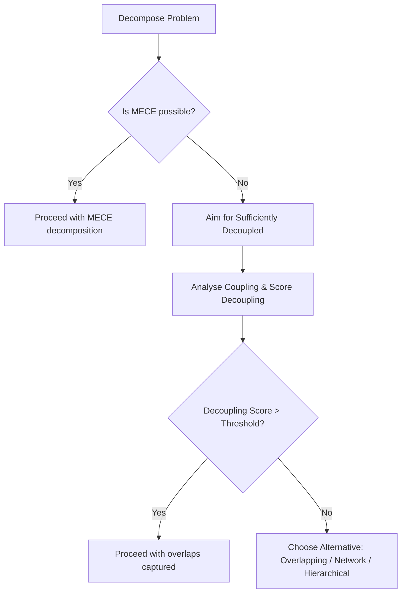

## Part I: The Enhanced 5D Journey

### 3.1 Phase 1: DEFINE (Strategic Formulation)

**Purpose**: Establish strategic context and identify the critical constraint

```python
PROCEDURE DEFINE_STRATEGIC_CONTEXT(problem_statement):
    # Invoke L2 Orchestrator for strategic analysis
    orchestrator = L2_StrategicOrchestratorPlugin()
    
    # Create Wardley Map using L3 plugin, invoked via the Core's standard execution port
    wardley_map_task = {'plugin': 'WardleyMapPlugin', 'action': 'MAP_VALUE_CHAIN', 'params': problem_statement}
    wardley_map = Core.invoke('PluginExecutionPort', wardley_map_task)
    
    evolution_states_task = {'plugin': 'WardleyMapPlugin', 'action': 'ASSESS_COMPONENT_EVOLUTION', 'params': wardley_map}
    evolution_states = Core.invoke('PluginExecutionPort', evolution_states_task)

    strategic_moves_task = {'plugin': 'WardleyMapPlugin', 'action': 'IDENTIFY_MOVEMENTS', 'params': evolution_states}
    strategic_moves = Core.invoke('PluginExecutionPort', strategic_moves_task)
    
    # Theory of Constraints Analysis produces a hypothesis, not a definitive answer.
    # This addresses Critique 5 (Single-Cause Fallacy) and Critique 15 (Assumption of Identifiable Constraints).
    system_model_task = {'plugin': 'TOCAnalyzerPlugin', 'action': 'MODEL_SYSTEM', 'params': problem_statement}
    system_model = Core.invoke('PluginExecutionPort', system_model_task)

    constraints_task = {'plugin': 'TOCAnalyzerPlugin', 'action': 'IDENTIFY_ALL_CONSTRAINTS', 'params': system_model}
    constraints = Core.invoke('PluginExecutionPort', constraints_task)

    constraint_hypothesis_task = {'plugin': 'TOCAnalyzerPlugin', 'action': 'GENERATE_CONSTRAINT_HYPOTHESIS', 'params': constraints}
    constraint_hypothesis = Core.invoke('PluginExecutionPort', constraint_hypothesis_task) # Returns hypothesis with confidence score
    
    # Strategic Options Generation
    options = []
    # Options are generated based on the highest-confidence constraint in the hypothesis
    primary_constraint_candidate = constraint_hypothesis.get_primary_candidate()
    FOR move IN strategic_moves:
        IF move.addresses(primary_constraint_candidate):
            option_task = {'plugin': 'StrategicOptionPlugin', 'action': 'EVALUATE_STRATEGIC_OPTION', 'params': {'move': move, 'constraint': primary_constraint_candidate}}
            option = Core.invoke('PluginExecutionPort', option_task)
            options.append(option)
    
    FOR hypothesis IN constraint_hypothesis.top_n(3): 
        child_pdp = CREATE_EXPLORATORY_PDP(hypothesis)
        # Publish event via the Core's standard event bus port
        event = create_event(type='aos.pdp.exploration.requested.v1', data={'pdp': child_pdp})
        Core.invoke('EventBusPort', {'action': 'publish', 'event': event})

    RETURN StrategicContext(
        wardley_map=wardley_map,
        constraint_hypothesis=constraint_hypothesis,
        strategic_options=options
    )
```

### 3.2 Phase 2: DIAGNOSE (Enhanced with Antifragility Assessment and Bias Mitigation)

```python
PROCEDURE DIAGNOSE_COMPLEXITY(pdp):
    # Traditional Cynefin assessment
    pdp = PERFORM_CYNEFIN_ANALYSIS(pdp)
    
    # NEW: Antifragility assessment
    volatility_sources = IDENTIFY_VOLATILITY_SOURCES(pdp)
    
    FOR source IN volatility_sources:
        # Determine if this volatility can be beneficial
        IF CAN_GAIN_FROM_DISORDER(source, pdp):
            strategy = DESIGN_ANTIFRAGILE_RESPONSE(source)
            pdp.antifragile_strategies.append(strategy)
    
    # Quantitative complexity metrics
    pdp.complexity_metrics = CALCULATE_COMPLEXITY_SCORES(pdp)
    
    # Bias Checkpoint: L3-Red-Team-Plugin challenges the human's classification
    red_team_task = {'plugin': 'RedTeamPlugin', 'action': 'challenge_classification', 'params': pdp}
    bias_report = Core.invoke('PluginExecutionPort', red_team_task)
    pdp.bias_checkpoint = bias_report
    
    IF pdp.complexity_assessment.secondary: 
        hybrid_response = GENERATE_HYBRID(pdp.complexity_assessment.primary, pdp.complexity_assessment.secondary); 
        pdp.update({"response_type": hybrid_response});

    RETURN pdp
```

### 3.3 Phase 3: DESIGN (Constraint-Focused Architecture)

```python
PROCEDURE DESIGN_SOLUTION(pdp):
    # Focus ideation on the primary constraint
    constraint = pdp.strategic_context.primary_constraint
    
    # Invoke L2 Orchestrator for design phase
    orchestrator = L2_DesignOrchestratorPlugin()
    
    # Generate solutions specifically targeting the constraint
    solutions = []
    
    # Design Thinking for human-centered solutions using L3 plugin
    IF constraint.involves_humans:
        design_thinking_task = {'plugin': 'DesignThinkingPlugin', 'action': 'DESIGN_THINKING_PROCESS', 'params': constraint}
        human_insights = Core.invoke('PluginExecutionPort', design_thinking_task)
        solutions.extend(human_insights)
    
    # TRIZ for technical contradictions using L3 plugin
    IF constraint.has_technical_contradiction:
        triz_contradiction_task = {'plugin': 'TRIZPlugin', 'action': 'EXTRACT_CONTRADICTIONS', 'params': constraint}
        contradictions = Core.invoke('PluginExecutionPort', triz_contradiction_task)
        
        triz_solution_task = {'plugin': 'TRIZPlugin', 'action': 'APPLY_INVENTIVE_PRINCIPLES', 'params': contradictions}
        triz_solutions = Core.invoke('PluginExecutionPort', triz_solution_task)
        solutions.extend(triz_solutions)
    
    # Synthesize solutions and resolve conflicts using L3 plugin
    synthesis_task = {'plugin': 'SynthesisPlugin', 'action': 'SYNTHESIZE_SOLUTIONS', 'params': solutions}
    synthesized_solutions = Core.invoke('PluginExecutionPort', synthesis_task)  # Resolves conflicts (Critique 22)
    
    # Antifragile design principles
    FOR solution IN synthesized_solutions:
        solution = ADD_ANTIFRAGILE_FEATURES(solution)
            - Optionality (multiple paths)
            - Redundancy (backup mechanisms)  
            - Overcompensation (grow stronger from stress)
            - Hormesis (small doses of stress)

    # NEW: Conduct Pre-Mortem to counter overconfidence
    pre_mortem_task = {'plugin': 'PreMortemPlugin', 'action': 'CONDUCT_WORKSHOP', 'params': synthesized_solutions}
    pre_mortem_results = Core.invoke('PluginExecutionPort', pre_mortem_task)
    pdp.solution_architecture.pre_mortem_analysis = pre_mortem_results

    # Evaluate against strategic movement
    strategic_fit_task = {'plugin': 'StrategicFitPlugin', 'action': 'SELECT_BY_STRATEGIC_FIT', 'params': {'solutions': synthesized_solutions, 'context': pdp.strategic_context}}
    best_solution = Core.invoke('PluginExecutionPort', strategic_fit_task)
    
    # NEW: Integration Validation
    integration_validation_task = {"plugin": "IntegrationValidatorPlugin", "action": "VALIDATE_SYNERGY", "params": synthesized_solutions}
    integration_validation = Core.invoke("PluginExecutionPort", integration_validation_task)
    IF integration_validation.score < 0.8: ESCALATE_FOR_REVIEW;

    # NEW: De-duplication
    dedup_task = {"plugin": "DeDuplicationPlugin", "action": "DETECT_OVERLAPS", "params": solutions}
    deduped_solutions = Core.invoke("PluginExecutionPort", dedup_task)

    RETURN pdp.with_solution_architecture(best_solution)
```

### 3.4 Phase 4: DEVELOP (Fractal Antifragile Decomposition)

```python
PROCEDURE DEVELOP_FRACTAL_PLAN(pdp):
    # Invoke L2 Orchestrator for development phase
    orchestrator = L2_DevelopOrchestratorPlugin()
    
    # Decomposition is now based on a "Sufficiently Decoupled" score
    # rather than a rigid MECE validation loop. This addresses Critique 14 and 33.
    decomposition_task = {'plugin': 'DecompositionPlugin', 'action': 'DECOMPOSE_SOLUTION', 'params': pdp.solution_architecture}
    components = Core.invoke('PluginExecutionPort', decomposition_task)

    coupling_analysis_task = {'plugin': 'DecompositionPlugin', 'action': 'ANALYZE_COUPLING', 'params': components}
    decoupling_analysis = Core.invoke('PluginExecutionPort', coupling_analysis_task)
    
    # A human reviewer or a policy can check the decoupling_score.
    # If the score is too low, the process can escalate instead of looping.
    if decoupling_analysis.score < get_policy('sufficient_decoupling_threshold'):
        # Publish event via the Core's standard event bus port
        event = create_event(type='aos.pdp.review.required.v1', data={'reason': 'Coupling score below threshold', 'analysis': decoupling_analysis})
        Core.invoke('EventBusPort', {'action': 'publish', 'event': event})
        # The process might pause here until review is complete.
        return pdp # Stop further processing until review
    
    # Create immutable child PDPs and publish events for asynchronous processing
    FOR component IN components:
        child_pdp_data = {
            'parent_pdp': pdp.id,
            'problem_definition': DERIVE_SUBPROBLEM(component),
            'strategic_context': INHERIT_CONTEXT(pdp, component),
            'antifragile_features': INHERIT_ANTIFRAGILITY(pdp)
        }
        
        # Publish an event for each new child PDP. This triggers a new instance
        # of the main orchestrator to process the child asynchronously.
        event = create_event(type='aos.pdp.child.created.v1', data={'pdp_data': child_pdp_data})
        Core.invoke('EventBusPort', {'action': 'publish', 'event': event})
    
    # The parent PDP's plan is now to monitor the outcomes of its children
    pdp = UPDATE_PARENT_PLAN_TO_MONITOR_CHILDREN(pdp, components)

    # NEW: Generate inheritance map for traceability
    traceability_task = {'plugin': 'TraceabilityPlugin', 'action': 'GENERATE_INHERITANCE_MAP', 'params': {'parent_pdp': pdp, 'children': components}}
    inheritance_map = Core.invoke('PluginExecutionPort', traceability_task)
    pdp.fractal_decomposition.inheritance_map = inheritance_map

    RETURN pdp
```

### 3.5 Phase 5: DELIVER & LEARN (Cybernetic Antifragile Control)

```python
PROCEDURE DELIVER_WITH_LEARNING(pdp):
    # Invoke L2 Orchestrator for delivery phase
    orchestrator = L2_DeliverLearnOrchestratorPlugin()
    
    # Initialize cybernetic controller as L3 plugin
    controller_init_task = {'plugin': 'CyberneticControllerPlugin', 'action': 'INITIALIZE', 'params': {
        'target_metrics': pdp.success_criteria,
        'antifragile_thresholds': {
            'volatility_gain': 0.1,  # Minimum gain from disorder
            'adaptation_rate': 2.0,   # Max adaptations per sprint
            'innovation_index': 0.7   # Minimum innovation score
        }
    }}
    controller = Core.invoke('PluginExecutionPort', controller_init_task)
    
    # Guardrails to prevent process stalling (Critique 33)
    loop_tokens = get_policy('max_learning_loops', default=10)
    last_progress = pdp.telemetry.get('progress', 0)
    
    WHILE pdp.status != 'Complete' AND loop_tokens > 0:
        # Execute and collect telemetry
        results = EXECUTE_NEXT_INCREMENT(pdp)
        pdp = pdp.update({'telemetry': results})  # Creates new version
        
        # Check progress-delta threshold to prevent low-value loops
        current_progress = pdp.telemetry.get('progress', 0)
        if (current_progress - last_progress) < get_policy('progress_delta_threshold', default=0.01):
            event = create_event(type='aos.pdp.review.required.v1', data={'reason': 'Learning loop progress has stalled.', 'pdp': pdp})
            Core.invoke('EventBusPort', {'action': 'publish', 'event': event})
            break # Exit loop if progress is negligible
        last_progress = current_progress
        
        # Antifragile learning
        IF results.encountered_unexpected_event:
            learning = EXTRACT_LEARNING(results.unexpected_event)
            
            IF learning.provides_advantage:
                # Gain from disorder
                pdp = INCORPORATE_ADVANTAGE(pdp, learning)
                pdp = STRENGTHEN_SIMILAR_AREAS(pdp, learning)
            
        # Cybernetic control
        analysis = controller.ANALYZE(pdp.telemetry)
        
        IF analysis.requires_intervention:
            IF analysis.severity == 'Strategic':
                # Re-enter at DEFINE phase
                pdp = UNIFIED_FRAMEWORK(pdp.reset_to_define())
            ELIF analysis.severity == 'Tactical':
                # Re-enter at DIAGNOSE phase
                pdp = UNIFIED_FRAMEWORK(pdp.reset_to_diagnose())
            ELSE:
                # Minor adjustment
                pdp = APPLY_ADJUSTMENT(pdp, analysis.adjustment)
                
        loop_tokens -= 1 # Burn a loop token
    
    # Contribute to organizational intelligence
    # First, get credentials for the knowledge graph service
    kg_creds = Core.invoke('CredBrokerQueryPort', {'resource_id': 'EnterpriseKnowledgeGraph'})
    KNOWLEDGE_GRAPH.with_credentials(kg_creds).add(pdp)
    
    RETURN pdp
```

## 📌 New Additions for AOS V4.0 Conceptual Completion  <!-- C-5 -->

### Emergent Response Templates (Chaotic Domain)
* Rapid *sense–act–learn* loops
* 24-hour containment playbook
* Flash retrospective template

### Constraint Hierarchy & Propagation
* `constraint_system` root node cascades to child PDPs via `constraint_scope` tags.
* Dashboard rolls up constraint impact metrics.

### Phase-0 Triage Entry
* **Triage Scorecard** assesses scale, volatility, and capability maturity.
* Routes work to `AOS-Lite`, `Standard`, or `Strategic` profile.

### Explicit Re-entry Triggers
* KPI deviation > X%  → DIAGNOSE
* Volatility class = Harmful → DESIGN mitigation

---

## Decision Tree: MECE Alternative Strategies  <!-- C-9 -->



## The UPDR Micro-Cycle  <!-- NEW INTEGRATION C-3 & C-4 -->

Every task inside each 5D phase now follows an inner **Understand → Plan → Do → Review (UPDR)** loop derived from Pólya’s heuristics and the Scientific Method.

1. **Understand** – restate the immediate sub-problem and surface assumptions.
2. **Plan** – frame a testable hypothesis or lightweight experiment.
3. **Do** – execute the experiment (often a single plugin invocation or small work item).
4. **Review** – analyse the output and decide to accept, refine, or escalate.

### Metacognitive Checkpoints

The Orchestrator inserts explicit checkpoints to enforce deliberate reflection:

* `checkpoint.problem_reframe.v1` – triggered after **Understand** to confirm the problem statement still holds.
* `checkpoint.contradiction_diagnostic.v1` – triggered before **Plan**; if a fundamental contradiction is detected the TRIZ workflow is auto-suggested.
* `checkpoint.robustness_check.v1` – triggered before returning to the parent 5D phase; prompts a Systems-Thinking impact scan to catch unintended consequences.

Workflow execution pauses until a human reviewer or authorised AI validator acknowledges each checkpoint, ensuring high-quality decision-making and preventing runaway automation.