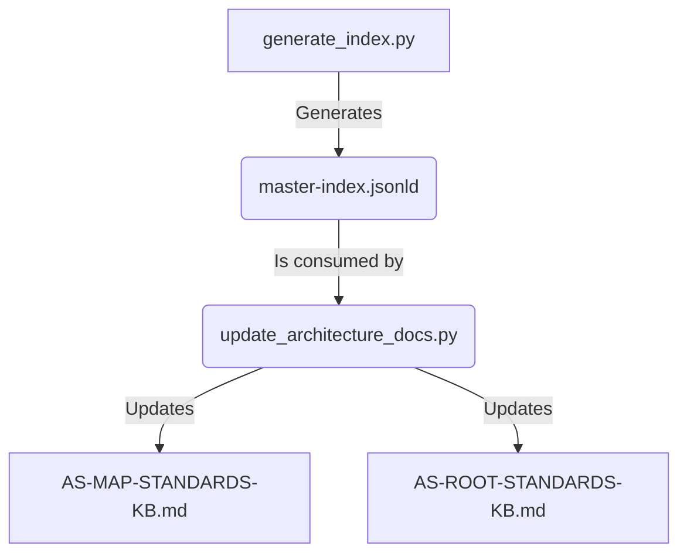

# MASTER ANALYSIS REPORT - AUDIT REMEDIATION INITIATIVE

## EXECUTIVE SUMMARY

This report establishes the technical blueprint for the Audit Remediation Initiative. Its purpose is to address five critical deficiencies within the Master Knowledge Base's standards ecosystem, as identified by the `remediation-investigation-plan-20250619` and verified by subsequent audit reports. The project will execute a series of targeted fixes—including scripting, manual review, and new tooling development—to correct invalid references, remove obsolete metadata, formalize the promotion of draft standards, automate architectural document synchronization, and enforce proper content taxonomy. The successful completion of this initiative will enhance the integrity, accuracy, and maintainability of the knowledge base, reinforcing its foundational principles of automation and a single source of truth.

## **VISION & GUIDING PRINCIPIPLES**

### Core Vision
To systematically eliminate identified inconsistencies and technical debt within the standards repository, restoring full alignment with the established architectural principles and operational mandates.

### Guiding Principles
- **Automation First**: Where possible, remediation will be performed by robust, verifiable scripts to ensure consistency and speed.
- **Fact-Based Execution**: All actions will be based on the verified findings of the audit reports, using corrected file counts and paths.
- **Architectural Integrity**: Solutions will respect and reinforce the established three-layer (Physical, Logical, Presentation) architecture.
- **Zero Assumptions**: The process will rely on dynamic verification rather than hardcoded values to prevent future drift.

### Design Philosophy
A surgical approach focused on executing five discrete, well-defined work packages. Each package is designed to be an independent task that contributes to the overall stability and integrity of the system, with clear inputs, processes, and success criteria.

---

## **CONSOLIDATED ARCHITECTURE FRAMEWORK**

### Source Documents
- **remediation-investigation-plan-20250619.md**: The primary document outlining the five required remediation tasks and the initial instructional plan.
- **audit-report-remediation-plan-20250619-01.md**: The first audit report, which verified the plan's plausibility and provided critical factual corrections to file counts and paths.
- **audit-remediation-investigation-plan-20250619-0000.md**: The second audit, which provided a pass/fail matrix and further confirmed the necessary revisions, particularly for the architectural synchronization task.

### Unified Framework Overview
This initiative integrates the instructional goals of the core plan with the mandatory revisions from the audit reports into a single, actionable strategy. The framework corrects the plan's initial factual inaccuracies and proceeds with the approved methodologies. It ensures that tasks like the architectural synchronization script are built using the correct file paths and that the scope of work for tasks like draft promotion and changelog removal is accurately defined.

---

## **CORE ARCHITECTURE DEFINITION (UNIFIED VIEW)**

### Architectural Layers
This project primarily impacts the **Physical Layer** (the markdown files in `standards/src/`) and the **Presentation Layer** (`AS-ROOT-STANDARDS-KB.md`). It also introduces new tooling that operates on the **Logical Layer**'s data source (`standards/registry/master-index.jsonld`).

### System Components
- **Standards Documents**: The set of 68 files requiring frontmatter cleaning and 12 files requiring reference correction. The 55 draft files are subject to a new review process.
- **Architectural Documents**: `AS-MAP-STANDARDS-KB.md` and `AS-ROOT-STANDARDS-KB.md`.
- **Master Index**: The `standards/registry/master-index.jsonld` file, which serves as the data source for the new automation.
- **New Tooling**: A new script, `tools/builder/update_architecture_docs.py`, to be created.
- **Correction Scripts**: Ad-hoc scripts for reference correction and changelog removal.

### Integration Architecture
The new `update_architecture_docs.py` script will be a key integration point. It will be triggered by the CI/CD pipeline immediately following the execution of `tools/indexer/generate_index.py`, creating a dependent chain that ensures architectural documents are never stale.

### Key Characteristics & Benefits
- **Integrity**: Corrects factual errors and broken links within the standards.
- **Consistency**: Ensures architectural documents are automatically synchronized with the source of truth.
- **Quality**: Establishes a formal quality gate for promoting draft standards to active status.
- **Maintainability**: Reduces technical debt by removing obsolete metadata and automating manual processes.

---

## **TECHNICAL FRAMEWORK SPECIFICATION**

### Foundational Schemas
The project will leverage the existing schema of `standards/registry/master-index.jsonld` as the data source for the new synchronization script.

### Technical Standards
- Scripts will be written in Python and adhere to existing repository conventions.
- All new tooling will include logging that outputs to `tools/reports/`.
- Manual processes (like the draft review) will be governed by a formal, documented checklist.

---

## **DEVELOPMENT ROADMAP**

### Implementation Phases
The project will be executed in five sequential phases, as detailed in the `master-roadmap.md` document. Each phase corresponds to one of the five core remediation tasks. The phases are designed to be executed in order, as the architectural synchronization script developed in Phase 4 has a dependency on the taxonomy corrections in Phase 5.

### Technical Milestones
- **M1**: All invalid references in 12 files corrected.
- **M2**: `change_log_url` key removed from all 68 files.
- **M3**: Formal review checklist for draft promotion is finalized and documented.
- **M4**: Architectural synchronization script is developed and unit tested.
- **M5**: Taxonomy corrections are complete and integrated into the synchronization script.

### Risk Mitigation
- **Risk**: The manual rule-mapping for invalid references could be error-prone.
- **Mitigation**: The mapping will be documented and peer-reviewed before the correction script is executed.
- **Risk**: The new synchronization script could fail to parse the index correctly.
- **Mitigation**: The script will be developed with robust error handling and tested against the live `master-index.jsonld` file.

--- 