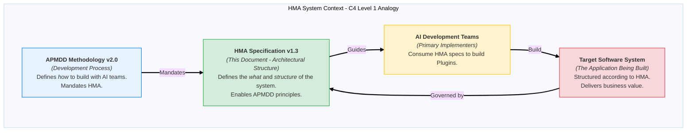
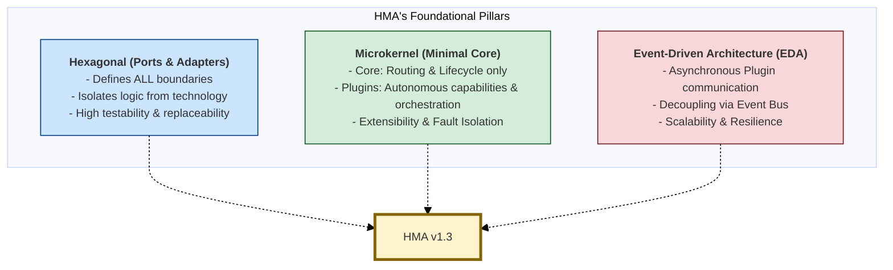

# Hexagonal Microkernel Architecture (HMA) Specification

_Version 1.3 (C4-Inspired Edition)_

**(Companion document to the AI-Powered Model-Driven Development (APMDD) Methodology v2.0)**

---

**Part 1: HMA Overview and Architectural Context (Analogous to C4 Level 1 - System Context)**

This part provides a high-level understanding of the Hexagonal Microkernel Architecture (HMA), its purpose, its relationship with the AI-Powered Model-Driven Development (APMDD) methodology, the core problems it aims to solve, and its fundamental philosophical underpinnings. It sets the stage for understanding HMA as a system within the broader context of AI-led software development.

*   **Diagram 1.0-A: HMA System Context Overview:** Illustrates HMA's role as the structural backbone mandated by APMDD, guiding AI teams in building the target system.

## Abstract
#hma-principle #c4-level-1

The **Hexagonal Microkernel Architecture (HMA)** is the mandated architectural pattern for systems developed under the **AI-Powered Model-Driven Development (APMDD) Methodology v2.0**. HMA provides a **holistic, standards-aligned framework** designed for building AI-augmented platforms that require rapid evolution while maintaining governability, observability, and component replaceability. It synthesizes the **Hexagonal Architecture (Ports & Adapters)** for strict separation of concerns and testability with the **Microkernel** pattern, interpreted here to enforce a **minimal Core acting primarily as a router and lifecycle manager** for highly autonomous, replaceable **Plugins**. This specification serves as the definitive technical reference for HMA's structure, components, interaction patterns, and rules, intended for architects guiding AI development teams using APMDD.

## 1. Introduction to HMA
#c4-level-1

### 1.1 Purpose of the HMA Specification

This document details the Hexagonal Microkernel Architecture (HMA), version 1.3 (C4-Inspired Edition). Its purpose is to provide a clear, comprehensive, and progressively detailed technical reference for architects, developers, and AI agents involved in designing, building, and maintaining systems according to the HMA pattern. It defines the mandatory structures, components, interaction patterns, standards, and underlying principles of HMA.

This C4-inspired edition aims to enhance understanding by presenting the architecture in layers of increasing detail, using formally defined architectural models from which various visual representations can be derived. The specific modeling notations and tooling are mandated by the APMDD methodology (see `[[APMDD v2.1 - Part 4 - Modeling Types, Strategy & Notations]]`).

Additionally, for a quick start and high-level overview of HMA v1.3, especially beneficial for initial familiarization or for AI agents, a dedicated set of "LLM Primers" is available:
* [[HMA v1.3 - Part LP - Story Guide]]: Provides a narrative overview of HMA's core philosophy, structure, and key components.
* [[HMA v1.3 - Part LP - Fact Sheet]]: Offers a structured summary of key HMA concepts, components, patterns, and layers.

While these primers offer excellent summaries, the detailed `Part X` documents constitute the complete Single Source of Truth for HMA v1.3.

### 1.2 Relationship to APMDD Methodology
[[APMDD v2.0]] #apmdd-alignment

HMA is the specific architectural pattern **required** by the overarching **AI-Powered Model-Driven Development (APMDD) Methodology v2.0**. While APMDD v2.0 defines the *process, principles, and lifecycle* for building software with AI agent teams, HMA defines the *target software structure* that enables this process.

HMA's emphasis on:
*   **Maximal Plugin Autonomy:** Limits the context an AI agent needs.
*   **Strict Modularity via Standardized Interfaces (Ports), defined within formal architectural models:** Simplifies AI task definition and component integration. (Refer to `[[APMDD v2.1 - Part 4 - Modeling Types, Strategy & Notations]]` for specific modeling tool mandates).
*   **Governed Interactions mediated by a Minimal Core:** Provides clear rules for AI-developed components.

makes it the ideal architectural foundation for achieving APMDD's goals. Adherence to this HMA specification is therefore critical for successful APMDD implementation.

### 1.3 Core Problems HMA Solves

HMA is specifically designed to address key challenges encountered in modern software development, particularly when leveraging AI development agents:

1.  **Managing AI Context Limitations:** Large Language Models (LLMs) and AI agents can struggle with maintaining focus and comprehensive understanding (context) across large, monolithic codebases. HMA's decomposition of systems into small, independent Plugins with well-defined interfaces drastically reduces the contextual scope an AI agent needs to handle for any given task, improving its effectiveness and reducing errors.
2.  **Enabling Scalable Modularity and Replaceability:** Traditional architectures can become entangled, making it difficult to modify or replace components without unintended side effects. HMA's strict use of Ports & Adapters and its Microkernel structure ensure high modularity and component replaceability, facilitating independent development, deployment, and evolution of system capabilities.
3.  **Ensuring System Governability:** As systems grow, maintaining architectural integrity and consistent interaction patterns becomes challenging. HMA provides a clear set of rules, standardized interfaces, and a minimal Core that acts as a central point for routing and lifecycle management, aiding in overall system governance.
4.  **Promoting Testability:** The clear boundaries and decoupled nature of HMA Plugins make them inherently easier to test in isolation, supporting robust quality assurance processes.
5.  **Facilitating Incremental Development:** HMA allows for the system to be built and evolved Plugin by Plugin, aligning well with agile and iterative development approaches favored by APMDD.

By addressing these problems structurally, HMA provides a stable and predictable environment for building complex, evolvable, and AI-augmented systems.

## 2. HMA Core Philosophy and Guiding Architectural Principles
#hma-principle #c4-level-1

The design of HMA is rooted in a synthesis of established architectural patterns and a set of guiding principles tailored to support the objectives of APMDD.

### 2.1 Synthesizing Hexagonal, Microkernel, and EDA
[[HMA v1.3 - Part 6 - Supporting Information#Hexagonal Architecture (Ports & Adapters)]] [[HMA v1.3 - Part 6 - Supporting Information#Microkernel Pattern]] [[HMA v1.3 - Part 6 - Supporting Information#Event-Driven Architecture (EDA)]]

HMA is not a singular invention but a deliberate combination and interpretation of proven architectural concepts:

*   **Hexagonal Architecture (Ports & Adapters):** This pattern provides the fundamental mechanism for decoupling. ALL major HMA boundaries (External-Core, Core-Plugin, Plugin-Plugin, Plugin-Infrastructure) are defined by technology-agnostic Ports, with technology-specific concerns handled by Adapters. This ensures the Core and Plugin business logic remains isolated and testable.
*   **Microkernel Pattern:** HMA adopts the Microkernel philosophy by enforcing a minimal, stable Core. The Core's responsibilities are strictly limited to essential, non-domain-specific functions: request routing, Plugin lifecycle management, and providing access to core Control Plane services. All application-specific capabilities and even complex workflow orchestration logic are delegated to external, replaceable Plugins.
*   **Event-Driven Architecture (EDA):** While not exclusively event-driven, HMA strongly recommends and provides first-class support for EDA (via a central Event Bus accessed through a standard Port) for asynchronous communication between Plugins. This promotes further decoupling, resilience, and scalability.

*   **Diagram 2.1-A: HMA's Foundational Pillars:** Shows HMA emerging from the synthesis of Hexagonal, Microkernel, and EDA patterns.

### 2.2 Key HMA Architectural Principles (APMDD Aligned)
#hma-principle

These principles (expanded from original HMA v1.2 Sec 3) define the mandatory technical characteristics and design philosophy of the HMA pattern, directly supporting APMDD goals:

1.  **Principle: Maximal Plugin Autonomy & Strict Separation of Concerns (SoC):**
    *   L3 Capability Plugins MUST encapsulate their entire capability (logic, data schema if any, specific infrastructure dependencies) and be independently deployable, versionable, and replaceable.
    *   The L2 Microkernel Core MUST remain minimal and strictly isolated from Plugin business logic and Plugin-specific infrastructure details. It should not depend on the concrete implementation of any Plugin.
2.  **Principle: Explicit Boundaries via Ports & Events:**
    *   ALL interactions across logical boundaries (External Client ↔ Core, Core ↔ L2 Orchestrator Plugin, Core ↔ L3 Capability Plugin, L2 Orchestrator ↔ L3 Capability Plugin (via Core), Plugin ↔ Plugin (if direct allowed, or via Event Bus), Core/Plugin ↔ Infrastructure) MUST occur through explicitly defined, technology-agnostic Ports or standardized asynchronous Events. No direct method calls or data sharing across these boundaries outside of these defined contracts.
3.  **Principle: Minimal Core (Router/Lifecycle/Control Plane Focus):**
    *   The Microkernel Core's primary responsibilities are:
        1.  Routing incoming requests/tasks to the appropriate L3 Capability Plugin or L2 Orchestrator Plugin via a standard `PluginExecutionPort`.
        2.  Managing the lifecycle (registration, activation, deactivation, update) of all Plugins (both L2 Orchestrators and L3 Capabilities).
        3.  Providing access to essential, cross-cutting Control Plane services (e.g., `CredentialBroker`).
    *   The Core does NOT contain domain-specific business logic or orchestrate multi-Plugin business workflows itself.
4.  **Principle: Replaceable L2 Orchestration via Plugins:**
    *   Complex workflows involving sequences or coordination of multiple L3 Capability Plugins MUST be implemented within dedicated, replaceable **Orchestrator Plugins**.
    *   These Orchestrator Plugins reside functionally within the L2 zone (as they are part of the application's control flow logic) but are architected and managed as Plugins by the Core's lifecycle mechanism.
    *   Multiple, specialized Orchestrator Plugins MAY exist to handle different complex workflows.
    *   Crucially, these L2 Orchestrator Plugins are typically LLM-driven agents or workflows, providing intelligent and adaptive coordination of L3 Capability Plugins, distinguishing them from simpler, pre-defined workflow engines.
5.  **Principle: Governed Extensibility (Technical & Contractual):**
    *   All addition, removal, or update of Plugins (L2 Orchestrator or L3 Capability) MUST be managed by the Core's lifecycle mechanism.
    *   Plugins MUST adhere strictly to defined interface contracts (Ports they implement or consume), communication protocols (e.g., event schemas), and architectural standards defined in this specification.
6.  **Principle: Architectural Support for Comprehensive Observability:**
    *   The HMA structure MUST provide standardized hooks and mechanisms (e.g., dedicated `ObservabilityPort`, standardized event metadata, trace context propagation) to allow comprehensive observability (metrics, traces, logs) across Core routing, Orchestrator activity, Plugin interactions, and infrastructure calls. Observability is not an afterthought but a design mandate.
7.  **Principle: Security by Design through Boundaries & Mechanisms:**
    *   Security MUST be an integral part of the HMA design, enforced via:
        *   Clearly defined trust boundaries (e.g., L2 Core/Orchestrator vs. L3 Plugins).
        *   Mandatory secure communication channels (TLS/mTLS).
        *   Centralized mechanisms for essential security concerns like credential management (e.g., the `CredentialBroker`).
        *   Treating L3 Plugins as distinct, potentially less trusted, runtime zones requiring isolation.
8.  **Principle: Context Management Primarily via Architectural Structure:**
    *   HMA addresses AI context limitations primarily through its **inherent structure**. Strict modularity via Plugins limits the context needed for any single AI development or operational task.
    *   The Core manages **no** business context related to Plugin operations. Plugins (Capability and Orchestrator) manage their own required operational context and state internally, isolated from other Plugins.

## 3. Foundational HMA Concepts at a Glance
#hma-principle

Understanding these core terms is essential before diving into the detailed structure of HMA. Full definitions are in the Glossary (Part 6, Section 19).

### 3.1 Core
[[HMA v1.3 - Part 6 - Supporting Information#Core (Microkernel Core - HMA L2)]]
(See [[HMA v1.3 - Part 2 - High-Level Structure#5. The HMA Microkernel Core Zone (L2): Role & Responsibilities]] and [[HMA v1.3 - Part 3 - Internal Components and Interfaces#8. Deeper Dive: Microkernel Core Components (L2)]])

The **Microkernel Core** is the minimal, central hub of an HMA system. It's responsible for basic plumbing: routing requests to the correct Plugin, managing Plugin lifecycles, and providing access to a few essential control-plane services. It does *not* contain business logic.
*(See Part 2, Section 5 and Part 3, Section 8 for details)*

### 3.2 Plugin (Capability & Orchestrator)
[[HMA v1.3 - Part 6 - Supporting Information#Plugin (HMA Context)]]
(See [[HMA v1.3 - Part 2 - High-Level Structure#6. HMA Plugins Zone (L3 Capability & L2 Orchestrator): Autonomy & Roles]] and [[HMA v1.3 - Part 3 - Internal Components and Interfaces#9. Deeper Dive: Generic Plugin Components (L3 & L2 Orchestrator)]])

A **Plugin** is an independent, replaceable software component that extends the HMA Core.
*   **L3 Capability Plugins** encapsulate specific business functionalities or domain logic.
*   **L2 Orchestrator Plugins** manage complex workflows by *intelligently and adaptively coordinating* multiple L3 Capability Plugins, often leveraging LLM-driven logic for task distribution and sequence management.
All Plugins are managed by the Core's lifecycle system and interact via defined Ports.
*(See Part 2, Section 6 and Part 3, Section 9 for details)*

### 3.3 Port & Adapter
[[HMA v1.3 - Part 6 - Supporting Information#Port (HMA Context)]] [[HMA v1.3 - Part 6 - Supporting Information#Adapter (HMA Context)]]
(See [[HMA v1.3 - Part 3 - Internal Components and Interfaces#9.1 Defining Ports (Inbound/Outbound)]] and [[HMA v1.3 - Part 3 - Internal Components and Interfaces#9.2 Implementing Adapters (Driving/Driven)]] and [[HMA v1.3 - Part 3 - Internal Components and Interfaces#10. Standard HMA Port Types & Their Purpose]])

*   A **Port** is a technology-agnostic interface that defines an interaction point at the boundary of the Core or a Plugin. It specifies *what* interaction can occur.
*   An **Adapter** is a technology-specific component that implements a Port (if it's an Outbound/Driven Port used by the Core/Plugin) or uses a Port (if it's an Inbound/Driving Port bringing requests into the Core/Plugin). Adapters bridge the abstract Ports to the concrete outside world (UIs, databases, message queues, external APIs).
*(See Part 3, Sections 9.1, 9.2 and 10 for details on standard Ports)*

### 3.4 Event & Event Bus
[[HMA v1.3 - Part 6 - Supporting Information#Event (HMA Context)]] [[HMA v1.3 - Part 6 - Supporting Information#Event Bus (HMA L4 Infrastructure, accessed via L2 Port)]]
(See [[HMA v1.3 - Part 4 - Detailed Specifications and Standards#13. Event Design & Schema Standards]])

*   An **Event** is a message representing a significant occurrence or state change within the system.
*   The **Event Bus** is the infrastructure (e.g., a message broker) that facilitates asynchronous, decoupled communication between HMA components (primarily Plugins) through the publication and subscription of Events. Accessed via `EventBusPort`.
*(See Part 4, Section 13 for Event standards)*

---
