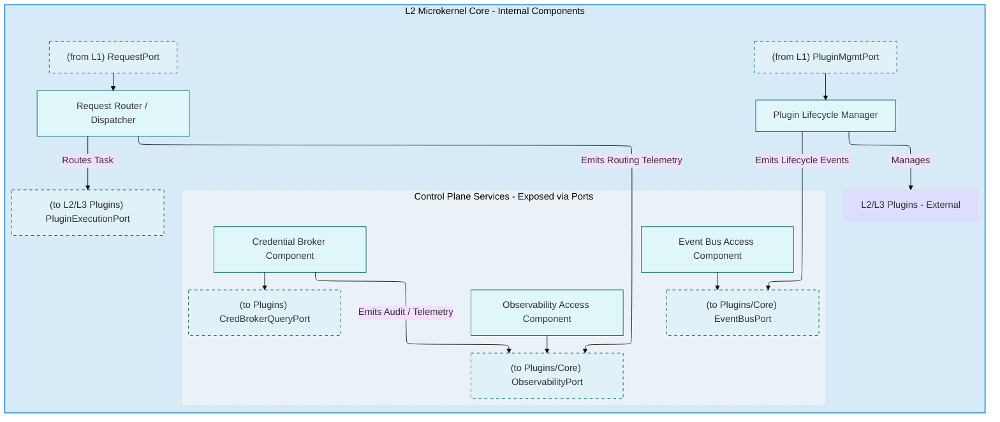
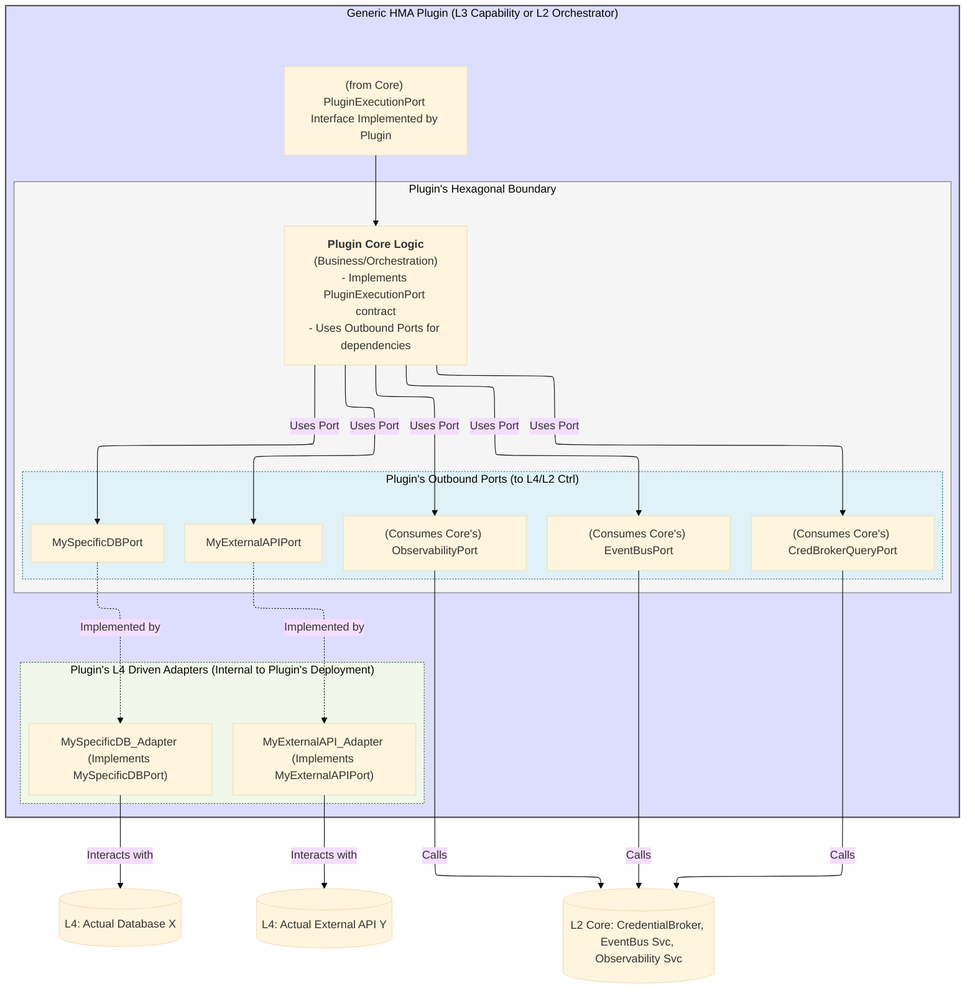
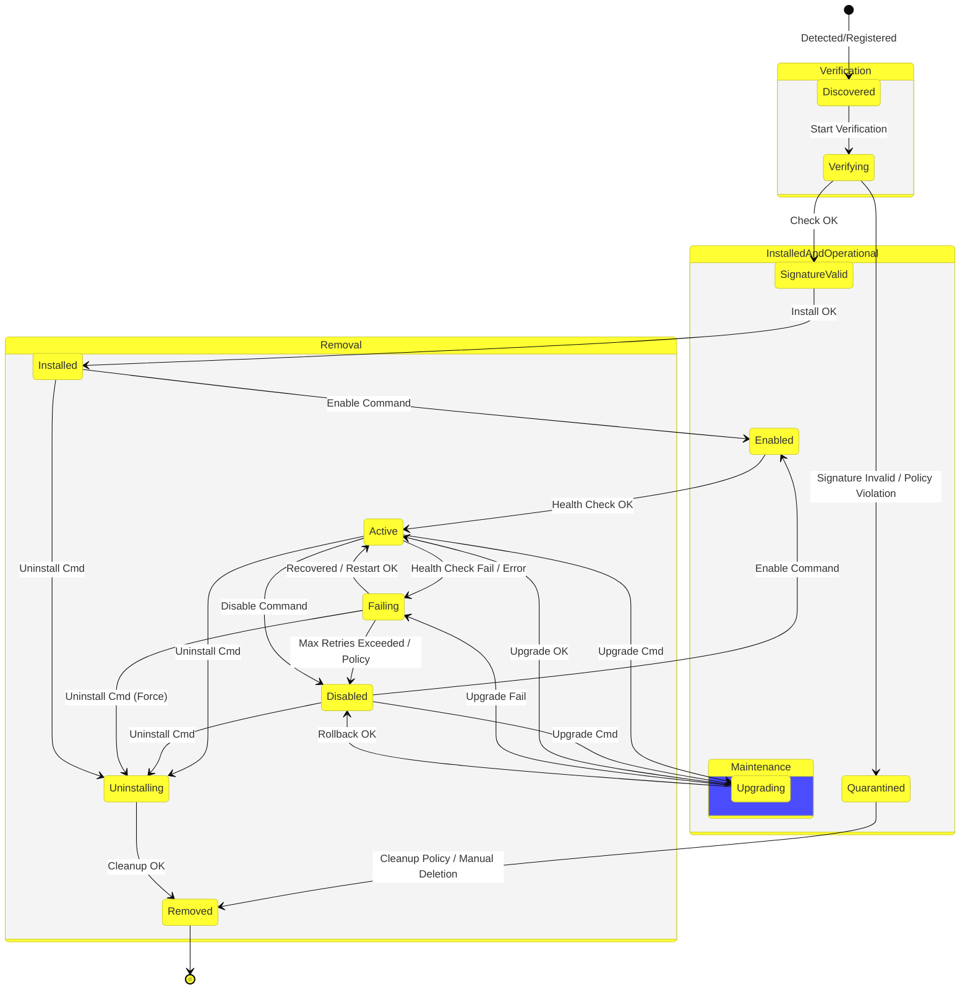

# Hexagonal Microkernel Architecture (HMA) Specification

_Version 1.3 (C4-Inspired Edition)_

**(Companion document to the AI-Powered Model-Driven Development (APMDD) Methodology v2.0)**

---

**Part 3: HMA Internal Components & Key Interfaces (Analogous to C4 Level 3 - Components)**

This part zooms into the major zones identified in Part 2 (Core, Plugins) and describes their key internal components and the standard interfaces (Ports) they expose or consume. This level of detail is crucial for understanding how HMA achieves its architectural goals.

## 8. Deeper Dive: Microkernel Core Components (L2)
#hma-core-component #hma-zone-core #hma-layer-L2 #c4-level-3
[[HMA v1.3 - Part 2 - High-Level Structure#5. The HMA Microkernel Core Zone (L2): Role & Responsibilities]]

The L2 Microkernel Core, while minimalist, comprises several key logical components that fulfill its mandated responsibilities.

### 8.1 Request Router/Dispatcher Component
[[HMA v1.3 - Part 6 - Supporting Information#Core (Microkernel Core - HMA L2)]]

*   **Responsibility:** This component is responsible for inspecting incoming requests (received via Inbound Ports like `RequestPort` from L1 Adapters) and determining which L3 Capability Plugin or L2 Orchestrator Plugin should handle the request.
*   **Mechanism:** It typically uses metadata from the request (e.g., path, headers, message type) and its internal routing configuration (which may be static or dynamically updated via Plugin registration) to make this decision.
*   **Output:** It dispatches the task to the selected Plugin by invoking the `PluginExecutionPort`, passing the necessary request data.
*   **Key Interface Used:** Consumes Inbound Ports (e.g., `RequestPort`), uses Outbound `PluginExecutionPort`.

It's important to distinguish the Router/Dispatcher's deterministic routing—based on established configuration and Plugin registration—from the adaptive, intelligent task coordination of L2 Orchestrator Plugins, which operate with a higher degree of dynamic decision-making, often leveraging LLMs. The Router's role is to dispatch to either a pre-defined L3 Plugin or to an L2 Orchestrator, which then takes over the more complex, intelligent coordination.

### 8.2 Plugin Lifecycle Manager Component
[[HMA v1.3 - Part 6 - Supporting Information#PluginLifecycleManager]]

*   **Responsibility:** This component manages the entire lifecycle of all Plugins (both L3 Capability and L2 Orchestrator types) within the HMA system. This includes:
    *   **Discovery & Registration:** Detecting new/updated Plugin packages.
    *   **Validation:** Ensuring Plugins meet technical compliance requirements (see Section 11.2) before activation (e.g., manifest validation, interface compatibility, security checks like signature verification if used). (Corresponds to original HMA v1.2 Sec 8.3)
    *   **Activation/Deactivation:** Starting and stopping Plugins.
    *   **Health Monitoring:** Basic health checks to ensure active Plugins are responsive.
    *   **Update/Removal:** Managing Plugin updates and graceful removal.
*   **Mechanism:** Interacts with a Plugin Registry (internal state of the Core) and uses defined management protocols with the Plugins themselves.
*   **Output:** Manages the state of Plugins; may emit lifecycle events (e.g., "PluginActivated") to the `EventBusPort` or `ObservabilityPort`.
*   **Key Interface Used:** Consumes Inbound Ports (e.g., `PluginMgmtPort` for administrative commands), interacts with Plugins based on their lifecycle interfaces.

### 8.3 Control Plane Service Components
#hma-core-component
[[HMA v1.3 - Part 6 - Supporting Information#Control Plane Services (HMA L2)]]

The Core provides access to essential, non-domain-specific services that Plugins rely on for governance and operation. These are exposed via specific Outbound Ports from the Core, which Plugins then consume.

*   **Credential Broker Component (and `CredBrokerQueryPort`):**
    *   **Responsibility:** Securely vends short-lived, scoped credentials to Plugins, enabling them to access other services (e.g., L4 infrastructure like databases, external APIs, or even other HMA services if inter-Plugin security is configured this way).
    *   **Mechanism:** Plugins request credentials by calling the `CredBrokerQueryPort` on the Core. The Broker component authenticates the Plugin, checks its authorization for the requested resource, and issues credentials. It interacts with a secure credential store (L4).
*   **Event Bus Access Component (and `EventBusPort`):**
    *   **Responsibility:** Provides a standardized way for the Core and Plugins to publish and subscribe to asynchronous events via the central Event Bus.
    *   **Mechanism:** The `EventBusPort` (implemented by a Core Driven Adapter like `CoreEventBusAdapter`) abstracts the specific Event Bus technology (e.g., Kafka, RabbitMQ) used in L4.
*   **Observability Access Component (and `ObservabilityPort`):**
    *   **Responsibility:** Provides a standardized way for the Core and Plugins to emit telemetry data (metrics, traces, logs).
    *   **Mechanism:** The `ObservabilityPort` (implemented by a Core Driven Adapter like `CoreObsAdapter`) abstracts the specific observability backend technology (e.g., Prometheus, Jaeger, ELK stack) used in L4. The L2.5 OTEL SDK would typically send data through this pathway.

### 8.4 Diagram: Core Internal Components
#hma-diagram

*   **Diagram 8.4-A: Core Internal Components (Illustrative View):** Shows the main logical components within the L2 Microkernel Core and the Ports they primarily interact with or expose, as defined in the architectural model.

## 9. Deeper Dive: Generic Plugin Components (L3 & L2 Orchestrator)
#hma-plugin #hma-zone-plugin #hma-layer-L3 #hma-plugin-capability #hma-plugin-orchestrator #c4-level-3
[[HMA v1.3 - Part 2 - High-Level Structure#6. HMA Plugins Zone (L3 Capability & L2 Orchestrator): Autonomy & Roles]]

All HMA Plugins, whether L3 Capability Plugins or L2 Orchestrator Plugins, share common structural characteristics due to the mandated Hexagonal Architecture.

### 9.1 Defining Ports (Inbound/Outbound)
#hma-port
[[HMA v1.3 - Part 6 - Supporting Information#Port (HMA Context)]]

*   **Inbound Ports (Optional for most Plugins, Core usually handles primary ingress):**
    *   If a Plugin needs to be directly callable by an external system (bypassing the standard Core routing for a specific reason, which should be rare for L3 Capability Plugins but might apply to some L2 Orchestrator Plugins if they expose unique workflow initiation APIs), it would define its own Inbound Ports. These would be fronted by L1 Adapters specific to that Plugin.
    *   More commonly, the "inbound" interaction for a Plugin is its implementation of the contract defined by the Core's `PluginExecutionPort`.
*   **Outbound Ports (Mandatory for most interactions):**
    *   Plugins define Outbound Ports to declare their need to interact with external services or infrastructure.
    *   **Examples:**
        *   A `UserRepositoryPort` for a Plugin needing to access user data.
        *   An `ExternalPaymentGatewayPort` for a Plugin processing payments.
        *   A `VectorSearchPort` for a RAG Plugin needing to query a vector database.
        *   All Plugins needing credentials use the Core's `CredBrokerQueryPort` (an outbound dependency for the Plugin).
        *   All Plugins needing to publish/subscribe to events use the Core's `EventBusPort`.
        *   All Plugins needing to emit telemetry use the Core's `ObservabilityPort`.
    *   These Outbound Ports keep the Plugin's core logic decoupled from the specific technology used to fulfill the need.

### 9.2 Implementing Adapters (Driving/Driven)
#hma-adapter
[[HMA v1.3 - Part 6 - Supporting Information#Adapter (HMA Context)]]

*   **Driving Adapters (Corresponds to Plugin Inbound Ports, if any):** If a Plugin has its own Inbound Ports for direct external access, it will have corresponding L1 Driving Adapters.
*   **Driven Adapters (Implements Plugin Outbound Ports):** For each Outbound Port a Plugin defines, it will have one or more L4 Driven Adapters that implement that Port using a specific technology.
    *   **Example:** A `UserRepositoryPort` might have a `PostgresUserRepoAdapter` or a `DynamoDBUserRepoAdapter`.
    *   These Adapters are internal to the Plugin's deployment unit and handle all the technology-specific details of interacting with L4 infrastructure or external systems.

### 9.3 Encapsulating Internal Logic and State

*   The core business logic or orchestration logic of the Plugin resides within its "hexagon," insulated by its Ports.
*   If a Plugin requires its own persistent state, it manages this internally, accessing its chosen data store via its own Outbound Ports and Driven Adapters (e.g., `MyPluginDBPort` -> `MyPluginPostgresAdapter`).
*   Plugins are responsible for their own internal consistency and state management.

For L2 Orchestrator Plugins, the core 'orchestration logic'—which dictates how tasks are sequenced and how L3 Capability Plugins are coordinated—is frequently implemented using LLM-driven decision-making or specialized AI agent workflows. This enables dynamic task breakdown, context-aware resource allocation, and adaptive responses to evolving conditions within the workflow.

### 9.4 Plugin's Interaction with L4 Infrastructure (via its Adapters)
#hma-layer-L4
*   A Plugin **never** directly interacts with L4 infrastructure (databases, external APIs, message brokers).
*   All such interactions **MUST** go through its own defined Outbound Ports and the corresponding L4 Driven Adapters that implement those Ports.
*   This ensures that if an L4 technology changes (e.g., migrating from one database to another), only the Plugin's specific Adapter needs to be modified/replaced; the Plugin's core logic and its Port definitions remain unchanged.

### 9.5 Diagram: Generic Plugin Internal Structure
#hma-diagram

*   **Diagram 9.5-A: Generic Plugin Internal Structure (Illustrative View):** Illustrates how a typical HMA Plugin... defines its own Outbound Ports... and consumes Core-provided Control Plane Ports, all based on its definition within the formal architectural model.

## 10. Standard HMA Port Types & Their Purpose
#hma-port #hma-standard
[[HMA v1.3 - Part 4 - Detailed Specifications and Standards#12. Port & API Design Standards]]

HMA defines several standard Port types that facilitate common interactions and enforce consistency. Core exposes some, and Plugins are expected to consume them or define their own based on these patterns.

### 10.1 `PluginExecutionPort`
#hma-port
[[HMA v1.3 - Part 6 - Supporting Information#PluginExecutionPort (HMA L2 Core Outbound Port)]]

*   **Defined By:** L2 Microkernel Core (as an Outbound Port from the Core's perspective).
*   **Implemented By:** All L3 Capability Plugins and L2 Orchestrator Plugins.
*   **Purpose:** The primary, standardized interface through which the Core's Router/Dispatcher invokes operations on a Plugin or dispatches a task to it. L2 Orchestrator Plugins also use this Port (via the Core) to call L3 Capability Plugins.
*   **Typical Contract:** Usually involves a generic `invoke(taskPayload)` or `execute(requestData)` method, where the payload contains necessary information for the Plugin to perform its function. The contract also defines how results or errors are returned.

### 10.2 `CredBrokerQueryPort`
#hma-port
[[HMA v1.3 - Part 6 - Supporting Information#CredBrokerQueryPort]]

*   **Defined By:** L2 Microkernel Core (as an Outbound Port from the Core's perspective, exposed by the Credential Broker component).
*   **Consumed By:** Any L3 Capability Plugin or L2 Orchestrator Plugin that needs to access secured resources (e.g., its own L4 database, an external API, the Event Bus if it requires authentication).
*   **Purpose:** Allows Plugins to request short-lived, scoped credentials from the Core's `CredentialBroker`.
*   **Typical Contract:** Methods like `getCredentials(resourceIdentifier)` returning a credential object or token.

### 10.3 `EventBusPort`
#hma-port
[[HMA v1.3 - Part 6 - Supporting Information#EventBusPort]]

*   **Defined By:** L2 Microkernel Core (as an Outbound Port from the Core's perspective, exposed by the Event Bus Access component).
*   **Consumed By:** The Core itself (for publishing lifecycle events) and any L3 Capability Plugin or L2 Orchestrator Plugin that needs to publish or subscribe to asynchronous events.
*   **Purpose:** Provides a technology-agnostic way to interact with the central Event Bus (which is an L4 infrastructure component).
*   **Typical Contract:** Methods like `publish(event)` and potentially `subscribe(eventType, handlerCallback)` (though subscription mechanisms can vary based on the Event Bus technology and Adapter implementation).

### 10.4 `ObservabilityPort`
#hma-port
[[HMA v1.3 - Part 6 - Supporting Information#ObservabilityPort (HMA L2 Core Outbound Port)]]

*   **Defined By:** L2 Microkernel Core (as an Outbound Port from the Core's perspective, exposed by the Observability Access component).
*   **Consumed By:** The Core itself and any L3 Capability Plugin or L2 Orchestrator Plugin for emitting telemetry data (metrics, traces, logs). The L2.5 OTEL SDK is the primary producer of data that flows through this conceptual port.
*   **Purpose:** Provides a standardized, technology-agnostic way to send telemetry to the observability backend (L4).
*   **Typical Contract:** Methods like `emitMetric(metricData)`, `emitTrace(traceData)`, `emitLog(logData)`.

### 10.5 Other Common Port Types
#hma-port

While the above are fundamental, Plugins or the Core might define other specialized Ports. Examples from HMA v1.2 or common scenarios include:

*   **`RequestPort` (Inbound for Core):** Defined by L2 Core, implemented by L1 Driving Adapters (e.g., REST Adapter) to handle incoming user/system requests.
*   **`PluginMgmtPort` (Inbound for Core):** Defined by L2 Core, potentially used by administrative tools (L0/L1) to interact with the Plugin Lifecycle Manager.
*   **`PeerAgentRequestPort` (Inbound for Core, via `A2AListener`):** Defined by L2 Core, implemented by an L1 `A2AListener` Adapter, for receiving requests from external peer AI agents.
*   **`LLMFacadePort` (Outbound for Plugin/Core):** Defined by a Plugin or Core component needing to interact with an external LLM service. Implemented by an L4 `LLMAdapter` (which might use MCP). (Original HMA v1.2 Sec 2.4)
*   **`A2ACallerPort` (Outbound for Plugin/Core):** Defined by a Plugin or Core component needing to make calls to an external AI agent using A2A protocol. Implemented by an L4 `A2AAdapter`. (Original HMA v1.2 Sec 2.5)
*   **`A2AListener` (Inbound Port on an L1 Adapter):** While not a Core or Plugin Port itself, it's an L1 Driving Adapter that listens for A2A communications and translates them into calls on a Core Inbound Port (e.g., `PeerAgentRequestPort`). (Original HMA v1.2 Sec 2.5)

The consistent use of these Port patterns ensures clear contracts and promotes loose coupling throughout the HMA system.

## 11. HMA Plugin Lifecycle Management (Detailed)
#hma-plugin-lifecycle #hma-core-component
[[HMA v1.3 - Part 5 - Cross-Cutting Concerns#18.3 Plugin Registry Validation]]

The L2 Core's Plugin Lifecycle Manager is responsible for overseeing the state and transitions of all HMA Plugins (both L2 Orchestrator and L3 Capability types). This ensures Plugins are managed consistently and robustly.

### 11.1 Plugin States and Transitions
#hma-plugin-lifecycle
(Content and diagram from original HMA v1.2 Sec 5.1, Diagram 5-A)

*   **Diagram 11.1-A: Detailed HMA Plugin Lifecycle State Machine:** Defines the valid states (e.g., Discovered, Verifying, Installed, Active, Disabled, Failing, Removed) and transitions for HMA Plugins. The Core's Plugin Lifecycle Manager orchestrates these transitions based on administrative commands or system events.

**Explanation of Key States:**

*   **Discovered:** The Plugin package or descriptor has been found by the Lifecycle Manager but not yet processed.
*   **Verifying:** The Lifecycle Manager is performing initial checks (e.g., manifest validity, signature verification, basic policy compliance).
*   **Quarantined:** The Plugin failed verification and is isolated, pending review or removal.
*   **SignatureValid / Installed:** Verification passed, and the Plugin's resources are provisioned/installed but not yet active.
*   **Enabled:** The Plugin is configured to start but may not yet be fully operational or passing health checks.
*   **Active:** The Plugin is running, has passed its health checks, and is ready to receive requests.
*   **Failing:** The Plugin is in an error state or repeatedly failing health checks. It might attempt recovery or be moved to Disabled.
*   **Disabled:** The Plugin is intentionally stopped and not accepting requests. It can be re-enabled or uninstalled.
*   **Upgrading:** The Plugin is undergoing a version update.
*   **Uninstalling/Removed:** The Plugin's resources are being de-provisioned / have been removed from the system.

### 11.2 Technical Compliance for Plugins
#hma-standard

To be managed effectively by the HMA lifecycle system and to participate correctly in the architecture, all Plugins (L2 Orchestrator or L3 Capability) MUST adhere to specific technical compliance requirements:

*   **Interface Contract Adherence:**
    *   MUST correctly implement the `PluginExecutionPort` contract if they are to be invoked by the Core.
    *   MUST correctly consume Core-provided Control Plane Ports (e.g., `CredBrokerQueryPort`, `EventBusPort`, `ObservabilityPort`) according to their defined contracts.
    *   If exposing their own Ports for inter-Plugin communication, these MUST be clearly defined and versioned.
*   **Communication Protocols:**
    *   MUST use specified communication protocols for interactions (e.g., event formats and schemas when using the Event Bus, standard HTTP/gRPC for any direct external APIs they expose via their L1 Adapters).
*   **Standards Adherence:**
    *   MUST follow HMA naming conventions (see Section 14).
    *   MUST adhere to schema standards for events (see Section 13) and API/Port designs (see Section 12).
*   **Security Compliance:**
    *   MUST obtain all necessary credentials exclusively via the Core's `CredBrokerQueryPort`.
    *   MUST respect defined trust boundaries and operate under the principle of least privilege.
    *   MUST securely handle any sensitive data they process.
*   **Observability Compliance:**
    *   MUST integrate with the L2.5 OTEL SDK (or equivalent provided mechanism) to emit standardized, HMA-tagged traces, metrics, and logs, as detailed in the Observability section (Section 16). This includes propagating trace contexts.
*   **Plugin Manifest:**
    *   Each Plugin SHOULD provide a machine-readable manifest file describing its identity, version, exposed/consumed Ports (HMA-level), dependencies, and configuration parameters needed by the Lifecycle Manager.
*   **Health Checks:**
    *   Each Plugin SHOULD expose a health check endpoint or mechanism that the Lifecycle Manager can use to determine its operational status.

The Core's Plugin Lifecycle Manager component (specifically its validation step - original HMA v1.2 Sec 8.3) is responsible for verifying much of this compliance before a Plugin can be fully activated.

---

