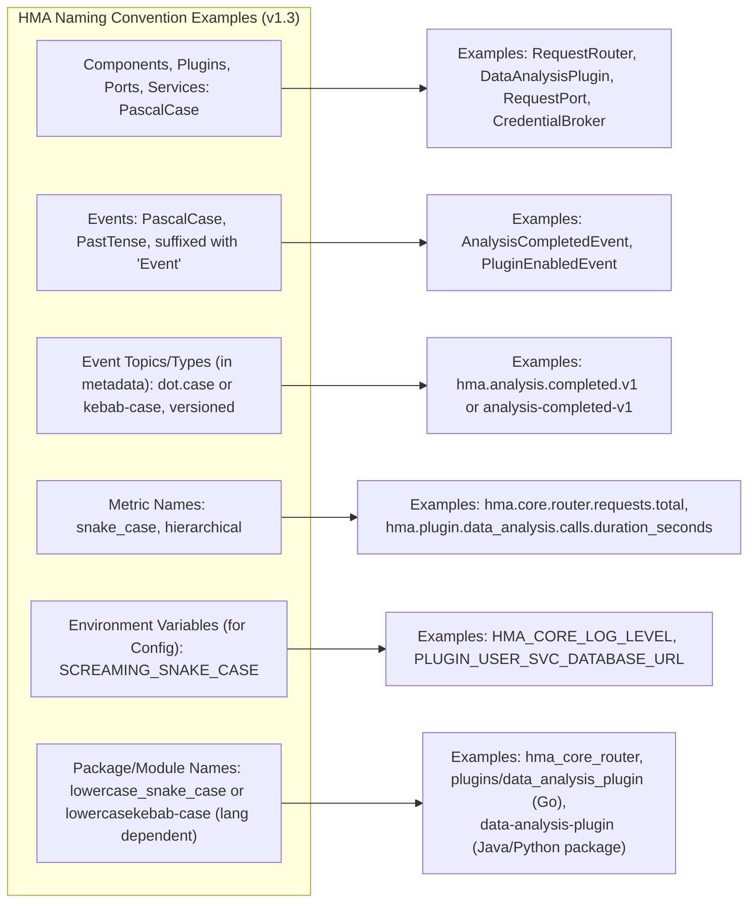

# Hexagonal Microkernel Architecture (HMA) Specification

_Version 1.3 (C4-Inspired Edition)_

**(Companion document to the AI-Powered Model-Driven Development (APMDD) Methodology v2.0)**

---

**Part 4: HMA Detailed Specifications, Standards, & Implementation Guidance (Analogous to C4 Level 4 - Code/Classes)**

This part delves into the "code-level" details and standards that HMA components, particularly Ports and Events, must adhere to. These specifications are crucial for ensuring interoperability, consistency, and effective automated governance in an HMA system developed under APMDD.

## 12. Port & API Design Standards
#hma-standard #hma-port #c4-level-4
[[HMA v1.3 - Part 3 - Internal Components and Interfaces#10. Standard HMA Port Types & Their Purpose]]

### 12.1 Interface Contract Rules

All HMA Ports (whether defined by the Core or by Plugins) and external APIs exposed by L1 Adapters MUST adhere to the following contract rules:

*   **Explicit Definitions:** Interfaces MUST be explicitly and formally defined using a clear contract language.
    *   For HMA Ports (internal): These are defined as elements within the formal architectural model, supplemented by clear documentation on parameters, return types, and semantics. Visual representations are derived from this model. (See `[[APMDD v2.1 - Part 4 - Modeling Types, Strategy & Notations]]` for tooling specifics).
    *   For external APIs (exposed by L1 Adapters): Use industry-standard specifications like OpenAPI (for REST APIs), gRPC Protocol Buffers, or AsyncAPI (for event-driven APIs).
*   **Stable Contracts:** Once a Port/API version is published and consumed, its contract SHOULD be treated as immutable. Changes require a new version.
*   **Well-Defined Parameters & Return Types:**
    *   All operation parameters and return types MUST be clearly defined, including their data types, structure (e.g., using DTOs - Data Transfer Objects), and any constraints (e.g., required fields, value ranges).
    *   Avoid using generic types like `object` or `map[string]interface{}` for primary data exchange where more specific types can be defined.
*   **Clear Semantics & Pre/Post-Conditions:** The purpose of each operation, its expected behavior, any preconditions for calling it, and post-conditions upon its completion (or failure) MUST be clearly documented.
*   **Error Handling:** Standardized error reporting mechanisms MUST be used. For APIs, this means consistent use of HTTP status codes and error response payloads. For internal Ports, this means clear exception types or error return conventions.
*   **Idempotency (where applicable):** Operations that can be safely retried without unintended side effects (e.g., `create` or `update` operations) SHOULD be designed to be idempotent. This is critical for resilient distributed systems.
*   **Security Considerations:** Input validation (see Section 17.2) MUST be performed at the Port/API boundary for all incoming data. Authentication and authorization mechanisms appropriate for the Port/API MUST be enforced.

### 12.2 Versioning Strategies

Versioning is crucial for managing the evolution of Ports and APIs without breaking existing consumers.

*   **Semantic Versioning (SemVer):** RECOMMENDED for Ports and external APIs. (MAJOR.MINOR.PATCH - e.g., `v1.2.3`).
    *   MAJOR version increment for incompatible API changes.
    *   MINOR version increment for adding functionality in a backward-compatible manner.
    *   PATCH version increment for backward-compatible bug fixes.
*   **Versioning Mechanisms:**
    *   **For External APIs (L1 Adapters):**
        *   URL Path Versioning (e.g., `/api/v1/resource`, `/api/v2/resource`) - Common for REST.
        *   Custom Request Header (e.g., `X-API-Version: 2`).
        *   Content Negotiation (using `Accept` header, e.g., `Accept: application/vnd.company.resource.v2+json`).
    *   **For Internal HMA Ports:** Versioning might be reflected in the Port interface name (e.g., `MyServicePortV2`), module path, or through specific version negotiation mechanisms if supported by the underlying Plugin invocation framework. The Plugin manifest SHOULD declare the versions of HMA Ports it implements or consumes.
*   **Deprecation Policy:** A clear policy for deprecating old versions of Ports/APIs SHOULD be established, allowing consumers time to migrate.

Adherence to these design standards facilitates interoperability, reduces integration friction, and supports the independent evolution of HMA components.

## 13. Event Design & Schema Standards
#hma-standard #hma-event #c4-level-4
[[HMA v1.3 - Part 6 - Supporting Information#Event (HMA Context)]]

### 13.1 Event Payload Structure and Schemas

Event schemas are formally defined (e.g., using JSON Schema). Visualizations of event structures, if needed, are generated based on these definitions according to APMDD's modeling guidelines (see `[[APMDD v2.1 - Part 4 - Modeling Types, Strategy & Notations]]`).

*   **Schema Definition:** All events published to the HMA Event Bus MUST have a clearly defined, versioned schema.
    *   **JSON Schema:** RECOMMENDED as the default schema definition language due to its wide adoption, human readability, and tooling support.
    *   Alternatives like Apache Avro or Protocol Buffers MAY be used if they offer significant advantages for a specific use case and are supported by the chosen Event Bus technology and HMA tooling.
*   **Payload Content:**
    *   Event payloads SHOULD be focused and contain only the data relevant to the specific event. Avoid overly large or chatty events.
    *   Data SHOULD be structured logically.
    *   Consider whether to include the full state of an entity or just the delta (changes). Full state is often simpler for consumers but can be larger.
*   **Data Formats:** JSON is the RECOMMENDED data format for event payloads when using JSON Schema.

### 13.2 Standard Event Metadata

All events published on the HMA Event Bus SHOULD include a standard set of metadata fields, typically in an event envelope or header, to facilitate processing, tracing, and auditing. Mandatory metadata includes:

*   `event_id` (string): A unique identifier for this specific event instance (e.g., a UUID). **MUST**
*   `event_type` (string): A string identifying the type of event, typically versioned (e.g., `user.created.v1`, `order.shipped.v2`). **MUST**
*   `event_version` (string): The version of the event schema this event instance conforms to (e.g., "1.0.0"). **MUST**
*   `source_component_id` (string): Identifier of the HMA Core component or Plugin that published the event. **MUST**
*   `timestamp` (string): ISO 8601 UTC timestamp indicating when the event was created/published. **MUST**
*   `trace_id` (string, optional but HIGHLY RECOMMENDED): Distributed tracing ID, to correlate this event with other operations in a request flow. **SHOULD**
*   `correlation_id` (string, optional): An ID to correlate related events in a business process. **MAY**
*   `subject` (string, optional): An identifier for the primary entity the event pertains to (e.g., user ID, order ID). **MAY**
*   `data_content_type` (string, optional but RECOMMENDED if not implied by `event_type`): MIME type of the event payload (e.g., `application/json`). **SHOULD**

### 13.3 Event Versioning

Just like APIs and Ports, event schemas MUST be versioned to allow for evolution without breaking consumers.

*   **Strategy:**
    *   Include the version in the `event_type` (e.g., `myapp.noun.verb.v1`) and/or explicitly in the `event_version` metadata field.
    *   Follow principles similar to Semantic Versioning:
        *   Incompatible changes (removing fields, changing data types non-compatibly) require a new major version of the event type.
        *   Adding new optional fields is generally a minor, backward-compatible change.
*   **Consumer Responsibility:** Event consumers SHOULD be designed to be tolerant of new, unknown fields in event payloads (i.e., ignore them if they don't understand them) to facilitate backward compatibility.
*   **Schema Registry:** For robust schema management and validation, using a Schema Registry (e.g., Confluent Schema Registry, Apicurio) is HIGHLY RECOMMENDED, especially in larger systems. The Event Bus Adapter (`CoreEventBusAdapter`) might integrate with such a registry.

These event standards promote loose coupling and ensure that event-driven interactions within HMA are reliable and maintainable.

## 14. HMA Naming Conventions
#hma-standard

(Content from original HMA v1.2 Sec 7.1, Diagram 7.1-A)

Mandatory naming conventions are enforced to ensure consistency, improve readability, and support automated governance and tooling within APMDD and HMA.

*   **Diagram 14-A: HMA Naming Convention Cheat Sheet (v1.3):** Visual guide for key HMA naming conventions.

| Element Type                                       | Convention                                                                        | Example                                                                              | Notes                                                                     |
| :------------------------------------------------- | :-------------------------------------------------------------------------------- | :----------------------------------------------------------------------------------- | :------------------------------------------------------------------------ |
| **Core Components (Logic)**                        | PascalCase                                                                        | `RequestRouter`, `PluginLifecycleManager`                                            | Reflects class or major component names.                                  |
| **Plugins (L3 Capability)**                        | PascalCase, often suffixed `Plugin`                                                 | `DataAnalysisPlugin`, `UserManagementPlugin`, `RAGCapabilityPlugin`                  |                                                                           |
| **Plugins (L2 Orchestrator)**                      | PascalCase, often suffixed `Orchestrator` or `OrchestratorPlugin`                 | `OrderProcessingOrchestrator`, `AgenticWorkflowOrchestratorPlugin`                   |                                                                           |
| **Ports (Interfaces)**                             | PascalCase, suffixed `Port`                                                         | `RequestPort`, `PluginExecutionPort`, `CredBrokerQueryPort`, `UserRepositoryPort`  | Clear indication of an HMA interface.                                     |
| **Control Plane Services (L2 Core Components)**      | PascalCase, often suffixed `Broker`, `Manager`, `Service`                           | `CredentialBroker`, `PluginLifecycleManager`                                         |                                                                           |
| **Adapters (L1 Driving, L4 Driven)**                 | PascalCase, often reflecting technology and/or Port, suffixed `Adapter`           | `RestApiAdapter`, `KafkaEventConsumerAdapter`, `PostgresUserRepositoryAdapter`       |                                                                           |
| **Events (Conceptual Object/Class Name)**          | PascalCase, Past Tense, suffixed `Event`                                            | `OrderCreatedEvent`, `PluginStateChangedEvent`, `AnalysisCompletedEvent`             | Describes a fact that has occurred.                                     |
| **Event Types (for routing/subscription, in metadata `event_type`)** | dot.case (preferred) or kebab-case, hierarchical, versioned (e.g., `v1`) | `myapp.order.created.v1`, `hma.plugin.status.changed.v1`, `user-account-locked-v2` | Use for event type registration and filtering in Event Bus.               |
| **Event Bus Topics (Physical)**                    | kebab-case or snake_case, hierarchical, versioned                                 | `hma-order-events-v1`, `plugin_lifecycle_events_v1`                                  | Actual topic names in the message broker (e.g., Kafka topic).             |
| **Metric Names**                                   | snake_case, hierarchical, with units if applicable                                  | `hma.core.router.requests.total`, `hma.plugin.dataplugin.db.calls.duration_seconds` | Follows Prometheus/OpenMetrics conventions.                             |
| **Configuration Parameters / Environment Variables** | SCREAMING_SNAKE_CASE                                                              | `HMA_DATABASE_URL`, `PLUGIN_RETRY_COUNT`                                             | Standard for environment variables.                                       |
| **Package/Module Names (Code Structure)**          | `lowercase_snake_case` or `lowercasekebab-case`                                   | `hma_core/routing`, `plugins/data_analysis` (Go) or `data-analysis-plugin` (Java)  | Language-specific conventions should be followed where they don't clash.  |
| **Source Code Files**                              | Follow language-specific conventions (e.g., PascalCase for C# classes, snake_case for Python modules) | `request_router.go`, `DataAnalysisPlugin.java`                                       |                                                                           |

Automated linters (`hma-lint` concept) SHOULD be used to enforce these naming conventions.

## 15. Rule Syntax (RFC 2119)
#hma-standard
[[HMA v1.3 - Part 6 - Supporting Information#RFC 2119]]

Throughout this HMA specification, keywords such as "MUST", "MUST NOT", "REQUIRED", "SHALL", "SHALL NOT", "SHOULD", "SHOULD NOT", "RECOMMENDED", "MAY", and "OPTIONAL" are to be interpreted as described in **RFC 2119**.

*   **MUST / REQUIRED / SHALL:** Absolute requirement.
*   **MUST NOT / SHALL NOT:** Absolute prohibition.
*   **SHOULD / RECOMMENDED:** Strong recommendation; valid reasons may exist to deviate, but implications must be understood and justified.
*   **SHOULD NOT:** Strong discouragement; deviation requires careful consideration and justification.
*   **MAY / OPTIONAL:** Truly optional; can be included or omitted based on specific needs without violating HMA.

Adherence to these interpretations is critical for understanding the mandatory versus suggestive nature of statements in this specification.

---

