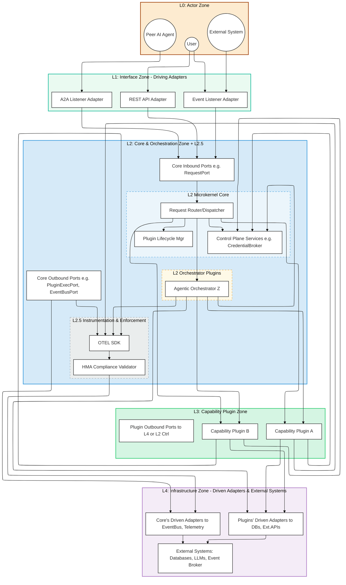
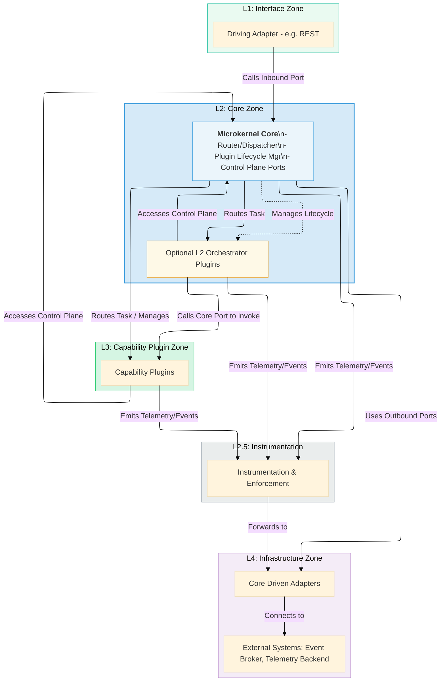
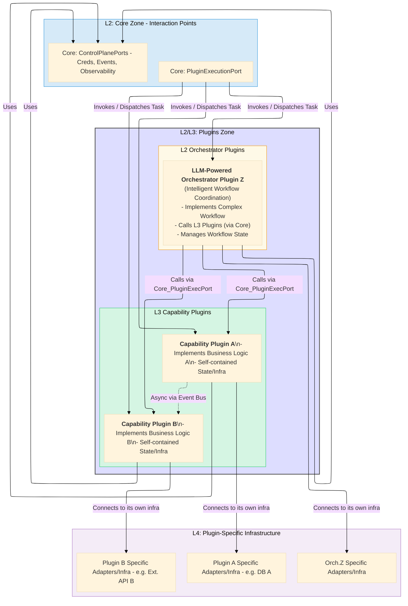
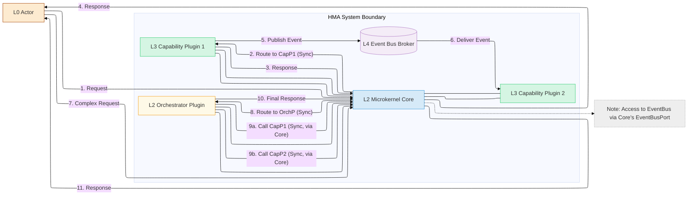

# Hexagonal Microkernel Architecture (HMA) Specification

_Version 2.1 (Flexible Implementation Edition)_

**(Companion document to the AI-Powered Model-Driven Development (APMDD) Methodology v2.1)**

---

**Part 2: HMA High-Level Structure: Layers & Major Zones (Analogous to C4 Level 2 - Containers)**

This part describes the macro-architecture of HMA with enhanced communication flexibility, focusing on its layered model and the major logical "zones" or "containers" within the system. It provides a high-level structural map, showing how different parts of an HMA system are organized and how they can interact using both standard and extended communication patterns.

## 4. HMA Macro-Architecture: The Layered Reference Model
#hma-layer-L0 #hma-layer-L1 #hma-layer-L2 #hma-layer-L2-5 #hma-layer-L3 #hma-layer-L4 #c4-level-2

HMA employs a strict layered architecture to enforce separation of concerns, enable replaceability, and manage dependencies. Understanding these layers is fundamental to understanding HMA's structure and flow.

### 4.1 Overview of L0-L4 Layers
*(See [[HMA v2.0 - Part 6 - Supporting Information#19.2 Core HMA Terms (Enhanced for v2.0)|Glossary]] for layer definitions)*

HMA defines the following logical layers:

*   **L0: Actor Layer:** This layer represents all external entities that interact with the HMA system. These can be human users, other software systems, administrative tools, or even peer AI agents. Actors initiate requests or consume events from the system.
*   **L1: Interface Layer (Driving Adapters):** This is HMA's outermost boundary from an inbound perspective. It consists of **Driving Adapters** that receive requests or events from L0 Actors. These Adapters are technology-specific (e.g., REST API endpoints, gRPC services, message queue listeners, A2A listeners) and are responsible for translating incoming communication into calls on the L2 Microkernel Core's Inbound Ports.
*   **L2: Microkernel Core Layer & L2.5 Instrumentation Sub-Layer:** This is the architectural heart of HMA, though intentionally minimal in its logic.
    *   **L2 Core Logic:** Contains the non-domain-specific components:
        *   **Request Router/Dispatcher:** Routes incoming tasks from L1 to the appropriate L3 Capability Plugin or L2 Orchestrator Plugin.
        *   **Plugin Lifecycle Manager:** Manages the states and transitions of all Plugins.
        *   **Control Plane Services:** Provides essential, cross-cutting services like the `CredentialBroker`.
        *   **Core Inbound/Outbound Ports:** Defines the interfaces for interaction with L1, L3/L2-Orchestrators, and L4.
    *   **L2 Pluggable Orchestrators:** While functionally part of the application's control flow logic (thus L2), **Orchestrator Plugins** are architected as replaceable components managed by the Core's Lifecycle Manager. They handle complex multi-Plugin workflows, and these are typically LLM-powered agents or workflows responsible for intelligent, adaptive coordination of complex, multi-Plugin tasks.
    *   **L2.5 Instrumentation & Enforcement Sub-Layer:** A conceptual sub-layer within or tightly coupled with L2. It houses components like the OpenTelemetry (OTEL) SDK for emitting standardized telemetry and the `HMA Compliance Validator` for intercepting and validating telemetry or enforcing architectural rules.
*   **L3: Capability Plugin Layer:** This layer contains all the independently deployable **Capability Plugins**. Each Plugin encapsulates a specific, cohesive set of business capabilities, domain logic, or application features. They are self-contained, manage their own state (if any), and interact with the L2 Core (for control plane services or being invoked) and L4 Infrastructure (for their specific needs) via well-defined Ports and Adapters. They may also communicate with other L3 Plugins asynchronously via the Event Bus.
*   **L4: Infrastructure Layer (Driven Adapters & External Systems):** This layer contains the concrete implementations and external dependencies that HMA components interact with.
    *   **Core's Driven Adapters:** Implementations of the Core's Outbound Ports, allowing the Core to interact with its operational infrastructure (e.g., Event Bus Broker, Observability Backend, Plugin Invocation mechanisms, Credential Store).
    *   **Plugin's Driven Adapters:** Implementations of Outbound Ports defined *within* L3 Plugins (or L2 Orchestrator Plugins) for their specific infrastructure needs (e.g., database adapters, external API client adapters, vector store client adapters).
    *   **External Systems:** The actual external services and resources, such as databases, message brokers, LLM services, secret vaults, vector databases, third-party APIs, etc.

### 4.2 Diagram: HMA Layered Reference Model & Major Zones
#hma-diagram

The HMA layered structure is defined within a formal architectural model. Diagrams such as the one below (Diagram 4.2-A) are illustrative views derived from this model. For specific modeling notations and tooling, refer to `[[APMDD v2.1 - Part 4 - Modeling Types, Strategy & Notations]]`.


*   **Diagram 4.2-A: HMA Layered Reference Model & Major Zones (Illustrative View):** This diagram visualizes the L0-L4 layers as distinct zones, emphasizing the separation. It shows the Core, Orchestrator Plugins, and Instrumentation within the L2 Zone, and how Capability Plugins form the L3 Zone. Interactions flow between these major zones. The formal definition of this architecture resides in a model compliant with APMDD's modeling strategy.

**(Note: The more detailed component diagram, previously Diagram 4-A in HMA v1.2, is still valuable and will be referenced or adapted for Part 3 when discussing component-level details within these zones.)**

### 4.3 Interaction Flow Between Layers

The primary dependency and interaction flow in HMA is generally unidirectional through the layers for requests, though responses and events can flow in other directions:

1.  **L0 Actors** initiate interactions.
2.  **L1 Interface Adapters** receive these, translate them, and call Inbound Ports on the **L2 Microkernel Core**.
3.  The **L2 Core** (Router/Dispatcher) then:
    *   For simple tasks, routes the request to an appropriate **L3 Capability Plugin** via the `PluginExecutionPort`.
    *   For complex tasks, routes the request to an appropriate **L2 Orchestrator Plugin**.
4.  An **L2 Orchestrator Plugin**, upon receiving a task, coordinates multiple **L3 Capability Plugins**. It does this by making calls *back through* the L2 Core's `PluginExecutionPort` (or by publishing/subscribing to events via the `EventBusPort`).
5.  **L3 Capability Plugins** (and L2 Orchestrator Plugins) execute their logic. They may:
    *   Interact with L2 Control Plane services (e.g., `CredentialBroker`) via their respective Ports.
    *   Use their *own* internal Adapters and Outbound Ports to interact with **L4 Infrastructure** (e.g., databases, external APIs, Vector Stores).
    *   Publish events to, or consume events from, the `EventBusPort` (which is connected to an L4 Event Bus Broker via a Core Driven Adapter).
6.  **L4 Infrastructure** components (Driven Adapters) are implementations of Ports defined by L2 or L3 components. They interact with actual external systems (also L4).

**Key Dependency Rule:** Higher layers (e.g., L3 Plugins) generally depend on interfaces defined by lower layers (e.g., L2 Core Ports for Control Plane access). Direct dependencies from lower layers to higher layers are typically avoided, with interactions mediated by Ports or events. The Core (L2) does not depend on concrete Plugin (L3) implementations, only on the abstract `PluginExecutionPort` contract.

## 5. The HMA Microkernel Core Zone (L2): Role & Responsibilities
#hma-zone-core #hma-layer-L2 #c4-level-2
[[HMA v2.0 - Part 3 - Internal Components and Interfaces#8. Deeper Dive: Microkernel Core Components (L2)]]

The L2 Zone is the central nervous system of HMA, but it is designed to be minimal and focused. It encompasses the Microkernel Core itself, any L2 Orchestrator Plugins, and the L2.5 Instrumentation sub-layer.

### 5.1 Core's Minimalist Mandate
#hma-core-component
*(See [[HMA v2.0 - Part 6 - Supporting Information#19.2 Core HMA Terms (Enhanced for v2.0)|Glossary: Core]])*

The Microkernel Core proper (excluding L2 Orchestrator Plugins) adheres to a strict minimalist mandate. Its sole responsibilities are:

*   **Request Routing & Dispatching:** Receiving validated requests from L1 Adapters (via Inbound Ports like `RequestPort`) and routing them to the correct L3 Capability Plugin or L2 Orchestrator Plugin (via the Outbound `PluginExecutionPort`).
*   **Plugin Lifecycle Management:** Discovering, registering, validating, activating, deactivating, and managing the overall lifecycle of all Plugins (both L3 Capability and L2 Orchestrator types).
*   **Control Plane Service Access:** Providing access for Plugins to essential, non-domain-specific Control Plane services (e.g., `CredentialBroker` via `CredBrokerQueryPort`, `EventBus` via `EventBusPort`, `Observability` via `ObservabilityPort`).

The Core **MUST NOT** contain any domain-specific business logic, complex multi-step workflow orchestration logic (that's for L2 Orchestrator Plugins), or manage any business-related state beyond its own operational needs (like the Plugin registry).

### 5.2 Core's Boundaries and Interactions with other Zones

*   **Interaction with L1 (Interface Zone):**
    *   The Core exposes Inbound Ports (e.g., `RequestPort`, `PluginMgmtPort`) that L1 Driving Adapters call.
    *   It receives translated, technology-agnostic requests from L1.
*   **Interaction with L3 (Capability Plugin Zone) & L2 Orchestrator Plugins:**
    *   The Core invokes operations on Plugins via the `PluginExecutionPort`.
    *   The Core manages the lifecycle of these Plugins.
    *   Plugins call back into the Core to access Control Plane services via specific Core Ports (e.g., `CredBrokerQueryPort`).
*   **Interaction with L2.5 (Instrumentation Zone):**
    *   The Core itself emits telemetry via the OTEL SDK.
    *   Its Plugin Lifecycle Manager may emit architecture events concerning Plugin state changes.
*   **Interaction with L4 (Infrastructure Zone):**
    *   The Core uses its own Outbound Ports and corresponding L4 Driven Adapters for its operational needs (e.g., `CoreEventBusAdapter` to connect to an Event Bus Broker, `CoreObsAdapter` to send telemetry to a backend).

### 5.3 Diagram: Core Zone Context
#hma-diagram


*   **Diagram 5.3-A: Core Zone Context (Illustrative View):** Highlights the Microkernel Core and associated L2 Orchestrator Plugins, showing their primary interactions with other HMA zones. This structure is formally defined as per APMDD's modeling guidelines.

## 6. HMA Plugins Zone (L3 Capability & L2 Orchestrator): Autonomy & Roles
#hma-zone-plugin #hma-layer-L3 #hma-plugin #c4-level-2
[[HMA v2.0 - Part 3 - Internal Components and Interfaces#9. Deeper Dive: Generic Plugin Components (L3 & L2 Orchestrator)]]

The Plugins Zone is where the application's unique value and business logic reside. HMA distinguishes between L3 Capability Plugins and L2 Orchestrator Plugins, though both are managed as "Plugins" by the Core.

### 6.1 L3 Capability Plugins: Encapsulating Business Logic
#hma-plugin-capability
*(See [[HMA v2.0 - Part 6 - Supporting Information#19.2 Core HMA Terms (Enhanced for v2.0)|Glossary: Plugin]])*

L3 Capability Plugins are the workhorses of an HMA system.

*   **Role:** Each L3 Capability Plugin MUST encapsulate a specific, cohesive piece of business functionality, domain logic, or a distinct system capability (e.g., "User Management Plugin," "Product Catalog Plugin," "Data Analysis Plugin," "RAG Capability Plugin").
*   **Autonomy:** They are designed to be highly autonomous:
    *   **Independent Development & Deployment:** Can be developed, tested, versioned, and deployed independently of other Plugins and the Core (once their Port contracts are stable).
    *   **Self-Contained State:** Manage their own internal state and persistence requirements (if any) via their own L4 Adapters (e.g., a specific database for a specific Plugin). They do not share state directly with other Plugins.
    *   **Encapsulated Dependencies:** All external dependencies (databases, external APIs, specific libraries) are accessed via their own internal Ports and Adapters, isolating these choices from the rest of the system.
*   **Interactions:**
    *   Invoked by the L2 Core (or an L2 Orchestrator Plugin via the Core) through the `PluginExecutionPort`.
    *   Can access L2 Core Control Plane services (e.g., `CredBrokerQueryPort`, `EventBusPort`).
    *   Can publish and subscribe to events on the Event Bus for asynchronous communication with other L3 Plugins.
    *   Direct synchronous calls to other L3 Plugins are generally discouraged; if absolutely necessary, they MUST occur via explicitly defined Ports and be mediated or discoverable via the Core, or use a well-defined service discovery mechanism compatible with HMA principles. EDA is preferred for inter-L3-Plugin communication.

### 6.2 L2 Orchestrator Plugins: Coordinating Complex Workflows
#hma-plugin-orchestrator
*(See [[HMA v2.0 - Part 6 - Supporting Information#19.2 Core HMA Terms (Enhanced for v2.0)|Glossary: Plugin]])*

L2 Orchestrator Plugins handle tasks that require the coordination of multiple L3 Capability Plugins.

*   **Role:** To implement complex, multi-step business processes or workflows that span across several distinct capabilities provided by L3 Plugins. For example, an "Order Processing Orchestrator" might coordinate calls to "Inventory Plugin," "Payment Plugin," and "Shipping Plugin." This coordination is typically achieved through LLM-driven intelligence, allowing for adaptive task sequencing, dynamic distribution of sub-tasks to appropriate L3 Capability Plugins based on their specialization and availability, and sophisticated management of the overall workflow state.
*   **Architectural Placement:** Functionally, they operate at L2 because they embody application control flow logic that is more complex than simple routing but is still application-specific (unlike the generic Core). However, they are *architected and managed as Plugins* by the Core's lifecycle manager. This allows them to be replaceable and independently deployable, just like L3 Plugins.
*   **Interactions:**
    *   Receive initial task requests from the L2 Core Router/Dispatcher (via `PluginExecutionPort`).
    *   Coordinate L3 Capability Plugins by:
        *   Making sequential or parallel calls to them via the L2 Core's `PluginExecutionPort`.
        *   Publishing command events or subscribing to status events on the Event Bus.
    *   Manage the state of the workflow they are orchestrating (e.g., step completion, intermediate results).
    *   Can access L2 Core Control Plane services.
*   **Multiple Orchestrators:** A system MAY have multiple specialized L2 Orchestrator Plugins, each responsible for a different set of complex workflows.

This clear distinction, yet common management mechanism, allows HMA to keep the Core truly minimal while still supporting sophisticated, evolvable application logic. The choice of whether a piece of logic is a simple L3 capability or a complex L2 orchestration is determined by the "Core vs. Plugin Decision Boundary Checklist" (see Part 3, Section 8 of APMDD v2.0, adapted from HMA v1.2 Sec 3.1).

### 6.3 Plugin Zone Boundaries and Interactions

*   **Plugin-Core Interaction:** Strictly via Core-defined Ports (`PluginExecutionPort` for invocation, Control Plane Ports for services).
*   **Plugin-Plugin Interaction (L3 to L3):**
    *   **Preferred:** Asynchronous via the Event Bus (`EventBusPort`).
    *   **Discouraged (Synchronous):** If unavoidable, must be through explicitly defined Ports on the target Plugin and ideally discoverable/routable via a Core mechanism or a dedicated, HMA-compliant service registry. Direct, unmanaged dependencies are forbidden.
*   **Plugin-Infrastructure (L4) Interaction:** Each Plugin manages its own L4 dependencies via its own internal Outbound Ports and Adapters. One Plugin does not directly access another Plugin's L4 infrastructure.

### 6.4 Diagram: Plugin Zone Context
#hma-diagram


*   **Diagram 6.4-A: Plugin Zone Context (Illustrative View):** Shows how L2 Orchestrator and L3 Capability Plugins interact with the Core's designated Ports and manage their own connections to L4 infrastructure, based on the formal architectural model.

## 7. Flexible HMA Interaction Patterns (ENHANCED in v2.1)
#hma-principle

HMA v2.1 supports both standard interaction patterns for compliance and extended patterns for innovation. Understanding this flexibility is crucial for designing systems that balance interoperability with optimization.

### 7.1 Baseline Interaction Patterns (MANDATORY for Compliance)

#### 7.1.1 Direct Synchronous Request/Response (via Core to Plugin)
*Standard HMA pattern - MUST be supported by all implementations*

This is the fundamental pattern for invoking a specific capability:

1.  An L0 Actor sends a request, which is processed by an L1 Adapter.
2.  The L1 Adapter calls an Inbound Port on the L2 Core.
3.  The L2 Core's Router/Dispatcher identifies the target L3 Capability Plugin (or a simple task for an L2 Orchestrator Plugin).
4.  The Core invokes the Plugin via the `PluginExecutionPort`, passing the request data.
5.  The Plugin executes its logic and returns a response to the Core via the `PluginExecutionPort`'s contract.
6.  The Core forwards the response back through L1 to the L0 Actor.

#### 7.1.2 Asynchronous Event-Driven Communication  
*Standard HMA pattern - MUST be supported by all implementations*

This pattern is recommended for decoupling Plugins, especially L3 Capability Plugins:

1.  A source Plugin (L3 or L2 Orchestrator) encounters a significant state change.
2.  It constructs an Event message adhering to a standard schema.
3.  It publishes this Event to the Event Bus via the Core's `EventBusPort`.
4.  One or more other Plugins receive the Event from the Event Bus.
5.  Consuming Plugins process the Event asynchronously.

#### 7.1.3 Orchestrated Multi-Plugin Workflows
*Standard HMA pattern - MUST be supported by all implementations*

This pattern is used for complex tasks requiring coordination of multiple L3 Capability Plugins, managed by an L2 Orchestrator Plugin.

### 7.2 Extended Interaction Patterns (OPTIONAL for Innovation)

Components MAY implement additional patterns internally while maintaining baseline compliance:

#### 7.2.1 GraphQL Query Pattern
```python
class GraphQLCapabilityPlugin:
    """Plugin with GraphQL internal API"""
    
    def execute_hma_request(self, request):
        # MANDATORY: Support standard PluginExecutionPort
        return self.process_standard_request(request)
    
    def execute_graphql_query(self, query):
        # OPTIONAL: Internal GraphQL capability
        return self.graphql_executor.execute(query)
        
    def expose_schema(self):
        # OPTIONAL: Expose GraphQL schema for internal clients
        return self.graphql_schema
```

#### 7.2.2 gRPC Streaming Pattern

```python
class StreamingCapabilityPlugin:
    """Plugin with streaming capabilities"""
    
    def execute_hma_request(self, request):
        # MANDATORY: Standard synchronous interface
        return self.process_sync_request(request)
    
    def stream_data(self, stream_request):
        # OPTIONAL: Internal streaming capability
        for data_chunk in self.data_generator():
            yield self.process_chunk(data_chunk)
            
    def create_bidirectional_stream(self, client_stream):
        # OPTIONAL: Advanced streaming patterns
        for client_data in client_stream:
            response = self.process_streaming_data(client_data)
            yield response
```

#### 7.2.3 WebSocket Real-time Pattern

```python
class RealtimeCapabilityPlugin:
    """Plugin with real-time capabilities"""
    
    def execute_hma_request(self, request):
        # MANDATORY: Standard interface compliance
        return self.process_standard_request(request)
    
    def handle_websocket_connection(self, websocket):
        # OPTIONAL: Real-time internal capability
        while websocket.connected:
            data = websocket.receive()
            response = self.process_realtime(data)
            websocket.send(response)
            
    def broadcast_to_subscribers(self, message):
        # OPTIONAL: Real-time broadcast capability
        for subscriber in self.active_connections:
            subscriber.send(message)
```

### 7.3 Pattern Selection Guidelines

**Choosing Appropriate Patterns:**

```yaml
pattern_selection:
  simple_crud_operations:
    recommended: "Direct Synchronous"
    rationale: "Simple, predictable, well-supported"
    
  loose_coupling_needs:
    recommended: "Asynchronous Event-Driven"
    rationale: "Decoupling, scalability, resilience"
    
  complex_workflows:
    recommended: "Orchestrated Multi-Plugin"
    rationale: "Coordination, state management"
    
  real_time_requirements:
    recommended: "WebSocket + Event-Driven hybrid"
    rationale: "Real-time updates with loose coupling"
    
  flexible_querying:
    recommended: "GraphQL + Direct Synchronous hybrid"
    rationale: "Flexible data access with standard compliance"
    
  high_throughput_streaming:
    recommended: "gRPC Streaming + Event-Driven hybrid"
    rationale: "Performance with standard event notifications"
```

### 7.4 Pattern Compliance Strategy

**Ensuring HMA Compliance with Extended Patterns:**

```python
class FlexibleInteractionAdapter:
    """Adapter for extended patterns with HMA compliance"""
    
    def __init__(self):
        # MANDATORY: Standard HMA interfaces
        self.standard_interface = PluginExecutionPort()
        
        # OPTIONAL: Extended capabilities
        self.graphql_interface = GraphQLInterface()
        self.streaming_interface = gRPCStreamingInterface()
        self.realtime_interface = WebSocketInterface()
    
    def expose_standard_interface(self):
        """MANDATORY: Always expose standard HMA interface"""
        return self.standard_interface
    
    def expose_extended_interfaces(self):
        """OPTIONAL: Expose additional capabilities"""
        return {
            'graphql': self.graphql_interface,
            'streaming': self.streaming_interface,
            'realtime': self.realtime_interface
        }
    
    def ensure_compliance(self, request):
        """Ensure all responses meet HMA contract standards"""
        response = self.process_with_any_interface(request)
        return self.validate_hma_compliance(response)
```

### 7.5 Communication Architecture Patterns

**Hybrid Communication Strategy:**

```yaml
communication_patterns:
  standard_systems:
    patterns: ["Direct Synchronous", "Event-Driven", "Orchestrated"]
    benefit: "Full HMA compliance, broad compatibility"
    
  real_time_systems:
    patterns: ["WebSocket + Event-Driven", "Streaming + Synchronous"]
    benefit: "Real-time capabilities with HMA foundation"
    
  query_intensive_systems:
    patterns: ["GraphQL + Direct Synchronous", "Caching + Event-Driven"]
    benefit: "Flexible querying with standard compliance"
    
  high_performance_systems:
    patterns: ["gRPC Streaming + Event-Driven", "Custom + HMA boundaries"]
    benefit: "Performance optimization with ecosystem compatibility"
```

### 7.6 Diagram: Key Interaction Patterns Overview
#hma-diagram


*   **Diagram 7.4-A: Key Interaction Patterns Overview:** Illustrates simplified versions of the three primary interaction patterns within an HMA system.

--- 