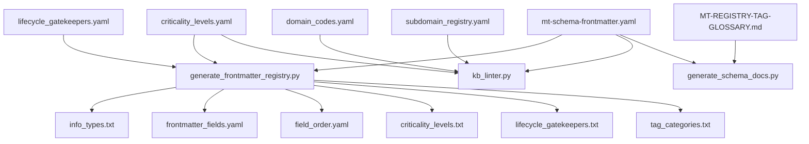
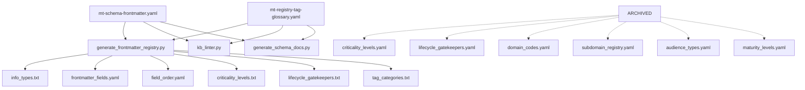

# Registry Content Relationships and Dependencies Analysis - 20250606-2000

**Generated**: 2025-06-06 20:00  
**Purpose**: Detailed analysis of cross-references and dependencies between registry files  
**Task**: TASK 1.1.2 - Map Content Relationships and Dependencies  

---

## Executive Summary

**Critical Dependencies Identified**: 8 major dependency chains  
**Script Dependencies**: 3 generation scripts + 1 linter with specific file dependencies  
**Content Overlaps**: 2 significant overlaps requiring careful consolidation  
**External References**: 6 external vocabulary references requiring updates  

---

## Content Relationship Matrix

### 🔗 **Direct Content Dependencies**

| Source File | Target Integration | Dependency Type | Complexity |
|-------------|-------------------|-----------------|------------|
| `audience_types.yaml` | `mt-schema-frontmatter.yaml` | Controlled Vocabulary | Low |
| `criticality_levels.yaml` | `mt-schema-frontmatter.yaml` | Controlled Vocabulary | Medium |
| `domain_codes.yaml` | `mt-schema-frontmatter.yaml` | Controlled Vocabulary | Low |
| `lifecycle_gatekeepers.yaml` | `mt-schema-frontmatter.yaml` | Controlled Vocabulary | Medium |
| `maturity_levels.yaml` | `mt-schema-frontmatter.yaml` | Controlled Vocabulary | Low |
| `subdomain_registry.yaml` | `mt-schema-frontmatter.yaml` | Controlled Vocabulary | High |
| `MT-REGISTRY-TAG-GLOSSARY.md` | `mt-registry-tag-glossary.yaml` | Content Conversion | High |

### 🔄 **Cross-File Content Overlaps**

#### 1. Criticality Levels Overlap
- **Files**: `criticality_levels.yaml` ↔ `MT-REGISTRY-TAG-GLOSSARY.md`
- **Overlap**: Both define criticality levels with descriptions
- **Conflict**: Different formats and potentially different content
- **Resolution**: Use `criticality_levels.yaml` as authoritative source, update tag glossary references

#### 2. Lifecycle Gatekeepers Overlap  
- **Files**: `lifecycle_gatekeepers.yaml` ↔ `MT-REGISTRY-TAG-GLOSSARY.md`
- **Overlap**: Both define lifecycle gatekeepers
- **Conflict**: Different formats and potentially different content
- **Resolution**: Use `lifecycle_gatekeepers.yaml` as authoritative source, update tag glossary references

---

## Script Dependencies Analysis

### 📜 **generate_frontmatter_registry.py**

#### Current Dependencies
```python
# Primary source
self.yaml_source = "mt-schema-frontmatter.yaml"

# Additional YAML dependencies
criticality_data = self.load_additional_yaml("criticality_levels.yaml")
gatekeeper_data = self.load_additional_yaml("lifecycle_gatekeepers.yaml")
```

#### Generated Outputs
- `info_types.txt` ← `mt-schema-frontmatter.yaml`
- `frontmatter_fields.yaml` ← `mt-schema-frontmatter.yaml`
- `field_order.yaml` ← `mt-schema-frontmatter.yaml`
- `criticality_levels.txt` ← `criticality_levels.yaml`
- `lifecycle_gatekeepers.txt` ← `lifecycle_gatekeepers.yaml`
- `tag_categories.txt` ← hardcoded prefixes

#### Post-Consolidation Changes Required
1. **Remove dependencies**: `criticality_levels.yaml`, `lifecycle_gatekeepers.yaml`
2. **Update generation logic**: Read criticality and lifecycle data from `mt-schema-frontmatter.yaml` controlled_vocabularies
3. **Update tag categories**: Read from `mt-registry-tag-glossary.yaml`

### 📜 **generate_schema_docs.py**

#### Current Dependencies
```python
self.yaml_source = "mt-schema-frontmatter.yaml"
# Also reads MT-REGISTRY-TAG-GLOSSARY.md for cross-references
```

#### Generated Outputs
- Updates sections in `MT-SCHEMA-FRONTMATTER.md`
- Updates sections in `GM-CONVENTIONS-NAMING.md`

#### Post-Consolidation Changes Required
1. **Update references**: Change from `MT-REGISTRY-TAG-GLOSSARY.md` to `mt-registry-tag-glossary.yaml`
2. **Update parsing logic**: Handle YAML format instead of Markdown

### 📜 **kb_linter.py**

#### Current Dependencies
```python
# YAML file dependencies
domain_codes_data = self._load_yaml_vocab("domain_codes.yaml")
self.subdomain_registry = self._load_yaml_vocab("subdomain_registry.yaml")
criticality_yaml_data = self._load_yaml_vocab("criticality_levels.yaml")

# Also references external vocabularies from mt-schema-frontmatter.yaml
```

#### Validation Functions
- Domain code validation against `domain_codes.yaml`
- Subdomain validation against `subdomain_registry.yaml`
- Criticality validation against `criticality_levels.yaml`
- Field validation against `mt-schema-frontmatter.yaml`

#### Post-Consolidation Changes Required
1. **Remove file dependencies**: `domain_codes.yaml`, `subdomain_registry.yaml`, `criticality_levels.yaml`
2. **Update validation logic**: Read all controlled vocabularies from `mt-schema-frontmatter.yaml`
3. **Update tag validation**: Read from `mt-registry-tag-glossary.yaml`

### 📜 **refactor_criticality_field.py**

#### Current Dependencies
```python
yaml_file_path = "criticality_levels.yaml"
```

#### Post-Consolidation Changes Required
1. **Update source**: Read from `mt-schema-frontmatter.yaml` controlled_vocabularies.criticality

---

## External References Analysis

### 🔗 **Current external_vocabularies in mt-schema-frontmatter.yaml**

```yaml
external_vocabularies:
  tags:
    source: "MT-REGISTRY-TAG-GLOSSARY"
    description: "Categories and specific tags for document classification"
  kb_id:
    source: "MT-REGISTRY-TAG-GLOSSARY"
    description: "Knowledge base identifiers"
  criticality:
    source: "MT-REGISTRY-TAG-GLOSSARY"
    description: "Criticality levels (P0-Critical, P1-High, P2-Medium, etc.)"
  lifecycle_gatekeeper:
    source: "MT-REGISTRY-TAG-GLOSSARY"
    description: "Roles/teams responsible for lifecycle approvals"
  primary_domain:
    source: "domain_codes.yaml"
    description: "Primary domain codes (2 uppercase letters)"
  sub_domain:
    source: "subdomain_registry.yaml"
    description: "Sub-domain codes (2-6 uppercase letters) per primary_domain"
```

### 🎯 **Required Updates Post-Consolidation**

```yaml
external_vocabularies:
  tags:
    source: "mt-registry-tag-glossary.yaml"
    description: "Categories and specific tags for document classification"
  kb_id:
    source: "mt-registry-tag-glossary.yaml"
    description: "Knowledge base identifiers"
  # REMOVE - now in controlled_vocabularies
  # criticality: [MOVED TO CONTROLLED_VOCABULARIES]
  # lifecycle_gatekeeper: [MOVED TO CONTROLLED_VOCABULARIES]
  # primary_domain: [MOVED TO CONTROLLED_VOCABULARIES]
  # sub_domain: [MOVED TO CONTROLLED_VOCABULARIES]
```

---

## Data Flow Mapping

### 🌊 **Current Data Flow**



### 🎯 **Target Data Flow Post-Consolidation**



---

## Validation Dependencies

### 🔍 **Field Validation Chain**

1. **primary_domain** validation:
   - Current: `kb_linter.py` → `domain_codes.yaml`
   - Target: `kb_linter.py` → `mt-schema-frontmatter.yaml`.controlled_vocabularies.primary_domain

2. **sub_domain** validation:
   - Current: `kb_linter.py` → `subdomain_registry.yaml`
   - Target: `kb_linter.py` → `mt-schema-frontmatter.yaml`.controlled_vocabularies.sub_domain

3. **criticality** validation:
   - Current: `kb_linter.py` → `criticality_levels.yaml`
   - Target: `kb_linter.py` → `mt-schema-frontmatter.yaml`.controlled_vocabularies.criticality

4. **lifecycle_gatekeeper** validation:
   - Current: `kb_linter.py` → `lifecycle_gatekeepers.yaml`
   - Target: `kb_linter.py` → `mt-schema-frontmatter.yaml`.controlled_vocabularies.lifecycle_gatekeeper

5. **tags** validation:
   - Current: `kb_linter.py` → `MT-REGISTRY-TAG-GLOSSARY.md` (inferred)
   - Target: `kb_linter.py` → `mt-registry-tag-glossary.yaml`

---

## Content Format Standardization Requirements

### 📋 **Format Conversion Matrix**

| Source Format | Target Format | Conversion Complexity |
|---------------|---------------|----------------------|
| Standard Registry (audience_types.yaml) | controlled_vocabularies | Low - Direct mapping |
| Standard Registry (domain_codes.yaml) | controlled_vocabularies | Low - Direct mapping |
| Standard Registry (maturity_levels.yaml) | controlled_vocabularies | Low - Direct mapping |
| List Format (criticality_levels.yaml) | controlled_vocabularies | Medium - Structure change |
| List Format (lifecycle_gatekeepers.yaml) | controlled_vocabularies | Medium - Structure change |
| Hierarchical (subdomain_registry.yaml) | controlled_vocabularies | High - Complex nesting |
| Markdown (MT-REGISTRY-TAG-GLOSSARY.md) | YAML structure | High - Content extraction |

### 🔧 **Standardization Strategy**

#### Target Format for controlled_vocabularies
```yaml
controlled_vocabularies:
  field_name:
    - id: "CODE"
      preferred_label: "Display Name"
      description: "Description text"
      # Additional metadata as needed
```

#### Special Cases
1. **subdomain_registry**: Maintain hierarchical structure within controlled_vocabularies
2. **criticality_levels**: Convert list format to standard registry format
3. **lifecycle_gatekeepers**: Convert list format to standard registry format

---

## Risk Assessment

### 🚨 **High Risk Dependencies**

1. **subdomain_registry.yaml hierarchical structure**
   - Risk: Complex nested structure may not integrate cleanly
   - Mitigation: Design specific YAML schema for hierarchical data

2. **MT-REGISTRY-TAG-GLOSSARY.md content extraction**
   - Risk: Manual content may be lost or misinterpreted
   - Mitigation: Careful parsing and validation of extracted content

3. **Script generation logic changes**
   - Risk: Scripts may fail after consolidation
   - Mitigation: Comprehensive testing with dry-run validation

### ⚠️ **Medium Risk Dependencies**

1. **Format standardization across different YAML structures**
   - Risk: Inconsistent data formats after consolidation
   - Mitigation: Define clear target schema and validation

2. **External vocabulary reference updates**
   - Risk: Broken references in generated documentation
   - Mitigation: Update all references systematically

### ✅ **Low Risk Dependencies**

1. **Simple controlled vocabulary integration**
   - Risk: Minimal - straightforward data migration
   - Mitigation: Standard validation procedures

---

## Next Steps for TASK 1.1.3

1. **Categorize Content for Target File Assignment**:
   - Map each source file content to specific target file sections
   - Define exact YAML structure for each controlled vocabulary
   - Plan integration strategy for complex hierarchical data

2. **Validate Content Preservation Strategy**:
   - Ensure no data loss during format conversion
   - Plan validation procedures for content integrity

3. **Design Integration Architecture**:
   - Define consolidated YAML schemas
   - Plan metadata and generation tracking sections

---

**Analysis Complete**: 2025-06-06 20:00  
**Dependencies Mapped**: 8 major chains  
**Scripts Analyzed**: 4 tools  
**Ready for**: TASK 1.1.3 - Categorize Content for Target File Assignment 