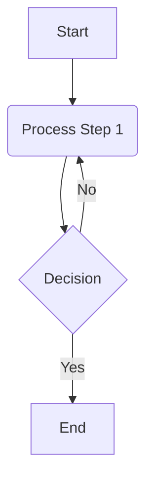

## Table of Contents
- [Standard: Image Alt Text for Accessibility (`SF-ACCESSIBILITY-IMAGE-ALT-TEXT`)](#standard-image-alt-text-for-accessibility-sf-accessibility-image-alt-text)
- [Standard: Callout and Admonition Syntax (`SF-CALLOUTS-SYNTAX`)](#standard-callout-and-admonition-syntax-sf-callouts-syntax)
- [Standard: Syntax for Conditional Attributes in IF Callouts (`SF-CONDITIONAL-SYNTAX-ATTRIBUTES`)](#standard-syntax-for-conditional-attributes-in-if-callouts-sf-conditional-syntax-attributes)
- [Standard: Citation Formatting Guidelines (`SF-FORMATTING-CITATIONS`)](#standard-citation-formatting-guidelines-sf-formatting-citations)
- [Standard: File Hygiene and Formatting (`SF-FORMATTING-FILE-HYGIENE`)](#standard-file-hygiene-and-formatting-sf-formatting-file-hygiene)
- [Standard: General Markdown Formatting Guidelines (`SF-FORMATTING-MARKDOWN-GENERAL`)](#standard-general-markdown-formatting-guidelines-sf-formatting-markdown-general)
- [Internal Linking Syntax Standard (`SF-LINKS-INTERNAL-SYNTAX`)](#internal-linking-syntax-standard-sf-links-internal-syntax)
- [Standard: Blockquote Syntax (`SF-SYNTAX-BLOCKQUOTES`)](#standard-blockquote-syntax-sf-syntax-blockquotes)
- [Standard: Markdown Syntax for Code (Inline and Blocks) (`SF-SYNTAX-CODE`)](#standard-markdown-syntax-for-code-inline-and-blocks-sf-syntax-code)
- [Standard: HTML Comment Syntax for TODO Items (`SF-SYNTAX-COMMENT-TODO`)](#standard-html-comment-syntax-for-todo-items-sf-syntax-comment-todo)
- [Standard: Definition List Syntax (`SF-SYNTAX-DEFINITION-LISTS`)](#standard-definition-list-syntax-sf-syntax-definition-lists)
- [Standard: Markdown Syntax for Mermaid Diagrams (`SF-SYNTAX-DIAGRAMS-MERMAID`)](#standard-markdown-syntax-for-mermaid-diagrams-sf-syntax-diagrams-mermaid)
- [Standard: Text Emphasis Syntax (`SF-SYNTAX-EMPHASIS`)](#standard-text-emphasis-syntax-sf-syntax-emphasis)
- [Standard: Character Escaping Syntax (`SF-SYNTAX-ESCAPING-CHARACTERS`)](#standard-character-escaping-syntax-sf-syntax-escaping-characters)
- [Standard: Footnote Syntax (`SF-SYNTAX-FOOTNOTES`)](#standard-footnote-syntax-sf-syntax-footnotes)
- [Standard: Heading Syntax (`SF-SYNTAX-HEADINGS`)](#standard-heading-syntax-sf-syntax-headings)
- [Standard: Image Syntax (`SF-SYNTAX-IMAGES`)](#standard-image-syntax-sf-syntax-images)
- [Standard: Key Reference Syntax (`SF-SYNTAX-KEYREF`)](#standard-key-reference-syntax-sf-syntax-keyref)
- [Standard: General Markdown Link Syntax (`SF-SYNTAX-LINKS-GENERAL`)](#standard-general-markdown-link-syntax-sf-syntax-links-general)
- [Standard: Markdown Syntax for Lists (`SF-SYNTAX-LISTS`)](#standard-markdown-syntax-for-lists-sf-syntax-lists)
- [Standard: Mathematical Equation Syntax (`SF-SYNTAX-MATH-EQUATIONS`)](#standard-mathematical-equation-syntax-sf-syntax-math-equations)
- [Standard: Table Syntax (`SF-SYNTAX-TABLES`)](#standard-table-syntax-sf-syntax-tables)
- [Standard: YAML Frontmatter Syntax (`SF-SYNTAX-YAML-FRONTMATTER`)](#standard-yaml-frontmatter-syntax-sf-syntax-yaml-frontmatter)
- [Standard: Table of Contents Syntax (`SF-TOC-SYNTAX`)](#standard-table-of-contents-syntax-sf-toc-syntax)
- [Standard: Transclusion Syntax for Content Embedding (`SF-TRANSCLUSION-SYNTAX`)](#standard-transclusion-syntax-for-content-embedding-sf-transclusion-syntax)


## Standard: Image Alt Text for Accessibility (SF-ACCESSIBILITY-IMAGE-ALT-TEXT)

# Standard: Image Accessibility and Alternative Text (SF-ACCESSIBILITY-IMAGE-ALT-TEXT)

## 1. Standard Statement

This standard mandates the use of descriptive alternative text (alt text) for all informational images embedded within knowledge base documents. Proper alt text is crucial for web accessibility, ensuring that content is understandable by users with visual impairments (e.g., those using screen readers) and when images fail to load.

## 2. Core Requirements for Alt Text

### Rule 2.1: Mandatory Alt Text for Informational Images (Derived from U-ACCESSIBILITY-001, Rule 1.1)
All images embedded in content that convey information relevant to understanding the content MUST include descriptive alternative text.
*   **Syntax:** Alt text is provided using the standard Markdown image syntax: ``
    *   The "Optional Title" part of the Markdown syntax (hover text) is not a replacement for alt text and should be used sparingly, if at all, as its accessibility support varies. Primary focus MUST be on the alt text.
*   **Reference:** The specific Markdown syntax for images should align with a general Markdown syntax standard, if available (e.g., [Standard: Image Syntax](#standard-image-syntax-sf-syntax-images)).
*   **Rationale:** Alt text provides a textual alternative to visual information, making image content accessible to screen readers and search engines, and providing context if images are disabled or fail to load.

### Rule 2.2: Concise and Sufficiently Descriptive Alt Text (Derived from U-ACCESSIBILITY-001, Rule 1.2)
Alternative text MUST be concise yet sufficiently descriptive to convey the meaning, purpose, or essential information of the image within the context of the surrounding content.
*   **Avoid Generic Terms:** Generic alt text such as "image," "picture," "graphic," or the image filename is unacceptable as it provides no useful information.
*   **Context is Key:** The description should reflect what is important about the image in its specific context. The same image might have different appropriate alt text depending on how it's used.
*   **Conciseness:** Aim for brevity while capturing the essence of the image. Screen readers will read the entire alt text.
*   **Rationale:** Meaningful alt text ensures that users relying on it gain equivalent understanding to those who can see the image.

### Rule 2.3: Handling Decorative Images (Derived from U-ACCESSIBILITY-001, Rule 1.2 guidance)
If an image is purely decorative and provides no informational value (e.g., a stylistic border or abstract background pattern), it SHOULD be implemented in a way that assistive technologies can ignore it.
*   **Guidance:** For purely decorative images, using an empty alt text (`alt=""`) is the preferred method in Markdown: ``.
*   **Caution:** This practice should be used sparingly and only when the image genuinely adds no information relevant to the content. If in doubt, provide descriptive alt text.
*   **Rationale:** Prevents screen readers from announcing non-informative image details, which can be distracting and add cognitive load for users.

## 3. Examples of Alt Text

### Good Alt Text:
*   `` (For a chart conveying specific data)
*   `` (Describing a logo)
*   `` (Describing a UI screenshot)
*   `` (Describing a flowchart's purpose and general structure)

### Bad Alt Text (to be avoided):
*   ``
*   ``
*   ``
*   `` (Empty alt text for an informational image)

## 4. Importance of Alt Text

*   **Accessibility for Visually Impaired Users:** Screen readers announce alt text, enabling users with visual impairments to understand the content and purpose of images.
*   **Context when Images Fail to Load:** If an image cannot be displayed (e.g., due to a broken link, slow connection, or user settings), the alt text is shown in its place, providing context.
*   **Search Engine Optimization (SEO):** Search engines use alt text to understand image content, which can improve search result relevance.
*   **Usability for All:** Clear alt text can benefit all users by providing additional context or information about an image, especially for complex visuals.

## 5. Scope of Application

This standard applies to all images (e.g., PNG, JPG, SVG, GIF) embedded within any Markdown document in the knowledge base.

## 6. Cross-References
- [[CS-POLICY-ACCESSIBILITY]] - The overarching policy on content accessibility.
- [Standard: Image Syntax](#standard-image-syntax-sf-syntax-images) - (If it exists) Standard defining the precise Markdown syntax for images. If not, refer to a general Markdown syntax guide.

---
*This standard (SF-ACCESSIBILITY-IMAGE-ALT-TEXT) is based on rules 1.1 and 1.2 previously defined in U-ACCESSIBILITY-001 from COL-LINKING-UNIVERSAL.md.*

---

## Standard: Callout and Admonition Syntax (SF-CALLOUTS-SYNTAX)

# Standard: Callout/Admonition Block Syntax (SF-CALLOUTS-SYNTAX)

## 1. Standard Statement

This standard defines a generalized Markdown syntax for creating callout or admonition blocks. These blocks are used to highlight specific types of information, such as notes, warnings, tips, or examples, setting them apart from the main narrative flow. The syntax builds upon the standard Markdown blockquote format.

While this standard defines the *syntax*, the policy governing *when and how to use* specific callout types is defined in [[CS-ADMONITIONS-POLICY]]. Adherence to [[SF-FORMATTING-FILE-HYGIENE]] regarding blank lines around block elements is also important.

## 2. Core Callout Syntax Rule

### Rule 2.1: Callout Block Structure
Callout/admonition blocks MUST be constructed as an extension of the standard Markdown blockquote syntax.
*   **Syntax:**
    ```markdown
    > [!TYPE] Optional Title
    > Callout content goes here.
    > It can span multiple lines.
    >
    > - And can include other Markdown elements like lists,
    > - provided they are correctly indented within the blockquote.
    ```
*   **Components:**
    1.  **Blockquote Marker (`>`):** Each line of the callout block MUST begin with the blockquote marker (`>`) followed by a space, as defined in [Standard: Blockquote Syntax](#standard-blockquote-syntax-sf-syntax-blockquotes).
    2.  **Type Specifier (`[!TYPE]`):** The first line of the callout block, immediately after the `> `, MUST contain a type specifier enclosed in square brackets and prefixed with an exclamation mark: `[!TYPE]`.
        *   **`TYPE`**: A keyword indicating the nature of the callout. This keyword MUST be uppercase. See "Recommended `TYPE` Keywords" below.
    3.  **Optional Title:** An optional title for the callout MAY follow the `[!TYPE]` specifier on the same line, separated by a space.
    4.  **Content:** The content of the callout begins on the line immediately following the type specifier line, or on the same line after the optional title if space permits and is readable. All content lines MUST also be prefixed with `> `.
*   **Blank Lines:** A blank line MUST precede and follow the entire callout block.

### Rule 2.2: Recommended `TYPE` Keywords
The following uppercase keywords ARE recommended for the `[!TYPE]` specifier to ensure consistency and semantic meaning. Their specific usage is governed by [[CS-ADMONITIONS-POLICY]].

*   **`NOTE`**: For general supplementary information or side comments.
*   **`IMPORTANT`**: For information that users must not overlook.
*   **`WARNING`**: For potential dangers, pitfalls, or critical cautionary advice.
*   **`TIP`**: For helpful hints, suggestions, or best practices.
*   **`QUESTION`**: For posing questions related to the content, or for FAQs. (Also `FAQ`)
*   **`ERROR`**: For highlighting error messages or incorrect outcomes.
*   **`SUCCESS`**: For indicating successful outcomes or positive confirmations. (Also `INFO`, `HELP`)
*   **`EXAMPLE`**: For designating examples. (Also `DEMO`)
*   **`QUOTE`**: For text quoted from external sources, distinct from a standard blockquote if specific styling is desired.
*   **`ABSTRACT`**: For summaries or abstracts at the beginning of a section. (Also `SUMMARY`, `TLDR`)
*   **`TODO`**: For highlighting to-do items or pending tasks within the document (primarily for editorial/authoring purposes, may be stripped in final output).
*   **`IF`**: For conditional text presentation logic (if supported by tooling, this indicates a block whose rendering may depend on certain conditions).

*   **Extensibility:** While these are recommended, specific projects or KBs MAY define additional custom types if necessary, but these MUST be documented in a local supplement to [[CS-ADMONITIONS-POLICY]]. Over-proliferation of types is discouraged.

## 3. Illustrative Examples

### Example 3.1: Note with Title
```markdown
> [!NOTE] Important Considerations
> This is a note with a title.
> It provides supplementary information that readers might find useful.
```

### Example 3.2: Warning without Title
```markdown
> [!WARNING]
> Proceed with caution. Incorrect configuration can lead to data loss.
```

### Example 3.3: Tip with Multi-line Content
```markdown
> [!TIP]
> To improve performance, consider the following:
> - Index your database tables.
> - Use a caching layer for frequently accessed data.
```

### Example 3.4: TODO item
```markdown
> [!TODO]
> - Finalize the examples for Section 4.
> - Get review from SME on accuracy of definitions.
```

## 4. Rendering and Tooling Dependency

The visual appearance (e.g., color, icon) of callout/admonition blocks is determined by the CSS and JavaScript of the Markdown rendering environment (e.g., static site generator theme, authoring tool previewer).
*   **Semantic Intent:** This standard defines the syntax to convey the *semantic intent* of the callout.
*   **Fallback:** If a specific `[!TYPE]` is not recognized by a renderer, it SHOULD gracefully fall back to rendering as a standard Markdown blockquote. The `[!TYPE] Optional Title` line will still be visible as the first line of the blockquote.

## 5. Importance of Standardized Callout Syntax

*   **Semantic Highlighting:** Allows authors to give semantic meaning to certain blocks of text, indicating their special importance or nature.
*   **Improved Readability:** When rendered with distinct styling, callouts help break up text and draw attention to key information.
*   **Authoring Consistency:** Provides a uniform syntax for authors to create these highlighted blocks.
*   **Potential for Automation:** Standardized syntax can be targeted by automation tools for indexing, summarization, or conditional processing.

## 6. Scope of Application

This standard applies to all Markdown documents within the knowledge base repository where callout or admonition blocks are used to highlight information.

## 7. Cross-References
- [[CS-ADMONITIONS-POLICY]] - Policy on when and how to use specific callout types.
- [Standard: Blockquote Syntax](#standard-blockquote-syntax-sf-syntax-blockquotes) - Defines the base blockquote syntax upon which callouts are built.
- [[SF-FORMATTING-FILE-HYGIENE]] - For rules on blank lines around block elements.

---
*This standard (SF-CALLOUTS-SYNTAX) generalizes the Obsidian callout syntax to provide a tool-agnostic method for declaring admonition blocks in Markdown, building upon standard blockquote syntax.*

---

## Standard: Syntax for Conditional Attributes in IF Callouts (SF-CONDITIONAL-SYNTAX-ATTRIBUTES)

# Standard: Syntax for Conditional Attributes in IF Callouts (SF-CONDITIONAL-SYNTAX-ATTRIBUTES)

## 1. Standard Statement

This standard defines the specific syntax for the `condition` string used within `[!IF condition]` callout blocks. The general syntax for callouts, including the `[!IF ...]` type, is defined in [[SF-CALLOUTS-SYNTAX]]. This document focuses solely on the structure and format of the `condition` part itself. Adherence to this syntax is crucial for consistent parsing and application of content profiling rules.

The actual list of permissible attributes and their corresponding values for use in conditions is defined and managed by the [[CS-CONTENT-PROFILING-POLICY]].

## 2. Core Syntax Rules for Condition Strings

### Rule 2.1: Condition Format (`attribute=value` pairs) (Derived from M-CONDITIONAL-TEXT-SYNTAX-001, Rule 1.2 - part)
The condition string within an `[!IF condition]` callout MUST consist of one or more `attribute=value` pairs.
*   **Syntax:** `attribute=value`
*   **Example:** `audience=expert`
*   **Rationale:** This simple key-value format allows for clear and parsable conditions.

### Rule 2.2: Multiple Conditions (AND logic) (Derived from M-CONDITIONAL-TEXT-SYNTAX-001, Rule 1.2 - part)
Multiple `attribute=value` pairs within a single `[!IF condition]` block can be combined using the keyword `AND`.
*   **Case Insensitivity:** The `AND` keyword is case-insensitive (i.e., `AND`, `and`, `And` are all acceptable, but `AND` is preferred for consistency).
*   **Syntax:** `attribute1=value1 AND attribute2=value2`
*   **Example:** `audience=expert AND platform=linux`
*   **Rationale:** Allows for more granular control over content visibility by combining multiple profiling criteria.

### Rule 2.3: `OR` Logic Not Supported in Single Block (Derived from M-CONDITIONAL-TEXT-SYNTAX-001, Rule 1.2 - part)
`OR` logic is NOT directly supported within a single `[!IF condition]` block.
*   **Guidance:** If `OR` logic is required (e.g., show content if `audience=expert OR audience=developer`), this MUST be achieved by using separate `[!IF ...]` blocks for each condition.
    ```markdown
    > [!IF audience=expert]
    > This content is for experts.

    > [!IF audience=developer]
    > This content is for developers. 
    > (Note: If the content is identical, it would be duplicated here. This highlights a limitation.)
    ```
*   **Rationale:** Keeps the condition parsing logic simple. Complex boolean expressions are difficult to manage and parse reliably within this syntax.

### Rule 2.4: No Spaces in Attributes or Values; Value Formatting (Derived from M-CONDITIONAL-TEXT-SYNTAX-001, Rule 1.3)
Attribute names and their assigned values MUST NOT contain spaces.
*   **Attribute Names:** SHOULD be concise and descriptive (e.g., `audience`, `platform`, `feature-flag`).
*   **Values:**
    *   Values also MUST NOT contain spaces.
    *   If a value consists of multiple words, it SHOULD be formatted using **kebab-case** (e.g., `expert-user`, `early-adopter-preview`).
*   **Assignment:** The equals sign (`=`) MUST NOT be surrounded by spaces.
    *   **Correct:** `audience=expert-user`
    *   **Incorrect:** `audience = expert-user`, `audience=expert user`
*   **Rationale:** Ensures simple and unambiguous parsing of the condition string.

## 3. Valid Condition String Examples

*   `audience=expert`
*   `platform=windows`
*   `feature-flag=new-dashboard AND audience=internal-tester`
*   `version=v2.1 AND audience=all` (assuming `all` is a defined value for `audience`)
*   `os=macos AND display-mode=dark`

## 4. Management of Attributes and Values

The list of approved profiling attributes (e.g., `audience`, `platform`) and their permissible values (e.g., `expert`, `novice` for `audience`) is defined and managed by the [[CS-CONTENT-PROFILING-POLICY]]. This standard only defines the syntax for how these attribute-value pairs are expressed within a condition string.

## 5. Importance of Consistent Condition Syntax

*   **Reliable Parsing:** Ensures that tools designed to process conditional content can reliably parse and interpret the conditions.
*   **Authoring Clarity:** Provides a clear and unambiguous way for authors to specify conditions.
*   **Maintainability:** Standardized syntax makes it easier to review, update, and manage conditional blocks across the knowledge base.

## 6. Scope of Application

This standard applies to the condition string within all `[!IF condition]` callout blocks used in Markdown documents across the knowledge base.

## 7. Cross-References
- [[SF-CALLOUTS-SYNTAX]] - Defines the general syntax for callout blocks, including the `[!IF ...]` type.
- [[CS-CONTENT-PROFILING-POLICY]] - Defines the approved list of profiling attributes and their values, and the overall policy for content profiling.

---
*This standard (SF-CONDITIONAL-SYNTAX-ATTRIBUTES) is based on rules 1.2 and 1.3 previously defined in M-CONDITIONAL-TEXT-SYNTAX-001.*

---

## Standard: Citation Formatting Guidelines (SF-FORMATTING-CITATIONS)

# Standard: Citing External Sources (APA 7th Edition) (SF-FORMATTING-CITATIONS)

## 1. Standard Statement

This standard **MANDATES** the exclusive requirements for citing external sources within all Knowledge Base documents. Proper attribution is **CRITICAL** for maintaining academic integrity, ensuring content verifiability, respecting intellectual property, and providing users with pathways to source material.

## 2. Core Citation Rules

### Rule 2.1: Requirement for Attribution
Any claims, direct quotations, specific data points, or paraphrased information derived from external, published, or citable sources **MUST** be clearly attributed.
*   **Rationale:** Upholds academic/professional integrity and allows verification.

### Rule 2.2: Adopted Citation Style (APA 7th Edition)
The **7th Edition of the Publication Manual of the American Psychological Association (APA)** is the **MANDATORY** citation style for all Knowledge Base documents. This style **MUST** be used consistently for both in-text citations and the "References" list.
*   **Rationale:** Ensures uniformity, predictability, and clarity in referencing.

### Rule 2.3: In-Text Citations
In-text citations **MUST** be used within the text body to indicate the source at the point of presentation. Follow APA 7th Edition guidelines for author-date citations.
*   **Example (Paraphrase):** ...as research has shown (Smith, 2023).
*   **Example (Direct Quote):** Smith (2023) stated, "the results were conclusive" (p. 45).
*   **Rationale:** Provides immediate attribution and aids full reference lookup.

### Rule 2.4: "References" Section
A dedicated section titled "References," formatted as an H2 heading, **MUST** be included at the end of any document containing citations. This section **MUST** list all sources cited in-text, conforming fully to APA 7th Edition formatting. Entries **MUST** be listed alphabetically by the first author's last name.
*   **Example:**
    ```markdown
    ## References
    Smith, J. A. (2023). *The Art of Referencing*. Publisher Name.
    Jones, P., & Adams, B. K. (2022). Citing sources in the digital age. *Journal of Scholarly Communication*, *15*(2), 112-130. https://doi.org/xxxx/xxxx
    ```
*   **Rationale:** Provides complete bibliographic information for source consultation.

### Rule 2.5: Citing Online Sources
When citing online sources, a direct and stable hyperlink (URL or DOI) **MUST** be included in the "References" list entry. Retrieval dates are generally **NOT** required for stable online sources (e.g., journal articles with DOIs).
*   **Example (URL in References):** Author, A. A. (Year). *Title of work*. Site Name. https://xxxx
*   **Rationale:** Facilitates direct access to online sources.

## 3. Importance of Strict Citation Formatting

*   **Academic and Professional Integrity:** Acknowledges work and avoids plagiarism.
*   **Verifiability:** Allows readers to verify information.
*   **Building Trust:** Demonstrates rigor and credibility.
*   **Legal Compliance:** Respects copyright/intellectual property.
*   **Supporting Further Research:** Provides foundation for others.

## 4. Scope of Application

This standard applies to **ALL** documents within any Knowledge Base that incorporate information from external sources. Adherence to these rules is **MANDATORY** for all content creators, automated systems, and tooling interacting with KB Markdown files.

## 5. Cross-References
*   [Internal Linking Syntax Standard](#internal-linking-syntax-standard-sf-links-internal-syntax)

---
*This standard (SF-FORMATTING-CITATIONS) has been revised to mandate strict APA 7th Edition citation formatting, including specific rules for in-text citations, references section, and online sources, ensuring academic integrity and verifiability.*

---

## Standard: File Hygiene and Formatting (SF-FORMATTING-FILE-HYGIENE)

# Standard: File Hygiene and Formatting (SF-FORMATTING-FILE-HYGIENE)

## 1. Standard Statement

This standard defines mandatory file hygiene and formatting rules for all text-based files within the knowledge base repository. Adherence to these rules is crucial for ensuring consistency in version control systems, promoting cross-platform compatibility, maintaining file integrity, enhancing readability, and supporting reliable automated processing.

## 2. Core File Hygiene Rules

### Rule 2.1: UTF-8 Encoding (Consistent with [[MT-SCHEMA-FRONTMATTER]])
All text-based files (e.g., `.md`, `.yaml`, `.json`, `.py`) MUST use **UTF-8 (Unicode Transformation Format—8-bit) encoding**.
*   **Byte Order Mark (BOM):** A Byte Order Mark (BOM) MUST NOT be used at the beginning of files.
*   **Rationale:** UTF-8 is a universal character encoding standard that supports a wide range of characters and symbols, ensuring broad compatibility. Avoiding BOM prevents potential issues with some tools and parsers, particularly in Unix-like environments. This rule aligns with the frontmatter encoding specified in [[MT-SCHEMA-FRONTMATTER]].

### Rule 2.2: Line Feed (LF) Line Endings (Derived from U-FILEHYGIENE-001, Rule 1.1)
All text-based files MUST use **Line Feed (LF) line endings (Unix-style)**.
*   **Prohibition:** Carriage Return Line Feed (CRLF) line endings (Windows-style) or Carriage Return (CR) line endings (classic Mac-style) are NOT permitted.
*   **Rationale:** Consistent line endings prevent common issues in version control systems (like Git incorrectly reporting entire files as changed), ensure cross-platform compatibility, and simplify text processing by scripts and tools. Most modern text editors can be configured to enforce LF line endings.

### Rule 2.3: No Trailing Whitespace (Derived from U-FILEHYGIENE-001, Rule 1.2)
Trailing whitespace (spaces or tabs) at the end of any line of text MUST be removed.
*   **Rationale:** Trailing whitespace can cause inconsistencies in diffs, create visual clutter, and sometimes interfere with the behavior of scripts or parsers. Many text editors can be configured to automatically remove trailing whitespace upon saving.

### Rule 2.4: Single Newline at End-Of-File (EOF) (Derived from U-FILEHYGIENE-001, Rule 1.3)
All text-based files MUST end with a single newline character.
*   **Guidance:** This means the last line of the file should have a line ending character, and there should not be multiple blank lines at the very end of the file.
*   **Rationale:** This is a POSIX standard and is expected by many command-line tools and text processing utilities. It ensures that files can be concatenated or processed correctly and prevents some tools from indicating a "missing newline" warning or diff.

## 3. Importance of File Hygiene

Maintaining consistent file hygiene offers several benefits:

*   **Version Control System (VCS) Integrity:** Prevents spurious changes in diffs caused by line ending or whitespace differences, making commit histories cleaner and reviews more focused.
*   **Cross-Platform Compatibility:** Ensures files can be opened and edited consistently across different operating systems (Windows, macOS, Linux).
*   **Improved Readability:** Eliminates distracting visual inconsistencies caused by mixed line endings or unnecessary whitespace.
*   **Reliable Automation:** Scripts and automated tools for parsing, linting, or building content are less likely to fail or produce unexpected results due to inconsistent formatting.
*   **Professionalism:** Adherence to these conventions reflects a professional approach to content and code management.

## 4. Scope of Application

This standard applies to all text-based files committed to the knowledge base repository, with a particular emphasis on:
*   Markdown files (`.md`)
*   YAML files (`.yaml`)
*   JSON files (`.json`)
*   Python scripts (`.py`)
*   Shell scripts (`.sh`, `.bash`)
*   Other configuration or text files (e.g., `.gitignore`, `.editorconfig`)

Binary files (e.g., images, PDFs) are exempt from these specific rules (though their naming conventions are covered elsewhere).

## 5. Tooling and Enforcement

It is highly recommended to configure text editors and Integrated Development Environments (IDEs) to automatically enforce these file hygiene rules (e.g., by setting default line endings to LF, removing trailing whitespace on save, ensuring a final newline). Project-level configuration files like `.editorconfig` can also be used to help standardize these settings across different editors. Automated linters or pre-commit hooks may also be employed to check for and enforce compliance.

## 6. Cross-References
- [[MT-SCHEMA-FRONTMATTER]] - For specific encoding rules related to YAML frontmatter.

---
*This standard (SF-FORMATTING-FILE-HYGIENE) is based on rules 1.1 through 1.3 previously defined in U-FILEHYGIENE-001 from COL-GOVERNANCE-UNIVERSAL.md, and incorporates a general UTF-8 encoding rule.*
```

---

## Standard: General Markdown Formatting Guidelines (SF-FORMATTING-MARKDOWN-GENERAL)

# Standard: Markdown General Formatting Conventions (SF-FORMATTING-MARKDOWN-GENERAL)

## 1. Standard Statement

This standard **MANDATES** general Markdown formatting conventions for paragraphs, line breaks, horizontal rules, and blank lines. Adherence to these conventions is **CRITICAL** for ensuring readability, consistency, and correct parsing of Markdown documents. These rules complement file-level hygiene rules in [[SF-FORMATTING-FILE-HYGIENE]].

## 2. Core General Formatting Rules

### Rule 2.1: Paragraphs
Paragraphs are sequences of text separated by one or more blank lines.
*   **Mandatory:** A single blank line (**MUST**) separate distinct paragraphs.
*   **Example:**
    ```markdown
    This is the first paragraph. It can span multiple lines of text
    but will be rendered as a single block.

    This is the second paragraph, separated from the first by a single blank line.
    ```
*   **Rationale:** Clearly delineates paragraphs for both raw text readability and correct rendering.

### Rule 2.2: Line Breaks (Soft vs. Hard)
Markdown treats most newlines within a paragraph as "soft" line breaks, rendering as a single space.
*   **Soft Line Breaks (Standard Behavior):**
    ```markdown
    This line is part of the first paragraph.
    This line will join the previous one, separated by a space.
    ```
*   **Hard Line Breaks (Explicit Breaks within a Paragraph):**
    If an explicit hard line break is absolutely necessary within a paragraph, it **MUST** be created by ending a line with two or more spaces before the newline character. The use of HTML `<br>` tags is **PROHIBITED**.
    ```markdown
    Line one with a hard break.  
    Line two, still in the same paragraph.
    ```
*   **Rationale:** Ensures predictable rendering and maintains Markdown purity.

### Rule 2.3: Horizontal Rules
Horizontal rules **MUST** be created using three or more hyphens (`---`) on a line by themselves. The use of asterisks (`***`) or underscores (`___`) is **PROHIBITED**.
*   **Spacing:** The characters forming the rule **MAY** be separated by spaces.
*   **Blank Lines:** A blank line **MUST** precede and follow a horizontal rule, as per [[SF-FORMATTING-FILE-HYGIENE]].
*   **Example:**
    ```markdown
    Some content above.

    ---

    Some content below.
    ```
*   **Rationale:** Provides clear visual separation and standardizes consistency.

### Rule 2.4: Use of Multiple Blank Lines
The use of more than one consecutive blank line to separate content elements (e.g., between paragraphs, before/after headings, lists, code blocks) is **PROHIBITED**.
*   **Rationale:** Maintains consistency in raw Markdown formatting and avoids excessive vertical spacing.

## 3. Importance of Strict General Formatting Conventions

*   **Readability:** Consistent formatting makes raw Markdown documents easier to read, edit, and review.
*   **Predictable Rendering:** Ensures Markdown is parsed and rendered as intended across different platforms and tools.
*   **Authoring Efficiency:** Clear rules reduce ambiguity for authors.
*   **Maintainability:** Well-formatted documents are easier to maintain over time.

## 4. Scope of Application

This standard applies to **ALL** Markdown documents within the Knowledge Base repository. Adherence to these rules is **MANDATORY** for all content creators, automated systems, and tooling interacting with KB Markdown files.

## 5. Cross-References
*   [[SF-FORMATTING-FILE-HYGIENE]]

---
*This standard (SF-FORMATTING-MARKDOWN-GENERAL) has been revised to mandate strict general Markdown formatting conventions, including explicit rules for paragraphs, line breaks, horizontal rules, and blank line usage, ensuring consistency and predictable rendering.*

---

## Internal Linking Syntax Standard (SF-LINKS-INTERNAL-SYNTAX)

# SF-LINKS-INTERNAL-SYNTAX: Internal Linking Syntax Standard

## 1. Standard Statement

This standard **MANDATES** the exclusive syntax and strict procedures for creating all internal links within Knowledge Base Markdown documents. Adherence to these rules is **CRITICAL** for ensuring universal consistency, preserving link integrity, enabling robust automated validation, and providing predictable navigation across the entire Knowledge Base ecosystem.

## 2. Core Internal Linking Rules

### Rule 2.1: Canonical Linking to Standard Documents by `standard_id`
Internal links to other formal standard documents (those with an assigned `standard_id` in their frontmatter) **MUST** be created exclusively by referencing their unique `standard_id`.
*   **Mandatory Syntax:** `[[STANDARD_ID]]` or `[[STANDARD_ID|Display Text]]`
*   **Example (without alias):** `[[AS-STRUCTURE-KB-ROOT]]`
*   **Example (with alias):** `[[AS-STRUCTURE-KB-ROOT|Knowledge Base Root Structure Standard]]`
*   **Rationale:** Referencing `standard_id` directly makes links highly resilient to file renames or moves, as the unique identifier remains stable. This is crucial for maintaining long-term link integrity in a dynamic knowledge base.

### Rule 2.2: Mandatory Descriptive Link Text for Readability
For all internal links (both to standard documents and non-standard documents), the link text **MUST** be descriptive and clearly indicate the nature of the target content to the user, enhancing readability and navigation. Using the raw `STANDARD_ID` or filename as link text is **PROHIBITED** if it is not immediately clear or sufficiently descriptive in context.
*   **Mandatory Use of Alias:** When the `STANDARD_ID` or filename is not inherently clear, an alias (display text) **MUST** be provided using the pipe (`|`) separator.
    *   **Example (Correct):** `For details, see the [Text Emphasis Syntax Standard](#standard-text-emphasis-syntax-sf-syntax-emphasis).`
    *   **Prohibited (if not descriptive):** `For details, see [Standard: Text Emphasis Syntax](#standard-text-emphasis-syntax-sf-syntax-emphasis).`
*   **Rationale:** Descriptive link text improves scannability, accessibility (for screen readers), and helps users understand the destination of a link before clicking, fostering a better user experience.

### Rule 2.3: Linking to Specific Sections (Headings)
To link directly to a specific heading or section within a target document, the heading text **MUST** be appended to the target document reference using the hash symbol (`#`).
*   **Mandatory Syntax:** `[[STANDARD_ID#Heading Text]]` or `[[STANDARD_ID#Heading Text|Display Text]]`
*   **Example (Standard ID):** `[[AS-STRUCTURE-KB-ROOT#Master Table of Contents]]`
*   **Example (Non-Standard Document):** `[[./path/to/document.md#Specific Section Name|Learn More]]`
*   **Requirement:** The `Heading Text` portion **MUST** exactly match the target heading in the linked document, including capitalization, spaces, and punctuation, to ensure the link resolves correctly.
*   **Rationale:** Allows for precise deep-linking within documents, improving navigability and user efficiency.

### Rule 2.4: Internal Linking for Non-Standard Documents (Path-Based)
For internal links to Markdown documents that do **NOT** have a `standard_id` (e.g., project notes, guides, or other general documentation files), relative file paths **MUST** be used. These paths **MUST** be relative to the repository root to ensure maximum stability, consistency, and portability across different tools and environments.
*   **Mandatory Syntax:** `[Link Text](./path/from/repo/root/to/document.md)`
*   **Example:** `[Project Guidelines](./active-project/project-guidelines/project-reminders.md)`
*   **Prohibited:** Direct path-based links relative to the *current* file's directory (e.g., `../another/file.md`) are **PROHIBITED** to avoid ambiguity and fragility when files are moved.
*   **Rationale:** A consistent root-relative path strategy minimizes the likelihood of broken links when files are reorganized within the repository, and simplifies automated processing like linting and indexing.

### Rule 2.5: Prohibition of Direct Path-Based Linking for Standard Documents
Direct file path-based links (e.g., `[text](./standards/src/AS-STRUCTURE-KB-ROOT.md)`) to standard documents that possess a `standard_id` are **PROHIBITED**. All references to such documents **MUST** use their `standard_id` as defined in Rule 2.1.
*   **Rationale:** Enforces the `standard_id` as the single canonical identifier for standard documents, which is more robust and maintainable than file paths.

### Rule 2.6: External Linking
Links to external web resources **MUST** use standard Markdown URL syntax.
*   **Mandatory Syntax:** `[Link Text](https://example.com/external-resource)`
*   **Rationale:** Provides a clear and universally understood method for referencing external content.

## 3. Importance of Strict Internal Linking

*   **Guaranteed Link Integrity:** Strict rules and preferred `standard_id` linking for standards drastically reduce the chance of broken links, even as the file structure evolves.
*   **Enhanced Navigation & Discoverability:** Consistent linking and descriptive text make the Knowledge Base highly navigable and ensure users can easily find related information.
*   **Reliable Automated Processing:** Tools for validation, indexing, and content transformation can reliably parse and resolve links, which is crucial for maintaining a healthy KB.
*   **Improved Maintainability:** A single, clear approach to linking simplifies authoring, reviewing, and updating content, especially in a large repository.
*   **Unified User Experience:** Provides a predictable and professional linking experience across all documents.

## 4. Scope of Application

This standard applies to **ALL** internal and external links created within **ALL** Markdown documents across the entire Knowledge Base repository. Adherence is **MANDATORY** for all content creators, automated systems, and any tooling interacting with KB Markdown files.

## 5. Cross-References
- [[CS-POLICY-TONE-LANGUAGE]] - For definitions of mandating keywords (MUST, SHOULD, MAY) and general language policy.
- [[CS-LINKING-INTERNAL-POLICY]] - General policy on the strategy and best practices for internal linking.

---
*This standard (SF-LINKS-INTERNAL-SYNTAX) has been extensively revised to provide strict, singular mandates for internal linking syntax, path resolution, and descriptive text, consolidating previous guidelines into absolute requirements. It replaces and supersedes any prior interpretations or practices where conflicts existed, establishing a single source of truth for linking within the Knowledge Base.*

---

## Standard: Blockquote Syntax (SF-SYNTAX-BLOCKQUOTES)

# Standard: Markdown Syntax for Blockquotes (SF-SYNTAX-BLOCKQUOTES)

## 1. Standard Statement

This standard **MANDATES** the exclusive Markdown syntax for creating blockquotes within all Knowledge Base documents. Strict and consistent use of blockquote syntax is **CRITICAL** for visually distinguishing quoted text, ensuring correct rendering, maintaining readability, and accurately conveying semantic meaning. Adherence to [[SF-FORMATTING-FILE-HYGIENE]] regarding blank lines around block elements is also **MANDATORY**.

## 2. Core Blockquote Syntax Rules

### Rule 2.1: Blockquote Marker
All lines of text intended to be part of a blockquote **MUST** be prefixed with a greater-than symbol (`>`) followed by a single space.
*   **Mandatory Syntax:** `> Quoted text`
*   **Multi-line Blockquotes:** For blockquotes spanning multiple lines, including blank lines used to separate paragraphs within the quote, each and every line **MUST** be prefixed with `> `.
    *   **Example:**
        ```markdown
        > This is the first paragraph of a blockquote.
        >
        > This is the second paragraph within the same blockquote.
        ```
*   **Prohibited Syntax:** Omitting the `> ` prefix on any line within a blockquote, or using tabs for indentation, **MUST NOT** be done.
*   **Rationale:** The `> ` prefix is the singular, universally recognized Markdown indicator for blockquotes, essential for consistent parsing and rendering.

### Rule 2.2: Nested Blockquotes
Nested blockquotes (a blockquote contained within another blockquote) **MUST** be created by adding an additional greater-than symbol (`>`) for each level of nesting, each followed by a single space.
*   **Mandatory Syntax:** `>> Nested quoted text`
*   **Example:**
    ```markdown
    > This is the first level of quoting.
    >
    > > This is a nested blockquote (second level).
    > > It can also span multiple lines.
    >
    > Back to the first level of quoting.
    >
    > > > This is a third level of nesting!
    ```
*   **Rationale:** Provides a clear, unambiguous, and standard method for representing multiple levels of quotation or attribution.

### Rule 2.3: Blank Lines Around Blockquotes
A single blank line **MUST** precede and a single blank line **MUST** follow every blockquote element to ensure clear separation from surrounding paragraphs or other block elements.
*   **Example:**
    ```markdown
    This is a paragraph before the blockquote.

    > This is the blockquote content.
    > It might have multiple lines.

    This is a paragraph after the blockquote.
    ```
*   **Rationale:** Ensures correct parsing and rendering of the blockquote as a distinct block element, preventing unintended merging with adjacent content and maintaining visual integrity.

## 3. Importance of Strict Blockquote Syntax

*   **Guaranteed Readability & Visual Distinction:** Clearly separates quoted material from original content, significantly improving comprehension and user experience.
*   **Accurate Semantic Meaning:** Unambiguously indicates that the enclosed text is a quotation, crucial for content integrity and automated analysis.
*   **Reliable Automated Processing:** Ensures that tools for linting, validation, and content transformation can accurately identify and process blockquoted material.
*   **Enhanced Authoring Consistency:** Provides a single, clear method for authors to correctly quote text, reducing errors and fostering uniformity across the Knowledge Base.

## 4. Scope of Application

This standard applies to **ALL** Markdown documents within the Knowledge Base repository where text is quoted from external sources or other documents. Adherence to these rules is **MANDATORY** for all content creators, automated systems, and any tooling interacting with KB Markdown files.

## 5. Cross-References
- [[CS-POLICY-TONE-LANGUAGE]] - For definitions of mandating keywords (MUST, SHOULD, MAY) and general language policy.
- [[SF-FORMATTING-FILE-HYGIENE]] - For rules on blank lines and file formatting that apply to block elements.

---
*This standard (SF-SYNTAX-BLOCKQUOTES) has been revised to provide strict, singular mandates for blockquote syntax, clarifying its application and incorporating absolute prohibitions. It replaces and supersedes any prior interpretations or practices where conflicts existed, establishing a single source of truth for quoted content representation within the Knowledge Base.*

---

## Standard: Markdown Syntax for Code (Inline and Blocks) (SF-SYNTAX-CODE)

# Standard: Markdown Syntax for Code (Inline and Blocks) (SF-SYNTAX-CODE)

## 1. Standard Statement

This standard **MANDATES** the exclusive Markdown syntax for representing inline code snippets and extended code blocks within all Knowledge Base documents. Strict and consistent code syntax is **CRITICAL** for ensuring accuracy, enabling reliable automated processing (e.g., syntax highlighting, code extraction), and maintaining a unified technical presentation across the entire Knowledge Base. Adherence to [[SF-FORMATTING-FILE-HYGIENE]] regarding blank lines around code blocks is also **MANDATORY**.

## 2. Core Code Syntax Rules

### Rule 2.1: Inline Code
Inline code snippets **MUST** be created exclusively by enclosing the code within single backticks (`` ` ``).
*   **Mandatory Syntax:** `` `code snippet here` ``
*   **Usage:** This syntax **MUST** be used for short code references, variable names, function names, commands, file paths, or any technical term that represents code, embedded directly within a paragraph or sentence.
*   **Example:** `To start the application, execute the `main.py` script. The configuration is defined by the `MAX_RETRIES` parameter.`
*   **Rationale:** Provides clear and consistent visual distinction for code elements within prose, enhancing readability and preventing misinterpretation of special characters.

### Rule 2.2: Fenced Code Blocks (Mandatory Method for Blocks)
Fenced code blocks **MUST** be used for all multi-line code examples or longer code snippets. They are created by enclosing the code block within triple backticks (```` ``` ````) on separate lines immediately preceding and following the code content.
*   **Mandatory Language Identifier:** A language identifier **MUST** be specified immediately after the opening triple backticks to enable proper syntax highlighting and semantic interpretation by automated tools.
    *   **Mandatory Syntax:**
        ````markdown
        ```language-identifier
        multiple lines
        of code
        go here
        ```
        ````
    *   **Common Language Identifiers (MUST be used where applicable):** `python`, `javascript`, `java`, `csharp`, `bash`, `yaml`, `json`, `html`, `css`, `sql`, `markdown`, `text` (for plain text where no specific language applies).
*   **Blank Lines:** A single blank line **MUST** precede and a single blank line **MUST** follow every fenced code block to ensure correct block-level rendering and separation from surrounding content.
*   **Prohibited Syntax:** Indented code blocks (using four spaces or a tab for indentation) **MUST NOT** be used under any circumstances.
*   **Example:**
    ````markdown
    ```python
    def calculate_sum(a, b):
        return a + b

    result = calculate_sum(10, 20)
    print(f"The sum is: {result}")
    ```
    ````
*   **Rationale:** Fenced code blocks with language identifiers are the most robust, universally supported, and machine-readable method for displaying code, providing explicit delimitation and enabling crucial syntax highlighting for improved comprehension and maintainability.

## 3. Importance of Strict Code Syntax

*   **Guaranteed Readability & Accuracy:** Strict adherence ensures that all code snippets are clearly distinguishable from regular text and are rendered with consistent formatting and correct syntax highlighting.
*   **Reliable Automated Processing:** Enables tools to accurately parse, extract, and validate code examples, which is vital for linting, documentation generation, and automated testing.
*   **Enhanced Maintainability:** A uniform approach simplifies the authoring, reviewing, and updating of technical content, reducing potential errors and ensuring consistency.
*   **Unified Technical Presentation:** Contributes to a professional and consistent visual and functional presentation of all code within the Knowledge Base.

## 4. Scope of Application

This standard applies to **ALL** Markdown documents within the Knowledge Base repository where inline code or code blocks are used. Adherence to these rules is **MANDATORY** for all content creators, automated systems, and any tooling interacting with KB Markdown files.

## 5. Cross-References
- [[CS-POLICY-TONE-LANGUAGE]] - For definitions of mandating keywords (MUST, SHOULD, MAY) and general language policy.
- [[SF-FORMATTING-FILE-HYGIENE]] - For rules on blank lines around block elements.

---
*This standard (SF-SYNTAX-CODE) has been extensively revised to provide strict, singular mandates for code syntax, emphasizing fenced code blocks with mandatory language identifiers and prohibiting deprecated indented code blocks. It replaces and supersedes any prior interpretations or practices where conflicts existed, establishing a single source of truth for code representation within the Knowledge Base.*

---

## Standard: HTML Comment Syntax for TODO Items (SF-SYNTAX-COMMENT-TODO)

# Standard: HTML Comment Syntax for TODO Items (SF-SYNTAX-COMMENT-TODO)

## 1. Standard Statement

This standard **MANDATES** the exclusive HTML comment-based syntax for marking "TODO" items or pending actions directly within content documents. This method **MUST** ensure TODOs are visible in the raw source and are machine-parseable but do not render in standard Markdown views.

## 2. Core Syntax Rules

### Rule 2.1: HTML Comment Delimiters
TODO items using this syntax **MUST** be enclosed within standard HTML comment delimiters: `<!--` and `-->`.
*   **Rationale:** Ensures content does not render in standard Markdown or HTML views.

### Rule 2.2: TODO Keyword
The comment **MUST** begin with the uppercase keyword `TODO:` immediately following the opening comment delimiter `<!--`.
*   **Syntax:** `<!-- TODO: ... -->`
*   **Rationale:** Provides a clear, machine-parseable identifier for TODO items.

### Rule 2.3: Date of Creation
If a date is included, it **MUST** represent the date the TODO was created or last significantly updated, formatted as `YYYY-MM-DD`. This date **MUST** appear immediately after `TODO:`.
*   **Syntax:** `<!-- TODO: YYYY-MM-DD ... -->`
*   **Example:** `<!-- TODO: 2024-05-30 ... -->`
*   **Rationale:** Helps in tracking the age and relevance of TODO items.

### Rule 2.4: Assignee
An assignee for the TODO item **MUST** be specified using an `@username` format if assigned. If included, it **MUST** follow the date (if present) or the `TODO:` keyword.
*   **Syntax (with date):** `<!-- TODO: YYYY-MM-DD @username ... -->`
*   **Syntax (without date):** `<!-- TODO: @username ... -->`
*   **Example:** `<!-- TODO: 2024-05-30 @generalteam: Review this section -->`
*   **Rationale:** Allows for clear assignment of responsibility.

### Rule 2.5: Description
A clear and concise description of the task or pending action **MUST** follow the keyword, date (if any), and assignee (if any).
*   **Syntax:** `<!-- TODO: [YYYY-MM-DD] [@username] Description of the task. -->`
*   **Example:** `<!-- TODO: 2024-06-15 @jdoe: Verify the accuracy of the statistics in this section. -->`
*   **Rationale:** Provides necessary context for addressing the TODO item.

### Rule 2.6: Placement
HTML comment TODOs **MUST** be placed on their own line between blocks of text for readability in raw Markdown. Inline placement is **PROHIBITED**.
*   **Example:**
    ```markdown
    This is a paragraph.

    <!-- TODO: 2024-05-30 @team: Add a diagram to illustrate this concept. -->

    This is another paragraph.
    ```
*   **Rationale:** Ensures clear association of TODOs with specific content areas and maintains raw text readability.

### Rule 2.7: Multi-line Descriptions
The description part of the TODO item **MAY** span multiple lines within the HTML comment block. However, the `TODO:`, date, and assignee (if present) **MUST** be on the first line for easier parsing.
*   **Example:**
    ```markdown
    <!-- TODO: 2024-05-30 @feedback_crew
    Review this entire section for clarity and technical accuracy.
    Ensure it aligns with the latest product updates released in Q2.
    Consider adding more examples for novice users.
    -->
    ```
*   **Rationale:** Allows for more detailed TODO descriptions when necessary.

## 3. Importance of Strict HTML Comment TODOs

*   **Non-Rendering:** Ensures TODO items do not appear in final published output.
*   **Machine-Parseable:** Consistent format allows tools to find, extract, and report on TODOs.
*   **Source Visibility:** TODOs are clearly visible to authors/editors in raw Markdown.
*   **Task Tracking:** Facilitates tracking pending work, assignments, and deadlines.
*   **Content Maintenance:** Aids in identifying areas requiring updates or development.

## 4. Alternative (Visible) TODOs

For TODO items that **MUST** be visible in the rendered output (e.g., as a note to readers that a section is incomplete), the callout syntax defined in [[SF-CALLOUTS-SYNTAX]] (e.g., `> [!TODO] This section is under construction.`) **MUST** be used instead. This standard (SF-SYNTAX-COMMENT-TODO) is specifically for non-rendering, source-visible TODOs.

## 5. Cross-References
*   [[SF-CALLOUTS-SYNTAX]]
*   [[UA-KEYDEFS-GLOBAL]]

---
*This standard (SF-SYNTAX-COMMENT-TODO) has been revised to mandate a strict, singular syntax for non-rendering, machine-parseable TODO items within HTML comments, ensuring consistency and effective task tracking.*

---

## Standard: Definition List Syntax (SF-SYNTAX-DEFINITION-LISTS)

# Standard: Markdown Syntax for Definition Lists (SF-SYNTAX-DEFINITION-LISTS)

## 1. Standard Statement

This standard **MANDATES** the exclusive syntax for creating definition lists within Markdown documents. Definition lists **MUST** present a series of terms, each followed by one or more definitions or descriptions. Adherence to this syntax is **CRITICAL** for consistency and compatibility with Markdown processors.

Adherence to [[SF-FORMATTING-FILE-HYGIENE]] regarding blank lines around definition list blocks is also **MANDATORY**.

## 2. Core Definition List Syntax

### Rule 2.1: Term
The term to be defined **MUST** be placed on a line by itself.
*   **Syntax:** `Term to be defined`

### Rule 2.2: Definition(s)
Each definition for the term **MUST** start on a new line, be preceded by a colon (`:`), and be indented by **four spaces**.
*   **Syntax (Single Definition):**
    ```markdown
    Term
    :    Definition of the term.
    ```
*   **Syntax (Multiple Definitions or Paragraphs per Term):**
    Multiple definition lines for the same term **MUST** each start with an indented colon. Blank lines between definition paragraphs for the same term **MUST** also start with an indented colon (or be sufficiently indented).
    ```markdown
    Term
    :    First definition or first paragraph.
    :    Second definition or second paragraph.
    ```
*   **Indentation:** Consistent four-space indentation after the colon is **MANDATORY**.

### Rule 2.3: Blank Lines
*   A blank line **MUST** precede the first term of a definition list.
*   A blank line **MUST** be used to separate one term-definition group from the next term in the list. Each definition line **MUST** start with an indented colon.
*   A blank line **MUST** follow the entire definition list block.

## 3. Illustrative Examples

### Example 3.1: Basic Definition List
```markdown
Apple
:    A round fruit, typically red, green, or yellow.
:    Keeps the doctor away if consumed daily.

Banana
:    An elongated, curved fruit with yellow skin when ripe.
```

## 4. Parser Compatibility

Definition list syntax is a Markdown extension. The chosen authoring and publishing toolchain for the Knowledge Base **MUST** support this syntax.

## 5. Importance of Strict Definition List Syntax

*   **Semantic Representation:** Clearly and semantically represents term-definition pairs.
*   **Readability:** Improves readability of glossaries and definitional content.
*   **Authoring Consistency:** Ensures all authors use the same method for creating definition lists.
*   **Styling:** Allows specific CSS styling in rendered HTML.

## 6. Scope of Application

This standard applies to **ALL** Markdown documents within the Knowledge Base repository where definition lists are used. Adherence to these rules is **MANDATORY** for all content creators, automated systems, and tooling interacting with KB Markdown files.

## 7. Cross-References
*   [[SF-FORMATTING-FILE-HYGIENE]]

---
*This standard (SF-SYNTAX-DEFINITION-LISTS) has been revised to mandate a strict, singular syntax for definition lists, ensuring consistency and reliable rendering across the Knowledge Base.*

---

## Standard: Markdown Syntax for Mermaid Diagrams (SF-SYNTAX-DIAGRAMS-MERMAID)

# Standard: Markdown Syntax for Mermaid Diagrams (SF-SYNTAX-DIAGRAMS-MERMAID)

## 1. Standard Statement

This standard **MANDATES** the exclusive syntax for embedding Mermaid diagrams within Markdown documents. Mermaid is a JavaScript-based tool utilizing a Markdown-inspired text definition for dynamic diagram creation and modification. Utilizing Mermaid **MUST** allow diagrams to be version-controlled and treated as code.

This standard specifies how to embed Mermaid definitions. The full syntax for Mermaid diagram types is defined by official Mermaid documentation. Adherence to [Standard: Markdown Syntax for Code (Inline and Blocks)](#standard-markdown-syntax-for-code-inline-and-blocks-sf-syntax-code) for fenced code blocks and [[SF-FORMATTING-FILE-HYGIENE]] regarding blank lines around block elements is also **MANDATORY**.

## 2. Core Mermaid Diagram Embedding Rule

### Rule 2.1: Fenced Code Block with `mermaid` Identifier
Mermaid diagrams **MUST** be embedded within a standard Markdown fenced code block, using the language identifier `mermaid`.
*   **Syntax:**
    ````markdown
    ```mermaid
    graph TD;
        A-->B;
        A-->C;
        B-->D;
        C-->D;
    ```
    ````
*   **Content:** The content within this fenced code block **MUST** be valid Mermaid diagram syntax.
*   **Blank Lines:** A blank line **MUST** precede and follow the ` ```mermaid ` block, as per [[SF-FORMATTING-FILE-HYGIENE]].
*   **Rationale:** Using a fenced code block with the `mermaid` identifier is the recognized method for embedding Mermaid diagrams, enabling correct processing and rendering.

## 3. Mermaid Diagram Content

The actual syntax for defining the diagram (e.g., flowcharts, sequence diagrams) within the ` ```mermaid ... ``` ` block is governed by the Mermaid.js library.
*   **Guidance:** Authors **MUST** refer to the official Mermaid.js documentation for complete syntax.
*   **Common Diagram Types Supported:** Flowchart, Sequence diagram, Gantt chart, Class diagram, State diagram, Pie chart, ER diagram, User Journey, Git graph.
*   **Official Documentation:** [Mermaid Documentation](https://mermaid.js.org/intro/syntax-reference.html)

## 4. Illustrative Example (Basic Flowchart)

```markdown
A simple flowchart example:



This demonstrates a basic flowchart with a start, a process step, a decision point, and an end.
```

## 5. Parser and Renderer Dependencies

Mermaid diagram embedding is a Markdown extension. Proper rendering requires a Markdown processor or platform with integrated Mermaid.js support. The chosen authoring and publishing toolchain for the Knowledge Base **MUST** be configured to support Mermaid diagram rendering from ` ```mermaid ` code blocks.

## 6. Importance of Strict Mermaid Embedding

*   **Diagrams as Code:** Allows diagrams to be version-controlled, diffed, and managed alongside textual content.
*   **Accessibility:** Text-based definition is accessible. Rendered image alt text is handled by renderer or requires manual addition.
*   **Ease of Update:** Diagrams are quickly updated by editing their text definition.
*   **Consistency:** Provides a uniform method for embedding diagrams.

## 7. Scope of Application

This standard applies to **ALL** Markdown documents within the Knowledge Base repository where diagrams are embedded using the Mermaid syntax. Adherence to these rules is **MANDATORY** for all content creators, automated systems, and tooling interacting with KB Markdown files.

## 8. Cross-References
*   [Standard: Markdown Syntax for Code (Inline and Blocks)](#standard-markdown-syntax-for-code-inline-and-blocks-sf-syntax-code)
*   [[SF-FORMATTING-FILE-HYGIENE]]
*   [Mermaid Documentation](https://mermaid.js.org/intro/syntax-reference.html)

---
*This standard (SF-SYNTAX-DIAGRAMS-MERMAID) has been revised to mandate a strict, singular syntax for embedding Mermaid.js diagrams, ensuring consistency and reliable rendering.*

---

## Standard: Text Emphasis Syntax (SF-SYNTAX-EMPHASIS)

# Standard: Markdown Syntax for Emphasis (SF-SYNTAX-EMPHASIS)

## 1. Standard Statement

This standard **MANDATES** the exclusive Markdown syntax for applying emphasis—specifically italic, bold, and bold italic—to text within all knowledge base documents. Strict and consistent application of these syntax rules is **CRUCIAL** for ensuring consistent rendering across all Markdown processors, enabling robust automated processing, and maintaining a unified visual and semantic style across the entire Knowledge Base.

## 2. Core Emphasis Syntax Rules

### Rule 2.1: Italic Text
Italic text **MUST** be created by enclosing the text in single asterisks (`*`).
*   **Mandatory Syntax:** `*text to be italicized*`
*   **Prohibited Syntax:** Underscores (`_text to be italicized_`) **MUST NOT** be used for italics.
*   **Example:** `This is *important* to note.` will render as: This is *important* to note.
*   **Rationale:** Ensures a single, consistent approach to italicization, simplifying parsing and reducing ambiguity.

### Rule 2.2: Bold Text
Bold text **MUST** be created by enclosing the text in double asterisks (`**`).
*   **Mandatory Syntax:** `**text to be bolded**`
*   **Prohibited Syntax:** Double underscores (`__text to be bolded__`) **MUST NOT** be used for bold text.
*   **Example:** `This is **very important** for the user.` will render as: This is **very important** for the user.
*   **Rationale:** Establishes a singular, unambiguous method for bolding, vital for automated processing and visual uniformity.

### Rule 2.3: Bold and Italic Text
Text that requires both bold and italic emphasis **MUST** be created by enclosing the text in triple asterisks (`***`).
*   **Mandatory Syntax:** `***text to be bolded and italicized***`
*   **Prohibited Syntax:** Triple underscores (`___text to be bolded and italicized___`) and any combination of asterisks and underscores (e.g., `**_text_**`, `*__text__*`) **MUST NOT** be used.
*   **Example:** `This is ***extremely critical*** information.` will render as: This is ***extremely critical*** information.
*   **Rationale:** Ensures a definitive and singular syntax for combined emphasis, critical for consistent rendering and machine readability.

## 3. Importance of Consistent Emphasis Syntax

*   **Unambiguous Interpretation:** A single, mandated syntax eliminates confusion for authors and ensures Markdown processors interpret emphasis consistently.
*   **Predictable Rendering:** Guarantees that emphasis is rendered identically across all platforms and tools, maintaining visual integrity.
*   **Automated Processing Reliability:** Simplifies the development of parsing, linting, and transformation tools by providing a single target syntax to process.
*   **Enhanced Readability and Maintainability:** A uniform approach makes the raw Markdown easier to read, write, and maintain over time, reducing errors and enabling more efficient content management.
*   **Unified KB Aesthetic:** Contributes to a professional and consistent visual aesthetic across the entire Knowledge Base.

## 4. Scope of Application

This standard applies to all Markdown documents within the knowledge base repository where textual emphasis is required. Adherence is **MANDATORY** for all content creators and automated systems.

## 5. Cross-References
- [[CS-POLICY-TONE-LANGUAGE]] - For definitions of mandating keywords (MUST, SHOULD, MAY) and general language policy.

---
*This standard (SF-SYNTAX-EMPHASIS) replaces previous flexible guidelines with strict mandates for emphasis syntax, ensuring universal consistency as required for the Knowledge Base. It is derived from previous concepts in M-SYNTAX-EMPHASIS-001 from COL-SYNTAX-MARKDOWN.md, with updated enforcement.*

---

## Standard: Character Escaping Syntax (SF-SYNTAX-ESCAPING-CHARACTERS)

# Standard: Escaping Special Markdown Characters (SF-SYNTAX-ESCAPING-CHARACTERS)

## 1. Standard Statement

This standard **MANDATES** the exclusive mechanism for escaping special Markdown characters. Escaping is **CRITICAL** when a character normally triggering Markdown formatting needs to be displayed literally. Consistent application ensures accurate content rendering and prevents parser misinterpretation.

## 2. Core Escaping Rule

### Rule 2.1: Use of Backslash for Escaping
To display a special Markdown character literally (i.e., to prevent it from being interpreted as Markdown syntax), a backslash (`\`) **MUST** be placed immediately before the character.
*   **Syntax:** `\CharacterToEscape`
*   **Example:** To display a literal asterisk, use `\*`.
*   **Rationale:** The backslash is the standard escaping mechanism in Markdown, signaling to the parser that the following character is literal content.

## 3. Common Characters Requiring Escaping

The following is a non-exhaustive list of common Markdown characters that **MAY** require escaping if intended to be displayed literally:

*   `\` (Backslash itself: `\\`)
*   `` ` `` (Backtick: `` \` ``)
*   `*` (Asterisk: `\*`)
*   `_` (Underscore: `\_`)
*   `{ }` (Curly braces: `\{` and `\}`)
*   `[ ]` (Square brackets: `\[` and `\]`)
*   `( )` (Parentheses: `\(` and `\)`)
*   `#` (Hash symbol for headings: `\#` at start of line)
*   `+` (Plus sign for list items: `\+` at start of line)
*   `-` (Hyphen/minus for list items/horizontal rules: `\-` at start of line)
*   `.` (Period/dot after number for ordered lists: `1\.`)
*   `!` (Exclamation mark for images: `\!` before `[`)

## 4. Illustrative Examples

### Example 4.1: Displaying Literal Asterisks
*   **Input:** `To display a literal asterisk, use \\\* like this: \\\*my text\\\*.`
*   **Output:** To display a literal asterisk, use \* like this: \*my text\*.

### Example 4.2: Displaying Literal Backticks
*   **Input:** ``To show an inline code snippet, you use backticks, like `` \`code\` ``. To show literal backticks, you'd type `` \\\`code\\\` ``.``
*   **Output:** To show an inline code snippet, you use backticks, like `code`. To show literal backticks, you'd type \`code\`.

### Example 4.3: Displaying Literal Hash Symbol
*   **Input:** `\#This is not a heading.`
*   **Output:** #This is not a heading.

### Example 4.4: Displaying Literal Numbered List Format
*   **Input:** `I want to type 1\. without starting an ordered list.`
*   **Output:** I want to type 1. without starting an ordered list.

## 5. Importance of Strict Escaping

*   **Accurate Rendering:** Ensures content displays exactly as intended.
*   **Clarity in Technical Documentation:** Crucial when documenting code, syntax, or commands with special Markdown characters.
*   **Preventing Parser Errors:** Avoids misinterpretation by Markdown parsers.
*   **Authoring Precision:** Provides authors fine-grained control over text output.

## 6. Scope of Application

This standard applies to **ALL** Markdown documents within the Knowledge Base repository where special Markdown characters need literal display. Adherence to these rules is **MANDATORY** for all content creators, automated systems, and tooling interacting with KB Markdown files.

## 7. Cross-References
*   *(None directly, but understanding the syntax of other elements like lists, code, emphasis helps identify characters that might need escaping.)*

---
*This standard (SF-SYNTAX-ESCAPING-CHARACTERS) has been revised to mandate strict character escaping using backslashes, ensuring accurate rendering and preventing parser misinterpretation.*

---

## Standard: Footnote Syntax (SF-SYNTAX-FOOTNOTES)

# Standard: Markdown Syntax for Footnotes (SF-SYNTAX-FOOTNOTES)

## 1. Standard Statement

This standard **MANDATES** the exclusive syntax for creating footnotes within Markdown documents. Footnotes provide supplementary information, explanations, or citations without disrupting the main text flow. Adherence to this syntax is **CRITICAL** for consistency and compatibility with Markdown processors.

Adherence to [[SF-FORMATTING-FILE-HYGIENE]] regarding blank lines around footnote definition blocks is also **MANDATORY**.

## 2. Core Footnote Syntax

Footnote syntax involves two parts: an inline marker and a definition block.

### Rule 2.1: Footnote Marker in Text
A footnote marker **MUST** be placed in the text where the reference occurs, without a preceding space.
*   **Syntax:** `[^identifier]`
*   **`identifier`**: A unique label linking the marker to its definition. It **MUST** be numeric (e.g., `[^1]`) or a descriptive textual label (e.g., `[^note1]`). Textual labels **MUST NOT** contain spaces or special Markdown characters; use simple alphanumeric strings with hyphens or underscores.
*   **Example:**
    ```markdown
    This is some text that requires a footnote.[^1]
    Another piece of information needs a different kind of note.[^note-alpha]
    ```

### Rule 2.2: Footnote Definition
The definition **MUST** provide the content of the footnote.
*   **Syntax:** `[^identifier]: Footnote text.`
*   **`identifier`**: This **MUST** exactly match the identifier in the corresponding inline marker.
*   **`Footnote text.`**: The content of the footnote. This can include multiple lines, paragraphs, and block elements, provided they are indented correctly.
*   **Placement:** Footnote definitions **MUST** be placed at the end of the document, separated from main text and each other by blank lines.
*   **Indentation for Multi-line/Block Content:** If a footnote definition contains multiple paragraphs or block elements, subsequent lines/blocks **MUST** be indented (typically by four spaces) to align under the start of the footnote text.
    ```markdown
    [^identifier]: This is the first paragraph of the footnote.
        This is still part of the same footnote, indented.

        A new paragraph within the footnote, also indented.
        - A list item within the footnote
    ```

### Rule 2.3: Uniqueness of Identifiers
Footnote identifiers **MUST** be unique within a single document.
*   **Rationale:** Duplicate identifiers lead to ambiguous references and incorrect rendering.

## 3. Parser Compatibility and Placement of Definitions

Footnote syntax is a Markdown extension. The chosen authoring and publishing toolchain for the Knowledge Base **MUST** support this syntax.

Footnote definitions **MUST** be placed together at the end of the document to improve raw Markdown readability and consistent rendering.

## 4. Importance of Strict Footnote Syntax

*   **Clarity:** Provides a standard way to offer supplementary information without disrupting main text flow.
*   **Readability:** Footnotes are clearly linked and presented in a dedicated section, aiding comprehension.
*   **Authoring Consistency:** Ensures all authors use the same method for creating footnotes.
*   **Academic/Referential Integrity:** Useful for citations or elaborations in formal documents.

## 5. Scope of Application

This standard applies to **ALL** Markdown documents within the Knowledge Base repository where footnotes are used. Adherence to these rules is **MANDATORY** for all content creators, automated systems, and tooling interacting with KB Markdown files.

## 6. Cross-References
*   [[SF-FORMATTING-FILE-HYGIENE]]

---
*This standard (SF-SYNTAX-FOOTNOTES) has been revised to mandate a strict, singular syntax for footnotes, ensuring consistency and reliable rendering across the Knowledge Base.*

---

## Standard: Heading Syntax (SF-SYNTAX-HEADINGS)

# Standard: Markdown Syntax for Headings (SF-SYNTAX-HEADINGS)

## 1. Standard Statement

This standard **MANDATES** the exclusive Markdown syntax for creating headings (H1 through H6) in all Knowledge Base documents. Consistent and absolutely correct heading syntax is **CRITICAL** for robust document structure, predictable rendering, guaranteed accessibility, and reliable automated processing (e.g., Table of Contents generation, semantic analysis). This document is the **single authoritative source** for how headings **MUST** be formed and applied hierarchically.

## 2. Core Heading Syntax Rules

### Rule 2.1: ATX Style Headings
Headings **MUST** be created exclusively using the ATX style, employing hash symbols (`#`) at the line's beginning. The number of hash symbols **MUST** directly correspond to the heading level (one `#` for H1, two `##` for H2, up to six `######` for H6).
*   **Mandatory Syntax:**
    ```markdown
    # This is an H1 Heading
    ## This is an H2 Heading
    ### This is an H3 Heading
    #### This is an H4 Heading
    ##### This is an H5 Heading
    ###### This is an H6 Heading
    ```
*   **Prohibited Syntax:** Setext style headings (using `=` for H1 and `-` for H2 below text) **MUST NOT** be used.
*   **Rationale:** ATX style is universally supported, visually unambiguous, and essential for machine readability and automated parsing.

### Rule 2.2: Single Space After Hash Symbols
There **MUST** be a single space character immediately following the hash symbol(s) and preceding the heading text.
*   **Correct Example:** `# My Heading`
*   **Prohibited Examples:** `#My Heading` (missing space), ` # My Heading` (leading space before `#`)
*   **Rationale:** Ensures correct parsing by all Markdown processors and maintains high raw source readability.

### Rule 2.3: Blank Lines Around Headings
A single blank line **MUST** precede and a single blank line **MUST** follow every heading.
*   **Example:**
    ```markdown
    Some paragraph text.

    ## My Heading

    More paragraph text.
    ```
*   **Exceptions:**
    *   An H1 heading at the document's beginning (immediately after YAML frontmatter) **MUST NOT** have a blank line before it.
    *   A heading at the document's very end **MUST NOT** have a blank line after it, though the file **MUST** still end with a single newline character as per [[SF-FORMATTING-FILE-HYGIENE]].
*   **Rationale:** Strictly defined blank lines prevent parsing ambiguities and ensure headings are correctly rendered as distinct blocks.

### Rule 2.4: Single H1 Heading for Document Title
Each Markdown document **MUST** contain **exactly one** H1 heading, and this H1 heading **MUST** be the very first content element (after the YAML frontmatter), serving exclusively as the document's main title. No other H1 headings **MUST** appear anywhere else.
*   **Rationale:** Ensures a clear, singular title for every document, critical for navigation, indexing, and overall document identity.

### Rule 2.5: Strict Hierarchical Heading Progression
Heading levels **MUST** be used in strict hierarchical order without skipping levels. For example, an H2 heading **MUST** be followed directly by an H3 if subdivision is needed; it **MUST NOT** be followed directly by an H4 or a lower level.
*   **Correct Sequence Example:** H1 -> H2 -> H3 -> H3 -> H2 -> H3 -> H4
*   **Prohibited Sequence Example:** H1 -> H3 (skips H2), H2 -> H4 (skips H3)
*   **Rationale:** Essential for accessibility (screen reader navigation), automated Table of Contents generation, and maintaining a logical, scannable document structure.

## 3. Importance of Strict Heading Syntax and Hierarchy

*   **Universal Readability and Scannability:** Consistent syntax and logical hierarchy make documents easy to read and understand.
*   **Guaranteed Accessibility:** Correct heading structure is fundamental for users relying on screen readers and assistive technologies.
*   **Reliable Automated Processing:** Tools for Table of Contents generation, content indexing, search, and semantic analysis depend entirely on strict heading syntax and hierarchy.
*   **Enhanced Maintainability:** Uniform approach simplifies document creation, editing, and long-term maintenance.
*   **Unified KB Structure:** Establishes a professional and consistent architectural foundation for all documentation.

## 4. Scope of Application

This standard applies to **ALL** Markdown documents within the Knowledge Base repository. Adherence to these rules is **MANDATORY** for all content creators, automated systems, and tooling interacting with KB Markdown files.

## 5. Cross-References
*   [[CS-POLICY-TONE-LANGUAGE]]
*   [[SF-FORMATTING-FILE-HYGIENE]]

---
*This standard (SF-SYNTAX-HEADINGS) has been revised to provide strict, singular mandates for heading syntax and hierarchical usage, consolidating previously distributed semantic rules. It replaces and supersedes any prior interpretations from M-SYNTAX-HEADINGS-001 or content structure policies where conflicts existed, ensuring a single source of truth for heading application.*

---

## Standard: Image Syntax (SF-SYNTAX-IMAGES)

# Standard: Markdown Syntax for Images (SF-SYNTAX-IMAGES)

## 1. Standard Statement

This standard **MANDATES** the exclusive Markdown syntax for embedding images within all Knowledge Base documents. Correct and consistent image syntax is **CRITICAL** for displaying visual content, ensuring accessibility through alternative text, and integrating with asset organization practices.

## 2. Core Image Syntax Rule

The standard Markdown syntax for embedding an image is: ``

Each component **MUST** adhere to the following requirements:

### Rule 2.1: Image Marker (`!`)
An image link **MUST** be prefixed with an exclamation mark (`!`).
*   **Rationale:** Distinguishes an embedded image from a regular hyperlink in Markdown.

### Rule 2.2: Alternative Text (`Alt text`)
Alternative text (alt text) **MUST** be enclosed in square brackets (`[]`).
*   **Mandatory:** Alt text is **MANDATORY** for all informational images.
*   **Purpose:** Provides a textual description of the image for users who cannot see it (e.g., screen readers, image load failure).
*   **Guidelines:** Refer to [[SF-ACCESSIBILITY-IMAGE-ALT-TEXT]] for comprehensive alt text guidelines.
*   **Example:** `![Architectural diagram showing user authentication flow]`
*   **Rationale:** Essential for accessibility (WCAG compliance) and provides context when images are unavailable.

### Rule 2.3: URL/Path to Image
The URL or path to the image file **MUST** be enclosed in parentheses (`()`).
*   **Content:** This **MUST** be either:
    *   A relative path to an internal image file.
    *   An absolute URL to an externally hosted image.
*   **Asset Organization:** For internal images, the path **MUST** adhere to [[AS-STRUCTURE-ASSET-ORGANIZATION]] conventions (e.g., `assets/images/`).
*   **Example (Relative Path):** `(./assets/images/my-diagram.png)`
*   **Example (Absolute URL):** `(https://example.com/path/to/image.jpg)`
*   **Rationale:** Specifies the source for image display by the Markdown renderer.

### Rule 2.4: Optional Title (`"Optional title"`)
An optional title for the image **MAY** be included in quotes after the URL/path, separated by a space.
*   **Usage:** This is **NOT** a substitute for alt text. Critical information **MUST** be in alt text or the main document body, not solely in a tooltip.
*   **Example:** ``
*   **Rationale:** Provides supplementary, non-essential information. Support and presentation vary across renderers.

### Rule 2.5: Purely Decorative Images
As per [[SF-ACCESSIBILITY-IMAGE-ALT-TEXT]], purely decorative images that add no informational value **MUST** use empty alt text: `alt=""`.
*   **Example:** ``

## 3. Importance of Strict Image Syntax

*   **Visual Content Display:** Enables crucial embedding and display of visual aids.
*   **Accessibility:** Mandatory alt text ensures content access for visually impaired users.
*   **Contextual Understanding:** Alt text provides context if images fail to load.
*   **Maintainability:** Consistent syntax and clear paths simplify maintenance.
*   **SEO:** Alt text contributes to search engine optimization.

## 4. Scope of Application

This standard applies to **ALL** Markdown documents within the Knowledge Base repository where images are embedded. Adherence to these rules is **MANDATORY** for all content creators, automated systems, and tooling interacting with KB Markdown files.

## 5. Cross-References
*   [[SF-ACCESSIBILITY-IMAGE-ALT-TEXT]]
*   [[AS-STRUCTURE-ASSET-ORGANIZATION]]

---
*This standard (SF-SYNTAX-IMAGES) has been revised to mandate a strict, singular syntax for image embedding, emphasizing accessibility and integration with asset organization standards.*

---

## Standard: Key Reference Syntax (SF-SYNTAX-KEYREF)

# Standard: Key-Based Referencing Syntax (SF-SYNTAX-KEYREF)

## 1. Standard Statement

This standard **MANDATES** the exclusive syntax for key-based referencing (keyref) placeholders within all Knowledge Base content. These placeholders **MUST** allow for indirect referencing of centrally defined values, promoting consistency and maintainability. This document is the **single authoritative source** for keyref syntax.

## 2. Core Keyref Syntax Rules

### Rule 2.1: Placeholder Format
Keyref placeholders **MUST** use double curly braces `{{ }}` enclosing the mandatory prefix `key.` followed by the key name (e.g., `key.yourKeyName`). Key names are case-sensitive as defined in [[UA-KEYDEFS-GLOBAL]].
*   **Mandatory Syntax:** `{{key.yourKeyName}}`
*   **Rationale:** This syntax is chosen for its commonality in templating languages and to minimize conflict with standard Markdown or HTML. The `key.` prefix provides a clear namespace.

### Rule 2.2: Key Naming Convention
Key names within the placeholder **MUST** follow camelCase convention (e.g., `officialCompanyName`). The ultimate source of truth for key names is [[UA-KEYDEFS-GLOBAL]].
*   **Rationale:** Enforces a consistent style for all key names, simplifying management and improving readability.

### Rule 2.3: Whitespace
Whitespace within the curly braces, around the key name or `key.` prefix, is **PROHIBITED**.
*   **Correct Example:** `{{key.yourKeyName}}`
*   **Prohibited Examples:** `{{ key.yourKeyName }}` or `{{key. yourKeyName}}`
*   **Rationale:** Ensures simpler parsing logic for the resolver script and consistent machine readability.

## 3. Importance of Strict Keyref Syntax

*   **Consistency:** Ensures all authors use the same syntax for referencing centrally managed values.
*   **Maintainability:** Centralized value definition ([[UA-KEYDEFS-GLOBAL]]) means changes update all references automatically.
*   **Automation:** Strict syntax allows for reliable automated processing (e.g., by a resolver script) to replace placeholders.
*   **Readability:** The `{{key.name}}` format is clear and indicates a placeholder in raw Markdown.

## 4. Scope of Application

This standard applies to **ALL** Markdown documents within the Knowledge Base repository where key-based references are used. Adherence to these rules is **MANDATORY** for all content creators, automated systems, and tooling interacting with KB Markdown files.

## 5. Cross-References
*   [[MT-KEYREF-MANAGEMENT]]
*   [[UA-KEYDEFS-GLOBAL]]

---
*This standard (SF-SYNTAX-KEYREF) has been revised to mandate a strict, singular syntax for key-based referencing, replacing previous guidelines with clear requirements.*

---

## Standard: General Markdown Link Syntax (SF-SYNTAX-LINKS-GENERAL)

# Standard: General Markdown Link Syntax (SF-SYNTAX-LINKS-GENERAL)

## 1. Standard Statement

This standard **MANDATES** the general Markdown syntax for creating hyperlinks, primarily focusing on external links and internal links using relative paths (e.g., to assets or non-standard documents). It complements [Internal Linking Syntax Standard](#internal-linking-syntax-standard-sf-links-internal-syntax), which specifically governs `[[STANDARD_ID]]` syntax for linking between standard documents. Adherence to these syntactical rules is **CRITICAL** for link integrity, readability, and consistent parsing.

## 2. Core Link Syntax Rules

### Rule 2.1: External Links
External links (**MUST** link to resources outside the Knowledge Base, typically on the internet) **MUST** use the standard Markdown inline link format: `[Link Display Text](URL)`.
*   **`Link Display Text`**: The human-readable text displayed for the link. This text **MUST** be descriptive of the link's destination or purpose.
*   **`URL`**: The full Uniform Resource Locator (URL) for the external resource (e.g., `https://www.example.com/somepage.html`). URLs **MUST** generally include the scheme (e.g., `http://`, `https://`).
*   **Example:**
    ```markdown
    Visit the [Official W3C Website](https://www.w3.org/).
    Refer to the [MDN guidelines](https://developer.mozilla.org/en-US/docs/Web/HTML).
    ```
*   **Rationale:** This is the universally recognized Markdown syntax for external links, ensuring maximum compatibility and understandability.

### Rule 2.2: Internal Links (Relative Paths for Non-Standard Documents/Assets)
Internal links to non-standard documents (e.g., supplementary materials not governed by a `standard_id`) or to assets (e.g., images, PDFs) within the Knowledge Base repository **MUST** use relative path Markdown inline link syntax: `[Link Display Text](./path/to/file.ext)` or `[Link Display Text](../path/to/file.ext)`.
*   **`Link Display Text`**: Descriptive text for the link.
*   **`./path/to/file.ext` or `../path/to/file.ext`**: The relative path from the current document to the target file.
*   **Example (Linking to an asset):**
    ```markdown
    See the [project overview diagram](./assets/images/project-overview.png).
    Download the [annual report](./assets/pdfs/annual-report-2023.pdf).
    ```
*   **Example (Linking to a non-standard supplementary document):**
    ```markdown
    Refer to the [detailed setup guide](./supplementary-docs/detailed-setup.md).
    ```
*   **Important Distinction for Standard Documents:** For linking *between standard documents* (i.e., documents with a `standard_id`), the mandatory convention is `[[STANDARD_ID]]` as defined in [Internal Linking Syntax Standard](#internal-linking-syntax-standard-sf-links-internal-syntax). The relative path method described here is **PROHIBITED** for linking standard documents to each other.
*   **Rationale:** Relative paths provide a robust way to link to local files, ensuring links remain valid as long as relative positions are maintained.

### Rule 2.3: Prohibition of Reference-Style Links
Reference-style links **MUST NOT** be used for creating any type of hyperlink (internal or external).
*   **Prohibited Example (Reference-Style):**
    ```markdown
    This is an [example][1] of a reference-style link.

    [1]: https://www.example.com/ "Optional Title"
    ```
*   **Rationale:** Inline links are generally more readable and easier to maintain. Prohibiting reference-style links ensures a single, consistent linking method.

### Rule 2.4: Autolinks for URLs and Email Addresses
To display a raw URL or email address as a clickable link, it **MUST** be enclosed in angle brackets (`< >`).
*   **Example (URL):** `<https://www.example.com>`
*   **Example (Email):** `<contact@example.com>`
*   **Rationale:** This is the standard Markdown syntax for creating autolinks, ensuring URLs and email addresses are correctly parsed and interactive.

## 3. Link Display Text (General Mandate)

Link display text **MUST** clearly indicate the content or purpose of the link's destination. Generic text like "click here" or "more info" is **PROHIBITED**.

## 4. Importance of Strict Link Syntax

*   **Functionality:** Ensures links work as intended across different Markdown renderers.
*   **Readability:** Clear and consistent link syntax improves the readability of both raw Markdown and rendered content.
*   **Maintainability:** Standardized link formats are easier to manage, update, and validate with automated tools.
*   **Accessibility:** Descriptive link text is crucial for users relying on assistive technologies.

## 5. Scope of Application

This standard applies to **ALL** Markdown documents within the Knowledge Base repository when creating external links or internal links to non-standard documents or assets using relative paths. For linking between standard documents, [Internal Linking Syntax Standard](#internal-linking-syntax-standard-sf-links-internal-syntax) **MUST** be followed.

## 6. Cross-References
*   [Internal Linking Syntax Standard](#internal-linking-syntax-standard-sf-links-internal-syntax)
*   [[CS-LINKING-INTERNAL-POLICY]]
*   [[AS-STRUCTURE-ASSET-ORGANIZATION]]

---
*This standard (SF-SYNTAX-LINKS-GENERAL) has been revised to mandate strict, singular syntax for general Markdown links, including external links and relative path internal links. It explicitly prohibits reference-style links and mandates descriptive link text.*
```

---

## Standard: Markdown Syntax for Lists (SF-SYNTAX-LISTS)

# Standard: Markdown Syntax for Lists (SF-SYNTAX-LISTS)

## 1. Standard Statement

This standard **MANDATES** the exclusive Markdown syntax for creating ordered (numbered) and unordered (bulleted) lists. Consistent and strictly correct list syntax is **CRITICAL** for robust document structure, predictable rendering across all Markdown processors, guaranteed accessibility, and reliable automated parsing. Adherence to [[SF-FORMATTING-FILE-HYGIENE]] regarding blank lines around list blocks is also **MANDATORY**.

## 2. Core List Syntax Rules

### Rule 2.1: Unordered List Marker
Unordered list items **MUST** be initiated exclusively with a hyphen (`-`) followed by a single space.
*   **Mandatory Syntax:** `- Item text`
*   **Prohibited Syntax:** Asterisks (`* Item text`), plus signs (`+ Item text`), or any other character **MUST NOT** be used as unordered list item markers.
*   **Example:**
    ```markdown
    - Task 1: Initialize system
    - Task 2: Configure settings
    ```
*   **Rationale:** Ensures a single, consistent visual and programmatic identifier for unordered list items across the entire Knowledge Base.

### Rule 2.2: Ordered List Marker
Ordered list items **MUST** be initiated exclusively with a number followed by a period (`.`) and a single space. The numbering for the first item in any new ordered list **MUST** start with `1.`.
*   **Mandatory Syntax:** `1. Item text`
*   **Prohibited Syntax:** Any numbering that does not start with `1.` for a new list (e.g., `2. Item text`), or the omission of the period or space, **MUST NOT** be used.
*   **Example:**
    ```markdown
    1. First step of the process
    2. Second step, following the first
    3. Third and final step
    ```
*   **Rationale:** Ensures clear, predictable sequential numbering and reliable parsing for ordered lists.

### Rule 2.3: Strict Indentation for Nested Lists
Nested list items **MUST** be indented by exactly **two (2) spaces** relative to the *start of the parent list item's content text* (i.e., the first character after the parent item's marker and its space). This typically results in a four-space indentation from the beginning of the line for a single level of nesting.
*   **Mandatory Indentation:** Two spaces relative to parent's content text.
*   **Prohibited Indentation:** Any other number of spaces (e.g., 3, 4, 1), or the use of tab characters for indentation, **MUST NOT** be used.
*   **Example:**
    ```markdown
    - Parent item content begins here.
      - Nested item 1 (indented 2 spaces from 'P')
        - Grand-nested item A (indented 2 spaces from 'N')
    1. Another parent item.
       - Nested unordered item (indented 2 spaces from 'A')
         1. Nested ordered item (indented 2 spaces from 'N')
    ```
*   **Rationale:** Strict indentation is paramount for consistent rendering and unambiguous parsing of complex, multi-level list structures across all Markdown processors.

### Rule 2.4: Blank Lines Around List Blocks
A single blank line **MUST** precede and a single blank line **MUST** follow every list block to clearly separate it from surrounding paragraphs or other block elements.
*   **Example:**
    ```markdown
    This is a paragraph before the list.

    - List item one
    - List item two

    This is a paragraph after the list.
    ```
*   **Rationale:** Prevents unintended merging of lists with adjacent content and ensures correct block-level rendering.

### Rule 2.5: Complex Block Elements Within List Items
When including complex block elements (such as paragraphs, code blocks, or tables) as part of a list item's content, these elements **MUST** be indented to align with the list item's content text (i.e., at least two spaces beyond the list item's marker indentation).
*   **Example (Code Block within a list item):**
    ```markdown
    - List item with a code block:

      ```python
      print("Hello, World!")
      ```
    ```
*   **Prohibition:** Placing complex block elements directly inside list items without proper indentation, or in a manner that breaks the list's logical flow, **MUST NOT** be done.
*   **Rationale:** Ensures that nested blocks are correctly associated with their parent list item and are rendered as part of the list item's content, maintaining structural integrity.

## 3. Importance of Strict List Syntax

*   **Universal Readability and Scannability:** Consistent list formatting makes complex information easier to digest and navigate for all users.
*   **Guaranteed Accessibility:** Correctly formatted lists are crucial for screen readers, allowing them to accurately convey list structure and content to users with disabilities.
*   **Reliable Automated Processing:** Tools for linting, validation, Table of Contents generation, and content transformation depend on strict and predictable list syntax to function correctly.
*   **Enhanced Maintainability:** A single, clear approach to lists simplifies document creation, editing, and long-term maintenance, reducing errors and ensuring consistency across the entire Knowledge Base.
*   **Unified KB Aesthetic:** Contributes to a professional and consistent visual aesthetic.

## 4. Scope of Application

This standard applies to **ALL** Markdown documents within the Knowledge Base repository where ordered or unordered lists are used. Adherence to these rules is **MANDATORY** for all content creators, automated systems, and any tooling interacting with KB Markdown files.

## 5. Cross-References
- [[CS-POLICY-TONE-LANGUAGE]] - For definitions of mandating keywords (MUST, SHOULD, MAY) and general language policy.
- [[SF-FORMATTING-FILE-HYGIENE]] - For rules on blank lines and file formatting.

---
*This standard (SF-SYNTAX-LISTS) has been revised to provide strict, singular mandates for list syntax and indentation, ensuring universal consistency as required for the Knowledge Base. It replaces and supersedes any prior interpretations or practices where conflicts existed, establishing a single source of truth for list application.*

---

## Standard: Mathematical Equation Syntax (SF-SYNTAX-MATH-EQUATIONS)

# Standard: Markdown Syntax for Math Equations (SF-SYNTAX-MATH-EQUATIONS)

## 1. Standard Statement

This standard **MANDATES** the exclusive syntax for embedding mathematical equations (both inline and as display blocks) within Markdown documents. The internal content of these equations **MUST** be expressed using LaTeX syntax. Consistent application of this standard is **CRITICAL** for the clear and accurate representation of mathematical formulas.

Adherence to [[SF-FORMATTING-FILE-HYGIENE]] regarding blank lines around block-level math equations is also **MANDATORY**.

## 2. Core Math Syntax Rules

### Rule 2.1: Inline Mathematical Equations
Inline mathematical equations **MUST** be enclosed by single dollar signs (`$`). The use of backslash-parentheses (`\(` and `\)`) is **PROHIBITED**.
*   **Mandatory Syntax:** `$ LaTeX equation here $`
*   **Example:**
    ```markdown
    The equation for energy is $E = mc^2$. This is a fundamental concept.
    ```
*   **Rationale:** Provides a single, clear method to embed simple mathematical expressions directly within text, enhancing readability and consistency.

### Rule 2.2: Block (Display) Mathematical Equations
Block or display mathematical equations **MUST** be enclosed by double dollar signs (`$$`). The use of backslash-square brackets (`\[` and `\]`) is **PROHIBITED**.
*   **Mandatory Syntax:**
    ```markdown
    $$
    LaTeX equation here
    $$
    ```
*   **Spacing:** A blank line **MUST** precede and follow the opening and closing delimiters of a block math equation.
*   **Example:**
    ```markdown
    The quadratic formula is given by:

    $$
    x = \frac{-b \pm \sqrt{b^2 - 4ac}}{2a}
    $$

    This formula is used to solve quadratic equations.
    ```
*   **Rationale:** Allows complex mathematical expressions to be displayed clearly, separated from main text. Ensures consistency and correct parsing.

### Rule 2.3: Equation Content (LaTeX)
The content within the math delimiters (**MUST** be valid LaTeX mathematical syntax).
*   **Example (LaTeX content):** `\sum_{i=1}^{n} i = \frac{n(n+1)}{2}`
*   **Rationale:** LaTeX is the de facto standard for typesetting mathematical and scientific notation, offering comprehensive features for complex formulas.

## 3. Parser and Renderer Dependencies

Math equation syntax is a Markdown extension; native support is not universal. Proper rendering requires a JavaScript library (e.g., MathJax, KaTeX) in the toolchain.

The chosen authoring and publishing toolchain for the Knowledge Base **MUST** support the specified syntax and a LaTeX-based rendering engine.

## 4. Importance of Strict Math Syntax

*   **Accuracy:** Ensures mathematical formulas are represented correctly and unambiguously.
*   **Readability:** Well-rendered math significantly improves comprehension of technical content.
*   **Authoring Consistency:** Provides a uniform method for authors to include mathematical notation.
*   **Professional Presentation:** Correctly typeset math contributes to a professional and credible appearance.

## 5. Scope of Application

This standard applies to **ALL** Markdown documents within the Knowledge Base repository where mathematical equations are included. Adherence to these rules is **MANDATORY** for all content creators, automated systems, and tooling interacting with KB Markdown files.

## 6. Cross-References
*   [[SF-FORMATTING-FILE-HYGIENE]]

---
*This standard (SF-SYNTAX-MATH-EQUATIONS) has been revised to mandate a strict, singular syntax for embedding LaTeX mathematical equations, replacing previous recommendations with clear requirements.*

---

## Standard: Table Syntax (SF-SYNTAX-TABLES)

# Standard: Markdown Syntax for Tables (SF-SYNTAX-TABLES)

## 1. Standard Statement

This standard **MANDATES** the exclusive Markdown syntax for creating tables to structure and present data within all Knowledge Base documents. Strict and consistent table syntax is **CRITICAL** for ensuring universal readability, precise data presentation, and reliable automated parsing. Adherence to [[SF-FORMATTING-FILE-HYGIENE]] regarding blank lines around table blocks is also **MANDATORY**.

## 2. Core Table Syntax Rules

### Rule 2.1: Basic Table Structure
Tables **MUST** be created using pipes (`|`) for column borders and hyphens (`-`) for the header row separator. Every row (**MUST** include header, separator, and body rows), **MUST** begin and end with a pipe (`|`).
*   **Header Row:** The first row **MUST** define table headers.
*   **Separator Row:** The second row **MUST** be a separator line of hyphens (`-`), separating header cells from body cells.
*   **Body Rows:** Subsequent rows **MUST** define table data.
*   **Columns:** Pipes (`|`) **MUST** separate cells within a row.
*   **Example (Mandatory Syntax):**
    ```markdown
    | Header 1 | Header 2 |
    |----------|----------|
    | Cell 1.1 | Cell 1.2 |
    ```
*   **Prohibited:** Omitting outer pipes (`|`) at the beginning or end of any row.
*   **Rationale:** Ensures clear, universally parsable, and visually consistent table structure.

### Rule 2.2: Header Row Separator Length
The separator line **MUST** use at least three hyphens (`---`) per column segment. For readability, it is **RECOMMENDED** that hyphen count roughly matches header cell content length.
*   **Example (Minimum Valid):**
    ```markdown
    | Header 1 | Header 2 |
    |---|---|
    | Cell 1.1 | Cell 1.2 |
    ```
*   **Example (Recommended for Readability):**
    ```markdown
    | Long Header Name | Another Header |
    |------------------|----------------|
    | Data Value       | More Data      |
    ```
*   **Rationale:** Distinguishes header from body and aids raw Markdown source readability.

### Rule 2.3: Column Alignment Specification
Column alignment (**MUST** be left, right, or center) **MUST** be specified using colons (`:`) within the header separator line. Default is left alignment if no colon is present.
*   **Left Alignment (Default or Explicit):** `| :--- |` or `| --- |`
*   **Right Alignment:** `| ---: |`
*   **Center Alignment:** `| :---: |`
*   **Example:**
    ```markdown
    | Left Aligned Column | Center Aligned Column | Right Aligned Column |
    | :------------------ | :-------------------: | -------------------: |
    | Text Example        |     Centered Text     |         Right Text   |
    | Numerical Data      |         123.45        |                 987  |
    ```
*   **Rationale:** Provides precise visual formatting for tabular data, improving readability.

### Rule 2.4: Blank Lines Around Tables
A single blank line **MUST** precede and a single blank line **MUST** follow every table block to separate it from surrounding paragraphs or other block elements.
*   **Example:**
    ```markdown
    This is a paragraph before the table.

    | Header A | Header B |
    |----------|----------|
    | Data 1   | Data 2   |

    This is a paragraph after the table.
    ```
*   **Rationale:** Ensures correct table parsing and rendering as a distinct block element, preventing unintended merging.

## 3. Importance of Strict Table Syntax

*   **Guaranteed Data Presentation Clarity:** Ensures tables are clear, readable, and consistent.
*   **Reliable Automated Processing:** Allows accurate identification, parsing, and processing of tabular data by tools.
*   **Enhanced Authoring Consistency:** Provides a single, clear method for authors, reducing errors and fostering uniformity.
*   **Unified KB Aesthetic:** Contributes to professional and consistent visual presentation of tabular data.

## 4. Scope of Application

This standard applies to **ALL** Markdown documents within the Knowledge Base repository where tabular data is presented. Adherence to these rules is **MANDATORY** for all content creators, automated systems, and tooling interacting with KB Markdown files.

## 5. Cross-References
*   [[CS-POLICY-TONE-LANGUAGE]]
*   [[SF-FORMATTING-FILE-HYGIENE]]

---
*This standard (SF-SYNTAX-TABLES) has been extensively revised to provide strict, singular mandates for table syntax, including specific rules for structure, separators, and alignment. It replaces and supersedes any prior interpretations or practices where conflicts existed, establishing a single source of truth for tabular data representation within the Knowledge Base.*

---

## Standard: YAML Frontmatter Syntax (SF-SYNTAX-YAML-FRONTMATTER)

# Standard: Markdown YAML Frontmatter Syntax (SF-SYNTAX-YAML-FRONTMATTER)

## 1. Standard Statement

This standard **MANDATES** the exclusive syntax for YAML frontmatter in all Knowledge Base documents. Adherence is **CRITICAL** for reliable metadata parsing, content validation, authoring consistency, and interoperability with tooling.

While this standard governs the *syntax* of the YAML block, the *schema and content rules* (e.g., allowed keys, value formats, mandatory fields) are defined in [[MT-SCHEMA-FRONTMATTER]]. File encoding (UTF-8 without BOM) and line endings (LF) are governed by [[SF-FORMATTING-FILE-HYGIENE]].

## 2. Core YAML Syntax Rules for Frontmatter

### Rule 2.1: Delimiters and Placement
A single YAML frontmatter block, enclosed by triple hyphens (`---`) on the line immediately before and after the YAML content, **MUST** be present at the very beginning of every Markdown document.
*   **Requirement:** No content, blank lines, or whitespace are permitted before the opening `---` delimiter. The document **MUST** start with this delimiter on line 1.
*   **Example:**
    ```yaml
    ---
    title: My Document
    ---
    # Markdown content starts here
    ```
*   **Rationale:** Ensures consistent and unambiguous detection of the frontmatter block by parsers and other tools.

### Rule 2.2: Key Naming Convention (kebab-case)
All keys within the YAML frontmatter block **MUST** use **kebab-case** (all lowercase words separated by single hyphens).
*   **Example (Correct):** `date-created: 2023-10-28`, `primary-topic: "Example Topic"`
*   **Example (Incorrect):** `date_created: 2023-10-28`, `PrimaryTopic: "Example Topic"`
*   **Rationale:** Enforces a single, consistent style for all YAML keys, simplifying parsing and improving readability. This is also mandated by [[MT-SCHEMA-FRONTMATTER]].

### Rule 2.3: Appropriate Data Types
Values for YAML keys **MUST** use appropriate YAML data types (e.g., string, number, boolean, list, dictionary/map).
*   **Strings:** Strings do not typically require quotes. However, quotes (preferably single quotes for consistency, unless double quotes are needed for specific character escaping) **MUST** be used if the string:
    *   Contains special characters that could be misinterpreted by the YAML parser (e.g., colons, hashes, brackets, leading/trailing whitespace that is significant).
    *   Is a number, boolean, or null-like value that should be treated as a string (e.g., `version: '1.0'`, `status: 'true'`).
*   **Numbers:** `version: 1.0` (float), `count: 15` (integer).
*   **Booleans:** `draft: true`, `is-archived: false`.
*   **Nulls:** `not-applicable: null` (use `null` explicitly, not empty strings if null is intended).
*   **Rationale:** Correct data typing is essential for reliable parsing and processing of metadata. [[MT-SCHEMA-FRONTMATTER]] specifies expected data types.

### Rule 2.4: List Syntax (Block Style)
Lists (arrays) in YAML frontmatter **MUST** use the block list syntax, where each item is preceded by a hyphen and a space (`- `).
*   **Example (Correct):**
    ```yaml
    tags:
      - standards
      - metadata
      - yaml
    ```
*   **Incorrect (Inline Style PROHIBITED):**
    ```yaml
    tags: [standards, metadata, yaml]
    ```
*   **Rationale:** Block list syntax is generally more readable for multi-item lists and is the mandated style for consistency.

### Rule 2.5: No Non-YAML Metadata
HTML comments (e.g., `<!-- comment -->`), or any other non-YAML content or comments, **MUST NOT** be used within the YAML frontmatter block.
*   **Rationale:** The frontmatter block is exclusively for machine-readable YAML metadata. Comments or other content can break parsers. YAML's own comment syntax (`# comment`) should be used if comments are necessary, though generally discouraged for standardized metadata fields.

## 3. Illustrative Example of Correct Frontmatter Syntax

```yaml
---
title: 'Example Standard Document'
standard_id: 'SF-EXAMPLE-DOC-001'
aliases:
  - Example Alias One
  - Example Alias Two
tags:
  - topic/example
  - status/draft
  - content-type/standard-definition
version: '0.1.0'
date-created: '2024-07-15T10:00:00Z'
is-experimental: true
complexity-score: 3
contact-person: null
---

# Document Content Starts Here

This section illustrates the start of the Markdown content, immediately following the closing `---` delimiter of the frontmatter block.
```

## 4. Scope of Application

This standard applies to the YAML frontmatter block of all Markdown documents within the Knowledge Base repository. Adherence to these rules is **MANDATORY** for all content creators, automated systems, and tooling interacting with KB Markdown files.

## 5. Cross-References
*   [[MT-SCHEMA-FRONTMATTER]]
*   [[SF-FORMATTING-FILE-HYGIENE]]

---
*This standard (SF-SYNTAX-YAML-FRONTMATTER) is based on rules 1.1 through 1.5 previously defined in M-SYNTAX-YAML-001 from COL-SYNTAX-MARKDOWN.md.*

---

## Standard: Table of Contents Syntax (SF-TOC-SYNTAX)

# Standard: Table of Contents (ToC) Markdown Syntax (SF-TOC-SYNTAX)

## 1. Standard Statement

This standard **MANDATES** the exclusive Markdown syntax for Tables of Contents (ToCs) within Knowledge Base documents. Adherence to this syntax is **CRITICAL** for ensuring universal consistency, proper rendering, and guaranteed compatibility with all automated tooling. This document is the **single authoritative source** for ToC structural formation.

## 2. Core ToC Syntax Rules

### Rule 2.1: Unordered List Format
A Table of Contents **MUST** be constructed as a Markdown unordered list, where each list item represents a document heading.
*   Nested lists **MUST** represent heading hierarchy (e.g., H3s under H2s, H4s under H3s).
*   **Example:**
    ```markdown
    - [Section 1: Introduction](#section-1-introduction)
      - [Subsection 1.1: Background](#subsection-11-background)
      - [Subsection 1.2: Scope](#subsection-12-scope)
    - [Section 2: Main Content](#section-2-main-content)
    ```
*   **Rationale:** Ensures standardized, hierarchical structure that is both human-readable and machine-parsable.

### Rule 2.2: Link to Headings (Mandatory Internal Links)
Each ToC list item **MUST** be an internal Markdown link pointing to the corresponding heading anchor within the document.
*   **Link Text:** The link text **MUST** precisely reflect the exact heading title.
*   **Link Destination (Anchor):** The link destination **MUST** be the auto-generated anchor for that heading. Standard Knowledge Base tooling **MUST** generate anchors by converting heading text to lowercase, replacing spaces with hyphens (`-`), and removing special characters (except hyphens).
    *   **Example:** A heading `## My Section Title` **MUST** have an anchor `#my-section-title`.
    *   **Example:** A heading `### What is a K.B.?` **MUST** have an anchor `#what-is-a-kb`.
*   **Rationale:** Guarantees functional navigation, enhances accessibility, and ensures reliable automated ToC generation and validation.

### Rule 2.3: Automated Generation (Mandatory)
ToCs **MUST** be generated automatically by official Knowledge Base tooling. Manual creation is **PROHIBITED** to prevent inconsistencies and errors.
*   **Validation:** Automated tools **MUST** ensure the generated ToC strictly conforms to Rules 2.1 and 2.2.
*   **Placement:** ToC placement is governed by structural standards (e.g., [[AS-STRUCTURE-DOC-CHAPTER]]).
*   **Rationale:** Eliminates human error in ToC maintenance, ensures real-time accuracy, and supports large-scale content management.

## 3. Importance of Strict ToC Syntax

*   **Universal Navigation:** Provides consistent and reliable navigation.
*   **Guaranteed Accessibility:** Essential for users relying on screen readers and assistive technologies.
*   **Reliable Automated Processing:** Ensures tools accurately generate, validate, and integrate ToCs.
*   **Enhanced Document Structure:** Reinforces hierarchical organization, improving comprehension.
*   **Reduced Maintenance Burden:** Eliminates manual ToC updates, reducing effort and errors.

## 4. Scope of Application

This standard applies to **ALL** Markdown documents within the Knowledge Base repository that require a Table of Contents. Adherence to these rules is **MANDATORY** for all content creators, automated systems, and tooling interacting with KB Markdown files.

## 5. Cross-References
*   [[CS-POLICY-TONE-LANGUAGE]]
*   [[CS-TOC-POLICY]]
*   [Internal Linking Syntax Standard](#internal-linking-syntax-standard-sf-links-internal-syntax)
*   [Standard: Heading Syntax](#standard-heading-syntax-sf-syntax-headings)

---
*This standard (SF-TOC-SYNTAX) has been extensively revised to provide strict, singular mandates for Table of Contents syntax and automated generation. It consolidates and supersedes any prior interpretations or policies regarding ToC structure and creation, establishing a single source of truth for ToC application within the Knowledge Base.*

---

## Standard: Transclusion Syntax for Content Embedding (SF-TRANSCLUSION-SYNTAX)

# Standard: Transclusion Syntax for Content Embedding (SF-TRANSCLUSION-SYNTAX)

## 1. Standard Statement

This standard **MANDATES** the exclusive syntax for declaring the intent to transclude (embed) content from one document (or part of a document) into another within the Knowledge Base. The purpose of this syntax is to provide a **strictly consistent and unambiguous method** for authors to specify content reuse, rigorously enforcing the "Don't Repeat Yourself" (DRY) principle across the entire Knowledge Base.

## 2. Core Transclusion Syntax Rules

All transclusion declarations **MUST** begin with an exclamation mark (`!`) followed immediately by double brackets (`[[...]]`).

### Rule 2.1: Embedding Entire Documents by `standard_id`
To embed the entire content of another formal standard document (one with a `standard_id`), the `standard_id` **MUST** be used within the transclusion syntax.
*   **Mandatory Syntax:** `![[TARGET_STANDARD_ID]]`
*   **`TARGET_STANDARD_ID`**: This **MUST** be the valid and existing `standard_id` of the source document.
*   **Prohibited Syntax:** Directly embedding a document using its file path (e.g., `![[./path/to/document.md]]`) is **PROHIBITED** if the document possesses a `standard_id`.
*   **Example:** `![[AS-SCHEMA-CONCEPT-DEFINITION]]`
*   **Rationale:** Ensures that content reuse leverages the robust and stable `standard_id` system, preventing broken embeds due to file renames or moves.

### Rule 2.2: Embedding Specific Sections (Headings)
To embed a specific section from another document, identified by one of its headings, the heading text **MUST** be appended to the target document reference using the hash symbol (`#`).
*   **Mandatory Syntax:** `![[TARGET_DOCUMENT_ID#Heading Text]]`
    *   `TARGET_DOCUMENT_ID` can be a `standard_id` (for standards) or a root-relative file path (for non-standard documents, as per [Internal Linking Syntax Standard](#internal-linking-syntax-standard-sf-links-internal-syntax)).
*   **Requirement:** The `Heading Text` portion **MUST** exactly match the target heading in the source document, including capitalization, spaces, and punctuation, to ensure successful embedding.
*   **Example (from a Standard):** `![[AS-SCHEMA-CONCEPT-DEFINITION#Rule 2.1: H1 Title]]`
*   **Example (from a non-Standard document):** `![[./guides/setup/quick-start.md#Installation Steps]]`
*   **Rationale:** Allows for precise embedding of modular content blocks defined by headings, crucial for targeted content reuse.

### Rule 2.3: Embedding Specific Blocks (Block IDs)
To embed a specific, smaller block of content (e.g., a paragraph, list item, or code block) from another document, a unique block identifier **MUST** be used.
*   **Mandatory Syntax:** `![[TARGET_DOCUMENT_ID#^blockID]]`
    *   `TARGET_DOCUMENT_ID` can be a `standard_id` or a root-relative file path.
*   **`^blockID`**: The `^blockID` **MUST** be a unique identifier assigned directly to the specific block of text within the source document (e.g., `This is a paragraph. ^my-unique-block`). The method for defining these `^blockID`s **MUST** be consistently applied and supported by tooling.
*   **Example:** `![[AS-SCHEMA-CONCEPT-DEFINITION#^important-note-on-schemas]]`
*   **Rationale:** Provides the most granular control over content reuse, enabling the embedding of very specific content snippets while adhering to the DRY principle.

## 3. Mandatory Considerations for Transclusion

### Rule 3.1: Valid Target Identification
The `TARGET_DOCUMENT_ID` (whether `standard_id` or root-relative path) used in any transclusion syntax **MUST** correspond to a valid, existing document or section within the Knowledge Base. Broken transclusion links due to invalid identifiers **MUST** be flagged as critical errors by validation tools.

### Rule 3.2: Tooling Support for Rendering
While this standard defines the syntax for declaring transclusion intent, the actual rendering and display of transcluded content is dependent on the capabilities of the authoring, publishing, or viewing tools used with the Knowledge Base. All official Knowledge Base tooling **MUST** support the full rendering of transcluded content as defined by this standard.
*   **Prohibition:** Tools that do not support the defined transclusion syntax, or that render it inconsistently, **MUST NOT** be used for authoring or publishing official Knowledge Base content.

### Rule 3.3: Prohibition of Circular Transclusion
Authors and automated processes **MUST NOT** create circular transclusion dependencies (e.g., Document A transcludes Document B, and Document B transcludes Document A). Such circular dependencies **WILL** lead to processing errors or infinite loops in rendering tools. Validation tools **MUST** be in place to detect and report circular transclusions as critical errors.

## 4. Importance of Strict Transclusion Syntax

*   **Guaranteed Content Reusability:** Provides an unambiguous and reliable mechanism for content embedding, ensuring the DRY principle is rigorously applied.
*   **Enhanced Maintainability:** Updating content in one source document automatically propagates changes to all embedded instances, drastically reducing maintenance overhead and error potential.
*   **Consistency Across KB:** Ensures that common definitions, warnings, or procedural steps are presented identically wherever they appear, fostering a unified and authoritative knowledge base.
*   **Reliable Automated Processing:** Tools for content assembly, validation, and publishing can depend on a predictable transclusion syntax, improving automation reliability.
*   **Streamlined Authoring:** Authors can efficiently build documents by assembling modular content blocks, reducing manual effort and improving content quality.

## 5. Scope of Application

This standard applies to **ALL** Markdown documents within the Knowledge Base repository where content embedding from other documents is required. Adherence to these rules is **MANDATORY** for all content creators, automated systems, and any tooling interacting with KB Markdown files.

## 6. Cross-References
- [[CS-POLICY-TONE-LANGUAGE]] - For definitions of mandating keywords (MUST, SHOULD, MAY) and general language policy.
- [[CS-MODULARITY-TRANSCLUSION-POLICY]] - Policy on when and how to use modularity and transclusion.
- [Internal Linking Syntax Standard](#internal-linking-syntax-standard-sf-links-internal-syntax) - For the base syntax of internal linking, which transclusion extends, and rules for path resolution for non-standard documents.
- [[MT-SCHEMA-FRONTMATTER]] - For the definition of `standard_id`.

---
*This standard (SF-TRANSCLUSION-SYNTAX) has been extensively revised to provide strict, singular mandates for transclusion syntax, clarifying its application and incorporating absolute prohibitions to ensure universal consistency and adherence to the DRY principle within the Knowledge Base. It replaces and supersedes any prior interpretations or practices where conflicts existed, establishing a single source of truth for content embedding.*
