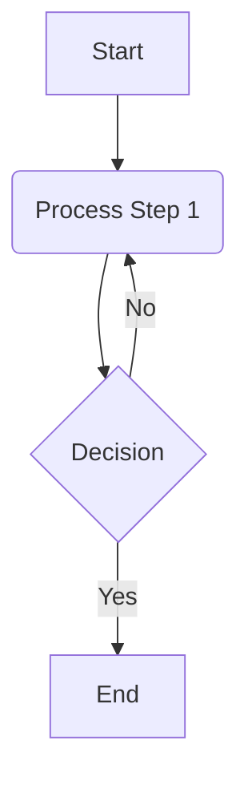

## Table of Contents
- [Standard: Image Alt Text for Accessibility (`SF-ACCESSIBILITY-IMAGE-ALT-TEXT`)](#standard-image-alt-text-for-accessibility-sf-accessibility-image-alt-text)
- [Standard: Callout and Admonition Syntax (`SF-CALLOUTS-SYNTAX`)](#standard-callout-and-admonition-syntax-sf-callouts-syntax)
- [Standard: Syntax for Conditional Attributes in IF Callouts (`SF-CONDITIONAL-SYNTAX-ATTRIBUTES`)](#standard-syntax-for-conditional-attributes-in-if-callouts-sf-conditional-syntax-attributes)
- [Standard: File and ID Naming Conventions (`SF-CONVENTIONS-NAMING`)](#standard-file-and-id-naming-conventions-sf-conventions-naming)
- [Standard: Citation Formatting Guidelines (`SF-FORMATTING-CITATIONS`)](#standard-citation-formatting-guidelines-sf-formatting-citations)
- [Standard: File Hygiene and Formatting (`SF-FORMATTING-FILE-HYGIENE`)](#standard-file-hygiene-and-formatting-sf-formatting-file-hygiene)
- [Standard: General Markdown Formatting Guidelines (`SF-FORMATTING-MARKDOWN-GENERAL`)](#standard-general-markdown-formatting-guidelines-sf-formatting-markdown-general)
- [Internal Linking Syntax Standard (`SF-LINKS-INTERNAL-SYNTAX`)](#internal-linking-syntax-standard-sf-links-internal-syntax)
- [Standard: Blockquote Syntax (`SF-SYNTAX-BLOCKQUOTES`)](#standard-blockquote-syntax-sf-syntax-blockquotes)
- [Standard: Markdown Syntax for Code (Inline and Blocks) (`SF-SYNTAX-CODE`)](#standard-markdown-syntax-for-code-inline-and-blocks-sf-syntax-code)
- [Standard: HTML Comment Syntax for TODO Items (`SF-SYNTAX-COMMENT-TODO`)](#standard-html-comment-syntax-for-todo-items-sf-syntax-comment-todo)
- [Standard: Definition List Syntax (`SF-SYNTAX-DEFINITION-LISTS`)](#standard-definition-list-syntax-sf-syntax-definition-lists)
- [Standard: Markdown Syntax for Mermaid Diagrams (`SF-SYNTAX-DIAGRAMS-MERMAID`)](#standard-markdown-syntax-for-mermaid-diagrams-sf-syntax-diagrams-mermaid)
- [Standard: Text Emphasis Syntax (`SF-SYNTAX-EMPHASIS`)](#standard-text-emphasis-syntax-sf-syntax-emphasis)
- [Standard: Character Escaping Syntax (`SF-SYNTAX-ESCAPING-CHARACTERS`)](#standard-character-escaping-syntax-sf-syntax-escaping-characters)
- [Standard: Footnote Syntax (`SF-SYNTAX-FOOTNOTES`)](#standard-footnote-syntax-sf-syntax-footnotes)
- [Standard: Heading Syntax (`SF-SYNTAX-HEADINGS`)](#standard-heading-syntax-sf-syntax-headings)
- [Standard: Image Syntax (`SF-SYNTAX-IMAGES`)](#standard-image-syntax-sf-syntax-images)
- [Standard: Key Reference Syntax (`SF-SYNTAX-KEYREF`)](#standard-key-reference-syntax-sf-syntax-keyref)
- [Standard: General Markdown Link Syntax (`SF-SYNTAX-LINKS-GENERAL`)](#standard-general-markdown-link-syntax-sf-syntax-links-general)
- [Standard: Markdown Syntax for Lists (`SF-SYNTAX-LISTS`)](#standard-markdown-syntax-for-lists-sf-syntax-lists)
- [Standard: Mathematical Equation Syntax (`SF-SYNTAX-MATH-EQUATIONS`)](#standard-mathematical-equation-syntax-sf-syntax-math-equations)
- [Standard: Table Syntax (`SF-SYNTAX-TABLES`)](#standard-table-syntax-sf-syntax-tables)
- [Standard: YAML Frontmatter Syntax (`SF-SYNTAX-YAML-FRONTMATTER`)](#standard-yaml-frontmatter-syntax-sf-syntax-yaml-frontmatter)
- [Standard: Table of Contents Syntax (`SF-TOC-SYNTAX`)](#standard-table-of-contents-syntax-sf-toc-syntax)
- [Standard: Transclusion Syntax for Content Embedding (`SF-TRANSCLUSION-SYNTAX`)](#standard-transclusion-syntax-for-content-embedding-sf-transclusion-syntax)


## Standard: Image Alt Text for Accessibility (SF-ACCESSIBILITY-IMAGE-ALT-TEXT)

# Standard: Image Accessibility and Alternative Text (SF-ACCESSIBILITY-IMAGE-ALT-TEXT)

## 1. Standard Statement

This standard mandates the use of descriptive alternative text (alt text) for all informational images embedded within knowledge base documents. Proper alt text is crucial for web accessibility, ensuring that content is understandable by users with visual impairments (e.g., those using screen readers) and when images fail to load.

## 2. Core Requirements for Alt Text

### Rule 2.1: Mandatory Alt Text for Informational Images (Derived from U-ACCESSIBILITY-001, Rule 1.1)
All images embedded in content that convey information relevant to understanding the content MUST include descriptive alternative text.
*   **Syntax:** Alt text is provided using the standard Markdown image syntax: ``
    *   The "Optional Title" part of the Markdown syntax (hover text) is not a replacement for alt text and should be used sparingly, if at all, as its accessibility support varies. Primary focus MUST be on the alt text.
*   **Reference:** The specific Markdown syntax for images should align with a general Markdown syntax standard, if available (e.g., [Standard: Image Syntax](#standard-image-syntax-sf-syntax-images)).
*   **Rationale:** Alt text provides a textual alternative to visual information, making image content accessible to screen readers and search engines, and providing context if images are disabled or fail to load.

### Rule 2.2: Concise and Sufficiently Descriptive Alt Text (Derived from U-ACCESSIBILITY-001, Rule 1.2)
Alternative text MUST be concise yet sufficiently descriptive to convey the meaning, purpose, or essential information of the image within the context of the surrounding content.
*   **Avoid Generic Terms:** Generic alt text such as "image," "picture," "graphic," or the image filename is unacceptable as it provides no useful information.
*   **Context is Key:** The description should reflect what is important about the image in its specific context. The same image might have different appropriate alt text depending on how it's used.
*   **Conciseness:** Aim for brevity while capturing the essence of the image. Screen readers will read the entire alt text.
*   **Rationale:** Meaningful alt text ensures that users relying on it gain equivalent understanding to those who can see the image.

### Rule 2.3: Handling Decorative Images (Derived from U-ACCESSIBILITY-001, Rule 1.2 guidance)
If an image is purely decorative and provides no informational value (e.g., a stylistic border or abstract background pattern), it SHOULD be implemented in a way that assistive technologies can ignore it.
*   **Guidance:** For purely decorative images, using an empty alt text (`alt=""`) is the preferred method in Markdown: ``.
*   **Caution:** This practice should be used sparingly and only when the image genuinely adds no information relevant to the content. If in doubt, provide descriptive alt text.
*   **Rationale:** Prevents screen readers from announcing non-informative image details, which can be distracting and add cognitive load for users.

## 3. Examples of Alt Text

### Good Alt Text:
*   `` (For a chart conveying specific data)
*   `` (Describing a logo)
*   `` (Describing a UI screenshot)
*   `` (Describing a flowchart's purpose and general structure)

### Bad Alt Text (to be avoided):
*   ``
*   ``
*   ``
*   `` (Empty alt text for an informational image)

## 4. Importance of Alt Text

*   **Accessibility for Visually Impaired Users:** Screen readers announce alt text, enabling users with visual impairments to understand the content and purpose of images.
*   **Context when Images Fail to Load:** If an image cannot be displayed (e.g., due to a broken link, slow connection, or user settings), the alt text is shown in its place, providing context.
*   **Search Engine Optimization (SEO):** Search engines use alt text to understand image content, which can improve search result relevance.
*   **Usability for All:** Clear alt text can benefit all users by providing additional context or information about an image, especially for complex visuals.

## 5. Scope of Application

This standard applies to all images (e.g., PNG, JPG, SVG, GIF) embedded within any Markdown document in the knowledge base.

## 6. Cross-References
- [[CS-POLICY-ACCESSIBILITY]] - The overarching policy on content accessibility.
- [Standard: Image Syntax](#standard-image-syntax-sf-syntax-images) - (If it exists) Standard defining the precise Markdown syntax for images. If not, refer to a general Markdown syntax guide.

---
*This standard (SF-ACCESSIBILITY-IMAGE-ALT-TEXT) is based on rules 1.1 and 1.2 previously defined in U-ACCESSIBILITY-001 from COL-LINKING-UNIVERSAL.md.*

---

## Standard: Callout and Admonition Syntax (SF-CALLOUTS-SYNTAX)

# Standard: Callout/Admonition Block Syntax (SF-CALLOUTS-SYNTAX)

## 1. Standard Statement

This standard defines a generalized Markdown syntax for creating callout or admonition blocks. These blocks are used to highlight specific types of information, such as notes, warnings, tips, or examples, setting them apart from the main narrative flow. The syntax builds upon the standard Markdown blockquote format.

While this standard defines the *syntax*, the policy governing *when and how to use* specific callout types is defined in [[CS-ADMONITIONS-POLICY]]. Adherence to [[SF-FORMATTING-FILE-HYGIENE]] regarding blank lines around block elements is also important.

## 2. Core Callout Syntax Rule

### Rule 2.1: Callout Block Structure
Callout/admonition blocks MUST be constructed as an extension of the standard Markdown blockquote syntax.
*   **Syntax:**
    ```markdown
    > [!TYPE] Optional Title
    > Callout content goes here.
    > It can span multiple lines.
    >
    > - And can include other Markdown elements like lists,
    > - provided they are correctly indented within the blockquote.
    ```
*   **Components:**
    1.  **Blockquote Marker (`>`):** Each line of the callout block MUST begin with the blockquote marker (`>`) followed by a space, as defined in [Standard: Blockquote Syntax](#standard-blockquote-syntax-sf-syntax-blockquotes).
    2.  **Type Specifier (`[!TYPE]`):** The first line of the callout block, immediately after the `> `, MUST contain a type specifier enclosed in square brackets and prefixed with an exclamation mark: `[!TYPE]`.
        *   **`TYPE`**: A keyword indicating the nature of the callout. This keyword MUST be uppercase. See "Recommended `TYPE` Keywords" below.
    3.  **Optional Title:** An optional title for the callout MAY follow the `[!TYPE]` specifier on the same line, separated by a space.
    4.  **Content:** The content of the callout begins on the line immediately following the type specifier line, or on the same line after the optional title if space permits and is readable. All content lines MUST also be prefixed with `> `.
*   **Blank Lines:** A blank line MUST precede and follow the entire callout block.

### Rule 2.2: Recommended `TYPE` Keywords
The following uppercase keywords ARE recommended for the `[!TYPE]` specifier to ensure consistency and semantic meaning. Their specific usage is governed by [[CS-ADMONITIONS-POLICY]].

*   **`NOTE`**: For general supplementary information or side comments.
*   **`IMPORTANT`**: For information that users must not overlook.
*   **`WARNING`**: For potential dangers, pitfalls, or critical cautionary advice.
*   **`TIP`**: For helpful hints, suggestions, or best practices.
*   **`QUESTION`**: For posing questions related to the content, or for FAQs. (Also `FAQ`)
*   **`ERROR`**: For highlighting error messages or incorrect outcomes.
*   **`SUCCESS`**: For indicating successful outcomes or positive confirmations. (Also `INFO`, `HELP`)
*   **`EXAMPLE`**: For designating examples. (Also `DEMO`)
*   **`QUOTE`**: For text quoted from external sources, distinct from a standard blockquote if specific styling is desired.
*   **`ABSTRACT`**: For summaries or abstracts at the beginning of a section. (Also `SUMMARY`, `TLDR`)
*   **`TODO`**: For highlighting to-do items or pending tasks within the document (primarily for editorial/authoring purposes, may be stripped in final output).
*   **`IF`**: For conditional text presentation logic (if supported by tooling, this indicates a block whose rendering may depend on certain conditions).

*   **Extensibility:** While these are recommended, specific projects or KBs MAY define additional custom types if necessary, but these MUST be documented in a local supplement to [[CS-ADMONITIONS-POLICY]]. Over-proliferation of types is discouraged.

## 3. Illustrative Examples

### Example 3.1: Note with Title
```markdown
> [!NOTE] Important Considerations
> This is a note with a title.
> It provides supplementary information that readers might find useful.
```

### Example 3.2: Warning without Title
```markdown
> [!WARNING]
> Proceed with caution. Incorrect configuration can lead to data loss.
```

### Example 3.3: Tip with Multi-line Content
```markdown
> [!TIP]
> To improve performance, consider the following:
> - Index your database tables.
> - Use a caching layer for frequently accessed data.
```

### Example 3.4: TODO item
```markdown
> [!TODO]
> - Finalize the examples for Section 4.
> - Get review from SME on accuracy of definitions.
```

## 4. Rendering and Tooling Dependency

The visual appearance (e.g., color, icon) of callout/admonition blocks is determined by the CSS and JavaScript of the Markdown rendering environment (e.g., static site generator theme, authoring tool previewer).
*   **Semantic Intent:** This standard defines the syntax to convey the *semantic intent* of the callout.
*   **Fallback:** If a specific `[!TYPE]` is not recognized by a renderer, it SHOULD gracefully fall back to rendering as a standard Markdown blockquote. The `[!TYPE] Optional Title` line will still be visible as the first line of the blockquote.

## 5. Importance of Standardized Callout Syntax

*   **Semantic Highlighting:** Allows authors to give semantic meaning to certain blocks of text, indicating their special importance or nature.
*   **Improved Readability:** When rendered with distinct styling, callouts help break up text and draw attention to key information.
*   **Authoring Consistency:** Provides a uniform syntax for authors to create these highlighted blocks.
*   **Potential for Automation:** Standardized syntax can be targeted by automation tools for indexing, summarization, or conditional processing.

## 6. Scope of Application

This standard applies to all Markdown documents within the knowledge base repository where callout or admonition blocks are used to highlight information.

## 7. Cross-References
- [[CS-ADMONITIONS-POLICY]] - Policy on when and how to use specific callout types.
- [Standard: Blockquote Syntax](#standard-blockquote-syntax-sf-syntax-blockquotes) - Defines the base blockquote syntax upon which callouts are built.
- [[SF-FORMATTING-FILE-HYGIENE]] - For rules on blank lines around block elements.

---
*This standard (SF-CALLOUTS-SYNTAX) generalizes the Obsidian callout syntax to provide a tool-agnostic method for declaring admonition blocks in Markdown, building upon standard blockquote syntax.*

---

## Standard: Syntax for Conditional Attributes in IF Callouts (SF-CONDITIONAL-SYNTAX-ATTRIBUTES)

# Standard: Syntax for Conditional Attributes in IF Callouts (SF-CONDITIONAL-SYNTAX-ATTRIBUTES)

## 1. Standard Statement

This standard defines the specific syntax for the `condition` string used within `[!IF condition]` callout blocks. The general syntax for callouts, including the `[!IF ...]` type, is defined in [[SF-CALLOUTS-SYNTAX]]. This document focuses solely on the structure and format of the `condition` part itself. Adherence to this syntax is crucial for consistent parsing and application of content profiling rules.

The actual list of permissible attributes and their corresponding values for use in conditions is defined and managed by the [[CS-CONTENT-PROFILING-POLICY]].

## 2. Core Syntax Rules for Condition Strings

### Rule 2.1: Condition Format (`attribute=value` pairs) (Derived from M-CONDITIONAL-TEXT-SYNTAX-001, Rule 1.2 - part)
The condition string within an `[!IF condition]` callout MUST consist of one or more `attribute=value` pairs.
*   **Syntax:** `attribute=value`
*   **Example:** `audience=expert`
*   **Rationale:** This simple key-value format allows for clear and parsable conditions.

### Rule 2.2: Multiple Conditions (AND logic) (Derived from M-CONDITIONAL-TEXT-SYNTAX-001, Rule 1.2 - part)
Multiple `attribute=value` pairs within a single `[!IF condition]` block can be combined using the keyword `AND`.
*   **Case Insensitivity:** The `AND` keyword is case-insensitive (i.e., `AND`, `and`, `And` are all acceptable, but `AND` is preferred for consistency).
*   **Syntax:** `attribute1=value1 AND attribute2=value2`
*   **Example:** `audience=expert AND platform=linux`
*   **Rationale:** Allows for more granular control over content visibility by combining multiple profiling criteria.

### Rule 2.3: `OR` Logic Not Supported in Single Block (Derived from M-CONDITIONAL-TEXT-SYNTAX-001, Rule 1.2 - part)
`OR` logic is NOT directly supported within a single `[!IF condition]` block.
*   **Guidance:** If `OR` logic is required (e.g., show content if `audience=expert OR audience=developer`), this MUST be achieved by using separate `[!IF ...]` blocks for each condition.
    ```markdown
    > [!IF audience=expert]
    > This content is for experts.

    > [!IF audience=developer]
    > This content is for developers.
    > (Note: If the content is identical, it would be duplicated here. This highlights a limitation.)
    ```
*   **Rationale:** Keeps the condition parsing logic simple. Complex boolean expressions are difficult to manage and parse reliably within this syntax.

### Rule 2.4: No Spaces in Attributes or Values; Value Formatting (Derived from M-CONDITIONAL-TEXT-SYNTAX-001, Rule 1.3)
Attribute names and their assigned values MUST NOT contain spaces.
*   **Attribute Names:** SHOULD be concise and descriptive (e.g., `audience`, `platform`, `feature-flag`).
*   **Values:**
    *   Values also MUST NOT contain spaces.
    *   If a value consists of multiple words, it SHOULD be formatted using **kebab-case** (e.g., `expert-user`, `early-adopter-preview`).
*   **Assignment:** The equals sign (`=`) MUST NOT be surrounded by spaces.
    *   **Correct:** `audience=expert-user`
    *   **Incorrect:** `audience = expert-user`, `audience=expert user`
*   **Rationale:** Ensures simple and unambiguous parsing of the condition string.

## 3. Valid Condition String Examples

*   `audience=expert`
*   `platform=windows`
*   `feature-flag=new-dashboard AND audience=internal-tester`
*   `version=v2.1 AND audience=all` (assuming `all` is a defined value for `audience`)
*   `os=macos AND display-mode=dark`

## 4. Management of Attributes and Values

The list of approved profiling attributes (e.g., `audience`, `platform`) and their permissible values (e.g., `expert`, `novice` for `audience`) is defined and managed by the [[CS-CONTENT-PROFILING-POLICY]]. This standard only defines the syntax for how these attribute-value pairs are expressed within a condition string.

## 5. Importance of Consistent Condition Syntax

*   **Reliable Parsing:** Ensures that tools designed to process conditional content can reliably parse and interpret the conditions.
*   **Authoring Clarity:** Provides a clear and unambiguous way for authors to specify conditions.
*   **Maintainability:** Standardized syntax makes it easier to review, update, and manage conditional blocks across the knowledge base.

## 6. Scope of Application

This standard applies to the condition string within all `[!IF condition]` callout blocks used in Markdown documents across the knowledge base.

## 7. Cross-References
- [[SF-CALLOUTS-SYNTAX]] - Defines the general syntax for callout blocks, including the `[!IF ...]` type.
- [[CS-CONTENT-PROFILING-POLICY]] - Defines the approved list of profiling attributes and their values, and the overall policy for content profiling.

---
*This standard (SF-CONDITIONAL-SYNTAX-ATTRIBUTES) is based on rules 1.2 and 1.3 previously defined in M-CONDITIONAL-TEXT-SYNTAX-001.*

---

## Standard: File and ID Naming Conventions (SF-CONVENTIONS-NAMING)

# Standard: File and Folder Naming Conventions (SF-CONVENTIONS-NAMING)

This standard defines the mandatory naming conventions for all files and folders within the knowledge base repository. Adherence to these conventions is critical for maintaining an organized structure, facilitating automated processing, ensuring link integrity, and providing a consistent experience for authors and users.

## 1. General Principles

### Rule 1.1: Descriptive and Concise Names (Derived from U-FORMAT-NAMING-001, Rule 1.8)
All file and folder names MUST be descriptive and concise, clearly indicating the primary content or purpose of the item.

## 2. Folder Naming Conventions

### Rule 2.1: Case and Separator (Derived from U-FORMAT-NAMING-001, Rule 1.1)
All folder names MUST be in **all lowercase kebab-case**.
*   **Example:** `part-i-foundations/`, `kb-specific-standards/`, `src/`, `registry/`
*   **Notes:** Words are separated by single hyphens. No spaces or other special characters (except hyphens) are permitted.

## 3. File Naming Conventions

### Rule 3.1: Atomic Standard Document Files (Primary Naming Standard)
This rule defines the primary naming convention for atomic standard definition, policy, and guide documents, particularly those located within the `/master-knowledge-base/standards/src/` directory.

*   **Syntax:** `{DOMAIN_CODE}-{SUB_DOMAIN_CODE}-{PRIMARY_TOPIC_KEYWORD}-{OPTIONAL_SECONDARY_TOPICS*}.md`
    *   **`DOMAIN_CODE`**: A 2-letter uppercase code representing the primary domain (e.g., `AS`, `CS`, `SF`).
    *   **`SUB_DOMAIN_CODE`**: A 2-6 letter uppercase code for the sub-domain (e.g., `STRUCTURE`, `POLICY`, `CONVENTIONS`).
    *   **`PRIMARY_TOPIC_KEYWORD`**: An uppercase, concise keyword (or hyphenated multi-word keyword) indicating the main subject (e.g., `KB-ROOT`, `NAMING`, `LAYERED-INFORMATION`).
    *   **`OPTIONAL_SECONDARY_TOPICS*`**: Optional, hyphenated uppercase keywords for further specification.
*   **Filename and `standard_id` Equivalence:** The filename (excluding the `.md` extension) for these atomic standard documents MUST be **identical** to their `standard_id` frontmatter value.
*   **Example:**
    *   `standard_id: SF-CONVENTIONS-NAMING` results in filename: `SF-CONVENTIONS-NAMING.md`
    *   `standard_id: AS-STRUCTURE-KB-ROOT` results in filename: `AS-STRUCTURE-KB-ROOT.md`
*   **Notes:** This convention supersedes and refines the previous Rule 1.2 from U-FORMAT-NAMING-001 for these specific types of documents. The structure of the `standard_id` itself (and thus the filename) is further detailed in [[MT-SCHEMA-FRONTMATTER]].

### Rule 3.2: General Content Files (Non-Standard Definitions) (Derived from U-FORMAT-NAMING-001, Rule 1.3)
For general content files (e.g., chapters within a KB part, supplementary documents not defining a formal standard), filenames (excluding the `.md` extension) MUST be descriptive and in **all lowercase kebab-case**.
*   **Numerical Prefixes:** Numerical prefixes (e.g., `00-`, `01-`) MAY be used for sequencing if desired.
*   **Example:** `01-introduction-to-research.md`, `llm-capabilities-overview.md`, `glossary-of-terms.md`
*   **Notes:** This applies to typical content articles within various knowledge bases.

### Rule 3.3: Collection/Grouping Documents (Derived from U-FORMAT-NAMING-001, Rule 1.4)
Files that group related individual standard definitions or discuss a category (often found within the standards knowledge base itself) MUST use the following pattern: `COL-{SUBJECT}-{DESCRIPTOR}.md`.
*   **`COL-` prefix:** Literal and uppercase.
*   **`{SUBJECT}` and `{DESCRIPTOR}`:** Uppercase, concise, hyphenated keywords.
*   **Example:** `COL-ARCH-UNIVERSAL.md`, `COL-SYNTAX-MARKDOWN.md`
*   **Notes:** This structured naming helps identify documents that serve as collections or high-level groupings.

### Rule 3.4: Guide Documents (Derived from U-FORMAT-NAMING-001, Rule 1.5)
Files that provide guidance on using items, processes, or standards MUST use the following pattern: `GUIDE-{TASK_OR_SUBJECT}.md`.
*   **`GUIDE-` prefix:** Literal and uppercase.
*   **`{TASK_OR_SUBJECT}`:** Uppercase, concise, hyphenated keywords.
*   **Example:** `GUIDE-STANDARDS-SUBMISSION-PROCESS.md`, `GUIDE-USING-THE-INDEXER.md`

### Rule 3.5: Script Files and Their Documentation (Derived from U-FORMAT-NAMING-001, Rule 1.7)
*   **Script Files:** Script basenames (e.g., for `.py`, `.sh` files) SHOULD use **snake_case** and reside in appropriate subdirectories within `/master-knowledge-base/tools/` (e.g., `linter/kb_linter.py`).
*   **User Guides for Scripts:** User-facing guides for scripts SHOULD follow the `GUIDE-` pattern (see Rule 3.4) and may reside in a `docs/` subdirectory near the script (e.g., `/master-knowledge-base/tools/linter/docs/GUIDE-KB-LINTER-USAGE.md`).
*   **Technical Documentation for Scripts:** Detailed technical or developer documentation for scripts SHOULD also reside in a `docs/` subdirectory and may use a pattern like `DOC-{SCRIPT_NAME}-{ASPECT}.md` (e.g., `/master-knowledge-base/tools/linter/docs/DOC-KB-LINTER-ARCHITECTURE.md`).

### Rule 3.6: Reserved Names for Structural Files (Derived from U-FORMAT-NAMING-001, Rule 1.6)
Certain filenames are reserved for specific structural purposes and MUST be used exactly as specified (all lowercase kebab-case where applicable).
*   **Examples:** `root.md`, `_overview.md`, `_kb_definition.md`, `_key_definitions.md`, `kb-directory.md`, `tag-glossary-definition.md`, `tpl-canonical-frontmatter.md`.
*   **Notes:** Adherence to these reserved names is crucial for architectural consistency and proper functioning of automated tools. Refer to specific standards defining these files for their exact locations and purposes.

## 4. Cross-References
- [[MT-SCHEMA-FRONTMATTER]] - Defines the structure of `standard_id`, which is integral to standard document naming.
- [Internal Linking Syntax Standard](#internal-linking-syntax-standard-sf-links-internal-syntax) - Relevant for how names might be used in links.

---
*This standard (SF-CONVENTIONS-NAMING) is based on rules 1.1 through 1.8 previously defined in U-FORMAT-NAMING-001 from COL-ARCH-UNIVERSAL.md, with Rule 1.2 significantly refined by the new atomic standard document naming convention (Rule 3.1 here).*
```

---

## Standard: Citation Formatting Guidelines (SF-FORMATTING-CITATIONS)

# Standard: Citing External Sources (APA 7th Edition) (SF-FORMATTING-CITATIONS)

## 1. Standard Statement

This standard defines the mandatory requirements for citing external sources within all knowledge base documents. Proper attribution of external information is essential for maintaining academic integrity, ensuring content verifiability, respecting intellectual property, and providing users with pathways to source material.

## 2. Requirement for Attribution (Derived from U-CITE-001, Rule 1.1)

Any claims, direct quotations, specific data points, or paraphrased information derived from external published or citable sources MUST be clearly attributed to the original source.
*   **Rationale:** Upholds academic and professional integrity, allows readers to verify information, and gives credit to original authors.

## 3. Adopted Citation Style (APA 7th Edition) (Derived from U-CITE-001, Rule 1.2)

The **7th Edition of the Publication Manual of the American Psychological Association (APA)** IS THE ADOPTED AND MANDATORY CITATION STYLE for all knowledge base documents.
*   **Consistency:** This style MUST be used consistently for both in-text citations and the "References" list across all Knowledge Bases.
*   **Rationale:** Using a single, well-established citation style ensures uniformity, predictability, and clarity in how sources are referenced, making it easier for both authors and readers.

## 4. In-Text Citations (Derived from U-CITE-001, Rule 1.3)

In-text citations MUST be used within the body of the text to indicate the source of specific information at the point where it is presented.
*   **Format:** Follow APA 7th Edition guidelines for author-date citations.
    *   **Example (Paraphrase):** ...as research has shown that this method is effective (Smith, 2023).
    *   **Example (Direct Quote):** Smith (2023) stated, "the results were conclusive" (p. 45).
*   **Rationale:** Provides immediate attribution and allows readers to easily locate the full reference in the "References" section.

## 5. "References" Section (Derived from U-CITE-001, Rule 1.4)

A dedicated section titled "References," formatted as an H2 heading, MUST be included at the end of any document that contains citations.
*   **Content:** This section MUST list all sources cited in-text.
*   **Format:** All entries in the "References" list MUST fully conform to APA 7th Edition formatting guidelines.
*   **Order:** Entries are typically listed alphabetically by the first author's last name.
*   **Example:**
    ```markdown
    ## References
    Smith, J. A. (2023). *The Art of Referencing*. Publisher Name.
    Jones, P., & Adams, B. K. (2022). Citing sources in the digital age. *Journal of Scholarly Communication*, *15*(2), 112-130. https://doi.org/xxxx/xxxx
    ```
*   **Rationale:** Provides readers with the complete bibliographic information needed to locate and consult the original sources.

## 6. Citing Online Sources (Derived from U-CITE-001, Rule 1.5)

When citing online sources, the following specific guidelines apply within the APA 7th Edition framework:
*   **Hyperlinks:** If the source is publicly available online, a direct and stable hyperlink (URL or DOI) MUST be included in the "References" list entry.
    *   **Syntax for links:** Standard Markdown link syntax can be used within the reference entry if desired for active links, e.g., `[https://doi.org/xxxx/xxxx](https://doi.org/xxxx/xxxx)` or simply the URL/DOI text which might be auto-linked by renderers. Adherence to [Internal Linking Syntax Standard](#internal-linking-syntax-standard-sf-links-internal-syntax) is for internal links, but general good practice for link clarity applies.
*   **Retrieval Dates:** According to APA 7th Edition, retrieval dates are generally NOT required for most online sources if the content is stable (e.g., journal articles with DOIs, final versions of web pages). However, a retrieval date MAY be included if the source material is expected to change over time and there is no archive URL (e.g., a frequently updated webpage that is not a formal publication).
    *   **Example (with retrieval date, if necessary):** Author, A. A. (Year, Month Day). *Title of work*. Site Name. Retrieved Month Day, Year, from https://xxxx
*   **Rationale:** Facilitates direct access to online sources and addresses the dynamic nature of web content.

## 7. Importance of Proper Citation

*   **Academic and Professional Integrity:** Acknowledges the work of others and avoids plagiarism.
*   **Verifiability:** Allows readers to consult original sources to verify information and explore topics in more depth.
*   **Building Trust:** Demonstrates rigor and credibility, enhancing user trust in the KB content.
*   **Legal Compliance:** Helps respect copyright and intellectual property rights.
*   **Supporting Further Research:** Provides a foundation for others to build upon existing knowledge.

## 8. Scope of Application

This standard applies to all documents within any Knowledge Base that incorporate information from external sources, whether through direct quotation, paraphrase, data presentation, or summarization.

## 9. Cross-References
- [Internal Linking Syntax Standard](#internal-linking-syntax-standard-sf-links-internal-syntax) - For general Markdown link syntax (though external links are primarily governed by APA 7th style for the URL/DOI presentation itself).
- Official APA 7th Edition Style and Grammar Guidelines (External Resource).

---
*This standard (SF-FORMATTING-CITATIONS) is based on rules 1.1 through 1.5 previously defined in U-CITE-001 from COL-LINKING-UNIVERSAL.md.*

---

## Standard: File Hygiene and Formatting (SF-FORMATTING-FILE-HYGIENE)

# Standard: File Hygiene and Formatting (SF-FORMATTING-FILE-HYGIENE)

## 1. Standard Statement

This standard defines mandatory file hygiene and formatting rules for all text-based files within the knowledge base repository. Adherence to these rules is crucial for ensuring consistency in version control systems, promoting cross-platform compatibility, maintaining file integrity, enhancing readability, and supporting reliable automated processing.

## 2. Core File Hygiene Rules

### Rule 2.1: UTF-8 Encoding (Consistent with [[MT-SCHEMA-FRONTMATTER]])
All text-based files (e.g., `.md`, `.yaml`, `.json`, `.py`) MUST use **UTF-8 (Unicode Transformation Format—8-bit) encoding**.
*   **Byte Order Mark (BOM):** A Byte Order Mark (BOM) MUST NOT be used at the beginning of files.
*   **Rationale:** UTF-8 is a universal character encoding standard that supports a wide range of characters and symbols, ensuring broad compatibility. Avoiding BOM prevents potential issues with some tools and parsers, particularly in Unix-like environments. This rule aligns with the frontmatter encoding specified in [[MT-SCHEMA-FRONTMATTER]].

### Rule 2.2: Line Feed (LF) Line Endings (Derived from U-FILEHYGIENE-001, Rule 1.1)
All text-based files MUST use **Line Feed (LF) line endings (Unix-style)**.
*   **Prohibition:** Carriage Return Line Feed (CRLF) line endings (Windows-style) or Carriage Return (CR) line endings (classic Mac-style) are NOT permitted.
*   **Rationale:** Consistent line endings prevent common issues in version control systems (like Git incorrectly reporting entire files as changed), ensure cross-platform compatibility, and simplify text processing by scripts and tools. Most modern text editors can be configured to enforce LF line endings.

### Rule 2.3: No Trailing Whitespace (Derived from U-FILEHYGIENE-001, Rule 1.2)
Trailing whitespace (spaces or tabs) at the end of any line of text MUST be removed.
*   **Rationale:** Trailing whitespace can cause inconsistencies in diffs, create visual clutter, and sometimes interfere with the behavior of scripts or parsers. Many text editors can be configured to automatically remove trailing whitespace upon saving.

### Rule 2.4: Single Newline at End-Of-File (EOF) (Derived from U-FILEHYGIENE-001, Rule 1.3)
All text-based files MUST end with a single newline character.
*   **Guidance:** This means the last line of the file should have a line ending character, and there should not be multiple blank lines at the very end of the file.
*   **Rationale:** This is a POSIX standard and is expected by many command-line tools and text processing utilities. It ensures that files can be concatenated or processed correctly and prevents some tools from indicating a "missing newline" warning or diff.

## 3. Importance of File Hygiene

Maintaining consistent file hygiene offers several benefits:

*   **Version Control System (VCS) Integrity:** Prevents spurious changes in diffs caused by line ending or whitespace differences, making commit histories cleaner and reviews more focused.
*   **Cross-Platform Compatibility:** Ensures files can be opened and edited consistently across different operating systems (Windows, macOS, Linux).
*   **Improved Readability:** Eliminates distracting visual inconsistencies caused by mixed line endings or unnecessary whitespace.
*   **Reliable Automation:** Scripts and automated tools for parsing, linting, or building content are less likely to fail or produce unexpected results due to inconsistent formatting.
*   **Professionalism:** Adherence to these conventions reflects a professional approach to content and code management.

## 4. Scope of Application

This standard applies to all text-based files committed to the knowledge base repository, with a particular emphasis on:
*   Markdown files (`.md`)
*   YAML files (`.yaml`)
*   JSON files (`.json`)
*   Python scripts (`.py`)
*   Shell scripts (`.sh`, `.bash`)
*   Other configuration or text files (e.g., `.gitignore`, `.editorconfig`)

Binary files (e.g., images, PDFs) are exempt from these specific rules (though their naming conventions are covered elsewhere).

## 5. Tooling and Enforcement

It is highly recommended to configure text editors and Integrated Development Environments (IDEs) to automatically enforce these file hygiene rules (e.g., by setting default line endings to LF, removing trailing whitespace on save, ensuring a final newline). Project-level configuration files like `.editorconfig` can also be used to help standardize these settings across different editors. Automated linters or pre-commit hooks may also be employed to check for and enforce compliance.

## 6. Cross-References
- [[MT-SCHEMA-FRONTMATTER]] - For specific encoding rules related to YAML frontmatter.

---
*This standard (SF-FORMATTING-FILE-HYGIENE) is based on rules 1.1 through 1.3 previously defined in U-FILEHYGIENE-001 from COL-GOVERNANCE-UNIVERSAL.md, and incorporates a general UTF-8 encoding rule.*
```

---

## Standard: General Markdown Formatting Guidelines (SF-FORMATTING-MARKDOWN-GENERAL)

# Standard: Markdown General Formatting Conventions (SF-FORMATTING-MARKDOWN-GENERAL)

## 1. Standard Statement

This standard defines general Markdown formatting conventions for paragraphs, line breaks, horizontal rules, and the use of blank lines. Adherence to these conventions is important for ensuring the readability, consistency, and correct parsing of Markdown documents across the knowledge base. These rules complement the file-level hygiene rules defined in [[SF-FORMATTING-FILE-HYGIENE]].

## 2. Core General Formatting Rules

### Rule 2.1: Paragraphs
Paragraphs are sequences of text separated by one or more blank lines.
*   **Requirement:** A single blank line (i.e., a line containing no characters or only whitespace) MUST be used to separate distinct paragraphs.
*   **Example:**
    ```markdown
    This is the first paragraph. It can span multiple lines of text
    but will be rendered as a single block.

    This is the second paragraph, separated from the first by a single blank line.
    ```
*   **Rationale:** Clearly delineates paragraphs for both raw text readability and correct rendering in HTML or other formats.

### Rule 2.2: Line Breaks (Soft vs. Hard)
Markdown treats most newlines within a paragraph as "soft" line breaks, which are typically rendered as a single space, joining lines together into a continuous paragraph.
*   **Soft Line Breaks (Standard Behavior):**
    ```markdown
    This line is part of the first paragraph.
    This line will join the previous one, separated by a space.
    ```
    *Renders as:* This line is part of the first paragraph. This line will join the previous one, separated by a space.
*   **Hard Line Breaks (Explicit Breaks within a Paragraph):**
    If an explicit hard line break (forcing a line to end and the next text to start on a new line *within the same paragraph block*) is absolutely necessary, the following methods MAY be used, but their use should be minimized in favor of starting new paragraphs for distinct ideas.
    1.  **Two or More Spaces at End of Line (Recommended for Markdown Purity):** End a line with two or more spaces before the newline character.
        ```markdown
        Line one with a hard break.
        Line two, still in the same paragraph.
        ```
        *Renders as:*
        Line one with a hard break.
        Line two, still in the same paragraph.
    2.  **HTML `<br>` Tag (Use Sparingly):** The HTML break tag `<br>` can be used.
        ```markdown
        Line one with an HTML break.<br>
        Line two, same paragraph.
        ```
        *Renders as:*
        Line one with an HTML break.
        Line two, same paragraph.
*   **Guidance:** Prefer distinct paragraphs for separate thoughts. Use hard line breaks only when semantically appropriate (e.g., lines of an address, poetry) and not for creating artificial spacing between paragraphs (use blank lines for that). The two-space method is generally preferred over `<br>` for maintaining Markdown purity.
*   **Rationale:** Understanding line break behavior is crucial for predictable rendering. Overuse of hard line breaks can make raw Markdown harder to read and edit.

### Rule 2.3: Horizontal Rules
Horizontal rules are used to create a thematic break between sections of content.
*   **Syntax:** MUST be created using three or more hyphens (`---`), asterisks (`***`), or underscores (`___`) on a line by themselves.
*   **Consistency:** For consistency across the knowledge base, **three or more hyphens (`---`) ARE THE PREFERRED STYLE.**
*   **Spacing:**
    *   The characters forming the rule MAY be separated by spaces.
    *   A blank line MUST precede and follow a horizontal rule, as per [[SF-FORMATTING-FILE-HYGIENE]].
*   **Example (Preferred):**
    ```markdown
    Some content above.

    ---

    Some content below.
    ```
*   **Example (Alternative, also valid but less preferred):**
    ```markdown
    Some content above.

    * * *

    Some content below.
    ```
*   **Rationale:** Provides a clear visual separation between content sections. Standardizing on one style (`---`) improves consistency.

### Rule 2.4: Use of Multiple Blank Lines
The use of more than one consecutive blank line to separate content elements (e.g., between paragraphs, before/after headings, lists, code blocks) SHOULD generally be avoided.
*   **Standard Separation:** A single blank line is typically sufficient to separate block-level elements in Markdown.
*   **Exception:** Using more than one blank line (e.g., two blank lines) before or after complex elements like code blocks or tables MAY be acceptable if it significantly improves the readability of the *raw Markdown source*, but this should not be a common practice. Excessive blank lines do not usually affect the rendered HTML output but can make the raw source less compact.
*   **Rationale:** Maintains consistency in raw Markdown formatting and avoids excessive vertical spacing that can make documents harder to scroll through and read in their source form.

## 3. Importance of General Formatting Conventions

*   **Readability:** Consistent formatting makes raw Markdown documents easier to read, edit, and review.
*   **Predictable Rendering:** Ensures that Markdown is parsed and rendered as intended across different platforms and tools.
*   **Authoring Efficiency:** Clear rules reduce ambiguity for authors.
*   **Maintainability:** Well-formatted documents are easier to maintain over time.

## 4. Scope of Application

This standard applies to all Markdown documents within the knowledge base repository.

## 5. Cross-References
- [[SF-FORMATTING-FILE-HYGIENE]] - For file-level hygiene rules including blank lines around block elements and EOF characters.

---
*This standard (SF-FORMATTING-MARKDOWN-GENERAL) is based on common Markdown conventions for paragraphs, line breaks, horizontal rules, and blank line usage.*

---

## Internal Linking Syntax Standard (SF-LINKS-INTERNAL-SYNTAX)

# SF-LINKS-INTERNAL-SYNTAX: Internal Linking Syntax Standard

## 1. Overview

This standard defines the syntax and best practices for creating internal links within knowledge base documents. Adherence to this standard ensures consistency, maintainability, and optimal functionality of the linking system across the knowledge base.

## 2. Canonical Link Style: `[[STANDARD_ID]]`

The canonical and mandatory method for internal linking to other standard documents is by using their unique `standard_id`.

*   **Syntax:** `[[STANDARD_ID]]`
*   **Example:** `[[AS-STRUCTURE-KB-ROOT]]`

This style directly references the unique identifier of the target standard, making links resilient to file renaming or moves (assuming the `standard_id` remains stable and an index maps IDs to paths).

## 3. Linking to Specific Headings

To link to a specific heading or section within a target document, use the following syntax:

*   **Syntax:** `[[STANDARD_ID#Heading Text]]`
*   **Example:** `[[AS-STRUCTURE-KB-ROOT#Section 2.1]]`

The heading text MUST exactly match the target heading in the linked document, including capitalization and punctuation.

## 4. Link Text Aliases (Display Text)

If the link text needs to be different from the `STANDARD_ID` or `STANDARD_ID#Heading Text`, an alias can be used:

*   **Syntax:** `[[STANDARD_ID|Display Text]]`
*   **Syntax (with heading):** `[[STANDARD_ID#Heading Text|Display Text]]`
*   **Example:** `[[AS-STRUCTURE-KB-ROOT|Knowledge Base Root Structure]]`
*   **Example (with heading):** `[[AS-STRUCTURE-KB-ROOT#Section 2.1|Details on KB Root]]`

## 5. Transitional Policy for Path-Based Links

During the transition to a fully `standard_id`-based linking system:

*   **Current State:** Direct path-based links (e.g., `[link text](./path/to/file.md)`) or relative wikilinks that resolve via file paths may exist in older documents.
*   **Linter Behavior (Phase 0):** Automated linters and validation tools will issue a **warning** for any internal links that use direct file paths instead of the `[[STANDARD_ID]]` format.
*   **Future State (Post-Transition):** Path-based internal links will be flagged as **errors** and must be remediated. The goal is to exclusively use `[[STANDARD_ID]]`-based links for referencing other standard documents.

## 6. Non-Standard Document Linking

For linking to documents that are not part of the formal standards collection (e.g., external documentation, supplementary resources not having a `standard_id`), standard Markdown relative or absolute links should be used:

*   **Syntax (Relative):** `[Link Text](./path/to/document.md)`
*   **Syntax (Absolute URL):** `[Link Text](https://example.com/resource)`

## 7. Generalization and Tool Independence

The linking mechanisms described herein are intended to be tool-agnostic. While some authoring tools may offer enhanced features for creating or managing these link types (e.g., Obsidian, Foam), the underlying syntax and principles must remain consistent with this standard to ensure interoperability and long-term maintainability. Tool-specific features that deviate from this standard should not be used for canonical linking between standard documents.

---

## Standard: Blockquote Syntax (SF-SYNTAX-BLOCKQUOTES)

# Standard: Markdown Syntax for Blockquotes (SF-SYNTAX-BLOCKQUOTES)

## 1. Standard Statement

This standard defines the mandatory Markdown syntax for creating blockquotes within all knowledge base documents. Consistent use of blockquote syntax is important for visually distinguishing quoted text, ensuring correct rendering, and maintaining readability. Adherence to [[SF-FORMATTING-FILE-HYGIENE]] regarding blank lines around block elements is also critical.

## 2. Core Blockquote Syntax Rules

### Rule 2.1: Blockquote Marker (Derived from M-SYNTAX-BLOCKQUOTE-001, Rule 1.1)
Blockquotes MUST be created by prefixing each line of the quoted text with a greater-than symbol (`>`) followed by a single space.
*   **Syntax:** `> Quoted text`
*   **Example:**
    ```markdown
    > This is a single-line blockquote.
    ```
*   **Multi-line Blockquotes:** For blockquotes spanning multiple lines, each line of the quoted text MUST be prefixed with `> `. Blank lines within a multi-line blockquote (to separate paragraphs within the quote) MUST also be prefixed with `> `.
    ```markdown
    > This is the first paragraph of a blockquote.
    >
    > This is the second paragraph within the same blockquote.
    ```
*   **Rationale:** The `> ` prefix is the standard Markdown indicator for blockquotes, universally recognized by parsers.

### Rule 2.2: Nested Blockquotes (Derived from M-SYNTAX-BLOCKQUOTE-001, Rule 1.2)
Nested blockquotes (a blockquote within another blockquote) MUST be created by using additional greater-than symbols (`>`) for each level of nesting.
*   **Syntax:** `>> Nested quoted text`
*   **Example:**
    ```markdown
    > This is the first level of quoting.
    >
    > > This is a nested blockquote (second level).
    > > It can also span multiple lines.
    >
    > Back to the first level of quoting.
    >
    > > > This is a third level of nesting!
    ```
*   **Rationale:** Provides a clear and standard way to represent multiple levels of quotation or attribution.

### Rule 2.3: Blank Lines Around Blockquotes (Derived from M-SYNTAX-BLOCKQUOTE-001, Rule 1.3)
A single blank line MUST precede and a single blank line MUST follow every blockquote element.
*   **Example:**
    ```markdown
    This is a paragraph before the blockquote.

    > This is the blockquote content.
    > It might have multiple lines.

    This is a paragraph after the blockquote.
    ```
*   **Rationale:** Ensures correct parsing and rendering of the blockquote as a distinct block element, separating it visually and structurally from surrounding content. This aligns with general file hygiene rules for block elements (see [[SF-FORMATTING-FILE-HYGIENE]]).

## 3. Importance of Correct Blockquote Syntax

*   **Readability:** Clearly distinguishes quoted material from the author's own text, improving comprehension.
*   **Visual Distinction:** Most renderers style blockquotes uniquely (e.g., with an indent and/or a vertical line), aiding visual organization.
*   **Semantic Meaning:** Indicates that the enclosed text is a quotation from another source.
*   **Authoring Consistency:** Ensures all authors use the same method for quoting text.

## 4. Scope of Application

This standard applies to all Markdown documents within the knowledge base repository where text is quoted from external sources or other documents.

## 5. Cross-References
- [[SF-FORMATTING-FILE-HYGIENE]] - For rules on blank lines and file formatting that apply to block elements.

---
*This standard (SF-SYNTAX-BLOCKQUOTES) is based on rules 1.1 through 1.3 previously defined in M-SYNTAX-BLOCKQUOTE-001 from COL-SYNTAX-MARKDOWN.md.*

---

## Standard: Markdown Syntax for Code (Inline and Blocks) (SF-SYNTAX-CODE)

# Standard: Markdown Syntax for Code (Inline and Blocks) (SF-SYNTAX-CODE)

## 1. Standard Statement

This standard defines the mandatory Markdown syntax for representing inline code snippets and extended code blocks within all knowledge base documents. Consistent and correct code syntax is essential for readability, accuracy, and proper rendering, including syntax highlighting where applicable. Adherence to [[SF-FORMATTING-FILE-HYGIENE]] regarding blank lines around block elements is also important for code blocks.

## 2. Core Code Syntax Rules

### Rule 2.1: Inline Code
Inline code snippets MUST be created by enclosing the code within single backticks (`` ` ``).
*   **Syntax:** `` `code snippet here` ``
*   **Usage:** Used for short code references, variable names, function names, commands, or file paths embedded within a paragraph or sentence.
*   **Example:**
    ```markdown
    To install the package, run `npm install my-package`. The function `calculateTotal()` returns an integer.
    ```
*   **Rationale:** Clearly distinguishes code elements from surrounding prose, improving readability and preventing misinterpretation of special characters.

### Rule 2.2: Fenced Code Blocks (Preferred Method for Blocks)
Fenced code blocks MUST be used for multi-line code examples or longer code snippets. They are created by enclosing the code block within triple backticks (```` ``` ````) on the lines immediately before and after the code.
*   **Syntax (Basic):**
    ````markdown
    ```
    multiple lines
    of code
    go here
    ```
    ````
*   **Language Identifier (Highly Recommended):** A language identifier SHOULD be specified immediately after the opening triple backticks to enable syntax highlighting in rendered views.
    *   **Syntax (with language identifier):**
        ````markdown
        ```python
        def hello_world():
            print("Hello, world!")
        ```
        ````
    *   **Common Language Identifiers:** `python`, `javascript`, `java`, `csharp`, `bash`, `yaml`, `json`, `html`, `css`, `sql`, `markdown`, `text` (for plain text).
*   **Blank Lines:** A blank line SHOULD precede and follow the fenced code block for readability and to ensure correct parsing, as per [[SF-FORMATTING-FILE-HYGIENE]].
*   **Rationale:** Fenced code blocks are the most common and robust method for displaying code, offering clear delimitation and support for language-specific syntax highlighting, which significantly improves readability and comprehension.

### Rule 2.3: Indented Code Blocks (Alternative, Less Preferred)
Indented code blocks, created by indenting each line of the code block by four (4) spaces or one (1) tab, are a valid Markdown syntax but are generally less preferred than fenced code blocks.
*   **Syntax:**
    ```markdown
        // This is an indented code block
        function example() {
            return true;
        }
    ```
    (Note: The above example has 4 leading spaces on each code line.)
*   **Preference:** Fenced code blocks (Rule 2.2) with language identifiers ARE STRONGLY PREFERRED over indented code blocks.
*   **Rationale for Preference:**
    *   Fenced code blocks explicitly define the start and end of the block, reducing ambiguity.
    *   Fenced code blocks allow for easy specification of the language for syntax highlighting, which is not possible with indented blocks.
    *   Indented blocks can sometimes be accidentally created or interact confusingly with list indentation.
*   **Usage Note:** If used, indented code blocks MUST also be separated from surrounding text by a blank line.

## 3. Importance of Correct Code Syntax

*   **Readability:** Clearly distinguishes code from narrative text. Syntax highlighting (with fenced code blocks) significantly improves the readability of code.
*   **Accuracy:** Ensures that code is displayed correctly, preserving indentation and special characters.
*   **Authoring Consistency:** Provides a uniform way for authors to represent code.
*   **Maintainability:** Easy to identify and update code sections.
*   **Accessibility:** While not a replacement for accessible code practices, clear visual separation helps all users.

## 4. Scope of Application

This standard applies to all Markdown documents within the knowledge base repository where inline code or code blocks are used.

## 5. Cross-References
- [[SF-FORMATTING-FILE-HYGIENE]] - For rules on blank lines around block elements.

---
*This standard (SF-SYNTAX-CODE) is based on common Markdown conventions for inline code and code blocks, emphasizing the preference for fenced code blocks with language identifiers.*

---

## Standard: HTML Comment Syntax for TODO Items (SF-SYNTAX-COMMENT-TODO)

# Standard: HTML Comment Syntax for TODO Items (SF-SYNTAX-COMMENT-TODO)

This document defines the standard HTML comment-based syntax for marking "TODO" items or pending actions directly within content documents. This method ensures TODOs are visible in the raw source and are machine-parseable but do not render in standard Markdown views.

## 2. Core Syntax Rules

### Rule 2.1: HTML Comment Delimiters
TODO items using this syntax MUST be enclosed within standard HTML comment delimiters: `<!--` and `-->`.
*   **Rationale:** Ensures the content does not render in standard Markdown or HTML views.

### Rule 2.2: TODO Keyword
The comment MUST begin with the uppercase keyword `TODO:` immediately following the opening comment delimiter `<!--`.
*   **Syntax:** `<!-- TODO: ... -->`
*   **Rationale:** Provides a clear, machine-parseable identifier for TODO items.

### Rule 2.3: Date of Creation (Optional but Recommended)
If a date is included, it SHOULD represent the date the TODO was created or last significantly updated, formatted as `YYYY-MM-DD`. This date SHOULD appear immediately after `TODO:`.
*   **Syntax:** `<!-- TODO: YYYY-MM-DD ... -->`
*   **Example:** `<!-- TODO: 2024-05-30 ... -->`
*   **Rationale:** Helps in tracking the age and relevance of TODO items.

### Rule 2.4: Assignee (Optional)
An assignee for the TODO item MAY be specified using an `@username` format. If included, it SHOULD follow the date (if present) or the `TODO:` keyword.
*   **Syntax (with date):** `<!-- TODO: YYYY-MM-DD @username ... -->`
*   **Syntax (without date):** `<!-- TODO: @username ... -->`
*   **Example:** `<!-- TODO: 2024-05-30 @generalteam: Review this section -->`
*   **Rationale:** Allows for clear assignment of responsibility for addressing the TODO item.

### Rule 2.5: Description
A clear and concise description of the task or pending action MUST follow the keyword, date (if any), and assignee (if any).
*   **Syntax:** `<!-- TODO: [YYYY-MM-DD] [@username] Description of the task. -->`
*   **Example:** `<!-- TODO: 2024-06-15 @jdoe: Verify the accuracy of the statistics in this section. -->`
*   **Rationale:** Provides necessary context for anyone addressing the TODO item.

### Rule 2.6: Placement
HTML comment TODOs can be placed inline within text (though they will still be on their own line in raw Markdown for the comment structure) or on their own line between blocks of text.
*   **Guidance:** For longer TODO descriptions or multiple TODOs, placing them on separate lines between paragraphs or other content blocks is recommended for raw text readability.
*   **Example (between paragraphs):**
    ```markdown
    This is a paragraph.

    <!-- TODO: 2024-05-30 @team: Add a diagram to illustrate this concept. -->

    This is another paragraph.
    ```
*   **Rationale:** Flexible placement allows authors to associate TODOs with specific content areas.

### Rule 2.7: Multi-line Descriptions
The description part of the TODO item can span multiple lines within the HTML comment block. However, the `TODO:`, date, and assignee (if present) should ideally be on the first line for easier parsing.
*   **Example:**
    ```markdown
    <!-- TODO: 2024-05-30 @feedback_crew
    Review this entire section for clarity and technical accuracy.
    Ensure it aligns with the latest product updates released in Q2.
    Consider adding more examples for novice users.
    -->
    ```
*   **Rationale:** Allows for more detailed TODO descriptions when necessary.

## 3. Importance of Standardized HTML Comment TODOs

*   **Non-Rendering:** Ensures that TODO items do not appear in the final published or rendered output, keeping the content clean for consumers.
*   **Machine-Parseable:** The consistent `<!-- TODO: ... -->` format allows scripts or tools to easily find, extract, and report on all TODO items across the knowledge base.
*   **Source Visibility:** TODOs are clearly visible to authors and editors when viewing the raw Markdown source.
*   **Task Tracking:** Facilitates tracking of pending work, assignments, and deadlines directly within the content.
*   **Content Maintenance:** Aids in identifying areas that require updates, verification, or further development.

## 4. Alternative (Visible) TODOs

For TODO items that *should* be visible in the rendered output (e.g., as a note to readers that a section is incomplete), the callout syntax defined in [[SF-CALLOUTS-SYNTAX]] (e.g., `> [!TODO] This section is under construction.`) SHOULD be used instead. This standard (SF-SYNTAX-COMMENT-TODO) is specifically for non-rendering, source-visible TODOs.

## 5. Cross-References
- [[SF-CALLOUTS-SYNTAX]] - For the syntax of visible `[!TODO]` callouts.
- [[UA-KEYDEFS-GLOBAL]] - (Potentially) for defining standard assignee usernames if a controlled list is desired.

---
*This standard (SF-SYNTAX-COMMENT-TODO) is based on rules 1.1 through 1.7 previously defined in M-SYNTAX-TODO-001 from COL-SYNTAX-MARKDOWN.md, focusing on the HTML comment syntax for TODOs.*

---

## Standard: Definition List Syntax (SF-SYNTAX-DEFINITION-LISTS)

# Standard: Markdown Syntax for Definition Lists (SF-SYNTAX-DEFINITION-LISTS)

## 1. Standard Statement

This standard defines the recommended syntax for creating definition lists within Markdown documents. Definition lists are used to present a series of terms, each followed by one or more definitions or descriptions. While not part of the core CommonMark specification, definition list syntax is a common extension supported by many Markdown processors.

Adherence to [[SF-FORMATTING-FILE-HYGIENE]] regarding blank lines around block elements is also important for definition lists.

## 2. Core Definition List Syntax (Common Extension)

The most common syntax for definition lists, often associated with PHP Markdown Extra or Pandoc, is as follows:

### Rule 2.1: Term
The term to be defined is placed on a line by itself.
*   **Syntax:** `Term to be defined`

### Rule 2.2: Definition(s)
Each definition for the term MUST start on a new line, be preceded by a colon (`:`), and be indented (typically by one to four spaces, with **four spaces recommended for clarity and compatibility**).
*   **Syntax (Single Definition):**
    ```markdown
    Term
    :    Definition of the term.
    ```
*   **Syntax (Multiple Definitions or Paragraphs per Term):**
    Multiple definition lines for the same term MUST each start with an indented colon. Blank lines between definition paragraphs for the same term must also start with an indented colon (or be sufficiently indented to be part of the definition block).
    ```markdown
    Term
    :    First definition or first paragraph of a definition.
    :    Second definition or second paragraph of the same definition.
    ```
*   **Indentation:** Consistent indentation for the definition lines is crucial. Four spaces after the colon (before the definition text) is a common and robust convention.
    `Term`
    `:    Definition text`

### Rule 2.3: Blank Lines
*   A blank line SHOULD precede the first term of a definition list.
*   A blank line SHOULD separate a term from its definition(s) if the term itself contains internal formatting or if it improves readability, though many parsers do not strictly require this.
*   A blank line MUST be used to separate one term-definition group from the next term in the list if there's ambiguity or if the definition itself spans multiple paragraphs without explicit colons on each line. However, the most robust method is to ensure each definition line starts with an indented colon.
*   A blank line MUST follow the entire definition list block.

## 3. Illustrative Examples

### Example 3.1: Basic Definition List
```markdown
Apple
:    A round fruit, typically red, green, or yellow.
:    Keeps the doctor away if consumed daily.

Banana
:    An elongated, curved fruit with yellow skin when ripe.
```
**Conceptual Rendered Output:**
<dl>
  <dt>Apple</dt>
  <dd>A round fruit, typically red, green, or yellow.</dd>
  <dd>Keeps the doctor away if consumed daily.</dd>
  <dt>Banana</dt>
  <dd>An elongated, curved fruit with yellow skin when ripe.</dd>
</dl>

### Example 3.2: Definition List with More Spacing for Readability
```markdown
Markdown
:    A lightweight markup language with plain-text-formatting syntax. Its design allows it to be converted to many output formats, but the original tool by the same name only supported HTML.

Parser
:    A program that processes input text to determine its grammatical structure with respect to a given formal grammar.
:    Markdown parsers interpret Markdown text and convert it into another format, typically HTML.
```

## 4. Parser Compatibility and Extensions

*   **Not Core CommonMark:** Definition list syntax as described is an extension to Markdown and is not part of the core CommonMark specification.
*   **Supported Environments:** This syntax is supported by many popular Markdown processors, including:
    *   Pandoc
    *   PHP Markdown Extra and derivatives (e.g., Parsedown with extensions)
    *   Some static site generators (Jekyll, Hugo, etc., often via configuration or plugins)
    *   Some note-taking applications.
*   **Consideration:** Authors should be aware that rendering of definition lists may vary or not be supported in all Markdown environments or viewers. If broad compatibility with basic Markdown renderers is a primary concern, alternative formatting (e.g., using headings and paragraphs, or bolded terms followed by descriptions) might be considered.
*   **Recommendation:** When definition lists are used, the chosen authoring and publishing toolchain MUST support the specified syntax.

## 5. Importance of Consistent Definition List Syntax

*   **Semantic Representation:** Clearly and semantically represents term-definition pairs.
*   **Readability:** Improves the readability of glossaries, data dictionaries, and other definitional content.
*   **Authoring Consistency:** Ensures all authors use the same method for creating definition lists when the feature is employed.
*   **Potential for Styling:** Allows specific CSS styling to be applied to definition lists in rendered HTML output.

## 6. Scope of Application

This standard applies to all Markdown documents within the knowledge base repository where definition lists are used to present terms and their corresponding definitions or descriptions.

## 7. Cross-References
- [[SF-FORMATTING-FILE-HYGIENE]] - For rules on blank lines around block elements.

---
*This standard (SF-SYNTAX-DEFINITION-LISTS) is based on common Markdown extension syntax for definition lists.*

---

## Standard: Markdown Syntax for Mermaid Diagrams (SF-SYNTAX-DIAGRAMS-MERMAID)

# Standard: Markdown Syntax for Mermaid Diagrams (SF-SYNTAX-DIAGRAMS-MERMAID)

## 1. Standard Statement

This standard defines the mandatory syntax for embedding Mermaid diagrams within Markdown documents. Mermaid is a JavaScript-based diagramming and charting tool that uses a Markdown-inspired text definition to create and modify diagrams dynamically. Utilizing Mermaid allows for diagrams to be version-controlled and treated as code.

This standard specifies how to embed Mermaid definitions within Markdown. The full syntax for Mermaid diagram types themselves is defined by the official Mermaid documentation. Adherence to [Standard: Markdown Syntax for Code (Inline and Blocks)](#standard-markdown-syntax-for-code-inline-and-blocks-sf-syntax-code) for fenced code blocks and [[SF-FORMATTING-FILE-HYGIENE]] regarding blank lines around block elements is also important.

## 2. Core Mermaid Diagram Embedding Rule

### Rule 2.1: Fenced Code Block with `mermaid` Identifier
Mermaid diagrams MUST be embedded within a standard Markdown fenced code block, using the language identifier `mermaid`.
*   **Syntax:**
    ````markdown
    ```mermaid
    graph TD;
        A-->B;
        A-->C;
        B-->D;
        C-->D;
    ```
    ````
*   **Content:** The content within this fenced code block MUST be valid Mermaid diagram syntax.
*   **Blank Lines:** A blank line MUST precede and follow the ` ```mermaid ` block to ensure correct parsing and rendering, as per [[SF-FORMATTING-FILE-HYGIENE]].
*   **Rationale:** Using a fenced code block with a specific language identifier (`mermaid`) is the common and recognized method for embedding Mermaid diagrams, allowing Markdown processors and rendering tools to identify and process the diagram definition correctly.

## 3. Mermaid Diagram Content

The actual syntax for defining the diagram (e.g., flowcharts, sequence diagrams, Gantt charts) within the ` ```mermaid ... ``` ` block is governed by the Mermaid.js library.
*   **Guidance:** Authors MUST refer to the official Mermaid.js documentation for the complete and up-to-date syntax for various diagram types.
*   **Common Diagram Types Supported by Mermaid (Non-Exhaustive List):**
    *   Flowchart (graph)
    *   Sequence diagram
    *   Gantt chart
    *   Class diagram
    *   State diagram
    *   Pie chart
    *   ER diagram (Entity Relationship)
    *   User Journey diagram
    *   Git graph
*   **Official Documentation Link:** For detailed Mermaid syntax, please consult the [Official Mermaid Documentation](https://mermaid.js.org/intro/syntax-reference.html) (or the current official URL).

## 4. Illustrative Example (Basic Flowchart)

```markdown
A simple flowchart example:



This demonstrates a basic flowchart with a start, a process step, a decision point, and an end.
```

**Conceptual Rendered Output:**
(This would render as a visual flowchart diagram if the Markdown processor supports Mermaid.)

A simple flowchart example:

[Visual Flowchart Diagram: Start -> Process Step 1 -> Decision --Yes--> End; Decision --No--> Process Step 1]

This demonstrates a basic flowchart with a start, a process step, a decision point, and an end.

## 5. Parser and Renderer Dependencies

*   **Not Core CommonMark:** Mermaid diagram embedding is an extension to standard Markdown.
*   **Rendering Engines:** Proper rendering of Mermaid diagrams requires a Markdown processor or platform that has integrated support for Mermaid.js. This often involves a JavaScript library that parses the Mermaid syntax within the code block and generates an SVG or other image format.
*   **Live Editors/Previews:** Many modern Markdown editors and platforms (e.g., GitLab, GitHub, some versions of Obsidian, dedicated Markdown editors) provide built-in or plugin-based support for rendering Mermaid diagrams.
*   **Recommendation:** The chosen authoring and publishing toolchain for the knowledge base MUST be configured to support Mermaid diagram rendering from ` ```mermaid ` code blocks.

## 6. Importance of Standardized Mermaid Embedding

*   **Diagrams as Code:** Allows diagrams to be version-controlled, diffed, and managed alongside textual content.
*   **Accessibility (Partial):** While the rendered image needs alt text (often handled by the renderer or requiring manual addition if static images are generated), the text-based definition itself is accessible to those who can read the code.
*   **Ease of Update:** Diagrams can be updated by editing their text definition, which is often quicker than using graphical tools for complex diagrams.
*   **Consistency:** Provides a uniform method for embedding diagrams.

## 7. Scope of Application

This standard applies to all Markdown documents within the knowledge base repository where diagrams are embedded using the Mermaid syntax.

## 8. Cross-References
- [Standard: Markdown Syntax for Code (Inline and Blocks)](#standard-markdown-syntax-for-code-inline-and-blocks-sf-syntax-code) - For the general rules regarding fenced code blocks.
- [[SF-FORMATTING-FILE-HYGIENE]] - For rules on blank lines around block elements.
- [Official Mermaid Documentation](https://mermaid.js.org/intro/syntax-reference.html) (External Resource) - For the full syntax of Mermaid diagram types.

---
*This standard (SF-SYNTAX-DIAGRAMS-MERMAID) is based on common practices for embedding Mermaid.js diagrams in Markdown.*

---

## Standard: Text Emphasis Syntax (SF-SYNTAX-EMPHASIS)

# Standard: Markdown Syntax for Emphasis (SF-SYNTAX-EMPHASIS)

## 1. Standard Statement

This standard defines the mandatory Markdown syntax for applying emphasis—specifically italic, bold, and bold italic—to text within all knowledge base documents. Consistent application of these syntax rules enhances readability, ensures correct rendering across different Markdown processors, and supports semantic interpretation of emphasis.

## 2. Core Emphasis Syntax Rules

### Rule 2.1: Italic Text (Derived from M-SYNTAX-EMPHASIS-001, Rule 1.1)
Italic text MUST be created by enclosing the text in either single asterisks (`*`) or single underscores (`_`).
*   **Syntax Options:**
    *   `*text to be italicized*`
    *   `_text to be italicized_`
*   **Consistency:** While both syntaxes are valid, authors SHOULD choose one style (either asterisks or underscores) for italics and use it consistently within a single document to maintain stylistic uniformity. Project-wide consistency is also encouraged but not strictly mandated by this syntax rule if intra-document consistency is met.
*   **Example (using asterisks):** `This is *important* to note.` will render as: This is *important* to note.
*   **Example (using underscores):** `This is _also important_ to note.` will render as: This is _also important_ to note.
*   **Rationale:** Provides standard ways to apply light emphasis, typically used for highlighting key terms, foreign words, or for subtle emphasis.

### Rule 2.2: Bold Text (Derived from M-SYNTAX-EMPHASIS-001, Rule 1.2)
Bold text MUST be created by enclosing the text in either double asterisks (`**`) or double underscores (`__`).
*   **Syntax Options:**
    *   `**text to be bolded**`
    *   `__text to be bolded__`
*   **Consistency:** Similar to italics, authors SHOULD choose one style (either double asterisks or double underscores) for bold text and use it consistently within a single document.
*   **Example (using double asterisks):** `This is **very important** for the user.` will render as: This is **very important** for the user.
*   **Example (using double underscores):** `This is __also very important__ for the user.` will render as: This is __also very important__ for the user.
*   **Rationale:** Provides standard ways to apply strong emphasis, typically used for highlighting critical information, warnings, or for strong emphasis.

### Rule 2.3: Bold and Italic Text (Derived from M-SYNTAX-EMPHASIS-001, Rule 1.3)
Text that requires both bold and italic emphasis MUST be created by enclosing the text in either triple asterisks (`***`) or triple underscores (`___`).
*   **Syntax Options:**
    *   `***text to be bolded and italicized***`
    *   `___text to be bolded and italicized___`
*   **Consistency:** The choice between triple asterisks or triple underscores should naturally follow from the chosen styles for italic and bold emphasis within the document (e.g., if using `*italic*` and `**bold**`, then `***bold italic***` is the consistent choice).
*   **Example (using triple asterisks):** `This is ***extremely critical*** information.` will render as: This is ***extremely critical*** information.
*   **Example (using triple underscores):** `This is ___also extremely critical___ information.` will render as: This is ___also extremely critical___ information.
*   **Alternative Combination:** It is also syntactically valid to combine asterisk and underscore styles, such as `**_bold italic_**` or `*__bold italic__*`. However, for simplicity and maximum compatibility, using triple asterisks or triple underscores is recommended. If combining, ensure the opening and closing tags are correctly mirrored.
*   **Rationale:** Provides a standard way to apply the strongest level of combined emphasis.

## 3. Importance of Consistent Emphasis Syntax

*   **Readability:** Consistent use of emphasis syntax makes raw Markdown easier to read and edit.
*   **Predictable Rendering:** Ensures that emphasis is rendered correctly and predictably across different Markdown platforms and tools.
*   **Semantic Meaning:** While Markdown emphasis is primarily presentational, consistent usage can subtly reinforce semantic meaning (e.g., italics for terms, bold for warnings).
*   **Authoring Efficiency:** Clear rules reduce ambiguity for authors when deciding how to apply emphasis.

## 4. Scope of Application

This standard applies to all Markdown documents within the knowledge base repository where textual emphasis is required.

## 5. Cross-References
*(None directly applicable for basic emphasis syntax, but related to overall Markdown authoring.)*

---
*This standard (SF-SYNTAX-EMPHASIS) is based on rules 1.1 through 1.3 previously defined in M-SYNTAX-EMPHASIS-001 from COL-SYNTAX-MARKDOWN.md.*

---

## Standard: Character Escaping Syntax (SF-SYNTAX-ESCAPING-CHARACTERS)

# Standard: Escaping Special Markdown Characters (SF-SYNTAX-ESCAPING-CHARACTERS)

## 1. Standard Statement

This standard defines the mandatory mechanism for escaping special Markdown characters. Escaping is necessary when a character that normally triggers Markdown formatting needs to be displayed literally as part of the text content. Consistent application of this escaping rule ensures accurate content rendering and prevents misinterpretation by Markdown parsers.

## 2. Core Escaping Rule

### Rule 2.1: Use of Backslash for Escaping
To display a special Markdown character literally (i.e., to prevent it from being interpreted as Markdown syntax), a backslash (`\`) MUST be placed immediately before the character.
*   **Syntax:** `\CharacterToEscape`
*   **Example:** To display a literal asterisk instead of initiating italics, use `\*`.
*   **Rationale:** The backslash is the standard character escaping mechanism in Markdown, signaling to the parser that the immediately following character should be treated as literal content.

## 3. Common Characters Requiring Escaping

The following is a non-exhaustive list of common Markdown characters that may require escaping if they are intended to be displayed literally:

*   `\`   Backslash itself (e.g., `\\` to display a literal backslash)
*   `` ` ``   Backtick (used for inline code, e.g., `` \` `` to display a literal backtick)
*   `*`   Asterisk (used for emphasis/italics/bold and list items, e.g., `\*` to display a literal asterisk)
*   `_`   Underscore (used for emphasis/italics/bold, e.g., `\_` to display a literal underscore)
*   `{ }` Curly braces (used in some Markdown extensions, e.g., `\{` and `\}` for literal braces)
*   `[ ]` Square brackets (used for links, e.g., `\[` and `\]` for literal square brackets)
*   `( )` Parentheses (used for links, e.g., `\(` and `\)` for literal parentheses)
*   `#`   Hash symbol (used for headings, e.g., `\#` to display a literal hash symbol at the start of a line)
*   `+`   Plus sign (can be used for list items, e.g., `\+` if needed at the start of a line)
*   `-`   Hyphen/minus sign (can be used for list items and horizontal rules, e.g., `\-` if needed at the start of a line to avoid list creation)
*   `.`   Period/dot (especially when following a number at the start of a line, which could create an ordered list, e.g., `1\.` to display "1." literally)
*   `!`   Exclamation mark (used for images, e.g., `\!` if needing to display `![` literally)

## 4. Illustrative Examples

### Example 4.1: Displaying Literal Asterisks
*   **Markdown Input:** `To display a literal asterisk, use \\\* like this: \\\*my text\\\*.`
*   **Conceptual Rendered Output:** To display a literal asterisk, use \* like this: \*my text\*.

### Example 4.2: Displaying Literal Backticks
*   **Markdown Input:** ``To show an inline code snippet, you use backticks, like `` \`code\` ``. To show literal backticks, you'd type `` \\\`code\\\` ``.``
*   **Conceptual Rendered Output:** To show an inline code snippet, you use backticks, like `code`. To show literal backticks, you'd type \`code\`.

### Example 4.3: Displaying Literal Hash Symbol at Start of Line
*   **Markdown Input:** `\#This is not a heading.`
*   **Conceptual Rendered Output:** #This is not a heading.

### Example 4.4: Displaying Literal Numbered List Format
*   **Markdown Input:** `I want to type 1\. without starting an ordered list.`
*   **Conceptual Rendered Output:** I want to type 1. without starting an ordered list.

## 5. Importance of Correct Escaping

*   **Accurate Rendering:** Ensures that content is displayed exactly as the author intended, without unintended formatting.
*   **Clarity in Technical Documentation:** Crucial when documenting code, syntax, or commands that use special Markdown characters.
*   **Preventing Parser Errors:** Incorrectly formatted or unescaped characters can sometimes lead to Markdown parsing errors or unexpected output.
*   **Authoring Precision:** Allows authors to have fine-grained control over their text output.

## 6. Scope of Application

This standard applies to all Markdown documents within the knowledge base repository where special Markdown characters need to be displayed literally.

## 7. Cross-References
*(None directly, but understanding the syntax of other elements like lists, code, emphasis helps identify characters that might need escaping.)*

---
*This standard (SF-SYNTAX-ESCAPING-CHARACTERS) is based on common Markdown conventions for escaping special characters using a backslash.*

---

## Standard: Footnote Syntax (SF-SYNTAX-FOOTNOTES)

# Standard: Markdown Syntax for Footnotes (SF-SYNTAX-FOOTNOTES)

## 1. Standard Statement

This standard defines the recommended syntax for creating footnotes within Markdown documents. Footnotes are used to provide supplementary information, explanations, or citations without disrupting the main flow of the text. While not part of the core CommonMark specification, footnote syntax is a common extension supported by many Markdown processors.

Adherence to [[SF-FORMATTING-FILE-HYGIENE]] regarding blank lines around block elements (like the footnote definition block) is also important.

## 2. Core Footnote Syntax (Common Extension)

The most common syntax for footnotes, often associated with PHP Markdown Extra, Pandoc, and other extended Markdown flavors, involves two parts: an inline marker and a definition block.

### Rule 2.1: Footnote Marker in Text
A footnote marker is placed in the text where the reference to the footnote occurs.
*   **Syntax:** `[^identifier]`
*   **`identifier`**: This is a label used to link the marker to its corresponding definition.
    *   It can be numeric (e.g., `[^1]`, `[^2]`).
    *   It can be a descriptive textual label (e.g., `[^note1]`, `[^important-clarification]`). Textual labels MUST NOT contain spaces or special Markdown characters that would break the marker. Simple alphanumeric strings with hyphens or underscores are generally safe.
*   **Placement:** The marker is placed directly after the text it refers to, without a preceding space.
*   **Example:**
    ```markdown
    This is some text that requires a footnote.[^1]
    Another piece of information needs a different kind of note.[^note-alpha]
    ```

### Rule 2.2: Footnote Definition
The definition provides the content of the footnote.
*   **Syntax:** `[^identifier]: Footnote text.`
*   **`identifier`**: This MUST exactly match the identifier used in the corresponding inline marker.
*   **`Footnote text.`**: The content of the footnote. This can include multiple lines, paragraphs, and even some block elements (like lists or blockquotes), provided they are indented correctly under the footnote definition.
*   **Placement:** Footnote definitions are typically placed at the end of the document, or at the end of the section they pertain to. They MUST be separated from the main text and from each other by blank lines.
*   **Indentation for Multi-line/Block Content:** If a footnote definition contains multiple paragraphs or other block elements, subsequent lines/blocks MUST be indented (typically by four spaces) to align under the start of the footnote text.
    ```markdown
    [^identifier]: This is the first paragraph of the footnote.
        This is still part of the same footnote, indented.

        A new paragraph within the footnote, also indented.
        - A list item within the footnote
    ```

### Rule 2.3: Uniqueness of Identifiers
Footnote identifiers (the text within `[^...]`) MUST be unique within a single document.
*   **Rationale:** Duplicate identifiers will lead to ambiguous references and incorrect rendering by most parsers.

## 3. Illustrative Examples

### Example 3.1: Numeric Identifiers
```markdown
This is the first statement that needs a footnote.[^1] Later, another point is made.[^2]

[^1]: This is the first footnote's content.
[^2]: This is the second footnote's content, which can be longer and even span multiple lines if needed, as long as subsequent lines are indented.
    This second line is part of footnote 2.
```
**Conceptual Rendered Output:**
This is the first statement that needs a footnote.<sup>1</sup> Later, another point is made.<sup>2</sup>

---
1.  This is the first footnote's content.
2.  This is the second footnote's content, which can be longer and even span multiple lines if needed, as long as subsequent lines are indented.
    This second line is part of footnote 2.

### Example 3.2: Labeled Identifiers
```markdown
Here's a concept that requires some clarification.[^clarify] We also need to cite a source for this claim.[^citation-smith2023]

[^clarify]: This footnote provides additional details and context for the preceding statement.
[^citation-smith2023]: Smith, J. (2023). *Advanced Topics in Markdown*. Publisher.
```
**Conceptual Rendered Output:**
Here's a concept that requires some clarification.<sup>3</sup> We also need to cite a source for this claim.<sup>4</sup>

---
3.  This footnote provides additional details and context for the preceding statement.
4.  Smith, J. (2023). *Advanced Topics in Markdown*. Publisher.

*(Note: Rendered footnote numbers (e.g., 3, 4) are usually sequential regardless of identifier text.)*

## 4. Parser Compatibility and Placement of Definitions

*   **Not Core CommonMark:** Footnote syntax as described is an extension to Markdown.
*   **Supported Environments:** This syntax is supported by many popular Markdown processors, including Pandoc, many static site generators, and some note-taking applications.
*   **Placement of Definitions:** While many parsers allow footnote definitions to be placed almost anywhere in the document (as long as they are separated by blank lines), the convention and **BEST PRACTICE** is to place all footnote definitions together at the end of the document (or, for very long documents, sometimes at the end of a major section). This improves readability of the raw Markdown.
*   **Rendering Order:** Regardless of where definitions are placed in the source, most parsers will render the footnotes in the order their markers appear in the text and typically list the footnote content at the bottom of the rendered document.

## 5. Importance of Consistent Footnote Syntax

*   **Clarity:** Provides a standard way to offer supplementary information without disrupting the main text flow.
*   **Readability:** When rendered, footnotes are usually clearly linked and presented in a dedicated section, aiding readability.
*   **Authoring Consistency:** Ensures all authors use the same method for creating footnotes when the feature is employed.
*   **Academic/Referential Integrity:** Useful for citations or elaborations in more formal or academic documents.

## 6. Scope of Application

This standard applies to all Markdown documents within the knowledge base repository where footnotes are used for supplementary information, explanations, or citations.

## 7. Cross-References
- [[SF-FORMATTING-FILE-HYGIENE]] - For rules on blank lines around block elements like footnote definition blocks.

---
*This standard (SF-SYNTAX-FOOTNOTES) is based on common Markdown extension syntax for footnotes.*

---

## Standard: Heading Syntax (SF-SYNTAX-HEADINGS)

# Standard: Markdown Syntax for Headings (SF-SYNTAX-HEADINGS)

## 1. Standard Statement

This standard defines the mandatory Markdown syntax for creating headings (H1 through H6) in all knowledge base documents. Consistent and correct heading syntax is fundamental for document structure, readability, accessibility, and reliable automated processing (such as Table of Contents generation).

While this document specifies the *syntax*, the *semantic application* of these headings (e.g., using a single H1 for the document title, not skipping levels, how H2s structure a chapter) is governed by content structure standards like [[AS-STRUCTURE-DOC-CHAPTER]] and policies like [[CS-POLICY-DOC-CHAPTER-CONTENT]]. Adherence to [[SF-FORMATTING-FILE-HYGIENE]] regarding blank lines around headings is also critical.

## 2. Core Heading Syntax Rules

### Rule 2.1: ATX Style Headings (Derived from M-SYNTAX-HEADINGS-001, Rule 1.1)
Headings MUST be created using the ATX style, which employs hash symbols (`#`) at the beginning of the line. The number of hash symbols corresponds to the heading level (one `#` for H1, two `##` for H2, and so on, up to six `######` for H6).
*   **Example:**
    ```markdown
    # This is an H1 Heading
    ## This is an H2 Heading
    ### This is an H3 Heading
    #### This is an H4 Heading
    ##### This is an H5 Heading
    ###### This is an H6 Heading
    ```
*   **Prohibition:** Setext style headings (using `=` for H1 and `-` for H2 on the line below the text) MUST NOT be used.
*   **Rationale:** ATX style is more widely supported, visually clearer in raw Markdown, and less prone to ambiguity than Setext style.

### Rule 2.2: Space After Hash Symbols (Derived from M-SYNTAX-HEADINGS-001, Rule 1.2)
There MUST be a single space character between the hash symbol(s) and the heading text.
*   **Example (Correct):** `# My Heading`
*   **Example (Incorrect):** `#My Heading` (missing space), ` # My Heading` (leading space before `#`)
*   **Rationale:** Ensures correct parsing by Markdown processors and improves readability of the raw text.

### Rule 2.3: Blank Lines Around Headings (Derived from M-SYNTAX-HEADINGS-001, Rule 1.5)
A single blank line MUST precede and a single blank line MUST follow every heading.
*   **Example:**
    ```markdown
    Some paragraph text.

    ## My Heading

    More paragraph text.
    ```
*   **Exceptions:**
    *   A heading at the very beginning of a document (typically the H1 title) does not require a blank line before it (as it's preceded by the YAML frontmatter).
    *   A heading at the very end of a document does not require a blank line after it (though the file should still end with a single newline character as per [[SF-FORMATTING-FILE-HYGIENE]]).
*   **Rationale:** Improves readability of the raw Markdown source and prevents potential parsing issues with some Markdown processors, ensuring headings are correctly rendered as distinct blocks.

## 3. Semantic Application of Headings (Context from M-SYNTAX-HEADINGS-001, Rules 1.3 & 1.4)

While this document focuses on syntax, the following semantic rules are critical for proper document structure and are primarily governed by other standards:

### Rule 3.1: Single H1 Heading for Document Title
Each document MUST begin with a single H1 heading, which serves as the document's main title. No other H1 headings should appear in the document.
*   **Syntax Example:** `# Document Title Here`
*   **Governance:** This rule's application and how it forms the basis of chapter structure is detailed in [[AS-STRUCTURE-DOC-CHAPTER]].

### Rule 3.2: No Skipping Heading Levels
Heading levels MUST be used hierarchically without skipping levels. For example, an H2 heading can be followed by an H3, but not directly by an H4.
*   **Correct Sequence Example:** H1 -> H2 -> H3 -> H2 -> H3
*   **Incorrect Sequence Example:** H1 -> H3 (skips H2)
*   **Governance:** The policy ensuring correct hierarchical heading usage for content organization is detailed in [[CS-POLICY-DOC-CHAPTER-CONTENT]].

## 4. Importance of Correct Heading Syntax

*   **Readability:** Clear headings make documents easier to read and scan, both in raw Markdown and rendered views.
*   **Accessibility:** Screen readers and other assistive technologies rely on correct heading syntax and hierarchy to provide navigation and structure to users with disabilities.
*   **Automated Processing:** Tools that generate Tables of Contents, parse document structure for indexing, or convert Markdown to other formats depend on valid heading syntax.
*   **Maintainability:** Consistent heading usage simplifies document maintenance and refactoring.

## 5. Scope of Application

This standard applies to all Markdown documents within the knowledge base repository.

## 6. Cross-References
- [[AS-STRUCTURE-DOC-CHAPTER]] - Defines the overall internal structure for Chapter documents, including the use of the H1 as the title.
- [[CS-POLICY-DOC-CHAPTER-CONTENT]] - Governs the semantic use of headings (H2-H6) for content organization within Chapters.
- [[SF-FORMATTING-FILE-HYGIENE]] - For rules on blank lines and EOF characters that interact with heading formatting.

---
*This standard (SF-SYNTAX-HEADINGS) is based on rules 1.1, 1.2, and 1.5 previously defined in M-SYNTAX-HEADINGS-001 from COL-SYNTAX-MARKDOWN.md. Rules 1.3 and 1.4 regarding semantic application are noted and deferred to content structure standards.*

---

## Standard: Image Syntax (SF-SYNTAX-IMAGES)

# Standard: Markdown Syntax for Images (SF-SYNTAX-IMAGES)

## 1. Standard Statement

This standard defines the mandatory Markdown syntax for embedding images within all knowledge base documents. Correct and consistent image syntax is essential for displaying visual content, ensuring accessibility through alternative text, and integrating with asset organization practices.

## 2. Core Image Syntax Rule

The standard Markdown syntax for embedding an image is:

``

Each component of this syntax has a specific purpose and requirement:

### Rule 2.1: Image Marker (`!`)
An image link is prefixed with an exclamation mark (`!`).
*   **Syntax:** The `!` character distinguishes an image link (which embeds the image) from a regular Markdown link (which creates a hyperlink).
*   **Rationale:** Standard Markdown differentiator for embedded images versus textual links.

### Rule 2.2: Alternative Text (`Alt text`)
Alternative text (alt text) is enclosed in square brackets (`[]`).
*   **Requirement:** Alt text is **mandatory** for all informational images.
*   **Purpose:** Provides a textual description of the image for users who cannot see it (e.g., users with screen readers, or if the image fails to load). It is critical for accessibility.
*   **Detailed Guidelines:** For comprehensive rules on how to write effective and descriptive alt text, refer to [[SF-ACCESSIBILITY-IMAGE-ALT-TEXT]].
*   **Example:** `![Architectural diagram showing user authentication flow]`
*   **Rationale:** Essential for accessibility (WCAG compliance) and provides context when images are unavailable.

### Rule 2.3: URL/Path to Image
The URL or path to the image file is enclosed in parentheses (`()`).
*   **Content:** This can be:
    *   A relative path to an image file stored within the knowledge base repository (preferred for internal assets).
    *   An absolute URL to an image hosted externally.
*   **Asset Organization:** For images stored internally, the path SHOULD adhere to the conventions defined in [[AS-STRUCTURE-ASSET-ORGANIZATION]] (e.g., pointing to a file within the `assets/images/` directory of the respective KB).
*   **Example (Relative Path):** `(./assets/images/my-diagram.png)`
*   **Example (Absolute URL):** `(https://example.com/path/to/image.jpg)`
*   **Rationale:** Specifies the source from which the browser or Markdown renderer should fetch and display the image.

### Rule 2.4: Optional Title (`"Optional title"`)
An optional title for the image can be included in quotes after the URL/path, separated by a space.
*   **Behavior:** Many Markdown renderers display this title as a tooltip when the user hovers their mouse over the image.
*   **Usage:** Use sparingly. It is NOT a substitute for alt text. Important information should be in the alt text or the main document body, not solely in a tooltip.
*   **Example:** ``
*   **Rationale:** Can provide supplementary, non-essential information. Its support and presentation vary across renderers, making it less reliable for critical information compared to alt text.

## 3. Complete Examples

### Example 3.1: Image with Alt Text and Relative Path (Preferred for Internal Assets)
```markdown

```

### Example 3.2: Image with Alt Text, Relative Path, and Optional Title
```markdown

```

### Example 3.3: Image with Alt Text and Absolute URL (for External Images)
```markdown

```

### Example 3.4: Purely Decorative Image (Use Sparingly)
As per [[SF-ACCESSIBILITY-IMAGE-ALT-TEXT]], if an image is purely decorative and adds no informational value:
```markdown

```
*(Note: The alt text is empty: `alt=""`)*

## 4. Importance of Correct Image Syntax

*   **Visual Content Display:** Enables the embedding and display of visual aids which are crucial for understanding many topics.
*   **Accessibility:** Mandatory alt text ensures content is accessible to users with visual impairments.
*   **Contextual Understanding:** Alt text provides context if images fail to load or are disabled.
*   **Maintainability:** Consistent syntax and clear paths (especially relative paths to organized assets) make maintenance easier.
*   **SEO:** Alt text can contribute to search engine optimization by describing image content to crawlers.

## 5. Scope of Application

This standard applies to all Markdown documents within the knowledge base repository where images are embedded.

## 6. Cross-References
- [[SF-ACCESSIBILITY-IMAGE-ALT-TEXT]] - For detailed guidelines on writing effective alternative text.
- [[AS-STRUCTURE-ASSET-ORGANIZATION]] - For rules on storing and organizing image files and other assets.

---
*This standard (SF-SYNTAX-IMAGES) is based on common Markdown image syntax conventions and emphasizes integration with accessibility and asset organization standards.*

---

## Standard: Key Reference Syntax (SF-SYNTAX-KEYREF)

# Standard: Key-Based Referencing Syntax (SF-SYNTAX-KEYREF)

## 1. Introduction

This document defines the universal standard for the syntax of key-based referencing (keyref) placeholders within content. These placeholders allow for indirect referencing of values defined centrally, promoting consistency and maintainability.

## 2. Rule/Guideline Statement(s)

| Rule ID | Statement                                                                                                                                                                                             | Notes                                                                                                                                                                                                                            |
| :------ | :---------------------------------------------------------------------------------------------------------------------------------------------------------------------------------------------------- | :------------------------------------------------------------------------------------------------------------------------------------------------------------------------------------------------------------------------------- |
| 2.1     | Keyref placeholders MUST use double curly braces `{{ }}` enclosing the prefix `key.` followed by the key name (e.g., `key.yourKeyName`). Key names are case-sensitive as defined in [[UA-KEYDEFS-GLOBAL]]. The `key.` prefix is mandatory. | This syntax is chosen for its commonality in templating languages and to minimize conflict with standard Markdown or HTML. The `key.` prefix provides a clear namespace.                                                              |
| 2.2     | Key names within the placeholder SHOULD follow camelCase convention (e.g., `officialCompanyName`) for readability and consistency, though the ultimate source of truth for key names is [[UA-KEYDEFS-GLOBAL]]. | While camelCase is recommended for new key creation, the resolver MUST use the exact case as defined in `[[UA-KEYDEFS-GLOBAL]]`.                                                                                                  |
| 2.3     | Whitespace within the curly braces, around the key name or `key.` prefix, is NOT PERMITTED.                                                                                                              | Example (Incorrect): `{{ key.yourKeyName }}` or `{{key. yourKeyName}}`. <br> Example (Correct): `{{key.yourKeyName}}`. <br> This ensures simpler parsing logic for the resolver script.                                                   |

## 3. Importance of Keyref Syntax

*   **Consistency:** Ensures all authors use the same syntax for referencing centrally managed values.
*   **Maintainability:** When a value changes, it only needs to be updated in the central definitions file ([[UA-KEYDEFS-GLOBAL]]), and all keyrefs will reflect the change upon rendering.
*   **Automation:** A clear and strict syntax allows for reliable automated processing (e.g., by a resolver script) to replace placeholders with their actual values.
*   **Readability:** The `{{key.name}}` format is generally readable in raw Markdown and clearly indicates a placeholder.

## 4. Cross-References
- [[MT-KEYREF-MANAGEMENT]] - Defines the policy and process for managing the central key definition file.
- [[UA-KEYDEFS-GLOBAL]] - The actual file where key-value pairs are stored (this standard will define its structure and rules).

---
*This standard (SF-SYNTAX-KEYREF) is based on the rules previously defined in U-KEYREF-SYNTAX-001.*

---

## Standard: General Markdown Link Syntax (SF-SYNTAX-LINKS-GENERAL)

# Standard: General Markdown Link Syntax (SF-SYNTAX-LINKS-GENERAL)

## 1. Standard Statement

This standard defines the general Markdown syntax for creating hyperlinks, primarily focusing on external links and internal links using relative paths (e.g., to assets or non-standard documents). It complements [Internal Linking Syntax Standard](#internal-linking-syntax-standard-sf-links-internal-syntax), which specifically governs the `[[STANDARD_ID]]` syntax for linking between standard documents. Adherence to these syntactical rules is essential for link integrity, readability, and consistent parsing.

## 2. Core Link Syntax Rules

### Rule 2.1: External Links (Derived from M-SYNTAX-LINKS-001, Rule 1.2)
External links (links to resources outside the current knowledge base, typically on the internet) MUST use the standard Markdown inline link format: `[Link Display Text](URL)`.
*   **`Link Display Text`**: The human-readable text that will be displayed for the link. This text SHOULD be descriptive of the link's destination or purpose.
*   **`URL`**: The full Uniform Resource Locator (URL) for the external resource (e.g., `https://www.example.com/somepage.html`). URLs should generally include the scheme (e.g., `http://`, `https://`).
*   **Example:**
    ```markdown
    For more information, visit the [Official W3C Website](https://www.w3.org/).
    Refer to the [guidelines on MDN](https://developer.mozilla.org/en-US/docs/Web/HTML).
    ```
*   **Rationale:** This is the universally recognized Markdown syntax for external links, ensuring maximum compatibility and understandability.

### Rule 2.2: Internal Links (Relative Paths for Non-Standard Documents/Assets) (Adapted from M-SYNTAX-LINKS-001, Rule 1.1)
Internal links to non-standard documents (e.g., supplementary materials not governed by a `standard_id`) or to assets (e.g., images, PDFs) within the knowledge base repository MUST use relative path Markdown inline link syntax: `[Link Display Text](./path/to/file.ext)` or `[Link Display Text](../path/to/file.ext)`.
*   **`Link Display Text`**: Descriptive text for the link.
*   **`./path/to/file.ext` or `../path/to/file.ext`**: The relative path from the current document to the target file.
*   **Example (Linking to an asset):**
    ```markdown
    See the [project overview diagram](./assets/images/project-overview.png).
    Download the [annual report](./assets/pdfs/annual-report-2023.pdf).
    ```
*   **Example (Linking to a non-standard supplementary document):**
    ```markdown
    Refer to the [detailed setup guide](./supplementary-docs/detailed-setup.md).
    ```
*   **Important Distinction for Standard Documents:** For linking *between standard documents* (i.e., documents that have a `standard_id`), the mandatory convention is `[[STANDARD_ID]]` as defined in [Internal Linking Syntax Standard](#internal-linking-syntax-standard-sf-links-internal-syntax). The relative path method described here is NOT for linking standard documents to each other.
*   **Rationale:** Relative paths provide a robust way to link to local files within the repository structure, ensuring links remain valid as long as the relative positions of files are maintained.

### Rule 2.3: Prohibition of Reference-Style Links (Derived from M-SYNTAX-LINKS-001, Rule 1.3)
Reference-style links MUST NOT be used for creating any type of hyperlink (internal or external).
*   **Incorrect Example (Reference-Style):**
    ```markdown
    This is an [example][1] of a reference-style link.

    [1]: https://www.example.com/ "Optional Title"
    ```
*   **Rationale:** Inline links, where the URL is directly specified with the link text, are generally more readable and easier to maintain within the context of the document. Prohibiting reference-style links ensures a single, consistent linking method.

### Rule 2.4: Autolinks for URLs and Email Addresses (Derived from M-SYNTAX-LINKS-001, Rule 1.4)
To display a raw URL or email address as a clickable link, it MUST be enclosed in angle brackets (`< >`).
*   **Example (URL):** `<https://www.example.com>` will render as a clickable link to `https://www.example.com`.
*   **Example (Email):** `<contact@example.com>` will render as a clickable `mailto:` link.
*   **Rationale:** This is the standard Markdown syntax for creating autolinks, ensuring that URLs and email addresses are correctly parsed and made interactive.

## 3. Link Display Text (General Guidance)

While [Internal Linking Syntax Standard](#internal-linking-syntax-standard-sf-links-internal-syntax) provides specific guidance on display text for `[[STANDARD_ID]]` links (Rule 1.5 from M-SYNTAX-LINKS-001 regarding no escaping pipes for `[[STANDARD_ID|Display Text]]` is best suited there), the general principle of descriptive link text applies to all links created using the syntax in this standard:
*   Link display text SHOULD clearly indicate the content or purpose of the link's destination.
*   Avoid generic link text like "click here" or "more info."

## 4. Importance of Correct Link Syntax

*   **Functionality:** Ensures links work as intended across different Markdown renderers.
*   **Readability:** Clear and consistent link syntax improves the readability of both raw Markdown and rendered content.
*   **Maintainability:** Standardized link formats are easier to manage, update, and validate, especially with automated tools.
*   **Accessibility:** Descriptive link text (Rule 2.1, 2.2) is crucial for users relying on assistive technologies.

## 5. Scope of Application

This standard applies to all Markdown documents within the knowledge base repository when creating external links or internal links to non-standard documents or assets using relative paths. For linking between standard documents, [Internal Linking Syntax Standard](#internal-linking-syntax-standard-sf-links-internal-syntax) MUST be followed.

## 6. Cross-References
- [Internal Linking Syntax Standard](#internal-linking-syntax-standard-sf-links-internal-syntax) - Defines the mandatory `[[STANDARD_ID]]` syntax for linking between standard documents.
- [[CS-LINKING-INTERNAL-POLICY]] - Outlines the strategy and best practices for internal linking.
- [[AS-STRUCTURE-ASSET-ORGANIZATION]] - For guidance on organizing and linking to assets.

---
*This standard (SF-SYNTAX-LINKS-GENERAL) is based on rules 1.1 (partially), 1.2, 1.3, and 1.4 previously defined in M-SYNTAX-LINKS-001 from COL-SYNTAX-MARKDOWN.md. It clarifies the use of relative path Markdown links for non-standard documents/assets and defers standard-to-standard linking to [Internal Linking Syntax Standard](#internal-linking-syntax-standard-sf-links-internal-syntax). Rule 1.5 regarding pipe escaping is primarily relevant to the wikilink/STANDARD_ID syntax.*
```

---

## Standard: Markdown Syntax for Lists (SF-SYNTAX-LISTS)

# Standard: Markdown Syntax for Lists (SF-SYNTAX-LISTS)

## 1. Standard Statement

This standard defines the mandatory Markdown syntax for creating ordered (numbered) and unordered (bulleted) lists. Consistent and correct list syntax is essential for document structure, readability, accessibility, and reliable parsing by Markdown processors. Adherence to [[SF-FORMATTING-FILE-HYGIENE]] regarding blank lines around list blocks is also critical.

## 2. Core List Syntax Rules

### Rule 2.1: Unordered List Marker (Derived from M-SYNTAX-LISTS-001, Rule 1.1)
Unordered lists MUST use a hyphen (`-`) followed by a single space as the item marker.
*   **Example (Correct):**
    ```markdown
    - Item A
    - Item B
    ```
*   **Prohibition:** Other common markers like asterisk (`*`) or plus (`+`) MUST NOT be used for unordered lists to ensure uniformity.
*   **Rationale:** Consistency in markers improves visual uniformity in raw Markdown and predictability for parsers.

### Rule 2.2: Ordered List Marker (Derived from M-SYNTAX-LISTS-001, Rule 1.2)
Ordered lists MUST use a number followed by a period (`.`) and a single space as the item marker.
*   **Starting Number:** For each distinct ordered list, the numbering MUST start from `1.`.
*   **Example (Correct):**
    ```markdown
    1. First item
    2. Second item
    3. Third item
    ```
*   **Note on Sequential Numbering:** While Markdown renderers typically handle sequential numbering even if all source numbers are `1.`, it is recommended to use sequential numbers in the source for clarity where feasible. However, the primary rule is the `1. ` format for the first item and consistent `number. ` format for subsequent items.
*   **Rationale:** Ensures clarity and proper rendering of ordered sequences.

### Rule 2.3: Nested List Indentation (Derived from M-SYNTAX-LISTS-001, Rule 1.3)
Nested list items MUST be indented by exactly **two (2) spaces** relative to the start of the parent item's marker text (i.e., two spaces before the `-` or `1. ` marker of the child item).
*   **Example (Correct):**
    ```markdown
    - Parent item
      - Child item 1 (indented 2 spaces)
        - Grandchild item A (indented 4 spaces total)
      - Child item 2
    1. Ordered parent
      - Unordered child (indented 2 spaces)
      - Unordered child
        1. Ordered grandchild (indented 4 spaces total)
    ```
*   **Prohibition:** Inconsistent indentation (e.g., 3 or 4 spaces for the first level of nesting) MUST be avoided. Tab characters MUST NOT be used for indentation.
*   **Rationale:** Precise two-space indentation is crucial for reliable parsing of nested structures across different Markdown processors and improves readability of complex lists in raw text.

### Rule 2.4: Blank Lines Around List Blocks (Derived from M-SYNTAX-LISTS-001, Rule 1.4)
A single blank line MUST precede and a single blank line MUST follow every list block to separate it from surrounding paragraphs or other block elements.
*   **Example:**
    ```markdown
    This is a paragraph before the list.

    - List item one
    - List item two

    This is a paragraph after the list.
    ```
*   **Rationale:** Ensures correct list parsing and rendering, preventing adjacent paragraphs from being unintentionally absorbed into list items or lists from merging.

### Rule 2.5: Prohibited Content Directly Inside List Items (Derived from M-SYNTAX-LISTS-001, Rule 1.5)
Complex block elements such as tables (see [Standard: Table Syntax](#standard-table-syntax-sf-syntax-tables)) or fenced code blocks (see [Standard: Markdown Syntax for Code (Inline and Blocks)](#standard-markdown-syntax-for-code-inline-and-blocks-sf-syntax-code)) MUST NOT be placed directly inside list items without proper separation or advanced list continuation syntax.
*   **Guidance:**
    *   For simple cases, such elements should be placed outside the list, separated by blank lines.
    *   If a table or code block logically belongs *within* a list item's content, it typically requires an additional level of indentation (usually 4 spaces or 1 tab, depending on the parser, beyond the list item's own indentation) and often a blank line between the list item's text and the complex block. However, for maximum compatibility and simplicity, placing them outside the list is preferred. This standard primarily discourages direct, unindented embedding that breaks list flow.
*   **Rationale:** Direct nesting of complex blocks within list items can be fragile across different Markdown parsers and often leads to rendering issues or broken list structures.

## 3. Illustrative Example (Comprehensive) (Derived from M-SYNTAX-LISTS-001 Example)

```markdown
Paragraph before list.

- Unordered item A
  - Nested unordered B (indented 2 spaces)
    1. Ordered sub-item C1 (indented 4 spaces)
    2. Ordered sub-item C2
- Unordered item D

Paragraph between lists.

1. Ordered item X
   - Unordered sub-item Y (indented 3 spaces from start of line, 2 from parent '1.')
2. Ordered item Z

Paragraph after list.
```

## 4. Importance of Correct List Syntax

*   **Readability:** Well-formed lists are easier to read and understand in both raw Markdown and rendered views.
*   **Accessibility:** Screen readers and assistive technologies rely on correct list markup to announce list structure and items properly.
*   **Automated Processing:** Tools that parse Markdown for content extraction, conversion, or linting depend on valid list syntax.
*   **Consistency:** Uniform list formatting contributes to the overall visual and structural consistency of the knowledge base.

## 5. Scope of Application

This standard applies to all Markdown documents within the knowledge base repository where ordered or unordered lists are used.

## 6. Cross-References
- [Standard: Table Syntax](#standard-table-syntax-sf-syntax-tables) - For syntax rules related to tables.
- [Standard: Markdown Syntax for Code (Inline and Blocks)](#standard-markdown-syntax-for-code-inline-and-blocks-sf-syntax-code) - For syntax rules related to code blocks.
- [[SF-FORMATTING-FILE-HYGIENE]] - For rules on blank lines and file formatting.

---
*This standard (SF-SYNTAX-LISTS) is based on rules 1.1 through 1.5 and the illustrative example previously defined in M-SYNTAX-LISTS-001 from COL-SYNTAX-MARKDOWN.md.*

---

## Standard: Mathematical Equation Syntax (SF-SYNTAX-MATH-EQUATIONS)

# Standard: Markdown Syntax for Math Equations (SF-SYNTAX-MATH-EQUATIONS)

## 1. Standard Statement

This standard defines the recommended syntax for embedding mathematical equations (both inline and as display blocks) within Markdown documents. The internal content of these equations SHOULD generally be expressed using LaTeX syntax. Consistent application of this standard facilitates the clear and accurate representation of mathematical formulas.

Adherence to [[SF-FORMATTING-FILE-HYGIENE]] regarding blank lines around block-level math equations is also important.

## 2. Core Math Syntax Rules (Common Extensions)

Mathematical equation rendering in Markdown is typically handled by extensions that process LaTeX syntax. Common Markdown processors often support MathJax, KaTeX, or similar JavaScript libraries for this purpose.

### Rule 2.1: Inline Mathematical Equations
Inline mathematical equations (equations that appear within a line of text) SHOULD be enclosed by single dollar signs (`$`) or by backslash-parentheses (`\(` and `\)`).
*   **Syntax Option 1 (Single Dollar Signs - Recommended for Simplicity):** `$ LaTeX equation here $`
*   **Syntax Option 2 (Backslash-Parentheses):** `\( LaTeX equation here \)`
*   **Consistency:** For consistency across the knowledge base, **Syntax Option 1 (single dollar signs: `$equation$`) IS THE PREFERRED STYLE** for inline math.
*   **Example (Preferred):**
    ```markdown
    The equation for energy is $E = mc^2$. This is a fundamental concept.
    ```
    *Conceptual Rendered Output:* The equation for energy is $E = mc^2$. This is a fundamental concept.
*   **Example (Alternative):**
    ```markdown
    The equation for energy is \(E = mc^2\). This is a fundamental concept.
    ```
*   **Rationale:** Provides a standard way to embed simple mathematical expressions directly within text. Using a single consistent style enhances readability of raw Markdown.

### Rule 2.2: Block (Display) Mathematical Equations
Block or display mathematical equations (equations that are set apart from the main text, typically centered and on their own lines) SHOULD be enclosed by double dollar signs (`$$`) or by backslash-square brackets (`\[` and `\]`).
*   **Syntax Option 1 (Double Dollar Signs - Recommended for Simplicity):**
    ```markdown
    $$
    LaTeX equation here
    $$
    ```
*   **Syntax Option 2 (Backslash-Square Brackets):**
    ```markdown
    \[
    LaTeX equation here
    \]
    ```
*   **Consistency:** For consistency across the knowledge base, **Syntax Option 1 (double dollar signs: `$$equation$$`) IS THE PREFERRED STYLE** for block math.
*   **Spacing:** A blank line MUST precede and follow the opening and closing delimiters of a block math equation to ensure correct parsing and rendering as a distinct block.
*   **Example (Preferred):**
    ```markdown
    The quadratic formula is given by:

    $$
    x = \frac{-b \pm \sqrt{b^2 - 4ac}}{2a}
    $$

    This formula is used to solve quadratic equations.
    ```
    *Conceptual Rendered Output:*
    The quadratic formula is given by:
    $$
    x = \frac{-b \pm \sqrt{b^2 - 4ac}}{2a}
    $$
    This formula is used to solve quadratic equations.
*   **Rationale:** Allows more complex mathematical expressions to be displayed clearly, separated from the main text flow. Using a single consistent style improves raw Markdown readability.

### Rule 2.3: Equation Content (LaTeX)
The content within the math delimiters (e.g., between `$`...`$`, or `$$`...`$$`) SHOULD be valid LaTeX mathematical syntax.
*   **Guidance:** Authors should be familiar with basic LaTeX math commands for symbols, fractions, roots, sums, integrals, matrices, etc.
*   **Example (LaTeX content):** `\sum_{i=1}^{n} i = \frac{n(n+1)}{2}`
*   **Rationale:** LaTeX is the de facto standard for typesetting mathematical and scientific notation, offering a comprehensive set of features for representing complex formulas.

## 3. Parser and Renderer Dependencies

*   **Not Core CommonMark:** Math equation syntax as described is an extension to Markdown. Native support is not available in all Markdown parsers.
*   **Rendering Engines:** Proper rendering of LaTeX math in Markdown typically requires a JavaScript library like MathJax or KaTeX to be active in the Markdown previewer, publishing system, or browser.
*   **Configuration:** The specific Markdown processor or platform being used might require configuration to enable math rendering and to choose the specific rendering engine (MathJax, KaTeX, etc.).
*   **Recommendation:** The chosen authoring and publishing toolchain for the knowledge base MUST support one of the specified syntaxes and a LaTeX-based rendering engine.

## 4. Importance of Consistent Math Syntax

*   **Accuracy:** Ensures mathematical formulas are represented correctly and unambiguously.
*   **Readability:** Well-rendered math significantly improves the readability and comprehension of technical and scientific content.
*   **Authoring Consistency:** Provides a uniform method for authors to include mathematical notation.
*   **Professional Presentation:** Correctly typeset math contributes to a professional and credible appearance of documents.

## 5. Scope of Application

This standard applies to all Markdown documents within the knowledge base repository where mathematical equations are included.

## 6. Cross-References
- [[SF-FORMATTING-FILE-HYGIENE]] - For rules on blank lines around block elements, which applies to display math blocks.

---
*This standard (SF-SYNTAX-MATH-EQUATIONS) is based on common Markdown extension syntaxes for embedding LaTeX mathematical equations.*

---

## Standard: Table Syntax (SF-SYNTAX-TABLES)

# Standard: Markdown Syntax for Tables (SF-SYNTAX-TABLES)

## 1. Standard Statement

This standard defines the mandatory Markdown syntax for creating tables to structure and present data within all knowledge base documents. Consistent and correct table syntax is essential for readability, clear data presentation, and reliable parsing by Markdown processors. Adherence to [[SF-FORMATTING-FILE-HYGIENE]] regarding blank lines around block elements is also important for tables.

## 2. Core Table Syntax Rules

### Rule 2.1: Basic Table Structure
Tables are created using pipes (`|`) to define column borders and hyphens (`-`) to create the header row separator.
*   **Header Row:** The first row defines the table headers.
*   **Separator Row:** The second row MUST be a separator line consisting of hyphens (`-`) for each column, separating the header cells from the body cells.
*   **Body Rows:** Subsequent rows define the table data.
*   **Columns:** Pipes (`|`) are used to separate cells within a row.

### Rule 2.2: Header Row Separator
The separator line between the header and the table body MUST use at least three hyphens (`---`) per column.
*   **Example (Minimum):**
    ```markdown
    | Header 1 | Header 2 |
    |---|---|
    | Cell 1.1 | Cell 1.2 |
    ```
*   **Example (More readable in raw text):**
    ```markdown
    | Header 1 | Header 2 |
    |----------|----------|
    | Cell 1.1 | Cell 1.2 |
    ```
*   **Rationale:** Clearly distinguishes the header from the table body.

### Rule 2.3: Column Alignment
Column alignment (left, right, center) can be specified by adding colons (`:`) to the header separator line.
*   **Left Alignment (Default):** `| :--- |` or `| --- |` (no colon or colon on the left)
*   **Right Alignment:** `| ---: |` (colon on the right)
*   **Center Alignment:** `| :---: |` (colons on both sides)
*   **Example:**
    ```markdown
    | Left Align | Center Align | Right Align |
    | :--------- | :----------: | ----------: |
    | Text       |    Text      |        Text |
    | Data       |    Data      |        Data |
    ```
*   **Rationale:** Allows for clear visual formatting of tabular data, improving readability in the rendered output.

### Rule 2.4: Outer Pipes (Optional but Recommended)
Outer pipes (`|`) at the beginning and end of each row are optional in many Markdown parsers but ARE RECOMMENDED for clarity and consistency in the raw Markdown source.
*   **Example (With outer pipes - Recommended):**
    ```markdown
    | Header 1 | Header 2 |
    |----------|----------|
    | Cell 1.1 | Cell 1.2 |
    ```
*   **Example (Without outer pipes - Allowed but less clear):**
    ```
    Header 1 | Header 2
    -------- | --------
    Cell 1.1 | Cell 1.2
    ```
*   **Rationale:** Including outer pipes makes the table structure more explicit and visually organized in the raw Markdown text, reducing ambiguity.

### Rule 2.5: Blank Lines Around Tables
A single blank line MUST precede and a single blank line MUST follow every table block to separate it from surrounding paragraphs or other block elements, as per [[SF-FORMATTING-FILE-HYGIENE]].
*   **Rationale:** Ensures correct table parsing and rendering.

## 3. Illustrative Example (Comprehensive)

```markdown
This is a paragraph before the table.

| Column A (Left) | Column B (Center) | Column C (Right) | Notes                       |
| :-------------- | :---------------: | ---------------: | :-------------------------- |
| Value 1         |   Centered Text   |       Right Text | First row of data           |
| Value 2         | Another Centered  |     Aligned Data | Second row with more detail |
| Value 3         |     Item C        |           $10.00 | Numeric data often right-aligned |

This is a paragraph after the table.
```
**Rendered Output (Conceptual):**

| Column A (Left) | Column B (Center) | Column C (Right) | Notes                       |
| :-------------- | :---------------: | ---------------: | :-------------------------- |
| Value 1         |   Centered Text   |       Right Text | First row of data           |
| Value 2         | Another Centered  |     Aligned Data | Second row with more detail |
| Value 3         |     Item C        |           $10.00 | Numeric data often right-aligned |

## 4. Best Practices for Table Readability

*   **Consistent Column Widths (Raw Text):** While rendered output varies, try to maintain somewhat consistent column widths in the raw Markdown source using spaces. This can improve the readability of the raw table definition, though it does not affect the final rendered output.
*   **Clear Headers:** Use concise and descriptive headers for each column.
*   **Simplicity:** For very complex data, consider if a table is the best presentation format or if the data should be broken down or presented differently. Markdown tables are best suited for relatively simple tabular data.
*   **Data Formatting:** Ensure data within cells is consistently formatted (e.g., alignment of numbers, date formats) where applicable.

## 5. Importance of Correct Table Syntax

*   **Clear Data Presentation:** Tables are essential for presenting structured data in a clear and understandable way.
*   **Readability:** Well-formatted tables improve the readability of documents containing tabular data.
*   **Authoring Consistency:** Ensures all authors use the same method for creating tables.
*   **Reliable Rendering:** Correct syntax is crucial for Markdown parsers to render tables accurately.

## 6. Scope of Application

This standard applies to all Markdown documents within the knowledge base repository where tabular data is presented.

## 7. Cross-References
- [[SF-FORMATTING-FILE-HYGIENE]] - For rules on blank lines around block elements like tables.

---
*This standard (SF-SYNTAX-TABLES) is based on common Markdown table syntax conventions.*

---

## Standard: YAML Frontmatter Syntax (SF-SYNTAX-YAML-FRONTMATTER)

# Standard: Markdown YAML Frontmatter Syntax (SF-SYNTAX-YAML-FRONTMATTER)

## 1. Standard Statement

This standard defines the syntax for YAML frontmatter in knowledge base documents. Adherence to these syntax rules is essential for ensuring reliable metadata parsing, supporting content validation, maintaining authoring consistency, and ensuring interoperability with various processing tools.

While this standard governs the *syntax* of the YAML block itself, the *schema and content rules* for the frontmatter (e.g., allowed keys, specific value formats like ISO dates for `date-created`, mandatory fields) are defined in [[MT-SCHEMA-FRONTMATTER]]. File encoding (UTF-8 without BOM) and line endings (LF) are governed by [[SF-FORMATTING-FILE-HYGIENE]].

## 2. Core YAML Syntax Rules for Frontmatter

### Rule 2.1: Delimiters and Placement (Derived from M-SYNTAX-YAML-001, Rule 1.1)
A single YAML frontmatter block, enclosed by triple hyphens (`---`) on the line immediately before and after the YAML content, MUST be present at the very beginning of every Markdown document.
*   **Requirement:** No content, blank lines, or whitespace are permitted before the opening `---` delimiter. The document must start with this delimiter on line 1.
*   **Example:**
    ```yaml
    ---
    # YAML content starts on the next line
    title: My Document
    ---
    # Markdown content starts here
    ```
*   **Rationale:** Ensures consistent and unambiguous detection of the frontmatter block by parsers and other tools.

### Rule 2.2: Key Naming Convention (kebab-case) (Derived from M-SYNTAX-YAML-001, Rule 1.2)
All keys within the YAML frontmatter block MUST use **kebab-case** (all lowercase words separated by single hyphens).
*   **Example (Correct):** `date-created: 2023-10-28`, `primary-topic: "Example Topic"`
*   **Example (Incorrect):** `date_created: 2023-10-28`, `PrimaryTopic: "Example Topic"`
*   **Rationale:** Enforces a single, consistent style for all YAML keys, simplifying parsing and improving readability. This is also mandated by [[MT-SCHEMA-FRONTMATTER]].

### Rule 2.3: Appropriate Data Types (Derived from M-SYNTAX-YAML-001, Rule 1.3)
Values for YAML keys MUST use appropriate YAML data types (e.g., string, number, boolean, list, dictionary/map).
*   **Strings:** Strings do not typically require quotes. However, quotes (preferably single quotes for consistency, unless double quotes are needed for specific character escaping) MUST be used if the string:
    *   Contains special characters that could be misinterpreted by the YAML parser (e.g., colons, hashes, brackets, leading/trailing whitespace that is significant).
    *   Is a number, boolean, or null-like value that should be treated as a string (e.g., `version: '1.0'`, `status: 'true'`).
*   **Numbers:** `version: 1.0` (interpreted as a float), `count: 15` (interpreted as an integer).
*   **Booleans:** `draft: true`, `is-archived: false`.
*   **Nulls:** `not-applicable: null` (use `null` explicitly, not empty strings if the intent is a null value).
*   **Rationale:** Correct data typing is essential for reliable parsing and subsequent processing of metadata. [[MT-SCHEMA-FRONTMATTER]] specifies the expected data types for its defined keys.

### Rule 2.4: List Syntax (Block Style) (Derived from M-SYNTAX-YAML-001, Rule 1.4)
Lists (arrays) in YAML frontmatter MUST use the block list syntax, where each item is preceded by a hyphen and a space (`- `).
*   **Example (Correct):**
    ```yaml
    tags:
      - standards
      - metadata
      - yaml
    ```
*   **Incorrect (Inline Style MUST NOT be used):**
    ```yaml
    tags: [standards, metadata, yaml]
    ```
*   **Rationale:** Block list syntax is generally more readable for lists of more than one or two short items and is the mandated style for consistency.

### Rule 2.5: No Non-YAML Metadata (Derived from M-SYNTAX-YAML-001, Rule 1.5)
HTML comments (e.g., `<!-- comment -->`), or any other non-YAML content or comments, MUST NOT be used within the YAML frontmatter block.
*   **Rationale:** The frontmatter block is exclusively for machine-readable YAML metadata. Comments or other content can break parsers or lead to unpredictable behavior. YAML's own comment syntax (`# comment`) should be used if comments are necessary within the frontmatter, though they are generally discouraged for standardized metadata fields.

## 3. Illustrative Example of Correct Frontmatter Syntax

```yaml
---
title: 'Example Standard Document with Correct YAML Syntax'
standard_id: 'SF-EXAMPLE-DOC-001'
aliases:
  - Example Alias One
  - Example Alias Two
tags:
  - topic/example
  - status/draft
  - content-type/standard-definition
version: '0.1.0' # String value, even for numbers, if specified by MT-SCHEMA-FRONTMATTER
date-created: '2024-07-15T10:00:00Z' # ISO-8601 string
is-experimental: true # Boolean
complexity-score: 3 # Number
# This is a valid YAML comment, generally used sparingly.
contact-person: null # Explicit null value
---

# Document Content Starts Here

This section illustrates the start of the Markdown content, immediately following the closing `---` delimiter of the frontmatter block.
```

## 4. Scope of Application

This standard applies to the YAML frontmatter block of all Markdown documents within the knowledge base repository.

## 5. Cross-References
- [[MT-SCHEMA-FRONTMATTER]] - Defines the schema, allowed keys, specific value formats, and overall content rules for frontmatter.
- [[SF-FORMATTING-FILE-HYGIENE]] - Defines file encoding (UTF-8 no BOM) and line ending (LF) requirements applicable to the entire file, including the frontmatter.

---
*This standard (SF-SYNTAX-YAML-FRONTMATTER) is based on rules 1.1 through 1.5 previously defined in M-SYNTAX-YAML-001 from COL-SYNTAX-MARKDOWN.md.*

---

## Standard: Table of Contents Syntax (SF-TOC-SYNTAX)

# Standard: Table of Contents (ToC) Markdown Syntax (SF-TOC-SYNTAX)

This standard defines the mandatory Markdown syntax for Tables of Contents (ToCs) within knowledge base documents. Adherence to this syntax ensures consistency, proper rendering, and compatibility with potential future tooling.

## 1. ToC Syntax Requirements

### Rule 1.1: Unordered List Format
A Table of Contents MUST be constructed as a Markdown unordered list.
*   Each list item represents a heading in the document.
*   Nested lists SHOULD be used to represent the heading hierarchy (e.g., H3s under H2s).

### Rule 1.2: Link to Headings
Each list item in the ToC MUST be a Markdown link pointing to the corresponding heading anchor within the document.
*   **Link Text:** The link text SHOULD accurately reflect the heading title.
*   **Link Destination (Anchor):** The link destination MUST be the auto-generated anchor for that heading. Most Markdown processors generate anchors by:
    1.  Converting the heading text to lowercase.
    2.  Replacing spaces with hyphens (`-`).
    3.  Removing or converting special characters (behavior can vary, so testing is advised).
    *   **Example:** A heading `## My Section Title` would typically have an anchor `#my-section-title`.

### Rule 1.3: Manual vs. Automated ToCs
*   **Manual Creation:** If a ToC is created manually, it MUST adhere to the syntax specified in Rules 1.1 and 1.2.
*   **Automated Generation:** If a tool or plugin is used to generate the ToC (as recommended in [[CS-TOC-POLICY]]), the output of that tool MUST conform to this Markdown syntax standard.

## 2. Illustrative Example

For a document with the following heading structure:

```markdown
# Document Title

## Section 1: Introduction
### Subsection 1.1: Background
### Subsection 1.2: Scope

## Section 2: Main Content
### Subsection 2.1: Key Concepts
#### Detail A
```

The corresponding ToC should be structured as follows:

```markdown
## Table of Contents
- [Section 1: Introduction](#section-1-introduction)
  - [Subsection 1.1: Background](#subsection-11-background)
  - [Subsection 1.2: Scope](#subsection-12-scope)
- [Section 2: Main Content](#section-2-main-content)
  - [Subsection 2.1: Key Concepts](#subsection-21-key-concepts)
```
*(Note: The depth of ToC (e.g., including H3s, H4s) is governed by [[CS-TOC-POLICY]]. This standard focuses on the syntax if they are included.)*

## 3. Verification
Authors should verify that ToC links correctly navigate to the intended sections. This is especially important for manually created ToCs or when heading titles are changed.

## 4. Cross-References
- [[CS-TOC-POLICY]] - Policy regarding ToC mandate, content depth, and generation.
- [[AS-STRUCTURE-DOC-CHAPTER]] - Defines the placement of ToCs within chapter documents.
- [Internal Linking Syntax Standard](#internal-linking-syntax-standard-sf-links-internal-syntax) - Governs general internal link syntax.
- [Standard: Heading Syntax](#standard-heading-syntax-sf-syntax-headings) - Governs heading syntax, which impacts anchor generation.

---
*This standard (SF-TOC-SYNTAX) formalizes the Markdown structure for Tables of Contents, supporting policies outlined in CS-TOC-POLICY and structural requirements in AS-STRUCTURE-DOC-CHAPTER. It derives from examples and implicit requirements in U-STRUC-002.*

---

## Standard: Transclusion Syntax for Content Embedding (SF-TRANSCLUSION-SYNTAX)

# Standard: Transclusion Syntax for Content Embedding (SF-TRANSCLUSION-SYNTAX)

## 1. Standard Statement

This standard defines a generalized syntax for declaring the intent to transclude (embed) content from one document (or part of a document) into another within the knowledge base. The purpose of this syntax is to provide a consistent method for authors to specify content reuse, promoting the "Don't Repeat Yourself" (DRY) principle.

## 2. Transclusion Syntax

The generalized syntax for transclusion uses a double-bracketed link format, prefixed with an exclamation mark `!`.

### Rule 2.1: Embedding Entire Files
To embed the entire content of another document, use the following syntax:
*   **Syntax:** `![[TARGET_STANDARD_ID]]`
*   **`TARGET_STANDARD_ID`**: This MUST be the valid `standard_id` of an existing document within the knowledge base.
*   **Example:** `![[AS-SCHEMA-CONCEPT-DEFINITION]]`
*   **Behavior:** This declaration indicates that the entire content of the document identified by `AS-SCHEMA-CONCEPT-DEFINITION` should be embedded at this point.

### Rule 2.2: Embedding Specific Sections (Headings)
To embed a specific section from another document, identified by one of its headings, use the following syntax:
*   **Syntax:** `![[TARGET_STANDARD_ID#Heading Text]]`
*   **`TARGET_STANDARD_ID`**: The `standard_id` of the target document.
*   **`#Heading Text`**: The exact text of the heading (H1-H6) of the section to be embedded. The heading text is case-sensitive and must match precisely.
*   **Example:** `![[AS-SCHEMA-CONCEPT-DEFINITION#Rule 2.1: H1 Title]]`
*   **Behavior:** This indicates that only the content under the specified heading (and its sub-headings, up to the next heading of the same or higher level) should be embedded.

### Rule 2.3: Embedding Specific Blocks (Block IDs)
To embed a specific block of content (e.g., a paragraph, list item) from another document, a block identifier syntax can be used:
*   **Syntax:** `![[TARGET_STANDARD_ID#^blockID]]`
*   **`TARGET_STANDARD_ID`**: The `standard_id` of the target document.
*   **`#^blockID`**: The `^blockID` is a unique identifier assigned to a specific block of text (e.g., a paragraph, list item, table) within the target document.
    *   **Block ID Definition:** The method for defining `^blockID`s within a source document (e.g., `This is a paragraph. ^my-unique-block`) is a convention that needs to be supported by authoring and processing tools. This standard primarily defines how to *reference* such a block for transclusion.
*   **Example:** `![[AS-SCHEMA-CONCEPT-DEFINITION#^important-note-on-schemas]]`
*   **Behavior:** This indicates that only the specific block of content associated with `^blockID` in the target document should be embedded.

## 3. Key Considerations

### Rule 3.1: Target Identification
The `TARGET_STANDARD_ID` used in any transclusion syntax MUST correspond to a valid, existing `standard_id` of a document within the knowledge base. Broken transclusion links due to invalid IDs should be flagged by validation tools.

### Rule 3.2: Tooling Dependency for Rendering
The actual rendering and display of transcluded content are dependent on the capabilities of the authoring, publishing, or viewing tools used with the knowledge base. This standard defines the *syntax for declaring transclusion intent*, providing a consistent authoring experience.
*   **Fallback Behavior:** If a tool does not support transclusion, it MAY render the syntax as a standard internal link (e.g., `[[TARGET_STANDARD_ID]]`) or display a placeholder indicating that embedded content is intended.

### Rule 3.3: Avoiding Circular Transclusion
Authors MUST avoid creating circular transclusion dependencies (e.g., Document A transcludes Document B, and Document B transcludes Document A). Such circular dependencies can lead to processing errors or infinite loops in rendering tools. Validation tools SHOULD attempt to detect circular transclusions.

## 4. Rationale

*   **Consistency:** Provides a uniform syntax for authors to express the intent of embedding content.
*   **Modularity:** Supports the creation of modular content by allowing reusable chunks of information to be defined once and referenced multiple times, as outlined in [[CS-MODULARITY-TRANSCLUSION-POLICY]].
*   **Maintainability:** When transcluded content is updated in its source document, all instances where it is embedded reflect these changes automatically (assuming tool support), reducing redundancy and effort.
*   **Future-Proofing:** Establishes a clear syntax that can be adopted by various tools, even if full rendering support varies initially.

## 5. Scope of Application

This standard applies to all authors creating or editing content within the knowledge base who wish to embed content from one document into another.

## 6. Cross-References
- [[CS-MODULARITY-TRANSCLUSION-POLICY]] - Policy on when and how to use modularity and transclusion.
- [Internal Linking Syntax Standard](#internal-linking-syntax-standard-sf-links-internal-syntax) - For the base syntax of internal linking, which transclusion extends.
- [[MT-SCHEMA-FRONTMATTER]] - For the definition of `standard_id`.

---
*This standard (SF-TRANSCLUSION-SYNTAX) generalizes concepts from O-USAGE-TRANSCLUSION-001 and aims to provide a tool-agnostic syntax for declaring content embedding intent.*
