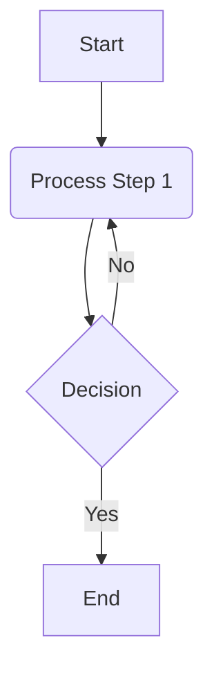

# Standard: Markdown Syntax for Mermaid Diagrams (SF-SYNTAX-DIAGRAMS-MERMAID)

## 1. Standard Statement

This standard defines the mandatory syntax for embedding Mermaid diagrams within Markdown documents. Mermaid is a JavaScript-based diagramming and charting tool that uses a Markdown-inspired text definition to create and modify diagrams dynamically. Utilizing Mermaid allows for diagrams to be version-controlled and treated as code.

This standard specifies how to embed Mermaid definitions within Markdown. The full syntax for Mermaid diagram types themselves is defined by the official Mermaid documentation. Adherence to [[SF-SYNTAX-CODE]] for fenced code blocks and [[SF-FORMATTING-FILE-HYGIENE]] regarding blank lines around block elements is also important.

## 2. Core Mermaid Diagram Embedding Rule

### Rule 2.1: Fenced Code Block with `mermaid` Identifier
Mermaid diagrams MUST be embedded within a standard Markdown fenced code block, using the language identifier `mermaid`.
*   **Syntax:**
    ````markdown
    ```mermaid
    graph TD;
        A-->B;
        A-->C;
        B-->D;
        C-->D;
    ```
    ````
*   **Content:** The content within this fenced code block MUST be valid Mermaid diagram syntax.
*   **Blank Lines:** A blank line MUST precede and follow the ` ```mermaid ` block to ensure correct parsing and rendering, as per [[SF-FORMATTING-FILE-HYGIENE]].
*   **Rationale:** Using a fenced code block with a specific language identifier (`mermaid`) is the common and recognized method for embedding Mermaid diagrams, allowing Markdown processors and rendering tools to identify and process the diagram definition correctly.

## 3. Mermaid Diagram Content

The actual syntax for defining the diagram (e.g., flowcharts, sequence diagrams, Gantt charts) within the ` ```mermaid ... ``` ` block is governed by the Mermaid.js library.
*   **Guidance:** Authors MUST refer to the official Mermaid.js documentation for the complete and up-to-date syntax for various diagram types.
*   **Common Diagram Types Supported by Mermaid (Non-Exhaustive List):**
    *   Flowchart (graph)
    *   Sequence diagram
    *   Gantt chart
    *   Class diagram
    *   State diagram
    *   Pie chart
    *   ER diagram (Entity Relationship)
    *   User Journey diagram
    *   Git graph
*   **Official Documentation Link:** For detailed Mermaid syntax, please consult the [Official Mermaid Documentation](https://mermaid.js.org/intro/syntax-reference.html) (or the current official URL).

## 4. Illustrative Example (Basic Flowchart)

```markdown
A simple flowchart example:



This demonstrates a basic flowchart with a start, a process step, a decision point, and an end.
```

**Conceptual Rendered Output:**
(This would render as a visual flowchart diagram if the Markdown processor supports Mermaid.)

A simple flowchart example:

[Visual Flowchart Diagram: Start -> Process Step 1 -> Decision --Yes--> End; Decision --No--> Process Step 1]

This demonstrates a basic flowchart with a start, a process step, a decision point, and an end.

## 5. Parser and Renderer Dependencies

*   **Not Core CommonMark:** Mermaid diagram embedding is an extension to standard Markdown.
*   **Rendering Engines:** Proper rendering of Mermaid diagrams requires a Markdown processor or platform that has integrated support for Mermaid.js. This often involves a JavaScript library that parses the Mermaid syntax within the code block and generates an SVG or other image format.
*   **Live Editors/Previews:** Many modern Markdown editors and platforms (e.g., GitLab, GitHub, some versions of Obsidian, dedicated Markdown editors) provide built-in or plugin-based support for rendering Mermaid diagrams.
*   **Recommendation:** The chosen authoring and publishing toolchain for the knowledge base MUST be configured to support Mermaid diagram rendering from ` ```mermaid ` code blocks.

## 6. Importance of Standardized Mermaid Embedding

*   **Diagrams as Code:** Allows diagrams to be version-controlled, diffed, and managed alongside textual content.
*   **Accessibility (Partial):** While the rendered image needs alt text (often handled by the renderer or requiring manual addition if static images are generated), the text-based definition itself is accessible to those who can read the code.
*   **Ease of Update:** Diagrams can be updated by editing their text definition, which is often quicker than using graphical tools for complex diagrams.
*   **Consistency:** Provides a uniform method for embedding diagrams.

## 7. Scope of Application

This standard applies to all Markdown documents within the knowledge base repository where diagrams are embedded using the Mermaid syntax.

## 8. Cross-References
- [[SF-SYNTAX-CODE]] - For the general rules regarding fenced code blocks.
- [[SF-FORMATTING-FILE-HYGIENE]] - For rules on blank lines around block elements.
- [Official Mermaid Documentation](https://mermaid.js.org/intro/syntax-reference.html) (External Resource) - For the full syntax of Mermaid diagram types.

---
*This standard (SF-SYNTAX-DIAGRAMS-MERMAID) is based on common practices for embedding Mermaid.js diagrams in Markdown.*
```
