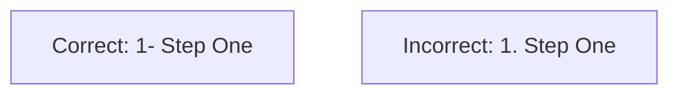
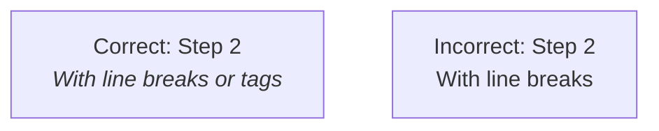
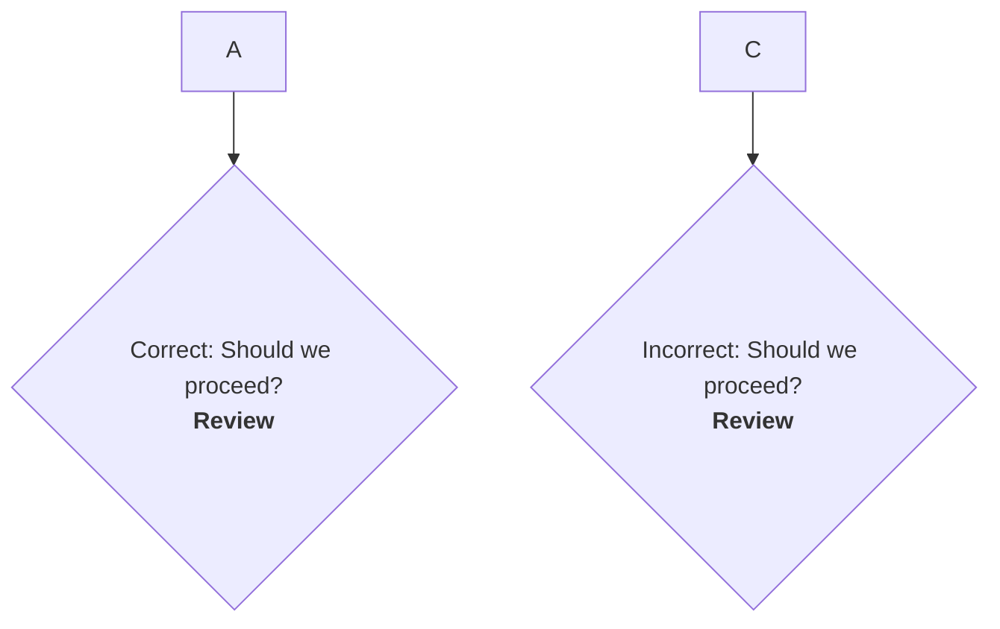
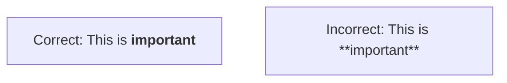

# ✅ Mermaid Diagram Authoring Guidelines

This document provides a comprehensive set of **seven guidelines** for authoring Mermaid diagrams. Adhering to these instructions ensures consistent rendering, prevents common parsing errors, and maintains high quality across all visual representations.

### 1. **Avoid Numbered Markdown Lists (`1.`, `2.`)**

❌ Do **not** use `1.`, `2.`, etc., in node labels. Mermaid interprets these as **unsupported Markdown lists**, causing rendering issues.

✅ **Use hyphenated numbers or other non-list formats instead:**



---

### 2. **Wrap Multi-Line or HTML Labels in Double Quotes**

❌ Do **not** insert `<br>` tags or other HTML in labels without wrapping the *entire* label in double quotes. The parser will fail when it encounters the `<` character unexpectedly.

✅ **Always wrap the full label in quotes:**



---

### 3. **Decision Nodes Must Use Curly Braces with Quotes**

Mermaid decision nodes (`{...}`) are not exempt from the quoting rule. If the text inside contains line breaks or HTML, it must be wrapped in double quotes *inside* the curly braces.

✅ **Use properly quoted content inside decision nodes:**



---

### 4. **All Node Texts Must Be Plain or HTML-Safe**

Avoid raw Markdown formatting like `**bold**` or `_italic_` inside nodes. This syntax is not reliably supported by the Mermaid parser and can break rendering.

✅ **Prefer simple HTML tags for styling**, which are officially supported and render consistently.



---

### 5. **Avoid Reserved Keywords as Node IDs**

Using common keywords like `end`, `start`, `graph`, or `subgraph` (often case-sensitive) as a node ID can cause parsing conflicts with the Mermaid grammar.

✅ **Capitalize or alias reserved terms to avoid conflicts:**

```mermaid
graph TD
    A --> EndNode[Correct: Project Complete]
    B --> end[Incorrect: Task complete]
```

---

### 6. **Quote Subgraph Titles with Special Characters**

❌ Do **not** use unquoted subgraph titles if they contain spaces, hyphens, parentheses, or other special characters. This will cause a parsing error.

✅ **Always wrap complex subgraph titles in double quotes** to ensure the parser treats them as a single string literal.

```mermaid
%% Correct: Title is wrapped in quotes
subgraph "Layer 1- Strategic (The Why)"
    A --> B
end

%% Incorrect: Title has special characters and no quotes
subgraph Layer 1- Strategic (The Why)
    C --> D
end
```

---

### 7. **Avoid `direction` Declarations Inside Subgraphs**

❌ Do **not** place `direction` declarations (e.g., `direction TD`) inside a `subgraph` block. Many Mermaid parsers expect a node or link definition on the following line and will fail when they encounter the `direction` keyword.

✅ **Set the layout direction once at the top level** of the graph (`graph TD` or `graph LR`). This is the most robust and reliable method for controlling layout.

```mermaid
%% Correct: Direction is set once at the top
graph TD
    subgraph "My Subgraph"
        A --> B
    end

%% Incorrect: 'direction' inside the subgraph is a common point of failure
graph TD
    subgraph "My Subgraph"
        direction LR
        C --> D
    end
```

---

### Summary: Authoring Checklist ✅

| Check | Pass? |
| :--- | :--- |
| No `1.`, `2.` numbered lists used in labels | ✅ |
| Quotes are used around all HTML/multiline labels | ✅ |
| Decision nodes (`{}`) use quotes for complex content | ✅ |
| Reserved keywords (like `end`) are avoided as node IDs | ✅ |
| HTML tags (`<b>`) are used for styling, not Markdown (`**`) | ✅ |
| Subgraph titles with special characters are quoted | ✅ |
| `direction` keyword is not used inside subgraphs | ✅ |