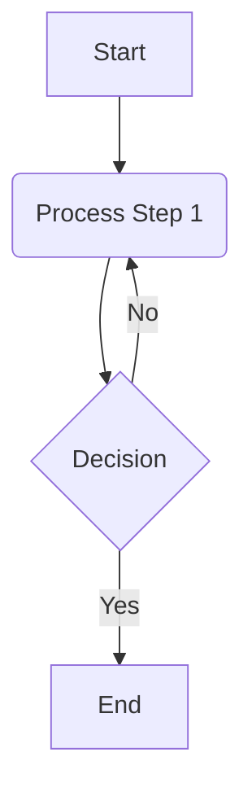

---

title: 'Standard: Markdown Syntax for Mermaid Diagrams'
standard_id: SF-SYNTAX-DIAGRAMS-MERMAID
aliases:
- Mermaid Syntax
- Markdown Diagram Syntax
- Embedding Mermaid Diagrams
tags:
- content-type/standard-definition
- content-type/technical-standard
- criticality/p2-medium
- kb-id/standards
- status/draft
- topic/markdown
- topic/sf
kb-id: standards
info-type: standard-definition
primary-topic: Mermaid Diagram Syntax in Markdown
related-standards:
- SF-SYNTAX-CODE
- SF-FORMATTING-FILE-HYGIENE
version: 1.0.0
date-created: '2024-07-15T12:00:00Z'
date-modified: '2025-06-17T02:29:16Z'
primary_domain: SF
sub_domain: MARKDOWN
scope_application: Defines the standard method for embedding Mermaid diagrams within
  Markdown documents to create text-based diagrams.
criticality: P2-Medium
lifecycle_gatekeeper: Architect-Review
impact_areas:
- Technical documentation
- Process visualization
- Authoring of complex diagrams as code
- Version controllable diagrams
---
# Standard: Markdown Syntax for Mermaid Diagrams (SF-SYNTAX-DIAGRAMS-MERMAID)

## 1. Standard Statement

This standard **MANDATES** the exclusive syntax for embedding Mermaid diagrams within Markdown documents. Mermaid is a JavaScript-based tool utilizing a Markdown-inspired text definition for dynamic diagram creation and modification. Utilizing Mermaid **MUST** allow diagrams to be version-controlled and treated as code.

This standard specifies how to embed Mermaid definitions. The full syntax for Mermaid diagram types is defined by official Mermaid documentation. Adherence to [[SF-SYNTAX-CODE]] for fenced code blocks and [[SF-FORMATTING-FILE-HYGIENE]] regarding blank lines around block elements is also **MANDATORY**.

## 2. Core Mermaid Diagram Embedding Rule

### Rule 2.1: Fenced Code Block with `mermaid` Identifier
Mermaid diagrams **MUST** be embedded within a standard Markdown fenced code block, using the language identifier `mermaid`.
*   **Syntax:**
    ````markdown
    ```mermaid
    graph TD;
        A-->B;
        A-->C;
        B-->D;
        C-->D;
    ```
    ````
*   **Content:** The content within this fenced code block **MUST** be valid Mermaid diagram syntax.
*   **Blank Lines:** A blank line **MUST** precede and follow the ` ```mermaid ` block, as per [[SF-FORMATTING-FILE-HYGIENE]].
*   **Rationale:** Using a fenced code block with the `mermaid` identifier is the recognized method for embedding Mermaid diagrams, enabling correct processing and rendering.

## 3. Mermaid Diagram Content

The actual syntax for defining the diagram (e.g., flowcharts, sequence diagrams) within the ` ```mermaid ... ``` ` block is governed by the Mermaid.js library.
*   **Guidance:** Authors **MUST** refer to the official Mermaid.js documentation for complete syntax.
*   **Common Diagram Types Supported:** Flowchart, Sequence diagram, Gantt chart, Class diagram, State diagram, Pie chart, ER diagram, User Journey, Git graph.
*   **Official Documentation:** [Mermaid Documentation](https://mermaid.js.org/intro/syntax-reference.html)

## 4. Illustrative Example (Basic Flowchart)

```markdown
A simple flowchart example:



This demonstrates a basic flowchart with a start, a process step, a decision point, and an end.
```

## 5. Parser and Renderer Dependencies

Mermaid diagram embedding is a Markdown extension. Proper rendering requires a Markdown processor or platform with integrated Mermaid.js support. The chosen authoring and publishing toolchain for the Knowledge Base **MUST** be configured to support Mermaid diagram rendering from ` ```mermaid ` code blocks.

## 6. Importance of Strict Mermaid Embedding

*   **Diagrams as Code:** Allows diagrams to be version-controlled, diffed, and managed alongside textual content.
*   **Accessibility:** Text-based definition is accessible. Rendered image alt text is handled by renderer or requires manual addition.
*   **Ease of Update:** Diagrams are quickly updated by editing their text definition.
*   **Consistency:** Provides a uniform method for embedding diagrams.

## 7. Scope of Application

This standard applies to **ALL** Markdown documents within the Knowledge Base repository where diagrams are embedded using the Mermaid syntax. Adherence to these rules is **MANDATORY** for all content creators, automated systems, and tooling interacting with KB Markdown files.

## 8. Cross-References
*   [[SF-SYNTAX-CODE]]
*   [[SF-FORMATTING-FILE-HYGIENE]]
*   [Mermaid Documentation](https://mermaid.js.org/intro/syntax-reference.html)

---
*This standard (SF-SYNTAX-DIAGRAMS-MERMAID) has been revised to mandate a strict, singular syntax for embedding Mermaid.js diagrams, ensuring consistency and reliable rendering.*
